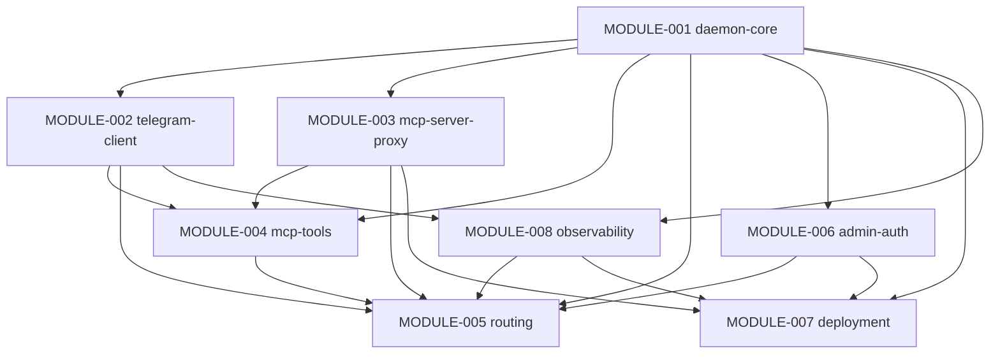
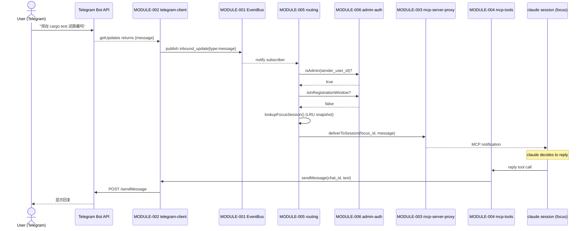
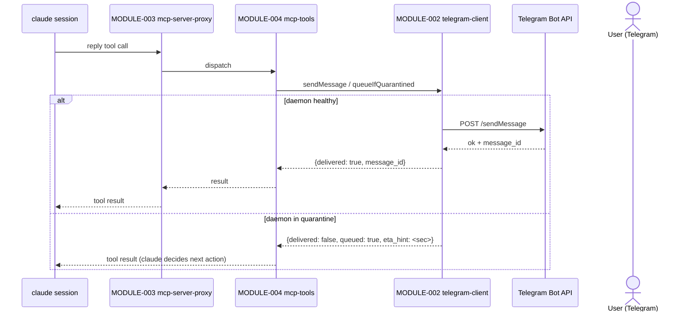
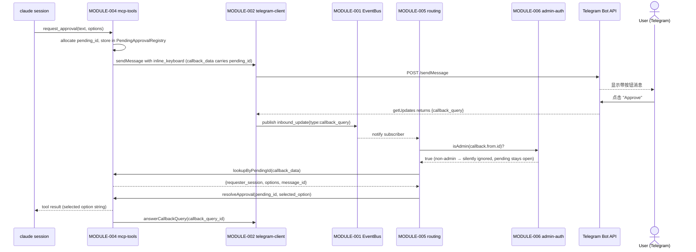

# Architecture Design Document

> Project: telegram-channels-pro
> Version: 1.0.0
> Generated: 2026-05-12
> Based on: docs/PRD.md (v1.5)

---

## 1. Architecture Overview

`telegram-channels-pro` adopts a **two-process, single-machine** architecture:

- **Daemon process** (one per machine): sole holder of the Telegram bot token, runs the single
  `getUpdates` long-polling loop, owns all routing / authentication / state, exposes a Unix-domain
  socket for MCP transport multiplexing.
- **MCP proxy** (one per opted-in claude session): thin stateless client running inside the claude
  session process; bridges the claude-side stdio MCP transport to the daemon's Unix-domain socket
  via length-prefixed JSON frames.

The daemon is brought up by **launchd** (default opt-out) or **lazy-spawn** (fallback when the
user declines launchd takeover). It uses a **file-lock based mutual exclusion** to guarantee
exactly one running instance; the second daemon instance exits cleanly without SIGTERMing the
running one. The watchdog detects orphan / stuck / idle states and exits gracefully with
severity-graded observability.

**Design philosophy**: every "important state" lives in the daemon (single source of truth);
claude-side proxies are reload-safe stateless clients. Telegram's "single poller per token"
physical constraint becomes an engineering invariant rather than an emergent failure mode.

**Logger / Alerter via EventBus** (pure pub/sub, no direct calls): every module emits log /
alert / status events to the EventBus (CONTRACT-003); MODULE-008 observability subscribes
and writes structured logs / dispatches TG alerts / serves the status subcommand. This
eliminates any potential `M008↔M002` cycle through direct Logger / Alerter calls and matches
the rest of the cross-module communication pattern.

**Key infrastructure choices** (Decisions A1-A14 in §8):
- State directory: `~/Library/Application Support/advance-kit/telegram-channels-pro/` (Apple
  standard, 0700 dir, files 0600)
- IPC transport: Unix-domain socket `daemon.sock` in state directory
- Log directory: `~/Library/Logs/advance-kit/telegram-channels-pro/` (0700 dir, 0600 files —
  preserves registration-code redaction semantics under same-uid threat model)
- Plugin namespace: `telegram-channels-pro`; CLI subcommands via `commands/*.md` slash command
  files (claude-code SDK standard); MCP server name: `telegram-channels-pro` (distinct from
  upstream `telegram`)

## 2. Technology Stack

| Layer | Technology | Rationale |
|-------|-----------|-----------|
| Runtime | Bun ≥ 1.1 (current LTS) | Matches upstream 0.0.6; enables RC#1/RC#3 cherry-pick upstream PRs; ships with bundled HTTP/Socket/test (REQ-031) |
| Language | TypeScript ≥ 5.4 | Static typing for IPC frame schema + MCP tool I/O safety |
| MCP framework | `@modelcontextprotocol/sdk` (latest stable) | Standard SDK; provides stdio transport for claude-side; required to be claude-code compatible |
| Telegram client | Bun built-in `fetch` | No extra HTTP dep; sufficient for getUpdates + sendMessage |
| IPC | Bun built-in Unix domain socket (`Bun.listen`/`Bun.connect`) | Native, no extra dep |
| Process manager | launchd (macOS-only) | macOS-standard; opt-out (REQ-027) |
| Logging | Custom structured JSON, file-rolled by daemon | Need fine-grained redaction control (REQ-023); no syslog dep |
| Testing | `bun:test` + bun's native test runner | Native; no jest dep |
| Plugin framework | claude-code plugin SDK (`commands/*.md`, `plugin.json`, `marketplace.json`) | Required for advance-kit integration (REQ-028) |

**Excluded dependencies** (deliberately avoided to minimize fork delta from upstream):
- `axios` / `node-fetch` — Bun built-in fetch suffices
- `node-cron` / scheduler libs — watchdog/idle TTL uses `setInterval`
- Logging libraries (`winston` / `pino`) — custom JSON writer with redaction
- ORM / DB — no persistent DB; only JSON state files

## 3. Module Inventory

| Module ID | Module Name | Responsibility | Spec Document |
|-----------|-------------|---------------|---------------|
| MODULE-001 | daemon-core | Process lifecycle (single-instance via file lock + PID/binary-identity validation), watchdog (orphan/stuck/idle), state-directory ownership, signal handling, deployment-mode reporting, EventBus | [MODULE-001-daemon-core](modules/MODULE-001-daemon-core.md) |
| MODULE-002 | telegram-client | Telegram Bot API HTTP client (`getUpdates`/`sendMessage`/`editMessageText`/`sendChatAction`/`answerCallbackQuery`/`getFile`), offset persistence + replay, sliding-window polling reliability + quarantine state machine, 409/429 segregation, publishes `inbound_update` events, **subscribes to `registration_timeout` event from M006 to pause polling in launchd wait-for-reset state** | [MODULE-002-telegram-client](modules/MODULE-002-telegram-client.md) |
| MODULE-003 | mcp-server-proxy | claude-session-side MCP server (stdio transport, tool registration), daemon-side Unix-socket acceptor, length-prefixed JSON framing, `deliverToSession` + `disconnectSession` API for outbound payloads and admin-driven socket close, transparent disconnect handling; publishes `session_connected`/`session_disconnected` events | [MODULE-003-mcp-server-proxy](modules/MODULE-003-mcp-server-proxy.md) |
| MODULE-004 | mcp-tools | 5 MCP tools (`reply` / `react` / `edit_message` / `download_attachment` / `request_approval`), pending-approval state machine (in-memory map, capacity-bounded 50; `cleanupBySession` on session disconnect), **download_attachment temp directory janitor** (periodic sweep of `<state_dir>/attachments/`; per-file TTL 1-24h per PRD §8 Decision A8 bounds), compat-test pinning for 4 upstream-equivalent tools | [MODULE-004-mcp-tools](modules/MODULE-004-mcp-tools.md) |
| MODULE-005 | routing | Session registry (LRU ordered list maintained from `session_connected`/`disconnected` events), **session capacity enforcement** (on `session_connected` event: if registered count > 8 → call M003.disconnectSession with reason "capacity exceeded"), routing-snapshot rule, inbound TG update routing (**admin-verify for both text and callback** → registration-window check → LRU dispatch (text) or pending-callback dispatch (callback)), TG slash commands (`/session` `/list` `/status`), per-chat dedup for no-session reply | [MODULE-005-routing](modules/MODULE-005-routing.md) |
| MODULE-006 | admin-auth | Environment variable precedence (`TELEGRAM_AUTHORIZED_USERS`), first-run registration window (5min, 6-char alnum code from 32-char alphabet excluding 0/O/I/1), per-sender (5) + global (30) brute-force counter, deployment-mode-aware timeout dispatch (publishes `registration_timeout` event in launchd mode → M002 pauses polling), admin allowlist provision, registration-gate state machine, **AdminStateReset API (CONTRACT-015) called by M007 reset-admin CLI handler** | [MODULE-006-admin-auth](modules/MODULE-006-admin-auth.md) |
| MODULE-007 | deployment | launchd plist template + bootstrap/bootout coordination, lazy-spawn fallback, concurrent-spawn race resolution, CLI subcommands (`install-daemon` / `uninstall-daemon` / `reset-admin` / `status`), advance-kit plugin format compliance, rollback documentation | [MODULE-007-deployment](modules/MODULE-007-deployment.md) |
| MODULE-008 | observability | EventBus subscriber for log / alert / status events, structured JSON logger with redaction list enforcement, log-file rotation, alert dispatch (state-change edge-triggered for quarantine, one-shot for watchdog fatal, token-bucket for auth-deny), crash-restart alert deduplication, `status` subcommand output schema (StatusReporter) | [MODULE-008-observability](modules/MODULE-008-observability.md) |

### 3.1 MECE Verification

**Exhaustive**: every Active=Y REQ-ID in REQUIREMENTS_REGISTRY.md maps to a primary module
owner (see §10 — primary marked with `(primary)` for multi-module entries).

**Exclusive** — boundary clarifications:

- **MODULE-001 daemon-core vs MODULE-007 deployment**: daemon-core owns *runtime* behavior
  (process lifecycle, lock, watchdog); deployment owns *install ceremony* (launchd plist
  authoring, bootstrap/bootout, CLI subcommands, rollback docs).

- **MODULE-002 telegram-client vs MODULE-004 mcp-tools**: telegram-client owns the HTTP
  protocol (low-level call to Telegram); mcp-tools owns the MCP-facing tool semantics.
  `reply` MCP tool calls into telegram-client's `sendMessage`. The MCP-side schema is
  mcp-tools' concern; the HTTP wire format is telegram-client's.

- **MODULE-005 routing owns ALL inbound admin verification (text AND callback)**:
  - Inbound text (Flow A step 2): M005 verifies sender ∈ AdminAllowlist before LRU dispatch.
  - Inbound callback (Flow C step 4): M005 verifies callback_query.from.id ∈ AdminAllowlist
    BEFORE looking up PendingApprovalRegistry in M004.
  - This concentrates admin-allowlist enforcement at the EventBus subscription boundary
    (one module, two flows). MODULE-006 owns the allowlist data (CONTRACT-009);
    MODULE-005 owns the verification gate.

- **MODULE-004 mcp-tools vs MODULE-005 routing for callback path**: M004 owns the
  PendingApprovalRegistry (CONTRACT-011) — pending state created by `request_approval` tool
  and consumed by M005 during callback flow. M005 calls `lookupByPendingId` and
  `resolveApproval` on M004; M004 does NOT call back into M005. **M004 does NOT consume
  AdminAllowlist** — callback admin verification happens entirely in M005 before M005 calls
  M004.lookupByPendingId. M004 is a pre-verified lookup-and-resolve sink. One-way data flow,
  M005 → M004, no cycle.

- **MODULE-003 mcp-server-proxy vs MODULE-005 routing**: mcp-server-proxy owns the
  *transport* (socket + framing + protocol bridge + `deliverToSession` API + session
  connect/disconnect event emission); routing owns the *destination decision* and the
  SessionRegistry list (built from `session_*` events).

- **MODULE-008 observability decoupled via EventBus**: every module emits log / alert /
  status events to MODULE-001's EventBus (CONTRACT-003); MODULE-008 subscribes and
  dispatches. **No module directly calls MODULE-008** (except MODULE-007 calling the
  `status` subcommand StatusReporter via CONTRACT-014, which is a synchronous read path
  for CLI). Module source code MUST NOT directly write to stderr/files except daemon-core's
  pre-EventBus bootstrap messages.

## 4. Dependency Graph



Arrow direction: `X --> Y` means **X is a dependency of Y** — Y directly calls into X's
non-EventBus contracts. Pub/sub flow via CONTRACT-003 EventBus is **NOT** encoded as
graph edges (publishers and subscribers each depend only on M001, the EventBus provider).
See §4.2 for the canonical convention.

### 4.1 Dependency Matrix

| Module | Depends On | Depended By |
|--------|-----------|-------------|
| MODULE-001 daemon-core | — (foundation) | MODULE-002, MODULE-003, MODULE-004, MODULE-005, MODULE-006, MODULE-007, MODULE-008 |
| MODULE-002 telegram-client | MODULE-001 | MODULE-004, MODULE-005, MODULE-008 |
| MODULE-003 mcp-server-proxy | MODULE-001 | MODULE-004, MODULE-005, MODULE-007 |
| MODULE-004 mcp-tools | MODULE-001, MODULE-002, MODULE-003 | MODULE-005 |
| MODULE-005 routing | MODULE-001, MODULE-002, MODULE-003, MODULE-004, MODULE-006, MODULE-008 | — (terminal subscriber + emitter) |
| MODULE-006 admin-auth | MODULE-001 | MODULE-005, MODULE-007 |
| MODULE-007 deployment | MODULE-001, MODULE-006, MODULE-008 | — (CLI ingress) |
| MODULE-008 observability | MODULE-001, MODULE-002 | MODULE-005, MODULE-007 |

**Dependency rationale per row**:
- M002 → M001: StateDir (offset.json path), EventBus pub (`inbound_update`, `quarantine_*`, `polling_health`) + sub (`registration_timeout` from M006 → pauses polling in launchd wait-for-reset)
- M003 → M001: StateDir (socket path), EventBus pub (`session_connected`, `session_disconnected`)
- M004 → M001 / M002 / M003: EventBus pub (tool events), TG API client, MCP transport registration. **M004 does NOT depend on M006** — callback admin verification is M005's responsibility (resolves R3 CONTRACT-009 contradiction)
- M005 → M001 / M003 / M004 / M006: EventBus sub (`inbound_update`, `session_*`), MCP `deliverToSession` + `disconnectSession`, PendingApprovalRegistry lookup/resolve, AdminAllowlist + RegistrationGate
- M006 → M001: StateDir (admin.json), EventBus pub (`registration_event`, `registration_timeout`)
- M007 → M001 / M006 / M008: daemon binary path (CONTRACT-001), AdminStateReset via CONTRACT-015 (for reset-admin CLI handler), StatusReporter via CONTRACT-014 (for `status` CLI)
- M008 → M001 / M002: EventBus sub (all `log_emit` / `alert_emit` / state events), TelegramAPIClient for alert delivery, PollingStatus query for StatusReporter

**Cycle check**: M008 depends on M002 (Alerter directly calls CONTRACT-004 TG client) — this
is the one edge between them. M002 also *publishes* alert events that M008 subscribes to,
but per the convention above, **pub/sub does not produce a graph edge** (publisher
M002 only depends on M001/EventBus provider; subscriber M008 only depends on M001 in the
pub/sub direction). So mermaid + matrix correctly show a single edge `M002 → M008` (direct
call: M008 depends on M002), not a cycle. **Arrow notation reminder**: mermaid edge
`M002 --> M008` means M002 is a dependency of M008 (M008 calls M002). The opposite
direction (M008 calling M002) is the false-cycle that's excluded by pub/sub being
non-edge.

**Topological order** (one valid sort; siblings independent of each other):
M001 → {M002, M003, M006} → {M004, M008} → M007 → M005

(M004 and M008 are concurrent peers — no edge in either direction between them.
M007 must come after M008 because M007 depends on M008 via CONTRACT-014. M005
comes last because it depends on M001/M003/M004/M006.)

### 4.2 Dependency Principles

- **No circular dependencies**: verified by topological sort.
- **Layered direction**: daemon-core (foundation) → infrastructure (telegram-client,
  mcp-server-proxy, admin-auth) → observability + ingress (M008, M007) → application
  middleware (mcp-tools) → business orchestration (routing).
- **Interface dependency over implementation**: every cross-module call goes through a
  Contract registered in §6.1.
- **EventBus is the unidirectional decoupler**: publishers don't depend on subscribers.
  This is why M002/M003/M004/M006 emit log/alert events that M008 consumes without M002 or
  others gaining a dependency on M008. **Convention enforced**: pub/sub flow via
  CONTRACT-003 EventBus produces ONLY a dep on M001 (the EventBus provider) from both
  publisher and subscriber sides. Mermaid (§4) and matrix (§4.1) edges encode **direct
  calls only** — pub/sub flow is documented in CONTRACT-003 description, not graph edges.

## 5. Data Flow

### Flow A — Inbound bidirectional chat (REQ-001)



### Flow B — Outbound push (REQ-002)



### Flow C — Approval round-trip (REQ-003)



**Defense-in-depth ordering**: admin verification (M005 → M006) happens **before**
PendingApprovalRegistry lookup (M005 → M004). Both gates are required for resolution.

### Daemon startup (REQ-004 + REQ-012)

```mermaid
sequenceDiagram
    participant LD as launchd / spawning claude
    participant DM as daemon-main
    participant L as MODULE-001 lock
    participant A as MODULE-006 admin-auth
    participant P as MODULE-002 polling
    participant O as MODULE-008 observability

    LD->>DM: exec daemon binary
    DM->>L: tryAcquire(daemon.lock)
    alt lock acquired
        L-->>DM: ok
        Note over DM: EventBus + log infra come up; M008 subscribes
        DM->>A: resolveAdminSource (env? file? none → registration)
        DM->>P: startPolling
        Note over DM: enter event loop
    else lock held by live PID
        L-->>DM: occupied
        DM->>O: log "daemon already running, exiting"
        DM->>DM: exit 0
    else stale lock (dead PID)
        L->>L: takeover
        L-->>DM: ok
    end
```

## 6. Interface Definitions

### 6.1 Inter-module Contract Registry

| Contract ID | Active | Provider Module | Consumer Module(s) | Description |
|-------------|--------|----------------|-------------------|-------------|
| CONTRACT-001 | Y | MODULE-001 | MODULE-002, MODULE-003, MODULE-004, MODULE-005, MODULE-006, MODULE-007, MODULE-008 | StateDir resolution: returns paths for `daemon.lock`, `daemon.sock`, `daemon.ctl.sock` (Slice-2 additive: M007 control socket), `admin.json`, `offset.json`, attachment dir, log dir; idempotent creation; enforces 0700 directory + 0600 file perms. Field expansion is append-only (additive); existing field signatures stable across slices. |
| CONTRACT-002 | Y | MODULE-001 | MODULE-006, MODULE-007, MODULE-008 | DeploymentMode: returns `"launchd"` or `"lazy-spawn"`; consumed by admin-auth (timeout dispatch), deployment (install state), observability (alert routing decisions) |
| CONTRACT-003 | Y | MODULE-001 | publishers: MODULE-001, MODULE-002, MODULE-003, MODULE-004, MODULE-005, MODULE-006, MODULE-007, MODULE-008; subscribers: MODULE-002 (consumes `registration_timeout` only), MODULE-005, MODULE-008 | EventBus: in-process pub/sub. Event-type catalog (canonical; any new event type requires registry update): `inbound_update` (M002), `quarantine_enter` / `quarantine_exit` / `polling_health` (M002), `session_connected` / `session_disconnected` / `frame_invalid` (M003), `tool_call` / `tool_result` / `pending_capacity_snapshot` (M004), `route_decision` / `auth_deny_routing` (M005), `auth_deny_registration` / `registration_event` / `registration_timeout` (M006), `daemon_start` / `daemon_stop` / `lock_event` / `watchdog_signal` / `state_dir_perms_anomaly` (M001), `cli_command` (M007), `subscriber_queue_drop` (M008 — self-warn from RISK-013), `log_emit` / `alert_emit` (any module). **Per-event-type subscriber routing**: M002 subscribes to `registration_timeout`; M005 subscribes to `inbound_update` + `session_connected` + `session_disconnected` + `tool_call`; M008 subscribes to ALL event types. **Disambiguation**: `auth_deny_routing` = M005 routing-gate rate-limited drop; `auth_deny_registration` = M006 brute-force-counter trip. **Stability**: this event-type catalog is the source of truth; the §6.1 stability rule "removed contract → Active=N" extends to event types — removed events become tombstones (`<event_type>: deprecated`). |
| CONTRACT-004 | Y | MODULE-002 | MODULE-004, MODULE-005, MODULE-008 | TelegramAPIClient: wraps `sendMessage`, `editMessageText`, `answerCallbackQuery`, `getFile`, `sendChatAction`, `getUpdates`; handles auth + rate-limit classification + 429 retry-after honoring. M005 consumes for no-session reply, `/list`/`/status`/`/session` ack via sendMessage, stale-button answerCallbackQuery. **Note (Slice 2)**: `setMessageReaction`, `sendPhoto`, and `sendDocument` are NOT in CONTRACT-004 surface — M004 reaction tool + reply-with-files use M004-internal HTTP helpers (`internal-reaction.ts`, `internal-multipart.ts`) to keep CONTRACT-004 minimal (only methods used by ≥2 modules). |
| CONTRACT-005 | Y | MODULE-002 | MODULE-008 | PollingStatus: query current state machine state (running / quarantine / cooldown), last_inbound_ts, fatal-window counters; exposed via EventBus periodic snapshot OR direct query |
| CONTRACT-006 | Y | MODULE-003 | MODULE-004 (registers tool handlers), MODULE-005 (calls `deliverToSession` + `disconnectSession`) | MCPTransport: register tool handlers; receive tool-call frames; emit tool-result frames; `deliverToSession(session_id, payload)` for outbound routing; `disconnectSession(session_id, reason)` for admin-driven socket close (e.g., session capacity exceeded — REQ-022 enforcement) |
| CONTRACT-009 | Y | MODULE-006 | MODULE-005 (single enforcement point for inbound text + callback admin gate per §3.1 + Decision A11) | AdminAllowlist: `isAdmin(tg_user_id): boolean` query AND `source(): 'env' \| 'file' \| 'none'` for status reporting. **MODULE-004 does NOT consume CONTRACT-009** — Decision A11 explicitly. |
| CONTRACT-010 | Y | MODULE-006 | MODULE-005, MODULE-007 (Slice-2 additive: `forceReopenForReset` for control-socket reset-admin) | RegistrationGate: state-machine for registration window. M005 queries `isInRegistrationWindow()` and `processRegistrationDM(sender_user_id, text): RegistrationResult` before normal routing. **Slice 2 additive method** `forceReopenForReset(): void` — transitions gate from any prior state ('open' / 'waiting_for_reset' / 'closed') to 'open' for M007's in-process reset-admin recovery (no daemon restart needed in either deployment mode). |
| CONTRACT-011 | Y | MODULE-004 | MODULE-005 | PendingApprovalRegistry: in-memory map pending_id → {requester_session, chat_id (Slice-2 add), callback_data, message_id, options}; capacity-bounded (50). M005 calls `lookupByPendingId(callback_data)`, `await resolveApproval(pending_id, choice, callback_query_id, tg)` (Slice 2: signature carries callback_query_id + tg; M004 calls answerCallbackQuery before resolving the Promise — ordering invariant), and `cleanupBySession(session_id, tg)` (Slice 2: signature carries tg; rejects pending Promises with `Error('session_terminated')` and edits TG button to "approval cancelled (session ended)" via tg.editMessageText per PRD §3.3 edge case) |
| CONTRACT-014 | Y | MODULE-008 | MODULE-005 (for `/status` command), MODULE-007 (for `status` CLI subcommand) | StatusReporter: synchronous read returning redacted health summary. Fields: `uptime_seconds`, `deployment_mode` (from CONTRACT-002), `polling_state` ('running' | 'quarantine' | 'cooldown' | 'paused' — full state machine surface from CONTRACT-005), `quarantine_active`, `last_inbound_ts`, `registered_sessions` (from M008's session-event cache), `pending_approvals: {current, max}` (from M004's `pending_capacity_snapshot` event), `admin_source` ('env' | 'file' | 'none' from `registration_event` sub-types). All fields derived from EventBus subscriptions in M008's local cache; M008 does NOT call M004 or M005 directly. |
| CONTRACT-015 | Y | MODULE-006 | MODULE-007 | AdminStateReset: `resetAdmin(): {cleared: boolean, prior_admin_hash: string \| null}` — used by M007 `reset-admin` CLI handler. Deletes admin.json + emits `registration_event` of type `admin_reset` for audit. Idempotent: if no admin.json existed, returns `{cleared: false}` |

**Contracts removed from R1 → R2 → final**:
- **CONTRACT-007 SessionRegistry** (R1): was intra-M005 — moved to internal data structure;
  external view is via M005's subscription to `session_*` EventBus events
- **CONTRACT-008 InboundRouter** (R1): was intra-M005 — subscription model means no
  external API surface; M005's EventBus subscription IS the routing entry
- **CONTRACT-012 Logger** (R1) and **CONTRACT-013 Alerter** (R1): both subsumed into
  CONTRACT-003 EventBus (`log_emit` / `alert_emit` event types). M008 subscribes; modules
  publish. No direct call from any module to M008 → no cycle through Logger/Alerter

**Contract stability rules**: existing contract unchanged signature → preserve ID; signature
changed → old Active=N + new CONTRACT-{next}; removed → Active=N (do not delete from
registry). For this initial generation (no prior version), removed CONTRACT-007/008/012/013
are not listed at all since they never existed in a shipped /spec output.

### 6.2 External Interfaces

| Interface | Direction | Counterparty | Protocol / Schema |
|-----------|-----------|--------------|-------------------|
| Telegram Bot API | outbound | api.telegram.org | HTTPS REST + long-polling `getUpdates` (offset-based) |
| MCP stdio (claude-side) | bidirectional | claude session process | stdio transport per @modelcontextprotocol/sdk; tool-call/tool-result frames |
| Unix domain socket (daemon-side) | bidirectional (acceptor) | claude session MCP proxies | length-prefixed JSON frames (4-byte big-endian length + UTF-8 JSON body, max 1 MiB) |
| launchd plist | bidirectional | launchd | macOS plist XML; `~/Library/LaunchAgents/com.advance.telegram-channels-pro.plist` |
| stderr (boot phase only) | outbound | parent process / launchd log | plain text, only for pre-EventBus daemon-core boot messages |

## 7. Non-functional Requirements Mapping

| NFR | Target | Implementation Strategy | Responsible Module |
|-----|--------|------------------------|-------------------|
| REQ-017 Stability (72h ≥99% 5min windows) | ≤8 outage windows over 72h, no >5min single outage | Polling reliability (REQ-005) + watchdog (REQ-007) + launchd KeepAlive (REQ-012) | MODULE-002 (primary), MODULE-001 |
| REQ-018 Inbound zero-loss | seqno 0 gaps with ≥1 session registered | Offset persistence to `offset.json`; replay on restart; recipient test harness | MODULE-002 |
| REQ-019 Zero zombies | `ps STAT=R + etime>1h + comm=bun` count = 0 | Watchdog (orphan + stuck detection); SIGTERM-clean shutdown | MODULE-001 |
| REQ-020 Latency | TG→claude P95 <5s; reply P95 <2s (delivered-only); approval P95 <3s (60s-click only) | Polling cycle ≤25s; single-hop UDS transport; precise callback routing via pending_id | MODULE-002 (polling), MODULE-003 (transport), MODULE-005 (routing) |
| REQ-021 Resource budget | RSS<50MB P95 stationary, CPU<1% mean stationary | Bun's minimal runtime; no DB; in-memory pending bound; stationary measurement protocol | MODULE-001 (process), MODULE-008 (measurement script) |
| REQ-022 Capacity edges | ≤8 sessions / >8 reject; ≤50 pending / >50 reject | SessionRegistry size guard (M005); PendingApprovalRegistry capacity check (M004) | MODULE-005, MODULE-004 |
| REQ-023 Observability | Structured JSON + 5 redaction items + status subcommand | EventBus-driven log_emit subscription in M008; redaction enforcement at write boundary | MODULE-008 |
| REQ-024 Alerting | edge-triggered for quarantine; one-shot for watchdog fatal; token-bucket for auth-deny; merged crash-restart window 30s-10min | EventBus-driven alert_emit subscription in M008; per-event-type dedup strategy | MODULE-008 |
| REQ-025 Recoverability | launchd auto-restart; 24h offset replay window; pending lost on crash | KeepAlive plist; offset persisted to `offset.json`; in-memory pending intentionally not persisted | MODULE-001, MODULE-002, MODULE-007 |

## 8. Key Decision Records

(2.5.0+ note: no Accepted ADR files in `docs/adr/` yet; free-form decisions below.)

### Decision A1: State directory location

- **Decision**: `~/Library/Application Support/advance-kit/telegram-channels-pro/` (Apple convention).
- **Rationale**: macOS-native; Time Machine but not iCloud; aligns with `~/Library/Logs/`.

### Decision A2: IPC transport

- **Decision**: Unix domain socket (0600 perms, same-uid only).
- **Rationale**: Filesystem permissions match same-uid trust boundary; no port collision; native Bun support.

### Decision A3: env-var + admin.json coexistence

- **Decision**: env-var takes precedence; admin.json not actively cleared (env can be unset to restore).
- **Rationale**: Mirrors PRD §4.7; preserves user intent. Logger annotates `admin_source: env|file`.

### Decision A4: idle TTL timer reset on reconnect

- **Decision**: lazy-spawn TTL countdown resets to full duration on every new MCP connection.
- **Rationale**: Matches typical idle-timer semantics.

### Decision A5: Alert spam suppression (three categories)

- State-change edge-triggered: quarantine enter / exit
- One-shot terminal: watchdog fatal exit
- Token-bucket rate-limited: registration auth-deny / non-admin callback (1 alert/10min/sender)
- Crash-restart merge window: `daemon_start` events within 30s-10min (default 5min) collapsed

### Decision A6: CLI subcommand mechanism

- **Decision**: Slash commands in `plugins/telegram-channels-pro/commands/*.md` per claude-code SDK standard; commands shell out to `bin/*.sh` helpers.
- **Rationale**: Matches existing `dev`/`spec`/`prd` plugin pattern.

### Decision A7: CONTEXT-MAP scope partitioning (single-PRD-file mode)

- **Decision**: 4 scopes derived from PRD structure:
  - Scope A: Inbound chat / outbound push / approval (REQ-001-003 + REQ-008-009)
  - Scope B: Daemon arch / polling / watchdog / observability (REQ-004-007 + REQ-021 + REQ-023-024)
  - Scope C: Permission / first-run / brute-force / commands (REQ-010-016)
  - Scope D: Deployment / launchd / rollback / format / constraints (REQ-012 + REQ-026-031)
  - Catch-all: Cross-cutting (REQ-017-022 + REQ-025 + REQ-032)

### Decision A8: Telegram offset persistence

- **Decision**: persist offset to `<state_dir>/offset.json` after every successful `getUpdates`; atomic write via `mktemp` + `rename`.
- **Rationale**: Loss window ≤ 25s (one long-poll cycle); atomic write avoids partial corruption.

### Decision A9: Frame format on Unix socket

- **Decision**: 4-byte big-endian length prefix + UTF-8 JSON body; max 1 MiB; oversize → connection terminate.

### Decision A10: Plugin SemVer starting point

- **Decision**: 0.1.0 across `plugin.json`, `marketplace.json`, and 3 READMEs (advance-kit VERSIONING.md 5-sync-point invariant).

### Decision A11: PendingApprovalRegistry ownership direction (resolves R1 cycle)

- **Decision**: M004 owns PendingApprovalRegistry as state storage. M005 reads / resolves
  during callback. M005 → M004 only. M004 does NOT call M005 — its tool dispatch comes via
  CONTRACT-006 MCPTransport (M003), not routing. **Callback admin verification happens in
  M005** (consistent with Flow C diagram); M004 receives a pre-verified lookup request.
- **Rationale**: One-way data flow eliminates cycle. Concentrating admin verification at M005
  unifies the inbound-text and callback paths (both subscribed via EventBus inbound_update).

### Decision A12: Logger / Alerter via EventBus only (resolves R2 hidden cycle)

- **Decision**: All log / alert emissions are EventBus events (CONTRACT-003: `log_emit`,
  `alert_emit`). M008 subscribes and dispatches. **No module calls M008 directly** except
  M007 calling StatusReporter via CONTRACT-014 (a synchronous read path).
- **Rationale**: Eliminates the M002↔M008 cycle that would arise if M008's Logger were
  consumed by direct call. EventBus is unidirectional from publisher's view; publishers
  don't depend on subscribers. M008 → M002 (Alerter calls TelegramAPIClient for delivery)
  is the only edge between the two, and M002 → M008 is pub/sub (not a dep).

### Decision A13: Session capacity enforcement via post-accept disconnect (resolves R3 REQ-022 gap)

- **Problem**: REQ-022 requires session capacity ≤8 accept / >8 reject. M003 owns socket
  accept; M005 owns SessionRegistry. Where does enforcement happen?
- **Decision**: M003 accepts every socket and emits `session_connected` events. M005
  subscribes, counts registered sessions, and on count >8 calls `disconnectSession(id,
  "capacity exceeded")` via CONTRACT-006. M003 closes the socket with a final frame
  carrying the reason; claude session sees a clean disconnect.
- **Rationale**: Keeps M003 a simple transport layer; centralizes capacity decisions in
  M005 (which owns SessionRegistry). The "soft" post-accept rejection is observable to
  the client (clean disconnect with reason) and matches PRD §5 capacity boundary
  semantics ("daemon returns 'session capacity exceeded (max 8)'").

### Decision A14: Launchd-mode registration timeout pauses polling via EventBus (resolves R3 REQ-011 gap)

- **Problem**: PRD §4.7 launchd-mode "wait-for-reset state — polling 暂停". M006 owns
  registration timeout detection; M002 owns polling state. No direct dep edge between them.
- **Decision**: M006 publishes `registration_timeout` event on EventBus when launchd-mode
  registration window expires. M002 subscribes to this event type (single-event-type
  subscription; otherwise M002 is a publisher-only). On receipt, M002 transitions polling
  state to `paused`; subsequent `reset-admin` CLI invocation triggers a `registration_event:
  admin_reset` from M006 which M002 ignores at the registration-timeout subscription level —
  daemon process restarts (via launchd KeepAlive after reset-admin's daemon-stop call) and
  re-enters registration normally.
- **Rationale**: Uses existing EventBus infrastructure; preserves M002's "only depends on
  M001" simplicity (subscribing to EventBus = depending on M001's CONTRACT-003); avoids
  introducing an M002↔M006 direct dep edge.

## 9. Risk Register

| ID | Risk | Impact | Probability | Mitigation | Owner Module |
|----|------|--------|-------------|------------|-------------|
| RISK-001 | Bun runtime under launchd may inherit env vars differently than claude-spawn mode | High | Medium | M0 validation: explicit env capture + log; `EnvironmentVariables` plist key | MODULE-007 |
| RISK-002 | Upstream Anthropic 0.0.7+ may refactor MCP SDK or channels protocol | Medium | Medium | Compat test suite (REQ-008 M1); product-rnd review per upstream minor | MODULE-004 |
| RISK-003 | Telegram getUpdates 429 (Too Many Requests) classification | Low | Low | telegram-client classifies 429 separately; honors Retry-After; not counted in fatal window | MODULE-002 |
| RISK-004 | High-frequency crash-restart loops produce TG alert spam | Medium | Low | Crash-restart merge window 30s-10min (A5); edge-triggered for quarantine | MODULE-008 |
| RISK-005 | macOS SIP / permission denial during launchctl bootstrap | High | Medium | Bootstrap error → clear text + fallback to lazy-spawn; never block plugin load | MODULE-007 |
| RISK-006 | Unix socket left on filesystem after unclean daemon exit | Low | Medium | Socket cleanup in SIGTERM handler + stale-socket detection (connect → ECONNREFUSED → unlink) | MODULE-001 |
| RISK-007 | Concurrent lazy-spawn race observable inconsistency | Low | Medium | Loser-side log "daemon already running, attaching"; documented in PRD §4.8 | MODULE-007 |
| RISK-008 | Registration code visible in launchd stderr log on shared-host (cross-uid) | Medium | Low | Log dir 0700 + log files 0600; same-uid trust boundary per PRD §8 | MODULE-006, MODULE-008 |
| RISK-009 | claude-code SDK plugin slash command semantics may change | Medium | Low | M0 validation against current SDK; pin SDK version range in plugin.json | MODULE-007 |
| RISK-010 | Pending approval lost on crash; user clicks stale button thinking live | Medium | Medium | `answerCallbackQuery` "approval expired" popup (PRD §3.3); resolution path involves M004 (registry empty), M005 (lookup miss), M002 (callback answer) — coordination via existing modules | MODULE-004 (primary), MODULE-005, MODULE-002 |
| RISK-011 | Oversize MCP frame DoS via crafted JSON | Medium | Low | 1 MiB frame cap (A9); connection terminates on oversize; logged | MODULE-003 |
| RISK-012 | Same-uid rogue process connects to daemon.sock and impersonates claude session | High | Low (same-uid trusted in v0.2) | Documented trust boundary; v0.2 does not authenticate socket clients; v0.3+ HMAC handshake candidate | MODULE-003 |
| RISK-013 | EventBus subscriber backpressure: M008 slow log write blocks publishers | Medium | Low | EventBus uses async dispatch with bounded queue per subscriber; publisher drop policy + log warning if queue full | MODULE-001 (EventBus), MODULE-008 (subscriber) |

## 10. Requirement Traceability

| REQ ID | Module(s) | Architecture Section |
|--------|-----------|---------------------|
| REQ-001 | MODULE-005 (primary), MODULE-002, MODULE-003, MODULE-004 | §5 Flow A, §6.1 CONTRACT-006 |
| REQ-002 | MODULE-004 (primary), MODULE-002 | §5 Flow B, §6.1 CONTRACT-004 |
| REQ-003 | MODULE-004 (primary), MODULE-005 (callback routing + admin verify) | §5 Flow C, §6.1 CONTRACT-011 |
| REQ-004 | MODULE-001 (primary) | §3 Inventory, §5 startup |
| REQ-005 | MODULE-002 (primary) | §6.1 CONTRACT-005, §7 NFR |
| REQ-006 | MODULE-001 (primary) | §5 startup, §8 A1 |
| REQ-007 | MODULE-001 (primary) | §3 Inventory, §7 NFR |
| REQ-008 | MODULE-004 (primary) | §6.1 CONTRACT-006, §9 RISK-002 |
| REQ-009 | MODULE-004 (primary), MODULE-005 (callback routing) | §5 Flow C, §6.1 CONTRACT-011 |
| REQ-010 | MODULE-005 (primary) | §5 Flow A |
| REQ-011 | MODULE-006 (primary) | §6.1 CONTRACT-010, §8 A3 |
| REQ-012 | MODULE-007 (primary) | §5 startup, §6.2 launchd, §9 RISK-001+RISK-005 |
| REQ-013 | MODULE-006 (allowlist data, primary), MODULE-005 (single enforcement point for inbound + callback admin gate) | §3.1 boundary, §6.1 CONTRACT-009, §5 Flow A+C |
| REQ-014 | MODULE-006 (primary) | §6.1 CONTRACT-010, §9 RISK-008 |
| REQ-015 | MODULE-005 (primary) | §5 Flow A (`/session` handling) |
| REQ-016 | MODULE-001 (primary), MODULE-006, MODULE-007 | §6.1 CONTRACT-001, §8 A1, §11.3 |
| REQ-017 | MODULE-002 (primary), MODULE-001 | §7 NFR |
| REQ-018 | MODULE-002 (primary) | §7 NFR, §8 A8 |
| REQ-019 | MODULE-001 (primary) | §7 NFR |
| REQ-020 | MODULE-002 (primary), MODULE-003, MODULE-005 | §7 NFR |
| REQ-021 | MODULE-001 (primary), MODULE-008 | §7 NFR |
| REQ-022 | MODULE-005 (sessions, primary), MODULE-004 (pending) | §6.1 CONTRACT-011, Decision A13 |
| REQ-023 | MODULE-008 (primary) | §6.1 CONTRACT-003 log_emit events, CONTRACT-014 |
| REQ-024 | MODULE-008 (primary) | §6.1 CONTRACT-003 alert_emit events, §8 A5, §9 RISK-004 |
| REQ-025 | MODULE-001 (primary), MODULE-002, MODULE-007 | §7 NFR, §9 RISK-006 |
| REQ-026 | MODULE-007 (primary) | §7 Scope rollback |
| REQ-027 | MODULE-007 (primary, cross-cutting) | §2 Tech Stack, §9 RISK-005 |
| REQ-028 | MODULE-007 (primary) | §2 Tech Stack, §8 A10 |
| REQ-029 | MODULE-006 (primary, cross-cutting constraint) | §9 RISK-008 |
| REQ-030 | MODULE-007 (primary) | §1 Architecture Overview |
| REQ-031 | MODULE-001 (primary, cross-cutting constraint) | §2 Tech Stack |
| REQ-032 | MODULE-003 (primary), MODULE-001 | §1 Architecture Overview, §6.1 CONTRACT-006 |

100% coverage: every Active=Y REQ in REQUIREMENTS_REGISTRY.md maps to ≥1 module with a primary owner.

## 11. Threat Model

### 11.1 Attack Surfaces

| Surface | Entry Points | Data at Risk | Responsible Module |
|---------|-------------|-------------|-------------------|
| Telegram bot endpoint | `https://api.telegram.org/bot{token}` | Bot token, all DMs sent to bot | MODULE-002, MODULE-006 |
| Telegram inbound | Any TG account that DMs the bot | Routing decisions, claude session inputs | MODULE-005, MODULE-006 |
| Unix domain socket (0600 same-uid) | claude session MCP proxies | All MCP tool calls + responses | MODULE-001 (perms), MODULE-003 (transport) |
| launchd plist (`~/Library/LaunchAgents`) | macOS shell with user perms | Auto-start configuration | MODULE-007 |
| Plugin state files | macOS shell with user perms | Admin TG user_id, offset (low sensitivity), daemon lock | MODULE-001, MODULE-002, MODULE-006 |
| Log files (0700 dir, 0600 files) | macOS shell with user perms | Daemon events (redacted) | MODULE-008 |
| Plugin install ceremony | Plugin marketplace pull | Plugin source code execution | MODULE-007 |

### 11.2 STRIDE Analysis

Modules under STRIDE analysis: M001 (lock + state dir), M002 (external API), M003 (MCP transport), M004 (pending registry), M005 (routing + admin verify), M006 (admin-auth), M007 (deployment), M008 (observability).

| Module | Threat | Category | Mitigation | Priority |
|--------|--------|----------|-----------|----------|
| MODULE-001 daemon-core | Spoofing: forged `daemon.lock` with attacker PID to confuse single-instance check | S | Lock file validated by PID + binary-identity (read `/proc`-equivalent via `ps`, verify bun binary path + start-time consistency); stale lock detection rejects forged entries | Medium |
| MODULE-001 daemon-core | Tampering: state dir permission downgrade (chmod 0755 then file insertion) | T | Daemon refuses to start if state dir perms ≠ 0700; restores 0700 on boot if owner == self; logs `state_dir_perms_anomaly` | Medium |
| MODULE-001 daemon-core | Denial of service: lock file held by zombie process never released | D | Stale-lock takeover protocol: PID dead OR binary mismatch → safe takeover; lockfile mtime watchdog warning | Low |
| MODULE-002 telegram-client | Information disclosure: bot token in logs | I | Redaction enforced by Logger (CONTRACT-003 `log_emit` subscriber filter); hash-only logging | High |
| MODULE-002 telegram-client | Denial of service: malicious party floods bot DMs | D | Telegram-side rate-limit; admin allowlist drops non-admin upstream; brute-force counter for registration window | Medium |
| MODULE-002 telegram-client | Tampering: MITM on Telegram HTTPS | T | macOS system trust store; HTTPS-only outbound; v0.3+ cert-pinning candidate | Low |
| MODULE-003 mcp-server-proxy | Spoofing: same-uid rogue process connects to daemon.sock and registers as claude session | S | Documented same-uid trust boundary (RISK-012); v0.2 no socket-client auth; v0.3+ HMAC handshake | Low (single-user assumption) |
| MODULE-003 mcp-server-proxy | Denial of service: oversize / malformed / slow-loris frames | D | 1 MiB frame cap (A9); JSON parse error → connection close + `frame_invalid` event; per-frame read timeout | Medium |
| MODULE-003 mcp-server-proxy | Information disclosure: socket inspection reveals tool-call payloads | I | 0600 socket perms; same-uid trust boundary; redaction happens at log layer, not socket | Medium |
| MODULE-004 mcp-tools | Spoofing: claude session crafts callback_data aliasing a real pending | S | callback_data is daemon-generated 16-byte random token, registry-mapped 1:1; claude cannot guess valid tokens | Medium |
| MODULE-004 mcp-tools | Denial of service: claude floods `request_approval` to exhaust registry | D | Capacity bound 50; `CapacityExceededError` returned; misbehaving session identifiable via `/list` | Medium |
| MODULE-005 routing | Spoofing: non-admin DMs bot, gets routed into claude session | S | Flow A step 2: admin-verify (via M006) BEFORE LRU dispatch; silent drop for non-admin | High |
| MODULE-005 routing | Spoofing (callback): 3rd party clicks inline button (bot in group, forwarded message) | S | Flow C step 4: M005 verifies callback_query.from.id via M006 BEFORE pending lookup; silent ignore for non-admin | High |
| MODULE-005 routing | Injection: `/session <shortid>` with shell metachar / control char / oversized input | T | Strict regex `^[a-f0-9]{1,12}$`; ack echoes only validated string | High |
| MODULE-005 routing | Information disclosure via `/list`: project paths leak (employer / repo names) | I | Output schema: `<shortid> <branch> <ago>` only — no path segments | Medium |
| MODULE-006 admin-auth | Spoofing: attacker DMs `register <code>` with leaked code | S | Code in local stderr only (not network); per-sender 5 + global 30 counters; admin set by FIRST match (one-shot) | High |
| MODULE-006 admin-auth | Tampering: attacker overwrites admin.json | T | 0600 file perms; same-uid trust boundary; cross-uid out-of-scope v0.2 | Medium |
| MODULE-006 admin-auth | Information disclosure: admin TG user_id in admin.json or logs | I | 0600 perms; redact in logs | Medium |
| MODULE-007 deployment | Spoofing: malicious plist substitution in `~/Library/LaunchAgents` | S | Install validates plist content + ownership before bootstrap; uninstall verifies plist origin before bootout; mismatched plist → refuse + alert | Medium |
| MODULE-007 deployment | Elevation of privilege: launchctl bootstrap failure due to SIP, falls back insecurely | E | RISK-005 mitigation: clear text instructions; lazy-spawn fallback preserves same trust boundary; never silently escalates | Medium |
| MODULE-007 deployment | Repudiation: install/uninstall not audited | R | Every CLI subcommand emits `cli_command` event with args (redacted); audit log for forensics | Low |
| MODULE-008 observability | Information disclosure: log files readable on shared host | I | Log dir 0700 + log files 0600; registration code rotation 5min limits exposure; same-uid trust boundary | Low |
| MODULE-008 observability | Repudiation: admin denies clicking approval; no audit trail | R | Audit log of approval request/resolve pairs (hashes only); replay-able for post-incident | Medium |
| MODULE-008 observability | Tampering: subscriber backpressure causes log loss | T | RISK-013 mitigation: bounded queue + drop policy + warn-on-drop event; M008 cannot infinitely buffer | Low |

### 11.3 Security Control Decisions

- **Trust boundary**: Same-uid local processes are trusted (v0.2 single-user assumption). Cross-uid threats out of scope.
- **All Telegram-sourced data untrusted**: sender user_id verified, callback_data is opaque random identifier, message text passed to claude (its own prompt-injection defense applies).
- **All state files and the state directory carry strict perms**:
  - State dir `~/Library/Application Support/advance-kit/telegram-channels-pro/`: 0700
  - State files (daemon.lock, daemon.sock, admin.json, offset.json): 0600
  - Log dir `~/Library/Logs/advance-kit/telegram-channels-pro/`: 0700
  - Log files: 0600
- **Bot token & registration code never logged in plaintext**: redaction at Logger (subscriber to `log_emit`); hash + length only.
- **Plugin source code trust**: relies on advance-kit marketplace; same threat model as upstream `external_plugins/telegram`.
- **No SQL / DB**: zero SQL injection surface.
- **HTTP only outbound to api.telegram.org**: macOS system trust store; cert-pinning v0.3+ candidate.
- **MCP socket has no in-band auth**: relies on filesystem 0600 + same-uid trust; HMAC handshake is v0.3+ candidate.
