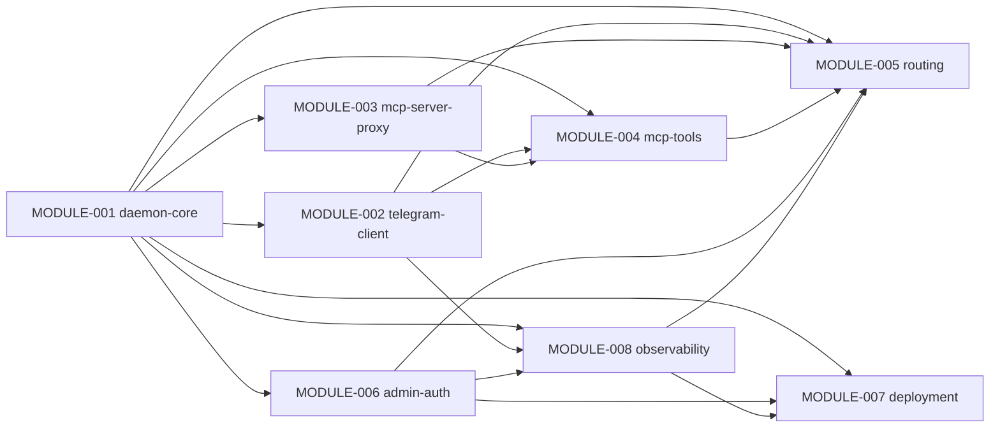
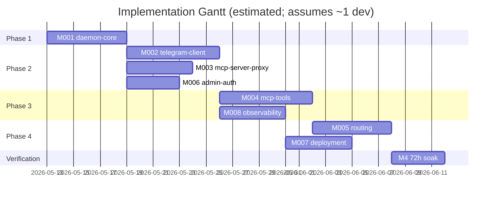

# Implementation Order

> Project: telegram-channels-pro
> Generated: 2026-05-12
> Updated: 2026-05-16 (/spec update v1.1.0 — v0.2 channels-integration amendment)
> Total Modules: 8

---

## Dependency Graph



`X --> Y` means X is a dependency of Y (Y calls X's contracts; pub/sub flow via EventBus
encodes only as dep on M001).

**v1.1.0 graph changes** (matches ARCHITECTURE.md §4 mermaid post-Round-1 audit fix):
- **REMOVED** phantom edge `M003 → M007` — M007 has no contract dependency on M003 per ARCH §4.1 rationale (audit fix Round 1 Critical D1).
- **ADDED** edge `M006 → M008` — M008 calls CONTRACT-009 `firstListedAdminUserId()` for routing TG admin alerts to first-listed admin under multi-admin first-listed degradation (REQ-046; audit fix Round 1 Critical D2).
- M004 row corrected: M004 does NOT depend on M006 (Decision A11 — callback admin verify is M005's responsibility; M004 receives pre-verified lookup); the pre-v1.1.0 graph erroneously showed `M006 → M004` which has been removed.

**Topological sort remains** `M001 → {M002, M003, M006} → {M004, M008} → M007 → M005`
(L0: M001; L1: M002, M003, M006; L2: M004, M008; L3: M007; L4: M005).

## Implementation Phases

### Phase 1: Foundation Layer (no upstream dependencies)

| Order | Module Doc | Module | Estimated Effort | Parallelizable |
|-------|-----------|--------|-----------------|----------------|
| 1.1 | [MODULE-001](modules/MODULE-001-daemon-core.md) | daemon-core (state dir + lock + watchdog + EventBus + DeploymentMode) | 4-6 d | No (foundation) |

**Phase Milestone (PRD M0 prerequisite)**: A daemon process can start, acquire its lock,
publish `daemon_start` event to its EventBus, run the watchdog probe loop, and accept SIGTERM
for graceful shutdown — without any TG/MCP/CLI activity yet.

### Phase 2: Infrastructure Layer (depends only on M001)

| Order | Module Doc | Module | Prerequisites | Estimated Effort | Parallelizable |
|-------|-----------|--------|--------------|-----------------|----------------|
| 2.1 | [MODULE-002](modules/MODULE-002-telegram-client.md) | telegram-client (HTTP wrapper + polling FSM + offset persistence + quarantine) | MODULE-001 | 5-7 d | Yes |
| 2.2 | [MODULE-003](modules/MODULE-003-mcp-server-proxy.md) | mcp-server-proxy (UDS acceptor + claude-side stdio + framing) | MODULE-001 | 4-5 d | Yes |
| 2.3 | [MODULE-006](modules/MODULE-006-admin-auth.md) | admin-auth (env precedence + registration window + brute-force counters) | MODULE-001 | 3-4 d | Yes |

**Phase Milestone (PRD M0 + M1 first half)**: Daemon polls Telegram successfully, claude session
can connect via UDS and send a tool_call frame, admin allowlist resolved from env-or-file at boot.

### Phase 3: Middleware Layer

| Order | Module Doc | Module | Prerequisites | Estimated Effort | Parallelizable |
|-------|-----------|--------|--------------|-----------------|----------------|
| 3.1 | [MODULE-004](modules/MODULE-004-mcp-tools.md) | mcp-tools (5 tools + PendingApprovalRegistry + attachment janitor) | MODULE-001, MODULE-002, MODULE-003, MODULE-006 | 5-7 d | Yes |
| 3.2 | [MODULE-008](modules/MODULE-008-observability.md) | observability (Logger + Alerter + StatusReporter + measurement helper) | MODULE-001, MODULE-002 | 4-5 d | Yes |

**Phase Milestone (PRD M1 + early M3)**: All 5 MCP tools callable; pending state stored in
M004; structured logs flow to disk; alerts dispatched via TG. Approval callback resolution
still requires M005 routing.

### Phase 4: Orchestration + Ingress

| Order | Module Doc | Module | Prerequisites | Estimated Effort | Parallelizable |
|-------|-----------|--------|--------------|-----------------|----------------|
| 4.1 | [MODULE-005](modules/MODULE-005-routing.md) | routing (SessionRegistry + inbound dispatch + commands + capacity enforce) | MODULE-001, MODULE-002, MODULE-003, MODULE-004, MODULE-006, MODULE-008 | 5-6 d | Yes |
| 4.2 | [MODULE-007](modules/MODULE-007-deployment.md) | deployment (launchd plist + CLI subcommands + plugin format + rollback docs) | MODULE-001, MODULE-003, MODULE-006, MODULE-008 | 4-5 d | Yes |

**Phase Milestone (PRD M2 + M3 + M4 gate)**: Inbound TG → focus claude session over LRU
routing; admin verification gates inbound text and callback; `/session`/`/list`/`/status`
commands work; capacity edge enforced; install-daemon and uninstall-daemon orchestrate
launchd plist; rollback documentation published.

## Milestone Mapping (PRD §7.1 M0-M4 ↔ Modules)

| PRD Milestone | User-visible Capability | Modules Required |
|---|---|---|
| M0 | First reply E2E (TG send → daemon polls → reply tool → TG reply visible) | M001 + M002 (sendMessage + getUpdates only) + M003 (single-session UDS) + M004 (`reply` tool only) |
| M1 | Official 4 tools work + first-run admin registration | M0 modules fully + M004 remaining tools (react, edit_message, download_attachment, compat suite) + M006 (env precedence + registration window) |
| M2 | Multi-session routing + `/reload-plugins` resilient | M0/M1 modules + M005 (SessionRegistry + LRU + `/session`/`/list`/`/status` + capacity guard) + M001 RC#2 self-aware lifecycle validation |
| M3 | request_approval round-trip (inline button + admin verify + claude await resolves) | M0-M2 modules + M004 PendingApprovalRegistry + M005 callback path |
| M4 | 72h soak + rollback docs + upstream PR draft | All modules + M008 measurement helper + M007 rollback docs + RC#1/RC#3 patches isolated for upstream PR |

## Critical Path



Critical path: M001 → M002 → M004 → M005 → M4 soak. Estimated ~30 days for a single-developer
serial path; parallel phases can compress to ~20-25 days with 2 devs (M003+M006 alongside M002;
M008 alongside M004; M007 alongside M005).

## AI Agent Implementation Guide

When handing a module to an AI Agent for implementation, provide:

1. The module's specification document (e.g. `docs/modules/MODULE-001-daemon-core.md`).
2. All upstream dependency module spec documents — but **only the §2.3 Interface Definitions
   sections** unless the agent specifically needs more (e.g. M005 needs M003 frame schema details).
3. Relevant sections from `docs/ARCHITECTURE.md` — at minimum §3 Module Inventory, §4 Dependency
   Graph, §6.1 Contract Registry, and §10 Requirement Traceability rows touching this module.
4. `docs/PRD.md` §3, §4, §5 (sections relevant to the module's REQ-IDs).
5. `docs/REQUIREMENTS_REGISTRY.md` rows for the REQ-IDs this module owns.
6. `docs/CONTEXT-MAP.md` to help the agent narrow scope when working on a feature.

### Agent Prompt Template

```
Implement MODULE-{NNN} ({module name}) per:

1. Module spec: docs/modules/MODULE-{NNN}-{name}.md
2. Architecture: docs/ARCHITECTURE.md (§3 Inventory, §4 Dep Graph, §6.1 Contract
   Registry, §8 Decisions A1-A14, §10 Traceability)
3. Required upstream contracts (§2.3 of each upstream module doc):
   {list dependency module §2.3 sections}
4. PRD context: docs/PRD.md §{relevant sections}
5. REQ ledger: docs/REQUIREMENTS_REGISTRY.md (REQ-{IDs owned})

Requirements:
- Strictly follow §2.3 Provided Interfaces (don't add fields/methods absent from the contract).
- Implement every §1.5 acceptance criterion as actual test in §3.3 layer.
- Test files under §3.2 File Structure paths.
- Honor §8 Error Handling table — return discriminated unions, not exceptions for
  contract-defined failure modes.
- Apply §2.9 Security Considerations.
- Use §2.10 Configuration & Environment Variables as the only config surface.
- Stub external modules with mock contracts during unit tests; use real ones only in
  integration / E2E layers per §3.3.

Definition of Done:
- All §1.5 Active=Y ACs have passing tests; update §3.4 ledger.
- Module progress in §3.1 reflects passing AC count.
- `bun build` + `bun test` exit 0.
- No `console.log` / `process.stderr.write` outside daemon-core boot phase.
```

### Module-specific implementation hints

- **MODULE-001 daemon-core**: implement EventBus first (everything else depends on it). Use
  Bun's `EventEmitter` extension or pure delegate; bounded queue per subscriber is the only
  non-trivial part.
- **MODULE-002 telegram-client**: sliding-window data structure + state machine; mock Telegram
  API for unit tests; compat suite (M004) consumes this module's schemas.
- **MODULE-003 mcp-server-proxy**: framing first, then handshake (session_init), then dispatch.
  claude-side proxy is much simpler than daemon-side (stdio is well-trodden).
- **MODULE-004 mcp-tools**: pending registry is the only non-trivial part. The 4 official tools
  are thin shims over CONTRACT-004. The compat suite needs upstream 0.0.6 schema fixtures —
  fetch from upstream repo at fork time + freeze.
- **MODULE-005 routing**: SessionRegistry (LRU) + 3 dispatch branches (text, callback, command)
  + capacity guard. Watch the registration-window-vs-admin ordering invariant (registration
  check FIRST per the fixed flow).
- **MODULE-006 admin-auth**: registration FSM + dual brute-force counters; the launchd-vs-lazy-
  spawn timeout dispatch is non-trivial — depends on M001 DeploymentMode.
- **MODULE-007 deployment**: shell scripts + plist template. Most of the work is integration
  testing against real `launchctl`. RISK-001 env-var inheritance is the biggest landmine.
- **MODULE-008 observability**: EventBus wildcard subscriber + 5 redaction classes + 3 alert
  categories + StatusReporter cache. Logger should be one of the first sub-modules implemented
  since it's used everywhere.

### Implementation order rationale (why this DAG)

- M001 owns the cross-module primitives (StateDir, EventBus, DeploymentMode). Without it, no
  other module can be tested in isolation.
- M002, M003, M006 depend only on M001 and are mutually independent — parallel-friendly.
- M008 needs M002 (Alerter calls TelegramAPIClient) — but otherwise independent. Could be
  done alongside M004 in Phase 3.
- M004 needs M002 (TG API) + M003 (MCP register) + M006 (allowlist) to actually function
  end-to-end. Compat suite is M004's deliverable but tests against M002's HTTP shape.
- M005 ties everything together — depends on M003 (deliver), M004 (pending lookup), M006
  (allowlist + registration gate), M008 (StatusReporter), M002 (TG API for command replies).
  Implement last after all primitive contracts are stable.
- M007 needs M001 (daemon binary path), M003 (lazy-spawn entry), M006 (reset-admin via
  CONTRACT-015), M008 (StatusReporter for status CLI). Implement after the primitives but can
  start alongside M005 since M007's surface is mostly install ceremony.
