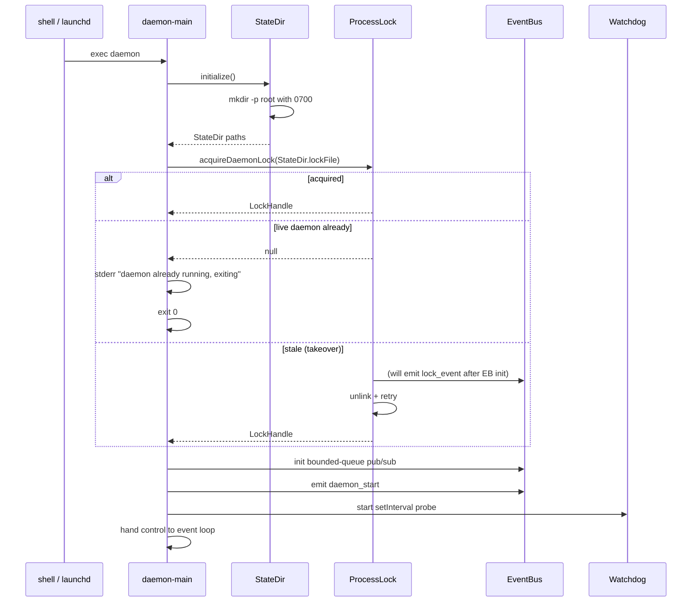
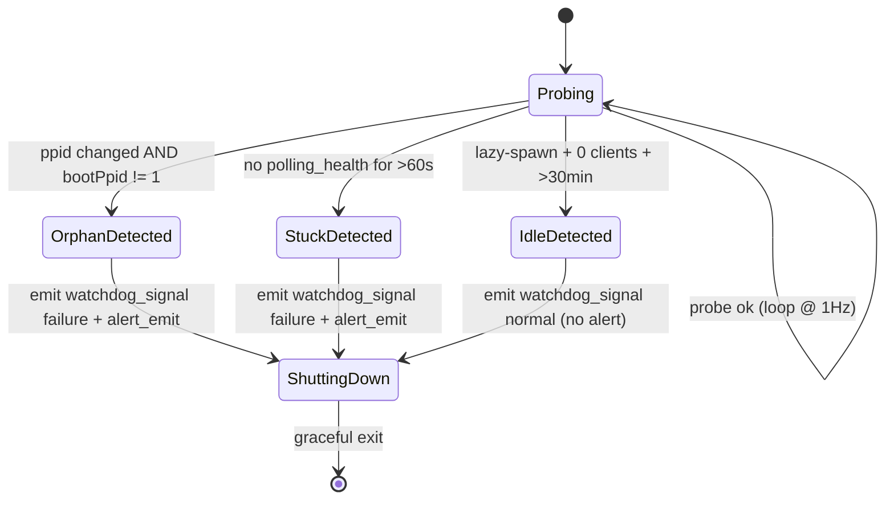
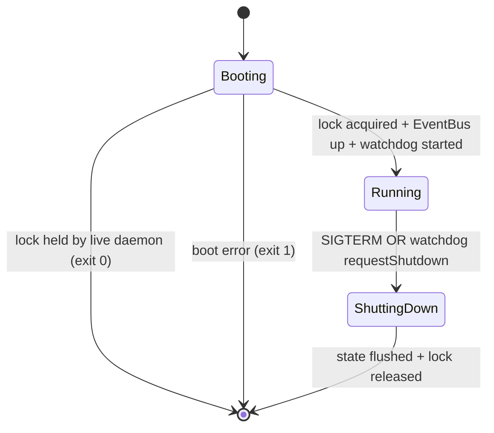

# MODULE-001: daemon-core

> Status: Draft
> Created: 2026-05-12
> Architecture: [ARCHITECTURE.md](../ARCHITECTURE.md)

---

## Part 1: Requirements

### 1.1 Module Goals & Overview

`daemon-core` is the foundational module for telegram-channels-pro. It owns the daemon process
lifecycle — single-instance guarantee via file lock, graceful shutdown, watchdog-driven exit
on orphan/stuck/idle conditions, state-directory ownership with strict permissions, deployment-
mode reporting (launchd vs lazy-spawn), and the in-process EventBus that decouples every
other module.

This module is the only module with **zero upstream dependencies** — every other module
depends on it for at least one of: StateDir resolution (CONTRACT-001), DeploymentMode query
(CONTRACT-002), or EventBus pub/sub (CONTRACT-003).

**Serves PRD topics**:
- `docs/PRD.md` (foundation infrastructure via REQ-004, REQ-006, REQ-007, REQ-016, REQ-019, REQ-021, REQ-025, REQ-031)

### 1.2 Architecture Overview

The daemon is a single Bun process running until orderly shutdown (SIGTERM from launchd or
self-initiated watchdog exit). On boot it:

1. Resolves the state directory `~/Library/Application Support/advance-kit/telegram-channels-pro/`,
   creating it with 0700 perms if missing.
2. Acquires an exclusive file lock at `<state_dir>/daemon.lock`, validating any stale lock
   via PID + binary identity check.
3. Brings up the in-process EventBus and writes a `daemon_start` event.
4. Initializes the watchdog (periodic `setInterval` probe for orphan / stuck / idle states).
5. Detects deployment mode (launchd via `LAUNCHD_SOCKET_*` env or PPID == 1; otherwise lazy-spawn).
6. Hands control to the main event loop (downstream modules subscribe and publish via EventBus).

On orderly shutdown:
1. Receives SIGTERM (or watchdog calls internal `requestShutdown(reason)`).
2. Emits `daemon_stop` event with reason.
3. Notifies subscribers to flush state (M002 persists offset.json, M008 flushes log buffers).
4. Closes Unix socket acceptor (M003 stops accepting new sessions).
5. Releases file lock + removes socket file.
6. exit(0) (or non-zero for watchdog fatal exits, so launchd KeepAlive restarts).

```
+---------------------------------------------------------------+
|                       MODULE-001 daemon-core                   |
|                                                               |
|  +------------+   +--------------+   +-------------------+    |
|  | ProcessLock|   | StateDirMgr  |   |   EventBus        |    |
|  | (CONTRACT- |   | (CONTRACT-   |   |   (CONTRACT-003)  |    |
|  |  001 lock) |   |  001 paths)  |   |                   |    |
|  +------------+   +--------------+   +-------------------+    |
|                                                               |
|  +------------+   +-------------------+                       |
|  | Watchdog   |   | DeploymentMode    |                       |
|  | (orphan/   |   | (CONTRACT-002)    |                       |
|  | stuck/idle)|   |                   |                       |
|  +------------+   +-------------------+                       |
|                                                               |
+---------------------------------------------------------------+
```

### 1.3 Feature Matrix

| Feature | Priority | Status | Description |
|---------|----------|--------|-------------|
| Single-instance file lock with PID + binary-identity stale check | P0 | Planned | REQ-004 / REQ-006 — guarantees ≤1 daemon at a time |
| State directory ownership at 0700 dir / 0600 files | P0 | Planned | REQ-016 — `daemon.lock`, `daemon.sock`, `admin.json`, `offset.json`, attachment temp dir, log dir |
| EventBus (in-process pub/sub) | P0 | Planned | CONTRACT-003 — the cross-module decoupler |
| Deployment mode detection (launchd vs lazy-spawn) | P0 | Planned | CONTRACT-002 — informs admin-auth timeout dispatch + idle TTL |
| Watchdog: orphan detection (parent PID gone) | P0 | Planned | REQ-007 / REQ-019 — exit with `watchdog_signal` event |
| Watchdog: stuck detection (no polling heartbeat for N seconds) | P0 | Planned | REQ-007 — exit with severity=failure (TG alert before exit) |
| Watchdog: idle detection (lazy-spawn mode, no MCP clients for TTL) | P0 | Planned | REQ-007 — exit with severity=normal (no alert) |
| SIGTERM graceful shutdown | P0 | Planned | REQ-004 — flush state then exit |
| EventBus bounded queue + drop policy | P1 | Planned | RISK-013 mitigation |
| Resource budget compliance (RSS<50MB, CPU<1% stationary) | P1 | Planned | REQ-021 — measured by M008 |

### 1.4 Detailed Feature Specifications

#### 1.4.1 Single-instance file lock

**User flow**:
1. daemon process starts (launchd or lazy-spawn invocation).
2. daemon-core attempts to acquire exclusive lock on `<state_dir>/daemon.lock` using `Bun.openSync` with O_EXCL flag (or POSIX `flock` LOCK_EX | LOCK_NB).
3. Lock acquired → write PID + boot timestamp + Bun version into the lock file content.
4. Lock not acquired → read existing lock file; validate the recorded PID is alive via `process.kill(pid, 0)` AND validate the running process command is the daemon binary (via `ps -p <pid> -o command=`); if alive + matching → exit 0 with stderr message "daemon already running (PID=<x>), exiting".
5. Lock validation fails (PID dead OR command mismatch) → log `lock_event: stale_takeover`, unlink lock file, retry from step 2.

**Technical implementation** (pseudocode):

```ts
async function acquireDaemonLock(stateDir: string): Promise<LockHandle> {
  const lockPath = `${stateDir}/daemon.lock`;
  for (let attempt = 0; attempt < 3; attempt++) {
    try {
      const fd = await Bun.file(lockPath).writer({ flags: 'wx' });
      await fd.write(`${process.pid}\n${Date.now()}\n${Bun.version}\n`);
      await fd.end();
      // Set permissions 0600
      await Bun.chmod(lockPath, 0o600);
      return { fd, path: lockPath };
    } catch (err) {
      if (err.code !== 'EEXIST') throw err;
      // Lock exists — validate
      const content = await Bun.file(lockPath).text();
      const [pidStr, ...rest] = content.split('\n');
      const pid = parseInt(pidStr, 10);
      if (await isLiveDaemon(pid)) {
        return null; // signal "exit cleanly"
      }
      // Stale — unlink and retry
      await Bun.unlink(lockPath);
      eventBus.emit('lock_event', { kind: 'stale_takeover', stale_pid: pid });
    }
  }
  throw new Error('failed to acquire daemon lock after 3 retries');
}

async function isLiveDaemon(pid: number): Promise<boolean> {
  if (pid <= 1 || pid === process.pid) return false;
  try { process.kill(pid, 0); } catch { return false; }
  // Verify binary identity
  const proc = Bun.spawn(['ps', '-p', String(pid), '-o', 'command='], { stdout: 'pipe' });
  const out = await new Response(proc.stdout).text();
  return out.includes('telegram-channels-pro') || out.includes('daemon-main');
}
```

**Configuration**: `daemon.lock` path is fixed (`<state_dir>/daemon.lock`); no user override.

#### 1.4.2 State directory ownership

**User flow**:
1. daemon-core resolves state dir via `path.join(os.homedir(), 'Library/Application Support/advance-kit/telegram-channels-pro')`.
2. If missing, creates with 0700 perms (recursive).
3. If exists with wrong perms (not 0700), emit `state_dir_perms_anomaly` event and chmod back to 0700 only if `stat()` shows owner == current uid; else refuse to start with clear error.
4. Returns `StateDir` interface with paths for `daemon.lock`, `daemon.sock`, `admin.json`, `offset.json`, `attachments/`, and `log_dir`.

**Paths returned**:

| Key | Path |
|-----|------|
| `lockFile` | `<state_dir>/daemon.lock` |
| `socketFile` | `<state_dir>/daemon.sock` |
| `adminFile` | `<state_dir>/admin.json` |
| `offsetFile` | `<state_dir>/offset.json` |
| `attachmentDir` | `<state_dir>/attachments/` |
| `logDir` | `~/Library/Logs/advance-kit/telegram-channels-pro/` (0700) |

#### 1.4.3 EventBus

**User flow** (publisher):
```ts
eventBus.emit('quarantine_enter', { reason: '5 fatal in 60s', timestamp: Date.now() });
```

**User flow** (subscriber):
```ts
eventBus.on('inbound_update', (event) => {
  // M005 routing logic
});
```

**Technical implementation**:
- In-process EventEmitter-style API (extends Node's `EventEmitter` for familiarity).
- Bounded queue per subscriber (default 1024 events).
- When subscriber queue is full: emit `subscriber_queue_drop` event globally (M008 subscribes for warning), drop oldest event in subscriber's queue.
- Synchronous emit semantics (publisher blocks briefly while all subscribers are notified) for simplicity; subscriber handlers MUST be cheap or schedule offloaded work.

**Event-type catalog**: see ARCHITECTURE.md §6.1 CONTRACT-003 description for the canonical list.

#### 1.4.4 DeploymentMode detection

**User flow**:
1. On daemon boot, daemon-core checks for the launchd-specific env vars `XPC_SERVICE_NAME` and `LAUNCHD_SOCKET` (Bun inherits via `EnvironmentVariables` plist key).
2. If found OR `process.ppid === 1` (launchd is the parent on macOS) → mode = `"launchd"`.
3. Otherwise → mode = `"lazy-spawn"`.
4. Mode is cached for the daemon's lifetime; `getDeploymentMode()` returns the cached value.

**Used by**:
- M006 admin-auth: launchd-mode → "wait-for-reset" on registration timeout; lazy-spawn → exit
- M007 deployment: status subcommand reports mode
- M008 observability: alert routing decisions (lazy-spawn mode might suppress crash-loop alerts since lazy-spawn restarts come from user action, not auto)

#### 1.4.5 Watchdog

**User flow**:
- A `setInterval(probe, 1000)` runs every 1 second.
- `probe()` checks:
  - **orphan**: `process.ppid !== bootPpid` AND `bootPpid !== 1` (launchd parent reparenting on user logout is normal; treat as non-orphan)
  - **stuck**: `Date.now() - lastPollingHeartbeat > heartbeatTimeoutMs` (default 60s; subscribes to `polling_health` events from M002 to track last heartbeat)
  - **idle (lazy-spawn only)**: `mcpClientCount === 0 AND Date.now() - lastClientDisconnect > idleTtlMs` (default 30min)
- Any condition triggers `requestShutdown(reason)` → emit `watchdog_signal` event with severity and reason → graceful shutdown sequence.

**Severity grading** (resolves PRD §1.1 principle "失败可观测，正常生命周期静默"):
- orphan / stuck → severity `failure` → daemon emits `alert_emit` event to M008 BEFORE shutdown (M008 attempts TG alert)
- idle (lazy-spawn) → severity `normal` → no alert, INFO-level log only

**Operational parameters** (locked here per PRD §8 Decision bounds):

| Parameter | Value | Justification |
|-----------|-------|---------------|
| Probe interval | 1000 ms | PRD §8 bound "探针周期 1-5s"; tight enough to catch Ctrl+Z within 1 cycle (PRD §2.1 zombie pain) |
| Heartbeat timeout (stuck) | 60 sec | PRD §8 bound "心跳超时 30-90s"; covers Telegram's 25s long-poll + buffer |
| Idle TTL (lazy-spawn) | 30 min | PRD §8 bound "idle TTL 5min-2h"; balances quick resource release with avoiding cold-spawn re-cost |
| `bootPpid` capture | first probe | Captured on watchdog init; used for orphan delta |

### 1.5 Acceptance Criteria

| ID | REQ Source | Contracts | Criterion | Verification |
|----|-----------|-----------|-----------|-------------|
| MODULE-001-AC-01 | REQ-004 | CONTRACT-001 | StateDir initialization creates 0700 directory at expected Apple Application Support path | unit test |
| MODULE-001-AC-02 | REQ-004 | CONTRACT-001 | State directory perms anomaly emits `state_dir_perms_anomaly` event and restores 0700 if owner matches | unit test |
| MODULE-001-AC-03 | REQ-006 | CONTRACT-001 | Daemon lock acquired on first start; second daemon instance exits cleanly with `lock_event` warning | integration test |
| MODULE-001-AC-04 | REQ-006 | CONTRACT-001 | Stale lock (dead PID) is detected via `process.kill(pid, 0)` + ps comm check; takeover succeeds; emits `lock_event: stale_takeover` | integration test |
| MODULE-001-AC-05 | REQ-006 | CONTRACT-001 | Stale lock with live but wrong-binary PID is rejected (daemon refuses to start) | integration test |
| MODULE-001-AC-06 | REQ-004 | CONTRACT-001 | SIGTERM triggers graceful shutdown: stop accepting MCP clients, emit `daemon_stop`, flush offset/admin via subscriber events, release lock, unlink socket | integration test |
| MODULE-001-AC-07 | CONTRACT-002 | CONTRACT-002 | DeploymentMode returns `"launchd"` when XPC_SERVICE_NAME env is set OR ppid === 1 | unit test |
| MODULE-001-AC-08 | CONTRACT-002 | CONTRACT-002 | DeploymentMode returns `"lazy-spawn"` when XPC env absent AND ppid !== 1 | unit test |
| MODULE-001-AC-09 | CONTRACT-003 | CONTRACT-003 | EventBus delivers published event to all subscribers within same tick | unit test |
| MODULE-001-AC-10 | CONTRACT-003 / RISK-013 | CONTRACT-003 | EventBus subscriber queue overflow drops oldest event and emits `subscriber_queue_drop` event | unit test |
| MODULE-001-AC-11 | REQ-007 / REQ-019 | CONTRACT-003 | Watchdog orphan detection triggers `watchdog_signal: orphan` and graceful shutdown when parent PID disappears | integration test |
| MODULE-001-AC-12 | REQ-007 | CONTRACT-003 | Watchdog stuck detection triggers when `polling_health` events stop arriving for 60s; severity=failure | integration test |
| MODULE-001-AC-13 | REQ-007 | CONTRACT-003 | Watchdog idle detection (lazy-spawn only) triggers after 30min with no MCP clients; severity=normal | integration test |
| MODULE-001-AC-14 | REQ-007 | CONTRACT-003 | Watchdog stuck/orphan emits `alert_emit` BEFORE shutdown; idle does NOT emit alert | integration test |
| MODULE-001-AC-15 | REQ-019 | — | After 72h soak, `ps -A` shows 0 bun processes with STAT=R + etime>1h (zombie check) | E2E soak test |
| MODULE-001-AC-16 | REQ-021 | — | Stationary RSS < 50MB P95 / CPU < 1% mean over ≥120 samples per measurement protocol (PRD §5) | E2E soak test |
| MODULE-001-AC-17 | REQ-025 | — | Daemon crash followed by launchd KeepAlive restart preserves no in-memory state but offset.json replay continues at last offset | integration test |
| MODULE-001-AC-18 | REQ-031 | — | All daemon-core source compiles + runs under Bun ≥1.1 with TypeScript ≥5.4 strict mode | build test |
| MODULE-001-AC-19 | REQ-016 | CONTRACT-001 | State directory permission check on boot: 0700 dir required; 0600 lock file written; chmod restoration only when owner matches uid | unit test |
| MODULE-001-AC-20 | REQ-016 | CONTRACT-001 | State files (`daemon.lock`, `daemon.sock`, `admin.json`, `offset.json`) are written with owner == `process.getuid()`; if existing file's owner differs from process uid → daemon refuses to read/write and emits `state_dir_perms_anomaly` event with action='refused' | unit test |
| MODULE-001-AC-21 | RISK-006 | CONTRACT-001 | Stale Unix socket from unclean prior exit is detected on boot: daemon attempts a non-blocking `connect()` to `daemon.sock`; ECONNREFUSED → unlink + recreate; successful connect → another daemon is alive (handled by lock check) | integration test |

### 1.6 Non-functional Requirements

| Requirement | Target | Measurement |
|-------------|--------|-------------|
| Boot latency (lock + state dir + EventBus init) | < 500 ms | startup log timestamp delta |
| EventBus emit overhead (publisher → all subscribers notified) | < 1 ms (in-process, no IO) | benchmark |
| Lock acquisition under contention | < 100 ms to detect existing live daemon | integration test |
| Watchdog probe overhead | < 5 ms per probe (1Hz) | benchmark |
| Stationary RSS | < 50 MB P95 (per PRD §5) | M008 measurement script |
| Stationary CPU | < 1% mean (per PRD §5) | M008 measurement script |

### 1.7 Security Requirements

- State directory created with 0700 (drwx------) — owner-only access.
- All state files (lock, socket, admin.json, offset.json) created with 0600 — owner-only read/write.
- State directory perms anomaly (manual chmod to 0755 etc.) is detected on boot:
  - If `stat.uid === process.getuid()` → daemon chmod-restores to 0700 + emits `state_dir_perms_anomaly` event
  - Else → daemon refuses to start (refusing to operate in a directory it doesn't own)
- Lock file contents (PID + boot ts + Bun version) are NOT secrets but are still 0600 to minimize attacker info gathering on multi-user hosts.
- Boot-phase stderr messages (before EventBus init) use plain text. The bot token is read AFTER EventBus init, so token never appears in pre-EventBus stderr.
- daemon-core does not call M002 (telegram-client) directly — all TG-side alerts on watchdog failure are routed through M008 via `alert_emit` event.

---

## Part 2: Specification

### 2.1 Module Boundary

**IN (Responsibilities)**:
- Daemon process boot + shutdown lifecycle
- Single-instance enforcement (file lock + PID/binary-identity validation)
- State directory creation + permission management
- EventBus pub/sub primitives (CONTRACT-003)
- Deployment mode detection + caching
- Watchdog probe loop (orphan / stuck / idle)
- Signal handling (SIGTERM / SIGINT for graceful shutdown)
- Stderr boot-phase logging (pre-EventBus)

**OUT (Excluded — with owning module reference)**:
- Telegram HTTP API + polling state machine → MODULE-002
- MCP transport / socket framing → MODULE-003
- 5 MCP tools (reply/react/etc.) → MODULE-004
- Session routing + TG commands → MODULE-005
- Admin allowlist / first-run registration → MODULE-006
- CLI subcommands + launchd plist authoring → MODULE-007
- Structured JSON logging + alert dispatch + status subcommand output → MODULE-008

### 2.2 Dependencies

#### Upstream Dependencies

(none — daemon-core is the foundation)

#### Downstream Dependencies (modules that depend on this module)

| Module | Doc Link | Dependency Content |
|--------|----------|--------------------|
| MODULE-002 telegram-client | [MODULE-002](./MODULE-002-telegram-client.md) | StateDir (offset.json path), EventBus pub (`inbound_update` etc.) + sub (`registration_timeout`) |
| MODULE-003 mcp-server-proxy | [MODULE-003](./MODULE-003-mcp-server-proxy.md) | StateDir (socket path), EventBus pub (`session_*`) |
| MODULE-004 mcp-tools | [MODULE-004](./MODULE-004-mcp-tools.md) | StateDir (attachment dir), EventBus pub (`tool_*`, `pending_capacity_snapshot`) |
| MODULE-005 routing | [MODULE-005](./MODULE-005-routing.md) | EventBus sub (`inbound_update`, `session_*`, `tool_call`) + pub (`route_decision`, `auth_deny_routing`) |
| MODULE-006 admin-auth | [MODULE-006](./MODULE-006-admin-auth.md) | StateDir (admin.json), DeploymentMode, EventBus pub |
| MODULE-007 deployment | [MODULE-007](./MODULE-007-deployment.md) | StateDir (resolve daemon binary + state paths), DeploymentMode |
| MODULE-008 observability | [MODULE-008](./MODULE-008-observability.md) | EventBus sub (all event types), StateDir (log dir), DeploymentMode |

#### External Dependencies

| Dependency | Version | Purpose |
|-----------|---------|---------|
| Bun | ≥1.1 | Runtime — provides `Bun.file`, `Bun.openSync`, `Bun.spawn`, `Bun.chmod` |
| Node `process` global | inherited | PID, ppid, signal handlers, env vars |
| Node `os` module | inherited | `homedir()` resolution |
| macOS `ps` binary | system | invoked via `Bun.spawn` for binary-identity validation in lock takeover |

#### External Dependency Evaluation

| Dependency | License | Maintenance | Known CVEs | Size Impact | Verdict |
|-----------|---------|-------------|-----------|-------------|---------|
| Bun | MIT | Active | None recent | bundled runtime (~50MB) | Accept |
| `ps` binary | macOS system | macOS-provided | n/a | nil | Accept |

### 2.3 Interface Definitions

#### Provided Interfaces

| Contract ID | Interface | Source Files | Description |
|-------------|-----------|--------------|-------------|
| CONTRACT-001 | StateDir | `src/daemon/state-dir.ts` | Path resolution + dir creation + perm enforcement |
| CONTRACT-002 | DeploymentMode | `src/daemon/deployment-mode.ts` | launchd vs lazy-spawn detection |
| CONTRACT-003 | EventBus | `src/daemon/event-bus.ts`, `src/daemon/event-types.ts` | Pub/sub primitives + canonical event-type definitions |

```ts
// CONTRACT-001 — StateDir
export interface StateDir {
  readonly root: string;       // ~/Library/Application Support/...
  readonly lockFile: string;
  readonly socketFile: string;
  readonly adminFile: string;
  readonly offsetFile: string;
  readonly attachmentDir: string;
  readonly logDir: string;
  initialize(): Promise<void>;  // ensures dirs exist with 0700; verifies file perms 0600 on existing files
}

// CONTRACT-002 — DeploymentMode
export type DeploymentMode = 'launchd' | 'lazy-spawn';
export function getDeploymentMode(): DeploymentMode;

// CONTRACT-003 — EventBus
export interface EventBus {
  emit<K extends EventTypeKey>(type: K, payload: EventPayloadMap[K]): void;
  on<K extends EventTypeKey>(type: K | K[], handler: (event: EventPayloadMap[K]) => void): Unsubscribe;
  // bounded-queue per subscriber semantics; overflow drops oldest + emits subscriber_queue_drop
}
type EventTypeKey =
  | 'inbound_update' | 'quarantine_enter' | 'quarantine_exit' | 'polling_health'
  | 'polling_event' | 'polling_status_snapshot'
  | 'session_connected' | 'session_disconnected' | 'frame_invalid'
  | 'tool_call' | 'tool_result' | 'pending_capacity_snapshot'
  | 'route_decision' | 'auth_deny_routing'
  | 'auth_deny_registration' | 'registration_event' | 'registration_timeout'
  | 'daemon_start' | 'daemon_stop' | 'lock_event' | 'watchdog_signal'
  | 'state_dir_perms_anomaly' | 'cli_command' | 'subscriber_queue_drop'
  | 'log_emit' | 'alert_emit';
// Canonical count: 26 event types (kept in sync with src/daemon/event-types.ts ALL_EVENT_TYPES).
type EventPayloadMap = { /* per-type payload shapes — see event-types.ts */ };
type Unsubscribe = () => void;
```

#### Required External Interfaces

(none — daemon-core is at the bottom)

#### Events/Messages

(All event types published BY daemon-core)

| Event Name | Trigger | Payload | Consumer |
|-----------|---------|---------|----------|
| `daemon_start` | After successful lock acquisition + EventBus init | `{ pid, boot_ts, bun_version, deployment_mode }` | M008 (log + alert if crash-loop merge condition) |
| `daemon_stop` | Inside graceful shutdown sequence | `{ pid, reason, uptime_ms }` | M002 (flush offset.json), M008 (flush logs) |
| `lock_event` | Stale lock takeover or contention | `{ kind: 'stale_takeover' \| 'contention_exit', stale_pid?, observed_command? }` | M008 (log) |
| `watchdog_signal` | Watchdog probe detected condition | `{ kind: 'orphan' \| 'stuck' \| 'idle', severity: 'failure' \| 'normal', detail }` | M008 (alert if severity=failure) |
| `state_dir_perms_anomaly` | Boot-time perm check detected wrong mode bits | `{ path, expected: '0700', observed, action: 'restored' \| 'refused' }` | M008 (log) |
| `subscriber_queue_drop` | Subscriber's per-event-type queue overflowed | `{ subscriber_id, event_type, drop_count }` | M008 (log warning) |

### 2.4 API Endpoints

(none — daemon-core has no external HTTP / REST surface)

### 2.5 Data Models

(daemon-core owns the on-disk format of `daemon.lock`; other files are owned by their respective modules)

`daemon.lock` plain-text format (3 lines):

```
<PID as decimal>
<boot_ts as Unix epoch milliseconds>
<Bun.version string>
```

File perms: 0600.
Owner: process uid.
Path: `<state_dir>/daemon.lock`.

`StateDirSpec` paths (CONTRACT-001 surface):

| Field | Path | Owner module | Purpose |
|-------|------|--------------|---------|
| `lockFile` | `<root>/daemon.lock` | M001 | single-instance lock |
| `socketFile` | `<root>/daemon.sock` | M003 | MCP UDS for claude sessions |
| `controlSocketFile` | `<root>/daemon.ctl.sock` | M007 | CLI control socket (status / reset-admin) |
| `adminFile` | `<root>/admin.json` | M006 | persisted admin allowlist |
| `offsetFile` | `<root>/offset.json` | M002 | TG getUpdates offset |
| `attachmentDir` | `<root>/attachments/` | M004 | downloaded TG attachments (TTL-bounded) |
| `logDir` | (separate; default `~/Library/Logs/advance-kit/...`) | M008 | JSONL daemon logs |

**Additive-field invariant**: when adding a path field to `StateDirSpec`, both
`resolveStateDir()` and any test helper that constructs a `StateDirSpec` literal
(e.g., `tests/helpers/tmp-state-dir.ts`) must populate the new field. The existing
6 path fields are stable across slices; new fields are append-only.

No SQL / migrations.

### 2.6 Database Functions & RPCs

(N/A — no database)

### 2.7 Core Logic

#### Boot sequence



#### Watchdog probe logic



### 2.8 Error Handling

| Error Code | Error Name | Trigger Condition | Handling Strategy |
|-----------|-----------|------------------|-------------------|
| `E_STATE_DIR_PERMS` | StateDirPermsRefused | State dir exists with wrong perms AND owner mismatch | Refuse boot; stderr message with chmod command suggestion; exit 1 |
| `E_LOCK_HELD_LIVE` | LockHeldByLiveDaemon | Lock acquisition failed AND PID is live + binary matches | Clean exit (0) with stderr "daemon already running" |
| `E_LOCK_HELD_WRONG_BINARY` | LockHeldByWrongBinary | Lock acquisition failed AND PID is live BUT command does not contain daemon-binary tokens | Refuse takeover; stderr explains the suspicious PID + command; exit 1 |
| `E_LOCK_RETRY` | LockRetryExhausted | 3 stale-takeover attempts all failed | Refuse boot; stderr; exit 1 |
| `E_BUN_VERSION` | UnsupportedBunVersion | `Bun.version` < 1.1 | Refuse boot; stderr explicit version requirement; exit 1 |
| `E_HOMEDIR` | NoHomeDir | `os.homedir()` empty / inaccessible | Refuse boot; stderr; exit 1 |
| `E_BOT_TOKEN_MISSING` | BotTokenMissing | `TELEGRAM_BOT_TOKEN` env var unset at boot | Refuse boot; release lock; stderr; exit 1 |

**Error Propagation**: daemon-core errors are boot-fatal — no event propagation needed because they abort before EventBus is up. After EventBus init, errors are emitted as events (e.g. `watchdog_signal`) and consumers handle.

### 2.9 Security Considerations

- File lock contents are not secret but stored 0600 to minimize discoverability.
- Watchdog probes invoke `ps -p <pid> -o command=` via `Bun.spawn` — input is internally-generated PID (from the lock file), not user input; no injection surface.
- State directory perm restoration only proceeds if `stat.uid === process.getuid()` — refuses cross-uid restoration to avoid escalation.
- Stderr boot messages contain PID, paths, and version — no secrets. Bot token is read AFTER EventBus is up, so it never touches pre-redaction stderr.

### 2.10 Configuration & Environment Variables

| Variable | Required | Default | Description |
|----------|----------|---------|-------------|
| `XPC_SERVICE_NAME` | No | (unset) | launchd-set; detected for DeploymentMode |
| `LAUNCHD_SOCKET` | No | (unset) | launchd-set; detected for DeploymentMode |
| `TGCP_STATE_DIR` | No | `~/Library/Application Support/advance-kit/telegram-channels-pro/` | Override for testing (rare) |

### 2.11 Operational Parameters

| Parameter | Value | Description |
|-----------|-------|-------------|
| Watchdog probe interval | 1000 ms | PRD §8 bound |
| Stuck heartbeat timeout | 60 sec | PRD §8 bound |
| Idle TTL (lazy-spawn) | 30 min | PRD §8 bound |
| EventBus subscriber queue size | 1024 events | RISK-013 mitigation; tunable per subscriber |
| Lock takeover max retries | 3 | empirically sufficient |

### 2.12 State Management

**Owned state surfaces**:

| Surface | Persistence | Owner | Consumers |
|---------|-------------|-------|-----------|
| `daemon.lock` file | Disk (0600) | MODULE-001 | (none — internal) |
| In-memory deployment mode cache | Process | MODULE-001 | M006, M007, M008 (via CONTRACT-002) |
| EventBus subscriber registry | Process | MODULE-001 | all modules (via CONTRACT-003) |
| Watchdog state (last polling heartbeat, last MCP client disconnect, bootPpid) | Process | MODULE-001 | (none — internal) |

**State transitions**: daemon process states



**Cross-module state protocol**: None for in-memory state. For disk state, M001 publishes `daemon_stop` event before exiting; M002 (offset.json) and M006 (admin.json) subscribe and flush their owned files. M001 does NOT directly touch other modules' state files.

### 2.13 Operations

**Health & monitoring**:
- No HTTP health endpoint at daemon-core layer (M008 surfaces `status` subcommand via CLI).
- Key metrics emitted via EventBus: `daemon_start`, `daemon_stop`, `watchdog_signal`, `lock_event`.
- Critical alerts: `watchdog_signal: severity=failure` (orphan / stuck) → TG alert via M008.

**Common failures & runbook**:

| Symptom | Likely cause | First response | Escalation |
|---------|--------------|----------------|------------|
| Daemon exits immediately with "daemon already running" | Lock held by live daemon | `ps -A \| grep telegram-channels-pro` to confirm; if user wants a second instance, that's a bug | Reject second instance is correct behavior |
| Daemon fails to start with E_STATE_DIR_PERMS | Manual chmod or cross-uid contamination | `chmod 0700 ~/Library/Application\ Support/advance-kit/telegram-channels-pro` | If owner mismatch, investigate intrusion |
| TG alert "watchdog_signal: orphan" | Parent process (launchd or claude) died | Verify launchctl status; if launchd-managed, expect KeepAlive restart | If repeated: investigate launchd config corruption |
| TG alert "watchdog_signal: stuck" | Polling heartbeat absent ≥60s | Check M002 polling state; likely Telegram API outage or quarantine | If sustained: check Telegram status page |

**Kill switches & feature flags**: none at daemon-core layer.

**Rollback strategy**:
- Deploy unit: daemon binary (compiled Bun bundle)
- Rollback method: replace binary; daemon-core's lock + state files are forward-compatible (lock format is 3-line plaintext, unlikely to break)
- State migration reversibility: no migrations (no schema)

**Capacity**: daemon-core itself has no application-level capacity bound; it's a process supervisor.

### 2.14 Observability

**Structured logs** (events that flow through `log_emit` or are intercepted by M008's subscription):

| Event | Level | Fields | Sensitive fields (NEVER log) |
|-------|-------|--------|------------------------------|
| `daemon_start` | INFO | pid, boot_ts, bun_version, deployment_mode | — |
| `daemon_stop` | INFO | pid, reason, uptime_ms | — |
| `lock_event: stale_takeover` | WARN | stale_pid, observed_command | — |
| `lock_event: contention_exit` | INFO | live_pid | — |
| `watchdog_signal: orphan` | ERROR | bootPpid, currentPpid | — |
| `watchdog_signal: stuck` | ERROR | heartbeat_age_ms | — |
| `watchdog_signal: idle` | INFO | client_count, idle_duration_ms | — |
| `state_dir_perms_anomaly` | WARN | path, expected, observed, action | — |
| `subscriber_queue_drop` | WARN | subscriber_id, event_type, drop_count | — |

**Metrics**: none owned directly by M001 (M008 derives `daemon_uptime` from `daemon_start`/`daemon_stop` events for `status` command).

**Traces**: not applicable (single-process boundary).

**Redaction list** (scrubbed before log sink): none (daemon-core events carry no secrets).

**Retention**:
- Logs: M008-owned (typically 14 days file-rolled).
- Process metrics: ephemeral; M008 caches recent values for status command.

---

## Part 3: Implementation

**Progress policy**: AC-driven. Module progress = `count(Active=Y AND Status='passed') / count(Active=Y) × 100`. See /dev §6.1.1 for the formula.

### 3.1 Current Status

| Status | Progress | Last Updated |
|--------|----------|--------------|
| In Progress | 90% | 2026-05-14 |

### 3.2 File Structure

| File | Role |
|------|------|
| `plugins/telegram-channels-pro/src/daemon/main.ts` | Daemon entry point; orchestrates boot sequence |
| `plugins/telegram-channels-pro/src/daemon/state-dir.ts` | StateDir implementation (CONTRACT-001) |
| `plugins/telegram-channels-pro/src/daemon/process-lock.ts` | File lock acquisition + stale takeover |
| `plugins/telegram-channels-pro/src/daemon/event-bus.ts` | EventBus implementation (CONTRACT-003) |
| `plugins/telegram-channels-pro/src/daemon/event-types.ts` | Canonical event type definitions + payload schemas |
| `plugins/telegram-channels-pro/src/daemon/deployment-mode.ts` | DeploymentMode detection (CONTRACT-002) |
| `plugins/telegram-channels-pro/src/daemon/watchdog.ts` | Probe loop + signal emission |
| `plugins/telegram-channels-pro/src/daemon/shutdown.ts` | Graceful shutdown coordination |
| `plugins/telegram-channels-pro/src/daemon/index.ts` | Module barrel export |
| `plugins/telegram-channels-pro/tests/daemon/*.test.ts` | Unit + integration tests |

### 3.3 Test Cases

| ID | Layer | AC Link | Scenario | Operation Sequence | Expected Result | Priority |
|----|-------|---------|----------|-------------------|-----------------|----------|
| MODULE-001-T01 | Unit | MODULE-001-AC-01 | state dir missing → created at 0700 | `await stateDir.initialize()` on empty parent dir | dir exists at expected path, mode bits == 0o700 | P0 |
| MODULE-001-T02 | Unit | MODULE-001-AC-02 | state dir 0755 + same uid → restored to 0700 | manually `chmod 0755 dir`, then `initialize()` | dir mode bits restored to 0o700; event `state_dir_perms_anomaly` emitted with action='restored' | P0 |
| MODULE-001-T03 | Unit | MODULE-001-AC-02 | state dir 0755 + different uid → refused | mock `stat.uid` mismatch | `initialize()` throws `E_STATE_DIR_PERMS`; event with action='refused' | P0 |
| MODULE-001-T04 | Integration | MODULE-001-AC-03 | first daemon acquires lock | daemon-main A starts | lock file exists with PID(A), boot_ts, bun_version; perms 0600 | P0 |
| MODULE-001-T05 | Integration | MODULE-001-AC-03 | second daemon exits clean | A still running, start B | B exits 0; stderr contains "daemon already running"; A's lock unchanged | P0 |
| MODULE-001-T06 | Integration | MODULE-001-AC-04 | stale lock (dead PID) takeover | write lock with PID=99999 (assumed dead), start daemon | daemon acquires lock; `lock_event: stale_takeover` emitted with stale_pid=99999 | P0 |
| MODULE-001-T07 | Integration | MODULE-001-AC-05 | stale lock with live but wrong binary | write lock with PID of `sleep 60`, start daemon | daemon refuses; stderr explains; exit 1 | P1 |
| MODULE-001-T08 | Integration | MODULE-001-AC-06 | SIGTERM graceful shutdown | running daemon receives SIGTERM | `daemon_stop` event fires; subscribers flush; lock + socket removed; exit 0 | P0 |
| MODULE-001-T09 | Unit | MODULE-001-AC-07 | DeploymentMode = launchd via env | set `XPC_SERVICE_NAME=foo`; call `getDeploymentMode()` | returns `'launchd'` | P0 |
| MODULE-001-T10 | Unit | MODULE-001-AC-08 | DeploymentMode = lazy-spawn fallback | unset XPC env, ppid != 1 | returns `'lazy-spawn'` | P0 |
| MODULE-001-T11 | Unit | MODULE-001-AC-09 | EventBus emit reaches subscriber | subscribe to type X; emit X | subscriber handler called within same microtask | P0 |
| MODULE-001-T12 | Unit | MODULE-001-AC-10 | EventBus queue overflow drops oldest | subscribe with queue=4; emit 5 events | 5th event delivered; `subscriber_queue_drop` emitted with drop_count=1 | P1 |
| MODULE-001-T13 | Integration | MODULE-001-AC-11 | watchdog orphan detection | start daemon as child of test harness; SIGKILL harness; observe daemon | `watchdog_signal: orphan` emitted within ~1s; daemon initiates shutdown | P0 |
| MODULE-001-T14 | Integration | MODULE-001-AC-12 | watchdog stuck detection | start daemon; suppress `polling_health` events; wait 65s | `watchdog_signal: stuck` emitted; severity=failure; `alert_emit` event precedes shutdown | P0 |
| MODULE-001-T15 | Integration | MODULE-001-AC-13 | watchdog idle (lazy-spawn) | start daemon in lazy-spawn mode; 0 MCP clients for 31min | `watchdog_signal: idle` emitted; severity=normal; NO `alert_emit` event | P1 |
| MODULE-001-T16 | E2E Soak | MODULE-001-AC-15 / AC-16 | 72h zombie + resource budget | run daemon under launchd 72h with 3 sessions + reload-plugins every 30min | end of run: 0 R-state bun procs; RSS<50MB P95; CPU<1% mean | P0 |
| MODULE-001-T17 | Build | MODULE-001-AC-18 | TS strict compile + Bun runtime | `bun build src/daemon/main.ts --target=bun` + `bun test` | exit 0 | P0 |
| MODULE-001-T18 | Integration | MODULE-001-AC-17 | offset.json replay across crash | crash daemon mid-poll; restart; verify next getUpdates uses prior offset | first getUpdates after restart includes the offset value from offset.json | P0 |
| MODULE-001-T19 | Unit | MODULE-001-AC-19 | lock file written at 0600 | acquireDaemonLock + stat | mode bits == 0o600 | P0 |
| MODULE-001-T20 | Unit | MODULE-001-AC-14 | failure-severity alert emitted | trigger watchdog stuck; observe event order | `alert_emit` event fires BEFORE `daemon_stop` | P1 |
| MODULE-001-T21 | Unit | MODULE-001-AC-20 | uid-mismatch refuses to operate | mock `stat.uid` differing from `process.getuid()` on existing lock file | initialize() throws or refuses; `state_dir_perms_anomaly` with action='refused' | P0 |
| MODULE-001-T22 | Integration | MODULE-001-AC-21 | stale socket cleanup on boot | leave dangling `daemon.sock` from prior exit (no listener); start daemon | daemon connects → ECONNREFUSED → unlinks → creates new socket successfully | P0 |

### 3.4 Acceptance Criteria Verification

| AC ID | Active | Status | Verified By Task | Date |
|-------|--------|--------|-----------------|------|
| MODULE-001-AC-01 | Y | passed | dev-tgcp-2026-05-13-slice-infra | 2026-05-14 |
| MODULE-001-AC-02 | Y | passed | dev-tgcp-2026-05-13-slice-infra | 2026-05-14 |
| MODULE-001-AC-03 | Y | passed | dev-tgcp-2026-05-13-slice-infra | 2026-05-14 |
| MODULE-001-AC-04 | Y | passed | dev-tgcp-2026-05-13-slice-infra | 2026-05-14 |
| MODULE-001-AC-05 | Y | passed | dev-tgcp-2026-05-13-slice-infra | 2026-05-14 |
| MODULE-001-AC-06 | Y | passed | dev-tgcp-2026-05-13-slice-infra | 2026-05-14 |
| MODULE-001-AC-07 | Y | passed | dev-tgcp-2026-05-13-slice-infra | 2026-05-14 |
| MODULE-001-AC-08 | Y | passed | dev-tgcp-2026-05-13-slice-infra | 2026-05-14 |
| MODULE-001-AC-09 | Y | passed | dev-tgcp-2026-05-13-slice-infra | 2026-05-14 |
| MODULE-001-AC-10 | Y | passed | dev-tgcp-2026-05-13-slice-infra | 2026-05-14 |
| MODULE-001-AC-11 | Y | passed | dev-tgcp-2026-05-13-slice-infra | 2026-05-14 |
| MODULE-001-AC-12 | Y | passed | dev-tgcp-2026-05-13-slice-infra | 2026-05-14 |
| MODULE-001-AC-13 | Y | passed | dev-tgcp-2026-05-13-slice-infra | 2026-05-14 |
| MODULE-001-AC-14 | Y | passed | dev-tgcp-2026-05-13-slice-infra | 2026-05-14 |
| MODULE-001-AC-15 | Y | untested | — | — |
| MODULE-001-AC-16 | Y | untested | — | — |
| MODULE-001-AC-17 | Y | passed | dev-tgcp-2026-05-13-slice-infra | 2026-05-14 |
| MODULE-001-AC-18 | Y | passed | dev-tgcp-2026-05-13-slice-infra | 2026-05-14 |
| MODULE-001-AC-19 | Y | passed | dev-tgcp-2026-05-13-slice-infra | 2026-05-14 |
| MODULE-001-AC-20 | Y | passed | dev-tgcp-2026-05-13-slice-infra | 2026-05-14 |
| MODULE-001-AC-21 | Y | passed | dev-tgcp-2026-05-13-slice-infra | 2026-05-14 |

### 3.5 Feature Implementation Record

| Feature | Status | Notes |
|---------|--------|-------|
| File lock + stale takeover | in-progress | /dev Slice B (2026-05-14) |
| StateDir initialization | in-progress | /dev Slice B (2026-05-14) |
| EventBus | in-progress | /dev Slice B (2026-05-14) |
| Watchdog | in-progress | /dev Slice B (2026-05-14) |
| Deployment mode detection | in-progress | /dev Slice B (2026-05-14) |
| Graceful shutdown + signal handling | in-progress | /dev Slice B (2026-05-14) |
| Stale socket cleanup (boot) | in-progress | /dev Slice B (2026-05-14) |

### 3.6 Known Gaps & Future Work

- macOS-only by design (REQ-027); Linux systemd / Windows Service support is v0.3+.
- No daemon-level metrics export (Prometheus etc.) in v0.2; status comes from EventBus events surfaced by M008.

### 3.7 Change History

| Date | Change |
|------|--------|
| 2026-05-12 | Initial creation |
| 2026-05-14 | /dev Slice B begins: bringing up StateDir + ProcessLock + EventBus + DeploymentMode + Watchdog + graceful shutdown under `plugins/telegram-channels-pro/` |
| 2026-05-15 | Slice 2 additive: `controlSocketFile` field added to StateDirSpec for M007 daemon-side control socket; resolveStateDir + tmp-state-dir.ts helpers updated; existing consumers unchanged (no removed/renamed fields) |

### 3.8 Implementation Notes

| Decision | Rationale | Alternatives considered | Trade-off |
|----------|-----------|-------------------------|-----------|
| EventBus uses Node EventEmitter base | Native to Bun; zero deps; subscribers familiar API | Custom Disruptor-style ring buffer | Lower throughput acceptable for human-scale event rates (<100/s) |
| Watchdog uses `setInterval` (1Hz) | Simple, low overhead; tolerable detection latency (~1s) | Per-event-triggered async checks | setInterval is more predictable; tradeoff is up to 1s detection lag |
| Lock file is plaintext (not JSON) | Trivial format; easy to read manually for debugging | JSON with extra fields | Minimal info needed (PID + boot_ts + bun_version); plaintext simpler |
| State dir under `~/Library/Application Support/...` | Apple convention; backed up to Time Machine (not iCloud); aligns with `~/Library/Logs/` | `~/.advance/...`, `/tmp/...`, XDG | Apple-native; secrets not synced to iCloud; persistent across reboots |
| Stuck detection subscribes to `polling_health` events (not raw HTTP probes) | M002 is the source of truth for polling liveness; M001 doesn't need to know HTTP | Direct HTTP ping to Telegram from M001 | Avoids M001→M002 dep edge; preserves layer separation |
