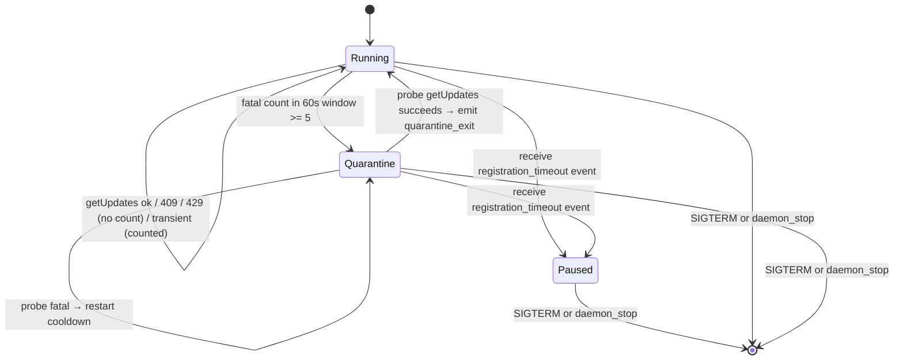
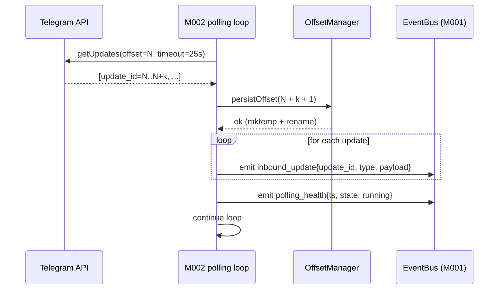

# MODULE-002: telegram-client

> Status: Draft
> Created: 2026-05-12
> Architecture: [ARCHITECTURE.md](../ARCHITECTURE.md)

---

## Part 1: Requirements

### 1.1 Module Goals & Overview

`telegram-client` is the sole owner of HTTP traffic to the Telegram Bot API. It wraps a stable
subset of API methods, maintains the `getUpdates` long-polling loop with offset persistence,
and implements a sliding-window-based reliability layer that replaces upstream's
`attempt >= 8` permanent give-up (the RC#1 fix). Two failure classes (409 Conflict / 429 Too
Many Requests) are segregated from the fatal counter; everything else flows through the
sliding window. On persistent fatal failures it enters a "quarantine" state with cooldown
backoff rather than ever giving up.

**Serves PRD topics**:
- `docs/PRD.md` (REQ-005 polling reliability, REQ-017 stability, REQ-018 zero-loss, REQ-020 latency, REQ-024 alert state-change for quarantine)

### 1.2 Architecture Overview

```
+-------------------------------------------------------------------+
|                       MODULE-002 telegram-client                   |
|                                                                   |
|  +-----------------+   +------------------+   +----------------+  |
|  | HTTP wrapper    |   | OffsetManager    |   | PollingFSM     |  |
|  | (Bun fetch)     |   | (offset.json,    |   | running ↔      |  |
|  | CONTRACT-004    |   |  atomic write)   |   | retry ↔        |  |
|  +-----------------+   +------------------+   | quarantine ↔   |  |
|                                               | paused         |  |
|  +-----------------+   +------------------+   +----------------+  |
|  | FatalWindow     |   | RateLimitHandler |                       |
|  | sliding 60s,    |   | (429 Retry-After |                       |
|  | threshold 5     |   |  honoring; 409   |                       |
|  | (RC#1 fix)      |   |  segregated)     |                       |
|  +-----------------+   +------------------+                       |
+-------------------------------------------------------------------+
                              | publishes via CONTRACT-003
                              v
   inbound_update, quarantine_*, polling_health, polling_status_snapshot
```

### 1.3 Feature Matrix

| Feature | Priority | Status | Description |
|---------|----------|--------|-------------|
| Telegram Bot API HTTP client | P0 | Planned | sendMessage / editMessageText / answerCallbackQuery / getFile / sendChatAction / getUpdates |
| `getUpdates` long-polling loop with offset persistence | P0 | Planned | REQ-018 zero-loss; atomic offset.json write |
| Sliding-window fatal counter (RC#1 fix) | P0 | Planned | replaces `attempt >= 8`; 60s window, 5-fatal threshold; **never** main-loop terminates |
| Exponential backoff retry, cap 60s | P0 | Planned | infinite retry per PRD §4.2 "永不主动放弃" |
| Quarantine state machine | P0 | Planned | enter on threshold trip; cooldown 60s; emit `quarantine_enter`/`exit` |
| 409 Conflict segregation | P0 | Planned | log, don't count in fatal window (per PRD §4.2) |
| 429 Too Many Requests handling | P0 | Planned | honor Retry-After header; not counted in fatal window |
| `MCPDisconnectedError` / `RateLimitedError` surfacing to MCP callers | P0 | Planned | PRD §3.2 quarantine signal `{delivered, queued, eta_hint}` shape |
| `polling_health` heartbeat (1Hz while running) | P0 | Planned | M001 watchdog stuck-detection input |
| `registration_timeout` subscription → pause polling | P0 | Planned | Decision A14 — launchd wait-for-reset |
| `pending_capacity_snapshot` periodic event (sourced from M004) | P1 | (subscribed from M004) | for M008 StatusReporter cache |

### 1.4 Detailed Feature Specifications

#### 1.4.1 Sliding-window fatal counter (RC#1 fix)

**User flow**:
1. polling loop calls `getUpdates` with current offset.
2. HTTP response classified:
   - 200 OK → push updates onto EventBus as `inbound_update`, advance offset, reset retry counter, emit `polling_health` heartbeat.
   - 409 Conflict (other poller) → log `polling_event: conflict_409`, do NOT count in fatal window, retry after exp backoff.
   - 429 Too Many Requests → parse `Retry-After` header (or default 5s), sleep for that duration, do NOT count in fatal window.
   - Network error / 5xx / timeout / unparseable response → record timestamp in fatal window, sleep per exp backoff, retry.
3. After each fatal recording, check sliding window: `count(fatal_ts where ts > now - 60s) >= 5` → trip quarantine.
4. Quarantine state: stop calling `getUpdates`, sleep 60s, then attempt one probe getUpdates; if it succeeds → emit `quarantine_exit`, return to running. If probe fails fatal → restart cooldown.
5. **Never terminates the polling loop voluntarily**. The only loop-exit triggers are SIGTERM (graceful shutdown) or `daemon_stop` event.

**Technical implementation** (pseudocode):

```ts
class FatalWindow {
  private timestamps: number[] = [];
  private readonly windowMs = 60_000;
  private readonly threshold = 5;
  record(ts: number) {
    this.timestamps.push(ts);
    // evict old entries
    const cutoff = ts - this.windowMs;
    while (this.timestamps[0] < cutoff) this.timestamps.shift();
  }
  tripped(): boolean { return this.timestamps.length >= this.threshold; }
  reset(): void { this.timestamps = []; }
}

async function pollLoop() {
  let backoffIdx = 0;
  const fatalWindow = new FatalWindow();
  let state: 'running' | 'quarantine' | 'paused' = 'running';

  while (true) {
    if (shutdownRequested) break;

    if (state === 'paused') {
      await sleep(1000);
      continue;
    }

    if (state === 'quarantine') {
      await sleep(60_000);
      try {
        const probe = await getUpdates({ timeout: 5, offset: currentOffset });
        eventBus.emit('quarantine_exit', { recovered_after_ms: Date.now() - quarantineEnteredAt });
        state = 'running';
        fatalWindow.reset();
        backoffIdx = 0;
        // process probe updates if any
        await processUpdates(probe);
        continue;
      } catch (err) {
        if (!is409(err) && !is429(err)) {
          fatalWindow.record(Date.now());
        }
        continue;
      }
    }

    // running state
    try {
      const updates = await getUpdates({ timeout: 25, offset: currentOffset });
      eventBus.emit('polling_health', { ts: Date.now(), state: 'running' });
      await processUpdates(updates);
      backoffIdx = 0;
    } catch (err) {
      if (is409(err)) {
        // log + don't count
        eventBus.emit('polling_event', { kind: 'conflict_409' });
        await sleep(backoff(backoffIdx++));
      } else if (is429(err)) {
        const retryAfter = parseRetryAfter(err) ?? 5;
        await sleep(retryAfter * 1000);
        // don't count, don't bump backoff
      } else {
        fatalWindow.record(Date.now());
        if (fatalWindow.tripped()) {
          state = 'quarantine';
          quarantineEnteredAt = Date.now();
          eventBus.emit('quarantine_enter', {
            reason: 'fatal_window_threshold',
            count_in_window: 5,
            window_ms: 60_000,
          });
          eventBus.emit('alert_emit', { severity: 'warn', topic: 'quarantine_enter' });
        } else {
          await sleep(backoff(backoffIdx++));
        }
      }
    }
  }
}

function backoff(idx: number): number {
  return Math.min(1000 * Math.pow(2, idx), 60_000); // 1s, 2s, 4s, 8s, ..., cap 60s
}
```

#### 1.4.2 Offset persistence (REQ-018 zero-loss)

**User flow**:
1. `getUpdates` returns N updates with last `update_id = U`.
2. Before publishing the updates to EventBus, write `U + 1` to `offset.json` atomically via `mktemp` + `rename`.
3. Then publish `inbound_update` events for each update.
4. On daemon restart, read `offset.json` at boot; first `getUpdates` call uses that offset.
5. If `offset.json` is missing or malformed → start with offset=0 (will get last 24h of updates from Telegram's server-side buffer).

**Atomic write**:
```ts
async function persistOffset(offset: number) {
  const tmp = await mktemp(`${stateDir.offsetFile}.tmp-XXXXXX`);
  await Bun.write(tmp, JSON.stringify({ offset, ts: Date.now() }));
  await Bun.chmod(tmp, 0o600);
  await rename(tmp, stateDir.offsetFile);
}
```

#### 1.4.3 Registration timeout → polling pause (Decision A14)

**User flow**:
1. EventBus subscribes to `registration_timeout` event (the only event type M002 subscribes to, per CONTRACT-003).
2. On receipt, transition polling state → `paused`; emit `polling_status_snapshot` reflecting paused state; emit `alert_emit` with severity=warn and topic='polling_paused_registration_timeout'.
3. Polling stays paused until daemon process restart (in launchd mode this happens via `reset-admin` + launchd KeepAlive cycle, per Decision A14).
4. State `paused` is NOT a quarantine — no cooldown timer, no probe. Only a SIGTERM (graceful) or daemon-stop event exits the loop.

#### 1.4.4 Polling status reporting (CONTRACT-005)

**User flow**:
1. M008 subscribes to `polling_status_snapshot` events for `status` CLI cache.
2. M002 emits `polling_status_snapshot` every 30s while running OR on every state transition (whichever comes first).
3. Snapshot fields: `state`, `last_inbound_ts`, `fatal_window_count`, `current_offset`, `since_state_change_ms`.

### 1.5 Acceptance Criteria

| ID | REQ Source | Contracts | Criterion | Verification |
|----|-----------|-----------|-----------|-------------|
| MODULE-002-AC-01 | REQ-005 | CONTRACT-004 | `getUpdates` long-polling cycle with 25s timeout; on success advance offset before publishing events | unit test |
| MODULE-002-AC-02 | REQ-005 | CONTRACT-004 | Sliding window 60s / 5-fatal threshold triggers quarantine_enter event with payload `{reason, count_in_window, window_ms}` | unit test |
| MODULE-002-AC-03 | REQ-005 | CONTRACT-004 | Quarantine cooldown 60s; one probe getUpdates afterwards; success → quarantine_exit event | unit test |
| MODULE-002-AC-04 | REQ-005 | CONTRACT-004 | 409 Conflict response: emit polling_event with kind=conflict_409; NOT counted in fatal window; retry after exp backoff | unit test |
| MODULE-002-AC-05 | REQ-005 | CONTRACT-004 | 429 Too Many Requests with Retry-After header: sleep retryAfter seconds; NOT counted in fatal window; backoffIdx NOT incremented | unit test |
| MODULE-002-AC-06 | REQ-005 | CONTRACT-004 | Polling loop NEVER terminates voluntarily — only SIGTERM or daemon_stop exits | integration test |
| MODULE-002-AC-07 | REQ-005 | CONTRACT-004 | Exponential backoff sequence: 1s, 2s, 4s, ..., cap 60s; reset on first success | unit test |
| MODULE-002-AC-08 | REQ-018 | CONTRACT-004 | Offset persisted to offset.json with atomic mktemp+rename BEFORE publishing inbound_update events | unit test |
| MODULE-002-AC-09 | REQ-018 | CONTRACT-004 | Daemon restart reads offset.json on boot; first getUpdates uses that offset | integration test |
| MODULE-002-AC-10 | REQ-018 | CONTRACT-004 | offset.json missing/malformed → start at offset 0 (Telegram serves 24h backlog) | unit test |
| MODULE-002-AC-11 | Decision A14 | CONTRACT-003 | Subscriber for `registration_timeout` event transitions polling state to 'paused' | unit test |
| MODULE-002-AC-12 | Decision A14 | CONTRACT-003 | Paused state stays paused indefinitely until SIGTERM/daemon_stop (no cooldown timer) | unit test |
| MODULE-002-AC-13 | REQ-020 | CONTRACT-004 | TG → claude inbound latency P95 < 5s during stable conditions (no quarantine) | E2E test |
| MODULE-002-AC-14 | REQ-020 | CONTRACT-004 | reply (sendMessage) → TG visible latency P95 < 2s for `{delivered: true}` samples only | E2E test |
| MODULE-002-AC-15 | CONTRACT-005 | CONTRACT-005 | `polling_status_snapshot` emitted every 30s or on state transition; payload schema matches §1.4.4 | unit test |
| MODULE-002-AC-16 | REQ-024 / Decision A5 | CONTRACT-003 | quarantine_enter / quarantine_exit each emit one `alert_emit` event (edge-triggered; no repeats during quarantine) | unit test |
| MODULE-002-AC-17 | CONTRACT-004 | CONTRACT-004 | sendMessage during quarantine returns `{delivered: false, queued: true, eta_hint: seconds_remaining}` per PRD §3.2 | unit test |
| MODULE-002-AC-18 | REQ-018 | CONTRACT-004 | Per `daemon_stop` event from M001, M002 flushes offset.json to current offset before allowing daemon exit | integration test |
| MODULE-002-AC-19 | REQ-005 / RISK-003 | CONTRACT-004 | 429 with no Retry-After header defaults to 5s sleep | unit test |
| MODULE-002-AC-20 | CONTRACT-004 | CONTRACT-004 | sendMessage / editMessageText / answerCallbackQuery / getFile / sendChatAction wrappers exist with correct HTTP method + path + auth header | unit test |
| MODULE-002-AC-21 | CONTRACT-004 | CONTRACT-004 | TelegramAPIClient input/output JSON schemas validate against upstream 0.0.6 same-name endpoint schemas (compat-test pinning) | integration test (compat suite) |

### 1.6 Non-functional Requirements

| Requirement | Target | Measurement |
|-------------|--------|-------------|
| getUpdates polling cycle | 25s long-poll timeout | observed |
| Offset write latency | < 10 ms (atomic write to local SSD) | benchmark |
| Inbound update → EventBus emit | < 50 ms after HTTP response | benchmark |
| Quarantine detect latency | ≤ 60s after first fatal in a 5-fatal series | unit test |
| Quarantine recovery latency | 60s cooldown + probe duration (~5-30s) | unit test |

### 1.7 Security Requirements

- Bot token redacted from all logs (via CONTRACT-003 `log_emit` events; redaction enforced at M008 subscriber boundary).
- HTTPS only (Bun's fetch defaults).
- offset.json contains no secrets (just the integer offset + timestamp); 0600 perms regardless.
- No user input passed through HTTP body without escaping (Telegram API auto-handles; we only pass internally-generated payloads).

---

## Part 2: Specification

### 2.1 Module Boundary

**IN**:
- HTTP client for Telegram Bot API endpoints (`getUpdates`, `sendMessage`, `editMessageText`, `answerCallbackQuery`, `getFile`, `sendChatAction`)
- Long-polling loop + offset persistence
- Sliding-window fatal counter + quarantine state machine
- 409 / 429 / network-error / 5xx classification
- `polling_health` heartbeat publishing
- `polling_status_snapshot` periodic publishing
- `registration_timeout` subscription handler

**OUT**:
- Routing decisions about inbound updates → MODULE-005
- MCP-side tool dispatch (the inbound update is published to EventBus; M005 routing subscribes) → MODULE-005
- Logging / alert delivery → MODULE-008
- Admin verification → MODULE-006 (M002 doesn't filter inbound updates by sender; routing does)
- Plugin install / launchd plist → MODULE-007

### 2.2 Dependencies

#### Upstream Dependencies

| Module | Doc Link | Required Contract | Dependency Content | Type |
|--------|----------|------------------|-------------------|------|
| MODULE-001 daemon-core | [MODULE-001](./MODULE-001-daemon-core.md) | CONTRACT-001 | StateDir (offset.json path), log dir | Hard |
| MODULE-001 daemon-core | [MODULE-001](./MODULE-001-daemon-core.md) | CONTRACT-003 | EventBus pub (`inbound_update`, `quarantine_*`, `polling_health`, `polling_status_snapshot`, `alert_emit`) + sub (`registration_timeout`) | Hard |

#### Downstream Dependencies

| Module | Doc Link | Dependency Content |
|--------|----------|--------------------|
| MODULE-004 mcp-tools | [MODULE-004](./MODULE-004-mcp-tools.md) | CONTRACT-004 TelegramAPIClient (calls sendMessage, editMessageText, answerCallbackQuery, getFile from each MCP tool handler) |
| MODULE-008 observability | [MODULE-008](./MODULE-008-observability.md) | CONTRACT-005 PollingStatus (snapshots cached for status CLI); CONTRACT-004 TelegramAPIClient (alert delivery via sendMessage) |

#### External Dependencies

| Dependency | Version | Purpose |
|-----------|---------|---------|
| Bun built-in `fetch` | ≥1.1 | HTTPS POST/GET to api.telegram.org |
| Telegram Bot API | live HTTPS | API methods listed in §1.3 |

#### External Dependency Evaluation

| Dependency | License | Maintenance | Known CVEs | Size Impact | Verdict |
|-----------|---------|-------------|-----------|-------------|---------|
| Bun fetch | MIT (bundled with Bun) | Active | None recent | nil | Accept |
| Telegram Bot API | n/a (external) | Stable | n/a | n/a | Accept |

### 2.3 Interface Definitions

#### Provided Interfaces

| Contract ID | Interface | Source Files | Description |
|-------------|-----------|--------------|-------------|
| CONTRACT-004 | TelegramAPIClient | `src/telegram/client.ts`, `src/telegram/methods.ts` | 6 Telegram API method wrappers + classified error returns |
| CONTRACT-005 | PollingStatus | `src/telegram/polling-status.ts` | Current FSM state snapshot |

```ts
// CONTRACT-004 — TelegramAPIClient
export interface TelegramAPIClient {
  sendMessage(req: SendMessageReq): Promise<SendMessageResult>;
  editMessageText(req: EditMessageTextReq): Promise<EditMessageTextResult>;
  answerCallbackQuery(req: AnswerCallbackQueryReq): Promise<{ok: true}>;
  getFile(file_id: string): Promise<GetFileResult>;
  sendChatAction(chat_id: number, action: ChatAction): Promise<{ok: true}>;
  getUpdates(opts: { timeout: number; offset: number }): Promise<Update[]>;  // internal use by polling loop
}

export type SendMessageResult =
  | { delivered: true; message_id: number }
  | { delivered: false; queued: true; eta_hint: number }
  | { delivered: false; error: 'rate_limited'; retry_after_sec: number }
  | { delivered: false; error: 'disconnected' };

// EditMessageTextResult, AnswerCallbackQueryReq, etc. follow Telegram Bot API 0.0.6 schemas
// (verified by MODULE-002-AC-21 compat suite).

// CONTRACT-005 — PollingStatus
export interface PollingStatus {
  getSnapshot(): PollingSnapshot;
}
export interface PollingSnapshot {
  state: 'running' | 'quarantine' | 'paused';
  last_inbound_ts: number | null;
  fatal_window_count: number;
  current_offset: number;
  since_state_change_ms: number;
}
```

#### Required External Interfaces

| Required Contract | Provider | Used For |
|---|---|---|
| CONTRACT-001 StateDir | MODULE-001 | resolve offset.json path |
| CONTRACT-003 EventBus | MODULE-001 | publish/subscribe |

#### Events/Messages

**Published by M002**:

| Event Name | Trigger | Payload | Consumer |
|-----------|---------|---------|----------|
| `inbound_update` | After offset persisted, per Telegram update | `{ update_id, type: 'message' \| 'callback_query', payload: ... }` | M005 (routing), M008 (log) |
| `quarantine_enter` | Fatal window threshold tripped | `{ reason: 'fatal_window_threshold', count_in_window, window_ms }` | M008 (alert + log) |
| `quarantine_exit` | Quarantine cooldown probe succeeds | `{ recovered_after_ms }` | M008 (alert + log) |
| `polling_health` | Every successful getUpdates cycle | `{ ts, state }` | M001 (watchdog stuck-detection input) |
| `polling_status_snapshot` | Every 30s or on state transition | (matches PollingSnapshot shape) | M008 (status CLI cache) |
| `polling_event` | Classified non-fatal events (409, 429) | `{ kind: 'conflict_409' \| 'rate_limited_429', detail }` | M008 (log) |
| `alert_emit` | On quarantine_enter/exit and registration_timeout pause | `{ severity, topic }` | M008 (alert dispatch) |

**Subscribed by M002**:

| Event Name | Source | Handler |
|-----------|--------|---------|
| `registration_timeout` | M006 | Transition polling state → 'paused'; emit polling_status_snapshot reflecting paused |
| `daemon_stop` | M001 | Flush offset.json + close any in-flight requests gracefully |

### 2.4 API Endpoints

**External (Telegram Bot API outbound)**:

| Method | Path | Auth | Description |
|--------|------|------|-------------|
| POST | `/bot{token}/sendMessage` | URL token | Outbound text/inline-keyboard message |
| POST | `/bot{token}/editMessageText` | URL token | Edit existing message |
| POST | `/bot{token}/answerCallbackQuery` | URL token | Acknowledge inline-button click |
| POST | `/bot{token}/getFile` | URL token | Get download path for attachment |
| POST | `/bot{token}/sendChatAction` | URL token | Typing indicator etc. |
| POST | `/bot{token}/getUpdates` | URL token | Long-poll for incoming updates |

Token sourced from `TELEGRAM_BOT_TOKEN` env var (required). Failure to read → daemon-core boot error.

### 2.5 Data Models

```json
// offset.json schema
{
  "offset": 12345678,
  "ts": 1715500000000
}
```

File path: `<state_dir>/offset.json`. Perms: 0600. Atomic write via `mktemp` + `rename`.

### 2.6 Database Functions & RPCs

(N/A)

### 2.7 Core Logic

**Polling FSM**:



**Update dispatch**:



### 2.8 Error Handling

| Error Code | Trigger | Handling | Surfaced to caller |
|-----------|---------|---------|--------------------|
| 409 Conflict (Telegram) | another poller stole getUpdates | `polling_event: conflict_409` event; exp backoff; do NOT count fatal | (internal — not surfaced to MCP tool callers) |
| 429 Too Many Requests | rate limit | parse Retry-After; sleep; do NOT count fatal | `SendMessageResult: {delivered: false, error: 'rate_limited', retry_after_sec}` for sendMessage callers |
| 5xx server error | Telegram outage | record in fatal window; exp backoff | (internal) |
| network timeout / DNS failure | local network issue | record in fatal window; exp backoff | (internal) |
| invalid response JSON | corrupted response | record in fatal window; exp backoff + log | (internal) |
| Quarantine active when sendMessage called | telegram-side queued | return `{delivered: false, queued: true, eta_hint}` | tool caller |
| daemon-stop signal received | graceful shutdown | break loop, flush offset, return | (internal) |

**Error propagation**: outbound API errors surface to MCP tool callers via discriminated-union return values (see SendMessageResult). Internal polling errors flow through EventBus events for observability.

### 2.9 Security Considerations

- Bot token retrieved once at boot from env var; cached in module-local closure; **never serialized** to log payloads (redaction list).
- HTTPS-only — Bun's fetch uses TLS to api.telegram.org via macOS system trust store.
- Inbound update payloads passed verbatim to EventBus (M005 routing handles admin verification before delivering to claude session).
- No user-controlled URLs / paths — all API methods use fixed paths.

### 2.10 Configuration & Environment Variables

| Variable | Required | Default | Description |
|----------|----------|---------|-------------|
| `TELEGRAM_BOT_TOKEN` | Yes | — | Bot token from BotFather; consumed once at boot |
| `TGCP_POLL_TIMEOUT` | No | 25 (seconds) | Long-poll timeout; tunable for testing |
| `TGCP_FATAL_WINDOW_MS` | No | 60000 | Sliding window size; PRD §8 bound 30s-5min |
| `TGCP_FATAL_THRESHOLD` | No | 5 | Threshold count; PRD §8 bound 3-10 |
| `TGCP_QUARANTINE_COOLDOWN_MS` | No | 60000 | Cooldown duration; PRD §8 bound 30s-5min |
| `TGCP_BACKOFF_CAP_MS` | No | 60000 | Exp backoff ceiling; PRD §8 bound ≤60s |

### 2.11 Operational Parameters

| Parameter | Value | Description |
|-----------|-------|-------------|
| Fatal window | 60s, threshold 5 | RC#1 fix; PRD §8 bound |
| Backoff sequence | 1, 2, 4, 8, 16, 32, 60 (sec, doubling, cap 60) | PRD §8 bound |
| Quarantine cooldown | 60s | PRD §8 bound |
| Long-poll timeout | 25s | Telegram-standard |
| Polling status snapshot cadence | 30s (or state transition) | NFR |

### 2.12 State Management

**Owned state surfaces**:

| Surface | Persistence | Owner | Consumers |
|---------|-------------|-------|-----------|
| `offset.json` | Disk (0600), atomic write | M002 | M002 (read at boot) |
| Polling FSM state (running/quarantine/paused) | Process | M002 | M008 (via snapshot events) |
| Fatal window timestamps | Process | M002 | (internal) |

**State transitions**: see §2.7 polling FSM diagram.

**Cross-module state protocol**: none — state is local to M002. Snapshot events broadcast state for read-only observation.

### 2.13 Operations

**Health & monitoring**:
- `polling_health` heartbeat (1Hz while running) consumed by M001 watchdog
- `polling_status_snapshot` (30s cadence) consumed by M008 for status CLI

**Common failures & runbook**:

| Symptom | Likely cause | First response | Escalation |
|---------|--------------|----------------|------------|
| TG alert "quarantine_enter" | Telegram API outage or local network issue | Wait 60s cooldown; check Telegram status page | If repeated: investigate token validity / network |
| `polling_event: conflict_409` | Another poller (e.g., upstream `telegram` plugin still running) | Verify only one daemon is running; uninstall conflicting plugin | If persistent: investigate token sharing |
| `polling_event: rate_limited_429` repeatedly | Bot too active / Telegram-side rate cap | Tune outbound rate; consider sendChatAction throttle | If sustained: contact Telegram about limit increase |
| Polling state stuck in `paused` after reset-admin | Daemon didn't restart cleanly | Check launchd KeepAlive; restart daemon manually | Investigate why launchd didn't auto-restart |

**Kill switches**: `TGCP_FATAL_THRESHOLD=999` env var effectively disables quarantine for debugging.

**Rollback strategy**:
- Deploy unit: daemon binary (M002 is part of)
- Rollback method: replace binary; offset.json is forward-compatible (single integer)
- Data migration reversibility: trivial (offset.json schema is stable)

**Capacity**: ~1 outbound API call per 25s long-poll cycle; sendMessage frequency bounded by claude session count (≤8 sessions per REQ-022).

### 2.14 Observability

**Structured logs** (via `log_emit` event):

| Event | Level | Fields | Sensitive fields |
|-------|-------|--------|------------------|
| `polling_health` | DEBUG | ts, state | — |
| `quarantine_enter` | WARN | reason, count_in_window, window_ms | — |
| `quarantine_exit` | INFO | recovered_after_ms | — |
| `polling_event: conflict_409` | WARN | (no extra fields) | — |
| `polling_event: rate_limited_429` | WARN | retry_after_sec | — |
| `inbound_update` | DEBUG | update_id, type (NOT payload — that's user content) | message text, callback_data |
| `polling_status_snapshot` | DEBUG | (snapshot fields) | — |

**Metrics**: derived by M008 from EventBus:
- `polling_state` (gauge: running=0, quarantine=1, paused=2)
- `inbound_update_rate` (rate of inbound_update events)
- `quarantine_count` (counter)
- `current_offset` (gauge)

**Traces**: not applicable (single-process).

**Redaction list**: bot token (always), inbound message text + callback_data, file_id from getFile.

**Retention**: M008-owned.

---

## Part 3: Implementation

**Progress policy**: AC-driven, per §3.4 ledger.

### 3.1 Current Status

| Status | Progress | Last Updated |
|--------|----------|--------------|
| In Progress | 90% | 2026-05-14 |

### 3.2 File Structure

| File | Role |
|------|------|
| `src/telegram/client.ts` | TelegramAPIClient implementation |
| `src/telegram/methods.ts` | Per-method request/response shapes + HTTP wrappers |
| `src/telegram/polling-loop.ts` | The long-polling main loop + FSM |
| `src/telegram/polling-status.ts` | CONTRACT-005 PollingStatus implementation |
| `src/telegram/offset-manager.ts` | offset.json read/write/atomic-persist |
| `src/telegram/fatal-window.ts` | Sliding window data structure |
| `src/telegram/error-classify.ts` | 409 / 429 / 5xx / network classifier |
| `tests/telegram/*.test.ts` | Unit + integration tests |
| `tests/telegram/compat-suite.test.ts` | MODULE-002-AC-21 compat schema verification — partially covered by `tests/telegram/methods.test.ts` (shape check of all 6 wrappers); full upstream-0.0.6 JSON-Schema validation ships in subsequent task |

### 3.3 Test Cases

| ID | Layer | AC Link | Scenario | Operation Sequence | Expected Result | Priority |
|----|-------|---------|----------|-------------------|-----------------|----------|
| MODULE-002-T01 | Unit | AC-01 | getUpdates ok cycle | call getUpdates({timeout:25, offset:0}); mock 200 ok with 3 updates | offset advanced to last_update_id+1; 3 inbound_update events emitted | P0 |
| MODULE-002-T02 | Unit | AC-02 | quarantine trip | inject 5 fatal errors within 60s | quarantine_enter event with count_in_window=5 | P0 |
| MODULE-002-T03 | Unit | AC-03 | quarantine recovery | quarantine + 60s + probe ok | quarantine_exit emitted; state returns to running | P0 |
| MODULE-002-T04 | Unit | AC-04 | 409 handling | inject HTTP 409 response | polling_event:conflict_409 emitted; fatal window unchanged | P0 |
| MODULE-002-T05 | Unit | AC-05 | 429 honoring | inject HTTP 429 with Retry-After:3 | sleep 3s; fatal window unchanged; backoffIdx unchanged | P0 |
| MODULE-002-T06 | Integration | AC-06 | polling never terminates | run 30 min with continuous fatal errors | loop still running; quarantine cycling | P0 |
| MODULE-002-T07 | Unit | AC-07 | backoff sequence | record fatal at t=0; observe sleep | sleeps follow 1s, 2s, 4s, 8s, 16s, 32s, 60s (cap) | P0 |
| MODULE-002-T08 | Unit | AC-08 | atomic offset persist | call persistOffset(123); kill mid-write | offset.json shows 123 OR shows prior value (NEVER torn) | P0 |
| MODULE-002-T09 | Integration | AC-09 | restart offset replay | persist offset=999; restart daemon; mock getUpdates | first getUpdates call carries offset=999 | P0 |
| MODULE-002-T10 | Unit | AC-10 | missing offset.json | delete offset.json; boot | first getUpdates uses offset=0 | P1 |
| MODULE-002-T11 | Unit | AC-11 | registration_timeout pause | emit registration_timeout event | polling state transitions to 'paused' | P0 |
| MODULE-002-T12 | Unit | AC-12 | paused indefinite | paused state; wait 5min | still paused; no transitions out except SIGTERM | P0 |
| MODULE-002-T13 | E2E | AC-13 | inbound latency P95<5s | live bot test 30 min | P95 measured < 5s | P1 |
| MODULE-002-T14 | E2E | AC-14 | reply latency P95<2s delivered-only | live bot send 100 messages | P95 < 2s for delivered: true samples | P1 |
| MODULE-002-T15 | Unit | AC-15 | status snapshot schema | emit at 30s + on state transition | event shape matches PollingSnapshot type | P0 |
| MODULE-002-T16 | Unit | AC-16 | edge-triggered alert | enter+exit quarantine; observe alerts | exactly 2 alert_emit events (enter + exit), not periodic | P0 |
| MODULE-002-T17 | Unit | AC-17 | sendMessage during quarantine | quarantine active; call sendMessage | returns `{delivered: false, queued: true, eta_hint}` | P0 |
| MODULE-002-T18 | Integration | AC-18 | daemon_stop offset flush | emit daemon_stop; observe offset.json | offset.json reflects latest in-memory value before exit | P0 |
| MODULE-002-T19 | Unit | AC-19 | 429 default Retry-After | HTTP 429 with no Retry-After header | sleeps 5s (default) | P1 |
| MODULE-002-T20 | Unit | AC-20 | all 6 method wrappers | call each; mock response | correct HTTP method, path with token, body shape | P0 |
| MODULE-002-T21 | Integration | AC-21 | compat schema suite | run compat-suite against upstream 0.0.6 schemas | all 4 official-compatible method I/O schemas validate | P0 |

### 3.4 Acceptance Criteria Verification

| AC ID | Active | Status | Verified By Task | Date |
|-------|--------|--------|-----------------|------|
| MODULE-002-AC-01 | Y | passed | dev-tgcp-2026-05-13-slice-infra | 2026-05-14 |
| MODULE-002-AC-02 | Y | passed | dev-tgcp-2026-05-13-slice-infra | 2026-05-14 |
| MODULE-002-AC-03 | Y | passed | dev-tgcp-2026-05-13-slice-infra | 2026-05-14 |
| MODULE-002-AC-04 | Y | passed | dev-tgcp-2026-05-13-slice-infra | 2026-05-14 |
| MODULE-002-AC-05 | Y | passed | dev-tgcp-2026-05-13-slice-infra | 2026-05-14 |
| MODULE-002-AC-06 | Y | passed | dev-tgcp-2026-05-13-slice-infra | 2026-05-14 |
| MODULE-002-AC-07 | Y | passed | dev-tgcp-2026-05-13-slice-infra | 2026-05-14 |
| MODULE-002-AC-08 | Y | passed | dev-tgcp-2026-05-13-slice-infra | 2026-05-14 |
| MODULE-002-AC-09 | Y | passed | dev-tgcp-2026-05-13-slice-infra | 2026-05-14 |
| MODULE-002-AC-10 | Y | passed | dev-tgcp-2026-05-13-slice-infra | 2026-05-14 |
| MODULE-002-AC-11 | Y | passed | dev-tgcp-2026-05-13-slice-infra | 2026-05-14 |
| MODULE-002-AC-12 | Y | passed | dev-tgcp-2026-05-13-slice-infra | 2026-05-14 |
| MODULE-002-AC-13 | Y | untested | — | — |
| MODULE-002-AC-14 | Y | untested | — | — |
| MODULE-002-AC-15 | Y | passed | dev-tgcp-2026-05-13-slice-infra | 2026-05-14 |
| MODULE-002-AC-16 | Y | passed | dev-tgcp-2026-05-13-slice-infra | 2026-05-14 |
| MODULE-002-AC-17 | Y | passed | dev-tgcp-2026-05-13-slice-infra | 2026-05-14 |
| MODULE-002-AC-18 | Y | passed | dev-tgcp-2026-05-13-slice-infra | 2026-05-14 |
| MODULE-002-AC-19 | Y | passed | dev-tgcp-2026-05-13-slice-infra | 2026-05-14 |
| MODULE-002-AC-20 | Y | passed | dev-tgcp-2026-05-13-slice-infra | 2026-05-14 |
| MODULE-002-AC-21 | Y | passed | dev-tgcp-2026-05-13-slice-infra | 2026-05-14 |

### 3.5 Feature Implementation Record

| Feature | Status | Notes |
|---------|--------|-------|
| Telegram API method wrappers | in-progress | /dev Slice B (2026-05-14) |
| Polling FSM (running/quarantine/paused) | in-progress | /dev Slice B (2026-05-14) — RC#1 fix core |
| Offset persistence | in-progress | /dev Slice B (2026-05-14) — atomic write |
| Fatal window | in-progress | /dev Slice B (2026-05-14) — sliding 60s, threshold 5 |
| 409/429 segregation | in-progress | /dev Slice B (2026-05-14) |
| registration_timeout subscription | in-progress | /dev Slice B (2026-05-14) — Decision A14 |
| polling_status_snapshot publishing | in-progress | /dev Slice B (2026-05-14) |
| Live-latency NFR measurement (AC-13/14) | not-started | E2E gated by live bot setup; tracked outside this slice |

### 3.6 Known Gaps & Future Work

- No proactive Telegram API health probe (e.g., `getMe` ping at boot). Defer to v0.3+; current model is "polling failure = health signal".
- Cert pinning to api.telegram.org is v0.3+ (RISK per ARCHITECTURE.md).

### 3.7 Change History

| Date | Change |
|------|--------|
| 2026-05-12 | Initial creation |
| 2026-05-14 | /dev Slice B begins: telegram-client implementation under `plugins/telegram-channels-pro/` |
| 2026-05-15 | Slice 2 scope-expansion re-verification: M002 implementation unchanged; included in scope_expansion for CONTRACT-001 additive `controlSocketFile` field — no consumer in M002 references the new field. |

### 3.8 Implementation Notes

| Decision | Rationale | Alternatives considered | Trade-off |
|----------|-----------|-------------------------|-----------|
| Sliding window 60s / 5 fatal (not upstream's `attempt >= 8`) | terranc/claude-code-telegram battle-tested with similar parameters; PRD §8 bounded; favors "transient noise tolerated, persistent failures surfaced" semantics | absolute attempt count (upstream), token-bucket | sliding-window better matches "what's the recent failure density" intuition; upstream's RC#1 fault was using absolute count which permanently exits after burst |
| Atomic offset.json write with mktemp + rename | Crash-safe; prevents torn writes losing offset | Direct write + fsync; SQLite | Single-file POSIX rename is atomic and simplest; offset is the only persistent state of significance |
| Token from env var only | Matches upstream pattern; supports launchd `EnvironmentVariables` plist key; avoids on-disk token storage | config file with token | env-var is OS-managed; daemon doesn't need a secrets manager |
| 409 / 429 segregated from fatal window | These are NOT failures of OUR daemon; conflating them with real errors triggers spurious quarantine | count everything | RC#2 (someone else stealing token) becomes less risky once our daemon doesn't escalate |
| `paused` state via subscription to `registration_timeout` (not direct call from M006) | Pub/sub keeps M002 ↔ M006 decoupled per A12; M002 doesn't depend on M006 | M006 directly calls M002.pausePolling() | Slight latency from EventBus dispatch is acceptable; cleaner layering |
