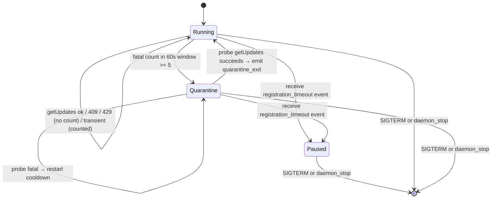
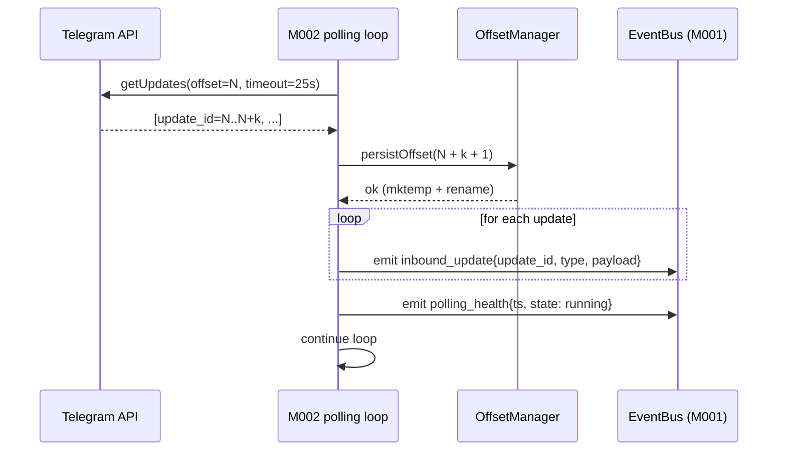
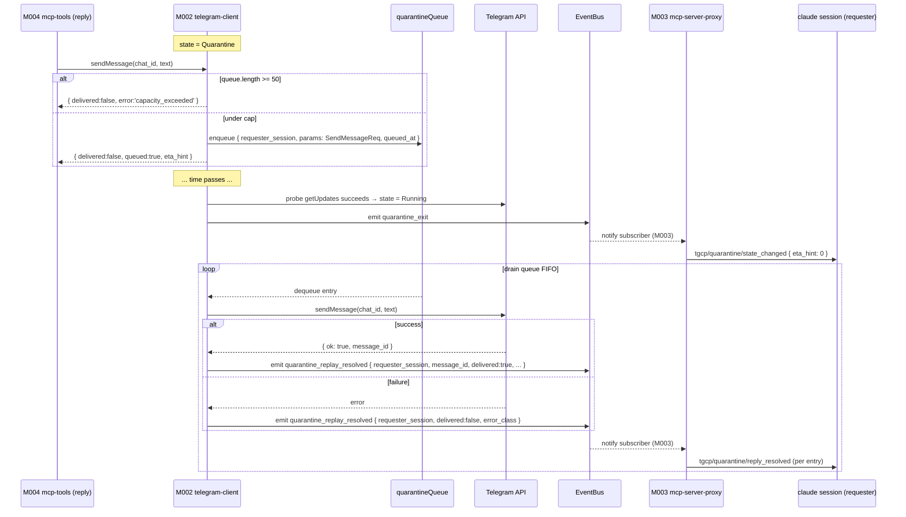
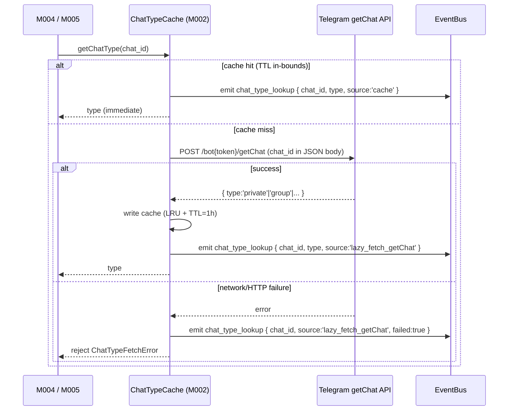
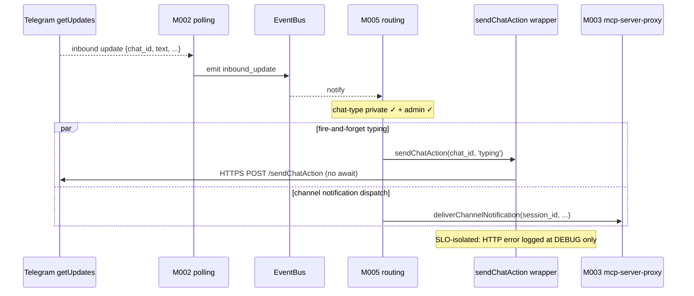

# MODULE-002: telegram-client

> Status: Draft
> Created: 2026-05-12
> Updated: 2026-05-16 (v1.1.0 — v0.2 channels-integration amendment)
> Architecture: [ARCHITECTURE.md](../ARCHITECTURE.md)

---

## Part 1: Requirements

### 1.1 Module Goals & Overview

`telegram-client` is the sole owner of HTTP traffic to the Telegram Bot API. It wraps a stable
subset of API methods, maintains the `getUpdates` long-polling loop with offset persistence,
and implements a sliding-window-based reliability layer that replaces upstream's
`attempt >= 8` permanent give-up (the RC#1 fix). Two failure classes (409 Conflict / 429 Too
Many Requests) are segregated from the fatal counter; everything else flows through the
sliding window. On persistent fatal failures it enters a "quarantine" state with cooldown
backoff rather than ever giving up.

**v1.1.0 additions**: `getChat` method exposed via CONTRACT-004 for ChatTypeCache cold-start
lazy-fetch (REQ-035); M002 OWNS `ChatTypeCache` (CONTRACT-016 provider) with 1h TTL + LRU
1000-entry cap, serving M004 (outbound chat-type defense-in-depth) and M005 (inbound chat-
type gating side-effect cache warm). M002 also owns the in-memory **quarantine outbound
replay queue** (50-cap, REQ-037), emitting `quarantine_replay_resolved` events on drain that
M003 subscribes to for `tgcp/quarantine/reply_resolved` MCP notifications (Decision A18).
`sendChatAction(typing)` is invoked fire-and-forget on inbound for the REQ-033 typing
indicator UX; failures log only and are SLO-isolated per Decision A15 typing AC.

**Serves PRD topics**:
- `docs/PRD.md` (REQ-005 polling reliability, REQ-017 stability — spurious-vs-scripted reconnect classification context, REQ-018 zero-loss, REQ-020 latency, REQ-024 alert state-change for quarantine, REQ-033 channel-protocol typing indicator, REQ-034 chat-type inbound payload plumbing, REQ-035 ChatTypeCache provider + getChat, REQ-037 quarantine outbound replay queue, REQ-045 quarantine drain event source)

(REQ-043 auth-reject silent-drop is owned by M005 + M008 — M002 does not participate; removed from this reverse-map in v1.1.0 audit-fix Round 1.)

### 1.2 Architecture Overview

```
+-------------------------------------------------------------------+
|                       MODULE-002 telegram-client                   |
|                                                                   |
|  +-----------------+   +------------------+   +----------------+  |
|  | HTTP wrapper    |   | OffsetManager    |   | PollingFSM     |  |
|  | (Bun fetch)     |   | (offset.json,    |   | running ↔      |  |
|  | CONTRACT-004    |   |  atomic write)   |   | retry ↔        |  |
|  +-----------------+   +------------------+   | quarantine ↔   |  |
|                                               | paused         |  |
|  +-----------------+   +------------------+   +----------------+  |
|  | FatalWindow     |   | RateLimitHandler |                       |
|  | sliding 60s,    |   | (429 Retry-After |                       |
|  | threshold 5     |   |  honoring; 409   |                       |
|  | (RC#1 fix)      |   |  segregated)     |                       |
|  +-----------------+   +------------------+                       |
+-------------------------------------------------------------------+
                              | publishes via CONTRACT-003
                              v
   inbound_update, quarantine_*, polling_health, polling_status_snapshot
```

### 1.3 Feature Matrix

| Feature | Priority | Status | Description |
|---------|----------|--------|-------------|
| Telegram Bot API HTTP client | P0 | Planned | sendMessage / editMessageText / answerCallbackQuery / getFile / sendChatAction / getUpdates |
| `getUpdates` long-polling loop with offset persistence | P0 | Planned | REQ-018 zero-loss; atomic offset.json write |
| Sliding-window fatal counter (RC#1 fix) | P0 | Planned | replaces `attempt >= 8`; 60s window, 5-fatal threshold; **never** main-loop terminates |
| Exponential backoff retry, cap 60s | P0 | Planned | infinite retry per PRD §4.2 "永不主动放弃" |
| Quarantine state machine | P0 | Planned | enter on threshold trip; cooldown 60s; emit `quarantine_enter`/`exit` |
| 409 Conflict segregation | P0 | Planned | log, don't count in fatal window (per PRD §4.2) |
| 429 Too Many Requests handling | P0 | Planned | honor Retry-After header; not counted in fatal window |
| `MCPDisconnectedError` / `RateLimitedError` surfacing to MCP callers | P0 | Planned | PRD §3.2 quarantine signal `{delivered, queued, eta_hint}` shape |
| `polling_health` heartbeat (1Hz while running) | P0 | Planned | M001 watchdog stuck-detection input |
| `registration_timeout` subscription → pause polling | P0 | Planned | Decision A14 — launchd wait-for-reset |
| `pending_capacity_snapshot` periodic event (sourced from M004) | P1 | (subscribed from M004) | for M008 StatusReporter cache |
| **v1.1.0**: `getChat` API method wrapper | P0 | Planned | REQ-035 ChatTypeCache cold-start lazy-fetch via CONTRACT-004 |
| **v1.1.0**: ChatTypeCache (CONTRACT-016) | P0 | Planned | REQ-035 — 1h TTL + LRU 1000; serves M004 outbound DiD + M005 inbound side-effect cache warm |
| **v1.1.0**: Quarantine outbound replay queue (50-cap, in-memory) | P0 | Planned | REQ-037 — best-effort delivery; lost on restart; new reply beyond cap → CapacityExceededError |
| **v1.1.0**: Quarantine drain emitter | P0 | Planned | REQ-045 + Decision A18 — emits `quarantine_replay_resolved` per replayed reply; M003 subscribes for MCP notification |
| **v1.1.0**: `sendChatAction(typing)` fire-and-forget on inbound | P1 | Planned | REQ-033 channel-protocol typing indicator UX; SLO-isolated per A15 |

### 1.4 Detailed Feature Specifications

#### 1.4.1 Sliding-window fatal counter (RC#1 fix)

**User flow**:
1. polling loop calls `getUpdates` with current offset.
2. HTTP response classified:
   - 200 OK → push updates onto EventBus as `inbound_update`, advance offset, reset retry counter, emit `polling_health` heartbeat.
   - 409 Conflict (other poller) → log `polling_event: conflict_409`, do NOT count in fatal window, retry after exp backoff.
   - 429 Too Many Requests → parse `Retry-After` header (or default 5s), sleep for that duration, do NOT count in fatal window.
   - Network error / 5xx / timeout / unparseable response → record timestamp in fatal window, sleep per exp backoff, retry.
3. After each fatal recording, check sliding window: `count(fatal_ts where ts > now - 60s) >= 5` → trip quarantine.
4. Quarantine state: stop calling `getUpdates`, sleep 60s, then attempt one probe getUpdates; if it succeeds → emit `quarantine_exit`, return to running. If probe fails fatal → restart cooldown.
5. **Never terminates the polling loop voluntarily**. The only loop-exit triggers are SIGTERM (graceful shutdown) or `daemon_stop` event.

**Technical implementation** (pseudocode):

```ts
class FatalWindow {
  private timestamps: number[] = [];
  private readonly windowMs = 60_000;
  private readonly threshold = 5;
  record(ts: number) {
    this.timestamps.push(ts);
    // evict old entries
    const cutoff = ts - this.windowMs;
    while (this.timestamps[0] < cutoff) this.timestamps.shift();
  }
  tripped(): boolean { return this.timestamps.length >= this.threshold; }
  reset(): void { this.timestamps = []; }
}

async function pollLoop() {
  let backoffIdx = 0;
  const fatalWindow = new FatalWindow();
  let state: 'running' | 'quarantine' | 'paused' = 'running';

  while (true) {
    if (shutdownRequested) break;

    if (state === 'paused') {
      await sleep(1000);
      continue;
    }

    if (state === 'quarantine') {
      await sleep(60_000);
      try {
        const probe = await getUpdates({ timeout: 5, offset: currentOffset });
        eventBus.emit('quarantine_exit', { recovered_after_ms: Date.now() - quarantineEnteredAt, eta_hint: 0 });  // v1.1.0 — eta_hint=0 signals quarantine exited for M003 tgcp/quarantine/state_changed
        state = 'running';
        pollingStatus.setState('running');  // v1.1.0 (REQ-037) — MUST precede drainReplayQueue so the drain's sendMessage replays take the real-POST path (not the quarantine stub which gates on pollingStatus.getSnapshot().state)
        await drainReplayQueue();  // v1.1.0 (REQ-037 + Decision A18) — FIFO drain (dequeue-per-entry, abortable on daemon_stop) emits quarantine_replay_resolved per entry; runs synchronously in polling-loop path AFTER state='running' + BEFORE processUpdates(probe)
        fatalWindow.reset();
        backoffIdx = 0;
        // process probe updates if any
        await processUpdates(probe);
        continue;
      } catch (err) {
        if (!is409(err) && !is429(err)) {
          fatalWindow.record(Date.now());
        }
        continue;
      }
    }

    // running state
    try {
      const updates = await getUpdates({ timeout: 25, offset: currentOffset });
      eventBus.emit('polling_health', { ts: Date.now(), state: 'running' });
      await processUpdates(updates);
      backoffIdx = 0;
    } catch (err) {
      if (is409(err)) {
        // log + don't count
        eventBus.emit('polling_event', { kind: 'conflict_409' });
        await sleep(backoff(backoffIdx++));
      } else if (is429(err)) {
        const retryAfter = parseRetryAfter(err) ?? 5;
        await sleep(retryAfter * 1000);
        // don't count, don't bump backoff
      } else {
        fatalWindow.record(Date.now());
        if (fatalWindow.tripped()) {
          state = 'quarantine';
          quarantineEnteredAt = Date.now();
          eventBus.emit('quarantine_enter', {
            reason: 'fatal_window_threshold',
            count_in_window: 5,
            window_ms: 60_000,
            eta_hint: 60,  // v1.1.0 — cooldown remaining seconds for M003 tgcp/quarantine/state_changed
          });
          eventBus.emit('alert_emit', { severity: 'warn', topic: 'quarantine_enter' });
        } else {
          await sleep(backoff(backoffIdx++));
        }
      }
    }
  }
}

function backoff(idx: number): number {
  return Math.min(1000 * Math.pow(2, idx), 60_000); // 1s, 2s, 4s, 8s, ..., cap 60s
}
```

#### 1.4.2 Offset persistence (REQ-018 zero-loss)

**User flow**:
1. `getUpdates` returns N updates with last `update_id = U`.
2. Before publishing the updates to EventBus, write `U + 1` to `offset.json` atomically via `mktemp` + `rename`.
3. Then publish `inbound_update` events for each update.
4. On daemon restart, read `offset.json` at boot; first `getUpdates` call uses that offset.
5. If `offset.json` is missing or malformed → start with offset=0 (will get last 24h of updates from Telegram's server-side buffer).

**Atomic write**:
```ts
async function persistOffset(offset: number) {
  const tmp = await mktemp(`${stateDir.offsetFile}.tmp-XXXXXX`);
  await Bun.write(tmp, JSON.stringify({ offset, ts: Date.now() }));
  await Bun.chmod(tmp, 0o600);
  await rename(tmp, stateDir.offsetFile);
}
```

#### 1.4.3 Registration timeout → polling pause (Decision A14)

**User flow**:
1. EventBus subscribes to `registration_timeout` event (the only event type M002 subscribes to, per CONTRACT-003).
2. On receipt, transition polling state → `paused`; emit `polling_status_snapshot` reflecting paused state; emit `alert_emit` with severity=warn and topic='polling_paused_registration_timeout'.
3. Polling stays paused until daemon process restart (in launchd mode this happens via `reset-admin` + launchd KeepAlive cycle, per Decision A14).
4. State `paused` is NOT a quarantine — no cooldown timer, no probe. Only a SIGTERM (graceful) or daemon-stop event exits the loop.

#### 1.4.4 Polling status reporting (CONTRACT-005)

**User flow**:
1. M008 subscribes to `polling_status_snapshot` events for `status` CLI cache.
2. M002 emits `polling_status_snapshot` every 30s while running OR on every state transition (whichever comes first).
3. Snapshot fields: `state`, `last_inbound_ts`, `fatal_window_count`, `current_offset`, `since_state_change_ms`.

#### 1.4.5 v1.1.0 — ChatTypeCache (CONTRACT-016 provider, REQ-035)

**User flow**:
1. M004 outbound tool (reply/react/edit_message/request_approval) wants to verify chat_id → chat_type is `private` before TG API call.
2. M004 calls `chatTypeCache.getChatType(chat_id)`.
3. **Hit path** (cache resident, in-bounds TTL): returns cached type immediately.
4. **Miss path**: invoke Telegram `getChat(chat_id)` via the internal HTTP wrapper; on success cache the result + return; on network/HTTP failure reject Promise with `ChatTypeFetchError` (M004 surfaces as `InvalidChatTypeError` to claude session).
5. M005 inbound flow reads `update.message.chat.type` from the already-parsed Telegram payload and writes the (chat_id, type) pair into the cache as a SIDE-EFFECT (no lazy-fetch needed because inbound already carries the value). Cache write happens BEFORE the chat-type gating decision — so even denied-inbound entries (group/supergroup/channel) populate the cache, letting future outbound DiD short-circuit any model attempt to use that chat_id without re-querying.

**Configuration (Decision A16 implicit /spec bindings)**:
- TTL: **1 hour** (chat type rarely changes; promotion group→supergroup is the only practical mutation and requires re-auth).
- LRU max entries: **1000** (single-user single-machine scale never approaches; safety margin against group-bot DoS where attacker adds bot to many groups).
- On concurrent miss for the same chat_id (e.g. an M005 inbound burst + an M004 outbound check both cold-starting the same chat): the ChatTypeCacheImpl coalesces all concurrent callers onto a **single** in-flight `getChat` call via an internal `inFlight: Map<number, Promise<ChatType>>`. The first miss-path caller registers the fetch promise; subsequent callers await the same promise (no duplicate Telegram API call — satisfies AC-24 "invokes getChat once"). The in-flight entry is cleared in a `finally` on both success and rejection, so a failed fetch is not poisoned-cached and the next call retries via a fresh lazy-fetch (AC-25). Concurrent callers that piggyback on the in-flight fetch observe the single `lazy_fetch_getChat` telemetry event (not a per-caller `cache` event), since a concurrent miss is by definition not a cache hit.

**Telemetry**: emit `chat_type_lookup` event per call with payload `{chat_id, type, source: 'cache' | 'lazy_fetch_getChat'}`; M008 subscribes to populate StatusReporter's `chat_type_cache_size` and `chat_type_lazy_fetch_failures_24h` fields.

#### 1.4.5b — Drain ownership clarification (v1.1.0, audit-fix Round 4)

The polling-loop pseudocode in §1.4.1 emits `quarantine_exit` inside the probe-success branch (line 130). The drain-queue walk runs **synchronously in the same path immediately after `quarantine_exit` emission**, BEFORE returning to the main loop. M002 does NOT subscribe to its own `quarantine_exit` event for drain (the §2.3 Subscribed-by table does not list `quarantine_exit` for M002). Pseudocode amended in §1.4.1: after `eventBus.emit('quarantine_exit', ...)` and `state = 'running'`, call `await drainReplayQueue()` before `processUpdates(probe)`. Drain emits one `quarantine_replay_resolved` event per replayed entry (FIFO order).

#### 1.4.6 v1.1.0 — Quarantine outbound replay queue (REQ-037, Decision A18)

**User flow**:
1. claude session calls MCP `reply` tool (M004) during M002's quarantine state.
2. M002's quarantine-aware sendMessage wrapper detects `state === 'quarantine'` → instead of immediate TG API call, push the message onto the **in-memory replay queue** (FIFO, 50-cap).
3. If queue length already at 50 → return `{delivered: false, error: 'capacity_exceeded'}` envelope to M004 (the cap-exceeded signal is conceptually `CapacityExceededError`; M002 throws that internally inside `enqueue()`, then the client wrapper catches via name-check and surfaces the `error: 'capacity_exceeded'` envelope variant to M004 per CONTRACT-004). M004 propagates the envelope to claude. No enqueue.
4. If under cap → enqueue a `QueueEntry` `{requester_session, params, queued_at}` where `params` is the FULL `SendMessageReq` (deep-cloned via `structuredClone` at the client boundary so it preserves `chat_id` + `text` + `reply_markup` + `parse_mode` + `reply_to_message_id` for byte-equivalent replay, and is isolated from post-enqueue caller mutation), return `{delivered: false, queued: true, eta_hint: <quarantine-cooldown-remaining-seconds>}` to the caller.
5. On `quarantine_exit` (state transition, after `state='running'`), M002 walks the queue in FIFO order (dequeue-per-entry; abortable between entries on `daemon_stop` so a graceful shutdown leaves un-replayed entries queued); for each entry attempt TG sendMessage using `entry.params` ONLY — `entry.requester_session` is NOT re-threaded into the replay POST (it is metadata used solely for the resolved-event payload below; the replay runs while `state='running'` so it takes the real-POST path, never re-enqueues):
   - Success → emit `quarantine_replay_resolved` with `{requester_session, message_id: <new_tg_message_id>, delivered: true, queued_at, replayed_at}` (`replayed_at` from the injected clock).
   - Failure (non-retriable) → emit with `delivered: false, error_class`.
6. Entries are removed as they drain (dequeue-per-entry); on a graceful-shutdown abort the remainder stays queued (dropped on restart per crash semantics below).

**Crash semantics**: queue is in-memory ONLY; daemon restart drops all queued messages SILENTLY (the implementation returns no queued-message identifier to the caller, and exposes no lookup/reference API, so there is no per-queued-message error surfaceable on a later reply — the AC-28 envelope `{delivered: false, queued: true, eta_hint}` is the only signal returned to claude at enqueue time, and there is no follow-up resolution event after a crash since the event sink is also in-memory). This is intentional best-effort delivery semantics: claude observes that the original reply was "queued, eta ~60s"; if the daemon restarts mid-quarantine, the queued reply is gone and no `quarantine_replay_resolved` event will fire for it. Pending state and outbound queue have same "lost on crash" treatment. Operators should monitor `quarantine_replay_resolved` cardinality vs prior queued envelopes if cross-restart loss visibility is needed.

**Capacity edge**: 50-cap matches REQ-022 capacity edges (≤8 sessions / ≤50 pending approvals / ≤50 quarantine queue). 51st reply does NOT enqueue.

#### 1.4.7 v1.1.0 — `sendChatAction(typing)` fire-and-forget (REQ-033 typing AC)

**User flow**:
1. M005 routing receives inbound text/callback that passes chat-type + admin checks.
2. M005 fires `tg.sendChatAction(chat_id, 'typing')` via CONTRACT-004 in a non-blocking await — the call is dispatched but the result is not consumed.
3. Telegram displays "{botname} is typing..." in the chat for ~5 seconds.
4. When claude session emits any of `reply` / `react` / `edit_message` / `request_approval` (4 outbound triggers per A15), M005/M004 emit the corresponding TG API call; the typing indicator auto-stops on Telegram side because a real message arrives.

**Failure handling (Decision A15 Latency Isolation clause)**:
- HTTP error / timeout / 429 on `sendChatAction` → log only (debug-level structured event); do NOT count toward §5 SLO (REQ-020 inbound latency P95<5s); do NOT block inbound delivery to claude session; do NOT raise to M008 as alert.
- This is a fire-and-forget UX hint, not a delivery contract; failures here are noise.

**Latency invariant**: the `sendChatAction` call is dispatched in parallel with (NOT before) the call to M003's `deliverChannelNotification` — the inbound→claude path's P95<5s SLO is not on the typing call's critical path.

### 1.5 Acceptance Criteria

| ID | REQ Source | Contracts | Criterion | Verification |
|----|-----------|-----------|-----------|-------------|
| MODULE-002-AC-01 | REQ-005 | CONTRACT-004 | `getUpdates` long-polling cycle with 25s timeout; on success advance offset before publishing events | unit test |
| MODULE-002-AC-02 | REQ-005 | CONTRACT-004 | Sliding window 60s / 5-fatal threshold triggers quarantine_enter event with payload `{reason, count_in_window, window_ms}` | unit test |
| MODULE-002-AC-03 | REQ-005 | CONTRACT-004 | Quarantine cooldown 60s; one probe getUpdates afterwards; success → quarantine_exit event | unit test |
| MODULE-002-AC-04 | REQ-005 | CONTRACT-004 | 409 Conflict response: emit polling_event with kind=conflict_409; NOT counted in fatal window; retry after exp backoff | unit test |
| MODULE-002-AC-05 | REQ-005 | CONTRACT-004 | 429 Too Many Requests with Retry-After header: sleep retryAfter seconds; NOT counted in fatal window; backoffIdx NOT incremented | unit test |
| MODULE-002-AC-06 | REQ-005 | CONTRACT-004 | Polling loop NEVER terminates voluntarily — only SIGTERM or daemon_stop exits | integration test |
| MODULE-002-AC-07 | REQ-005 | CONTRACT-004 | Exponential backoff sequence: 1s, 2s, 4s, ..., cap 60s; reset on first success | unit test |
| MODULE-002-AC-08 | REQ-018 | CONTRACT-004 | Offset persisted to offset.json with atomic mktemp+rename BEFORE publishing inbound_update events | unit test |
| MODULE-002-AC-09 | REQ-018 | CONTRACT-004 | Daemon restart reads offset.json on boot; first getUpdates uses that offset | integration test |
| MODULE-002-AC-10 | REQ-018 | CONTRACT-004 | offset.json missing/malformed → start at offset 0 (Telegram serves 24h backlog) | unit test |
| MODULE-002-AC-11 | Decision A14 | CONTRACT-003 | Subscriber for `registration_timeout` event transitions polling state to 'paused' | unit test |
| MODULE-002-AC-12 | Decision A14 | CONTRACT-003 | Paused state stays paused indefinitely until SIGTERM/daemon_stop (no cooldown timer) | unit test |
| MODULE-002-AC-13 | REQ-020 | CONTRACT-004 | TG → claude inbound latency P95 < 5s during stable conditions (no quarantine) | E2E test |
| MODULE-002-AC-14 | REQ-020 | CONTRACT-004 | reply (sendMessage) → TG visible latency P95 < 2s for `{delivered: true}` samples only | E2E test |
| MODULE-002-AC-15 | CONTRACT-005 | CONTRACT-005 | `polling_status_snapshot` emitted every 30s or on state transition; payload schema matches §1.4.4 | unit test |
| MODULE-002-AC-16 | REQ-024 / Decision A5 | CONTRACT-003 | quarantine_enter / quarantine_exit each emit one `alert_emit` event (edge-triggered; no repeats during quarantine) | unit test |
| MODULE-002-AC-17 | CONTRACT-004 | CONTRACT-004 | sendMessage during quarantine returns `{delivered: false, queued: true, eta_hint: seconds_remaining}` per PRD §3.2 | unit test |
| MODULE-002-AC-18 | REQ-018 | CONTRACT-004 + CONTRACT-003 | Per `daemon_stop` event from M001, M002's subscriber handler synchronously flushes offset.json (atomic mktemp+rename per AC-08) BEFORE returning from the handler. **Sync handshake**: M001 publishes `daemon_stop` via CONTRACT-003's synchronous-shutdown-mode dispatch (M001 awaits all `daemon_stop` subscribers' handlers to settle before proceeding with process-exit). The handler ALSO sets the polling-loop's `shutdownRequested` flag so the next `while (true)` iteration breaks cleanly. CONTRACT-003 sync-mode for `daemon_stop` is a v1.1.0 audit clarification — see ARCH RISK-013 note + CONTRACT-003 "Universal daemon_stop subscription" clause | integration test |
| MODULE-002-AC-19 | REQ-005 / RISK-003 | CONTRACT-004 | 429 with no Retry-After header defaults to 5s sleep | unit test |
| MODULE-002-AC-20 | CONTRACT-004 | CONTRACT-004 | sendMessage / editMessageText / answerCallbackQuery / getFile / sendChatAction / getUpdates (+ v1.1.0 getChat) wrappers exist with correct HTTP method (POST per §2.4 convention) + path + auth header | unit test |
| MODULE-002-AC-21 | CONTRACT-004 | CONTRACT-004 | TelegramAPIClient input/output JSON schemas validate against upstream 0.0.6 same-name endpoint schemas (compat-test pinning) | integration test (compat suite) |
| MODULE-002-AC-22 | REQ-035 | CONTRACT-004 | `getChat(chat_id)` API wrapper: POST `/bot{token}/getChat` with `chat_id` in JSON body (per §2.4 POST convention); returns the `GetChatEnvelope` discriminated union — `{ok: true, result: {id, type: 'private' \| 'group' \| 'supergroup' \| 'channel'}}` on success, `{ok: false, error}` on Telegram-reported error / HTTP non-2xx / fetch failure | unit test |
| MODULE-002-AC-23 | REQ-035 | CONTRACT-016 | ChatTypeCache hit path: in-bounds TTL (1h) entry returns cached value in O(1); emits `chat_type_lookup` event with `source: 'cache'` | unit test |
| MODULE-002-AC-24 | REQ-035 | CONTRACT-016 | ChatTypeCache miss path: invokes `getChat` once via internal HTTP wrapper; on success writes cache + returns type; emits `chat_type_lookup` with `source: 'lazy_fetch_getChat'` | unit test |
| MODULE-002-AC-25 | REQ-035 | CONTRACT-016 | ChatTypeCache miss path on `getChat` failure (network / 5xx / 401): rejects Promise with `ChatTypeFetchError`; does NOT cache; next call retries via lazy-fetch | unit test |
| MODULE-002-AC-26 | REQ-035 | CONTRACT-016 | ChatTypeCache LRU eviction at 1000 entries; oldest entry by access-time evicted on 1001st insert | unit test |
| MODULE-002-AC-27 | REQ-035 | CONTRACT-016 | ChatTypeCache entry TTL of 1 hour; expired entries treated as miss + re-fetched on next access | unit test |
| MODULE-002-AC-28 | REQ-037 | CONTRACT-004 | Quarantine outbound replay queue: in-memory FIFO 50-cap; under cap accepts reply, returns `{delivered: false, queued: true, eta_hint}`; at cap returns `CapacityExceededError` (no enqueue) | unit test |
| MODULE-002-AC-29 | REQ-037 | CONTRACT-004 | Quarantine queue drain on `quarantine_exit`: walks FIFO, calls sendMessage per entry, emits `quarantine_replay_resolved` per entry with `{requester_session, message_id, delivered, queued_at, replayed_at}` | unit test |
| MODULE-002-AC-30 | REQ-037 | CONTRACT-004 | Quarantine queue lost on daemon restart (in-memory, not persisted); pending entries silently dropped; claude session sees error on next reply call when the queued message_id is referenced | integration test |
| MODULE-002-AC-31 | REQ-045 + Decision A18 | CONTRACT-003 | `quarantine_replay_resolved` event payload schema: `{requester_session, message_id, delivered, queued_at, replayed_at, error_class?}`; M003 subscribes for `tgcp/quarantine/reply_resolved` MCP notification | unit test |
| MODULE-002-AC-32 | REQ-045 | CONTRACT-003 | `quarantine_enter` carries `eta_hint: <cooldown_remaining_sec>` at every cooldown-restart transition (probe-fail-restarts-cooldown is treated as a state transition for emission purposes per Decision A18 clarification, so a stuck quarantine continues to surface fresh eta_hint to M003); `quarantine_exit` carries `eta_hint: 0`. **Emission cadence**: edge-triggered on each cooldown restart + on exit; M003 forwards each fresh hint via `tgcp/quarantine/state_changed`. (Earlier wording "transitions only — countdown is client-side" was misleading; under probe-fail-restarts-cooldown the eta_hint must re-emit or M003's client sees a stale 60s window that never reaches 0) | unit test |
| MODULE-002-AC-33 | REQ-033 + A15 | CONTRACT-004 | `sendChatAction(chat_id, 'typing')` invoked fire-and-forget on inbound (parallel to deliverChannelNotification dispatch — NOT sequential); HTTP error / timeout / 429 logged at debug-level only, NOT counted in §5 SLO, NOT raised as alert | unit test |
| MODULE-002-AC-34 | REQ-022 | CONTRACT-004 | Quarantine queue 50-cap is independent counter from REQ-009 pending-approval 50-cap and REQ-022 session 8-cap — three independent capacity edges | unit test |
| MODULE-002-AC-35 | REQ-017 | CONTRACT-004 | Stability SLO M002 contribution: polling loop maintains running state across 72h soak (REQ-017 ≥99% windows zero SPURIOUS reconnect — M002 polling-reliability invariants prevent gratuitous disconnects). Measured by AC-06 (never voluntarily terminates) + AC-02/03 (quarantine cycling without loop exit) + soak harness counting `mcp_reconnect_classified` events with reason=spurious to ≤8 windows over 72h | integration test (soak harness; gates on M003 reconnect-classification handshake protocol per REQ-045) |

### 1.6 Non-functional Requirements

| Requirement | Target | Measurement |
|-------------|--------|-------------|
| getUpdates polling cycle | 25s long-poll timeout | observed |
| Offset write latency | < 10 ms (atomic write to local SSD) | benchmark |
| Inbound update → EventBus emit | < 50 ms after HTTP response | benchmark |
| Quarantine detect latency | ≤ 60s after first fatal in a 5-fatal series | unit test |
| Quarantine recovery latency | 60s cooldown + probe duration (~5-30s) | unit test |

### 1.7 Security Requirements

- Bot token redacted from all logs (via CONTRACT-003 `log_emit` events; redaction enforced at M008 subscriber boundary).
- HTTPS only (Bun's fetch defaults).
- offset.json contains no secrets (just the integer offset + timestamp); 0600 perms regardless.
- No user input passed through HTTP body without escaping (Telegram API auto-handles; we only pass internally-generated payloads).

---

## Part 2: Specification

### 2.1 Module Boundary

**IN**:
- HTTP client for Telegram Bot API endpoints (`getUpdates`, `sendMessage`, `editMessageText`, `answerCallbackQuery`, `getFile`, `sendChatAction`)
- Long-polling loop + offset persistence
- Sliding-window fatal counter + quarantine state machine
- 409 / 429 / network-error / 5xx classification
- `polling_health` heartbeat publishing
- `polling_status_snapshot` periodic publishing
- `registration_timeout` subscription handler

**OUT**:
- Routing decisions about inbound updates → MODULE-005
- MCP-side tool dispatch (the inbound update is published to EventBus; M005 routing subscribes) → MODULE-005
- Logging / alert delivery → MODULE-008
- Admin verification → MODULE-006 (M002 doesn't filter inbound updates by sender; routing does)
- Plugin install / launchd plist → MODULE-007

### 2.2 Dependencies

#### Upstream Dependencies

| Module | Doc Link | Required Contract | Dependency Content | Type |
|--------|----------|------------------|-------------------|------|
| MODULE-001 daemon-core | [MODULE-001](./MODULE-001-daemon-core.md) | CONTRACT-001 | StateDir (offset.json path), log dir | Hard |
| MODULE-001 daemon-core | [MODULE-001](./MODULE-001-daemon-core.md) | CONTRACT-003 | EventBus pub (`inbound_update`, `quarantine_*`, `polling_health`, `polling_status_snapshot`, `alert_emit`) + sub (`registration_timeout`) | Hard |

#### Downstream Dependencies

| Module | Doc Link | Dependency Content |
|--------|----------|--------------------|
| MODULE-004 mcp-tools | [MODULE-004](./MODULE-004-mcp-tools.md) | CONTRACT-004 TelegramAPIClient (calls sendMessage, editMessageText, answerCallbackQuery, getFile from each MCP tool handler; **v1.1.0** also CONTRACT-016 ChatTypeCache for outbound chat-type defense-in-depth REQ-035) |
| MODULE-005 routing | [MODULE-005](./MODULE-005-routing.md) | CONTRACT-004 TelegramAPIClient (no-session reply / `/list` / `/status` / `/session` ack via sendMessage; stale-button answerCallbackQuery; **v1.1.0** sendChatAction(typing) fire-and-forget on inbound REQ-033; CONTRACT-016 ChatTypeCache side-effect cache warm on inbound REQ-034 — M005 writes to cache as it parses chat.type from update payload) |
| MODULE-003 mcp-server-proxy | [MODULE-003](./MODULE-003-mcp-server-proxy.md) | **v1.1.0**: subscribes via CONTRACT-003 to M002-published `quarantine_replay_resolved` + `quarantine_enter` + `quarantine_exit` events for `tgcp/quarantine/reply_resolved` and `tgcp/quarantine/state_changed` MCP notification emission (Decision A18) — pub/sub direction, no graph edge per §4.2 |
| MODULE-008 observability | [MODULE-008](./MODULE-008-observability.md) | CONTRACT-005 PollingStatus (snapshots cached for status CLI); CONTRACT-004 TelegramAPIClient (alert delivery via sendMessage); **v1.1.0** subscribes to `chat_type_lookup` + `quarantine_replay_resolved` + `mcp_reconnect_classified` events for StatusReporter v1.1.0 fields |

#### External Dependencies

| Dependency | Version | Purpose |
|-----------|---------|---------|
| Bun built-in `fetch` | ≥1.1 | HTTPS POST/GET to api.telegram.org |
| Telegram Bot API | live HTTPS | API methods listed in §1.3 |

#### External Dependency Evaluation

| Dependency | License | Maintenance | Known CVEs | Size Impact | Verdict |
|-----------|---------|-------------|-----------|-------------|---------|
| Bun fetch | MIT (bundled with Bun) | Active | None recent | nil | Accept |
| Telegram Bot API | n/a (external) | Stable | n/a | n/a | Accept |

### 2.3 Interface Definitions

#### Provided Interfaces

| Contract ID | Interface | Source Files | Description |
|-------------|-----------|--------------|-------------|
| CONTRACT-004 | TelegramAPIClient | `src/telegram/client.ts`, `src/telegram/methods.ts` | 6 Telegram API method wrappers + classified error returns. **v1.1.0**: 7th method `getChat` added for ChatTypeCache cold-start lazy-fetch (REQ-035). |
| CONTRACT-005 | PollingStatus | `src/telegram/polling-status.ts` | Current FSM state snapshot |
| **CONTRACT-016 (v1.1.0)** | ChatTypeCache | `src/telegram/chat-type-cache.ts` | Async LRU cache of chat_id → chat_type with 1h TTL + 1000-entry LRU eviction; lazy-fetch via `getChat` on miss; rejects with `ChatTypeFetchError` on network failure. Serves M004 outbound DiD + M005 inbound side-effect cache warm. |

```ts
// CONTRACT-004 — TelegramAPIClient (v1.1.0 — 7 methods including getChat;
// sendMessage gained an OPTIONAL metadata-only `opts` parameter for REQ-037
// quarantine-queue session routing — opts.requester_session is NEVER spread
// into the HTTP POST body, only used to tag the QueueEntry when state === quarantine).
export interface TelegramAPIClient {
  sendMessage(req: SendMessageReq, opts?: { requester_session?: string }): Promise<SendMessageResult>;
  editMessageText(req: EditMessageTextReq): Promise<EditMessageTextResult>;
  answerCallbackQuery(req: AnswerCallbackQueryReq): Promise<{ok: true}>;
  getFile(file_id: string): Promise<GetFileResult>;
  sendChatAction(chat_id: number, action: ChatAction): Promise<{ok: true}>;
  // ChatAction enum per Telegram Bot API (v1.1.0 explicit declaration):
  // 'typing' | 'upload_photo' | 'record_video' | 'upload_video' | 'record_voice'
  // | 'upload_voice' | 'upload_document' | 'choose_sticker' | 'find_location'
  // | 'record_video_note' | 'upload_video_note'
  // tgcp v0.2 uses 'typing' exclusively (REQ-033); other actions reserved for v0.3+.
  getUpdates(opts: { timeout: number; offset: number }): Promise<Update[]>;  // internal use by polling loop
  // v1.1.0 — REQ-035 cold-start lazy-fetch for ChatTypeCache.
  // Returns the {ok,...} envelope convention used by the concrete client.ts
  // impl (same convention getFile / answerCallbackQuery already use at the
  // implementation layer; the simplified raw-result signatures shown above
  // for the older methods are interface-level shorthand — the concrete
  // TelegramAPIClientImpl returns discriminated-union envelopes for all of
  // them). getChat's signature here is the precise impl shape:
  getChat(chat_id: number): Promise<GetChatEnvelope>;
}

// REQ-035 — getChat envelope (discriminated union, mirrors getFile's impl shape)
export type GetChatEnvelope =
  | { ok: true; result: GetChatResult }
  | { ok: false; error: string };
export interface GetChatResult {
  id: number;
  type: 'private' | 'group' | 'supergroup' | 'channel';
}

export type SendMessageResult =
  | { delivered: true; message_id: number }
  | { delivered: false; queued: true; eta_hint: number }
  | { delivered: false; error: 'rate_limited'; retry_after_sec: number }
  | { delivered: false; error: 'disconnected' }
  | { delivered: false; error: 'capacity_exceeded' };  // v1.1.0 — REQ-037: queue at 50-cap

// CONTRACT-016 (v1.1.0) — ChatTypeCache
export interface ChatTypeCache {
  // Hit returns immediately; miss triggers lazy-fetch via CONTRACT-004 getChat.
  getChatType(chat_id: number): Promise<'private' | 'group' | 'supergroup' | 'channel'>;
  // Side-effect write used by M005 inbound flow (already has chat.type from update payload).
  primeCache(chat_id: number, type: 'private' | 'group' | 'supergroup' | 'channel'): void;
  // The methods below are M008-StatusReporter-only conveniences; they are equivalent to
  // counting `chat_type_lookup` events. M008 derives its StatusReporter fields from
  // EventBus subscription per CONTRACT-014, so these direct-query methods are OPTIONAL.
  // /dev may implement them OR skip them — the contract surface is satisfied either way.
  // (Inconsistency with ARCH §6.1 CONTRACT-016 description noted; ARCH does not enumerate
  // these methods and instead relies on event-derivation. Both paths converge on the same
  // values.)
  size?(): number;
  lazyFetchFailures24h?(): number;
}

export class ChatTypeFetchError extends Error {
  constructor(public chat_id: number, public underlying: unknown) { super(`getChat(${chat_id}) failed`); }
}

// EditMessageTextResult, AnswerCallbackQueryReq, etc. follow Telegram Bot API 0.0.6 schemas
// (verified by MODULE-002-AC-21 compat suite).

// CONTRACT-005 — PollingStatus
export interface PollingStatus {
  getSnapshot(): PollingSnapshot;
}
export interface PollingSnapshot {
  state: 'running' | 'quarantine' | 'paused';
  last_inbound_ts: number | null;
  fatal_window_count: number;
  current_offset: number;
  since_state_change_ms: number;
}
```

#### Required External Interfaces

| Required Contract | Provider | Used For |
|---|---|---|
| CONTRACT-001 StateDir | MODULE-001 | resolve offset.json path |
| CONTRACT-003 EventBus | MODULE-001 | publish/subscribe |

#### Events/Messages

**Published by M002**:

| Event Name | Trigger | Payload | Consumer |
|-----------|---------|---------|----------|
| `inbound_update` | After offset persisted, per Telegram update | `{ update_id, type: 'message' \| 'callback_query', payload: ... }` | M005 (routing), M008 (log) |
| `quarantine_enter` | Fatal window threshold tripped | `{ reason: 'fatal_window_threshold', count_in_window, window_ms, eta_hint }` (v1.1.0 adds eta_hint) | M008 (alert + log), **M003 (v1.1.0: emit `tgcp/quarantine/state_changed`)** |
| `quarantine_exit` | Quarantine cooldown probe succeeds | `{ recovered_after_ms, eta_hint: 0 }` (v1.1.0 adds eta_hint) | M008 (alert + log), **M003 (v1.1.0: emit `tgcp/quarantine/state_changed`)** |
| `polling_health` | Every successful getUpdates cycle | `{ ts, state }` | M001 (watchdog stuck-detection input) |
| `polling_status_snapshot` | Every 30s or on state transition | (matches PollingSnapshot shape) | M008 (status CLI cache) |
| `polling_event` | Classified non-fatal events (409, 429) | `{ kind: 'conflict_409' \| 'rate_limited_429', detail }` | M008 (log) |
| `alert_emit` | On quarantine_enter/exit and registration_timeout pause | `{ severity, topic }` | M008 (alert dispatch) |
| **`chat_type_lookup` (v1.1.0)** | Every ChatTypeCache `getChatType` call | `{ chat_id, type, source: 'cache' \| 'lazy_fetch_getChat', failed?: boolean }` | M008 (StatusReporter cache size + lazy-fetch failure counter) |
| **`quarantine_replay_resolved` (v1.1.0)** | Per replayed reply during quarantine drain (REQ-037 + Decision A18) | `{ requester_session, message_id?: number, delivered: boolean, queued_at, replayed_at, error_class?: string }` | **M003 (emit `tgcp/quarantine/reply_resolved` MCP notification)**, M008 (log) |

**Subscribed by M002**:

| Event Name | Source | Handler |
|-----------|--------|---------|
| `registration_timeout` | M006 | Transition polling state → 'paused'; emit polling_status_snapshot reflecting paused |
| `daemon_stop` | M001 | Flush offset.json + close any in-flight requests gracefully (v1.1.0 audit: ARCH CONTRACT-003 subscriber summary now explicitly includes `daemon_stop` for M002 + universal-subscription clarification for any module with cleanup needs) |

### 2.4 API Endpoints

**External (Telegram Bot API outbound)**:

| Method | Path | Auth | Description |
|--------|------|------|-------------|
| POST | `/bot{token}/sendMessage` | URL token | Outbound text/inline-keyboard message |
| POST | `/bot{token}/editMessageText` | URL token | Edit existing message |
| POST | `/bot{token}/answerCallbackQuery` | URL token | Acknowledge inline-button click |
| POST | `/bot{token}/getFile` | URL token | Get download path for attachment |
| POST | `/bot{token}/sendChatAction` | URL token | Typing indicator etc. |
| POST | `/bot{token}/getUpdates` | URL token | Long-poll for incoming updates |
| **POST (v1.1.0)** | `/bot{token}/getChat` | URL token | REQ-035 cold-start lazy-fetch via ChatTypeCache; `chat_id` in JSON body (per the §2.4 POST convention below); returns `GetChatEnvelope` (`{ok:true, result:{id,type}}` / `{ok:false, error}`) |

Token sourced from `TELEGRAM_BOT_TOKEN` env var (required). Failure to read → daemon-core boot error. **Convention**: all 7 endpoints use POST. **6 of them** (`sendMessage` / `editMessageText` / `answerCallbackQuery` / `getFile` / `sendChatAction` / `getChat`) send parameters in a JSON request body (`content-type: application/json`, `JSON.stringify(...)` — `src/telegram/client.ts` `post()` helper). **`getUpdates` is the exception**: it uses POST with parameters in the URL query string (`url.searchParams.set(...)` — see `client.ts` `get()` helper). The long-poll handler does not need a JSON body; Telegram Bot API accepts both forms and treats them identically, so the `get()`-helper form is a functionally-equivalent transport choice for this one endpoint, not a defect.

### 2.5 Data Models

```json
// offset.json schema
{
  "offset": 12345678,
  "ts": 1715500000000
}
```

File path: `<state_dir>/offset.json`. Perms: 0600. Atomic write via `mktemp` + `rename`.

**v1.1.0 — ChatTypeCache in-memory model (CONTRACT-016, REQ-035)**:

```ts
// In-memory only — NOT persisted; rebuilt empty on daemon restart.
cache:    Map<number /* chat_id */, { type: 'private' | 'group' | 'supergroup' | 'channel'; insertedAt: number /* epoch ms */ }>
// In-flight dedup: concurrent miss-path callers for the same chat_id share
// one fetch promise (AC-24 "invokes getChat once"); cleared in finally on
// success OR rejection so AC-25 retry semantics hold.
inFlight: Map<number /* chat_id */, Promise<ChatType>>
```

LRU mechanism: the `Map` insertion order IS the recency order. On a
cache hit the entry is moved to the most-recent position via
`delete(chat_id)` then `set(chat_id, ...)`, and `insertedAt` is
rewritten to `clock.now()` (so `insertedAt` doubles as the last-access
timestamp — no separate `lastAccessAt` field). TTL = 1h
(`3_600_000` ms): an entry is a cache hit only while
`clock.now() - insertedAt < ttlMs`; otherwise it is treated as a miss
and re-fetched. LRU eviction: after every `set`, while
`map.size > maxEntries` (default 1000), delete the first
(least-recently-used) map entry.

**v1.1.0 — OutboundReplayQueue data model (REQ-022 AC-34 cap edge + REQ-037 AC-28/29/30 FIFO/drain)**:

```ts
// Typed in-memory FIFO queue for quarantine replay (REQ-037).
// Default capacity = QUARANTINE_QUEUE_CAP (50) — one of REQ-022's three independent caps.
interface QueueEntry {
  requester_session: string;             // REQUIRED — drives quarantine_replay_resolved routing
  params: SendMessageReq;                // FULL deep-cloned request (preserves reply_markup/parse_mode)
  queued_at: number;                     // clock.now() at enqueue
}
type ReplayFn = (entry: QueueEntry) => Promise<{
  delivered: boolean;
  message_id?: number;
  error_class?: string;
}>;
class OutboundReplayQueue {
  constructor(cfg: { capacity?: number; eventBus?: EventBus; clock?: Clock });
  enqueue(entry: QueueEntry): void;       // throws CapacityExceededError at cap
  async drain(replayFn: ReplayFn, shouldAbort?: () => boolean): Promise<void>;
  size(): number;
  clear(): void;
}
```

REQ-037 AC-28/29/30 (full FIFO + drain + restart semantics) IS shipped:
- AC-28: `enqueue(QueueEntry)` validates cap (50 default) → throws `CapacityExceededError` at cap;
  `client.ts.sendMessage(req, opts)` catches it via `(e as Error)?.name === 'CapacityExceededError'`
  and returns `{delivered:false, error:'capacity_exceeded'}` envelope to M004 (M004 then propagates
  the envelope to claude; AC-28 wording "returns CapacityExceededError to M004" refers to the
  conceptual capacity-exceeded signal, surfaced via the envelope variant — exception is
  internal-to-M002 control-flow, envelope is the inter-module contract).
- AC-29: `drain(replayFn, shouldAbort?)` walks FIFO via dequeue-per-entry (shift), emits
  `quarantine_replay_resolved` per entry with full payload (requester_session, message_id?,
  delivered, queued_at, replayed_at, error_class?); honors `shouldAbort` between entries so
  graceful daemon_stop leaves remaining entries queued (dropped on restart per AC-30).
- AC-30: in-memory only; daemon restart drops all queued messages (no persistence).

REQ-022 AC-34 cap-edge independence (SessionRegistry 8-cap + PendingApprovalRegistry 50-cap +
this 50-cap) is verified at the cap-only surface; each cap is independently configurable via
its constructor `cfg.capacity` and lives in a distinct module path.

### 2.6 Database Functions & RPCs

(N/A)

### 2.7 Core Logic

**Polling FSM**:



**Update dispatch**:



**v1.1.0 — Quarantine outbound replay queue (REQ-037 + Decision A18)**:



**v1.1.0 — ChatTypeCache flow (REQ-035 + CONTRACT-016)**:



**v1.1.0 — sendChatAction fire-and-forget (REQ-033 typing AC)**:



### 2.8 Error Handling

| Error Code | Trigger | Handling | Surfaced to caller |
|-----------|---------|---------|--------------------|
| 409 Conflict (Telegram) | another poller stole getUpdates | `polling_event: conflict_409` event; exp backoff; do NOT count fatal | (internal — not surfaced to MCP tool callers) |
| 429 Too Many Requests | rate limit | parse Retry-After; sleep; do NOT count fatal | `SendMessageResult: {delivered: false, error: 'rate_limited', retry_after_sec}` for sendMessage callers |
| 5xx server error | Telegram outage | record in fatal window; exp backoff | (internal) |
| network timeout / DNS failure | local network issue | record in fatal window; exp backoff | (internal) |
| invalid response JSON | corrupted response | record in fatal window; exp backoff + log | (internal) |
| Quarantine active when sendMessage called | telegram-side queued | return `{delivered: false, queued: true, eta_hint}` | tool caller |
| daemon-stop signal received | graceful shutdown | break loop, flush offset, return | (internal) |

**Error propagation**: outbound API errors surface to MCP tool callers via discriminated-union return values (see SendMessageResult). Internal polling errors flow through EventBus events for observability.

### 2.9 Security Considerations

- Bot token retrieved once at boot from env var; cached in module-local closure; **never serialized** to log payloads (redaction list).
- HTTPS-only — Bun's fetch uses TLS to api.telegram.org via macOS system trust store.
- Inbound update payloads passed verbatim to EventBus (M005 routing handles admin verification before delivering to claude session).
- No user-controlled URLs / paths — all API methods use fixed paths.

### 2.10 Configuration & Environment Variables

| Variable | Required | Default | Description |
|----------|----------|---------|-------------|
| `TELEGRAM_BOT_TOKEN` | Yes | — | Bot token from BotFather; consumed once at boot |
| `TGCP_POLL_TIMEOUT` | No | 25 (seconds) | Long-poll timeout; tunable for testing |
| `TGCP_FATAL_WINDOW_MS` | No | 60000 | Sliding window size; PRD §8 bound 30s-5min |
| `TGCP_FATAL_THRESHOLD` | No | 5 | Threshold count; PRD §8 bound 3-10 |
| `TGCP_QUARANTINE_COOLDOWN_MS` | No | 60000 | Cooldown duration; PRD §8 bound 30s-5min |
| `TGCP_BACKOFF_CAP_MS` | No | 60000 | Exp backoff ceiling; PRD §8 bound ≤60s |

### 2.11 Operational Parameters

| Parameter | Value | Description |
|-----------|-------|-------------|
| Fatal window | 60s, threshold 5 | RC#1 fix; PRD §8 bound |
| Backoff sequence | 1, 2, 4, 8, 16, 32, 60 (sec, doubling, cap 60) | PRD §8 bound |
| Quarantine cooldown | 60s | PRD §8 bound |
| Long-poll timeout | 25s | Telegram-standard |
| Polling status snapshot cadence | 30s (or state transition) | NFR |

### 2.12 State Management

**Owned state surfaces**:

| Surface | Persistence | Owner | Consumers |
|---------|-------------|-------|-----------|
| `offset.json` | Disk (0600), atomic write | M002 | M002 (read at boot) |
| Polling FSM state (running/quarantine/paused) | Process | M002 | M008 (via snapshot events) |
| Fatal window timestamps | Process | M002 | (internal) |
| **ChatTypeCache (v1.1.0, CONTRACT-016)** | Process (in-memory LRU map; 1h TTL, 1000-entry cap) | M002 | M004 (outbound DiD per REQ-035), M005 (inbound side-effect write per REQ-034) |
| **Quarantine outbound replay queue (v1.1.0, REQ-037)** | Process (in-memory FIFO; 50-cap) | M002 | M004 (returns capacity_exceeded if at cap), M003 (subscribes to drain events for MCP notifications) |
| **chat_id → chat_type cache write-through state (v1.1.0)** | derived from inbound + lazy-fetch | M002 (cache provider) | M005 calls `primeCache` on inbound; M004 calls `getChatType` for outbound DiD |

**State transitions**: see §2.7 polling FSM diagram (Running ↔ Quarantine ↔ Paused). v1.1.0 ChatTypeCache and quarantine queue are stateless from the FSM perspective — they live in process memory and reset on daemon restart (intentional — see REQ-037 best-effort delivery semantics).

**Cross-module state protocol**:
- Polling state: M008 reads via `polling_status_snapshot` events (read-only observation).
- ChatTypeCache: M005 has WRITE access via `primeCache(chat_id, type)`; M004 has READ access via `getChatType(chat_id)`. Two-writer (M002 lazy-fetch + M005 prime) on same map is safe because both write the same factual value (Telegram's reported chat.type is the source of truth; both paths converge).
- Quarantine queue: M002-owned write; M004 attempts to enqueue (gated through `sendMessage` API); M003 reads drain events via EventBus subscription. No direct queue access from outside M002.

**Consistency model**: eventually consistent (in-memory). Daemon restart loses ChatTypeCache + quarantine queue (intentional). Cross-process consistency: out-of-scope (v0.2 single-process daemon assumption per REQ-029).

**Failure semantics**:
- ChatTypeCache lazy-fetch failure → reject Promise; cache unchanged; next call retries.
- Quarantine queue at cap → 51st reply returns capacity_exceeded; no enqueue; claude session sees error.
- Quarantine drain partial failure → per-entry `quarantine_replay_resolved` event with `delivered:false + error_class`; subsequent entries still attempted (drain doesn't abort on first failure).

### 2.13 Operations

**Health & monitoring**:
- `polling_health` heartbeat (1Hz while running) consumed by M001 watchdog
- `polling_status_snapshot` (30s cadence) consumed by M008 for status CLI

**Common failures & runbook**:

| Symptom | Likely cause | First response | Escalation |
|---------|--------------|----------------|------------|
| TG alert "quarantine_enter" | Telegram API outage or local network issue | Wait 60s cooldown; check Telegram status page | If repeated: investigate token validity / network |
| `polling_event: conflict_409` | Another poller (e.g., upstream `telegram` plugin still running) | Verify only one daemon is running; uninstall conflicting plugin | If persistent: investigate token sharing |
| `polling_event: rate_limited_429` repeatedly | Bot too active / Telegram-side rate cap | Tune outbound rate; consider sendChatAction throttle | If sustained: contact Telegram about limit increase |
| Polling state stuck in `paused` after reset-admin | Daemon didn't restart cleanly | Check launchd KeepAlive; restart daemon manually | Investigate why launchd didn't auto-restart |

**Kill switches**: `TGCP_FATAL_THRESHOLD=999` env var effectively disables quarantine for debugging.

**Rollback strategy**:
- Deploy unit: daemon binary (M002 is part of)
- Rollback method: replace binary; offset.json is forward-compatible (single integer)
- Data migration reversibility: trivial (offset.json schema is stable)

**Capacity**: ~1 outbound API call per 25s long-poll cycle; sendMessage frequency bounded by claude session count (≤8 sessions per REQ-022).

### 2.14 Observability

**Structured logs** (via `log_emit` event):

| Event | Level | Fields | Sensitive fields |
|-------|-------|--------|------------------|
| `polling_health` | DEBUG | ts, state | — |
| `quarantine_enter` | WARN | reason, count_in_window, window_ms | — |
| `quarantine_exit` | INFO | recovered_after_ms | — |
| `polling_event: conflict_409` | WARN | (no extra fields) | — |
| `polling_event: rate_limited_429` | WARN | retry_after_sec | — |
| `inbound_update` | DEBUG | update_id, type (NOT payload — that's user content) | message text, callback_data |
| `polling_status_snapshot` | DEBUG | (snapshot fields) | — |
| **`chat_type_lookup` (v1.1.0)** | DEBUG | chat_id, type, source | — |
| **`quarantine_replay_resolved` (v1.1.0)** | INFO | requester_session, message_id, delivered, queued_at, replayed_at, error_class? | requester_session (hashed on JSON-log write boundary by M008 redaction; ACTUAL session_id retained in the in-memory event payload for M003 routing — see redaction discipline below) |
| ~~`mcp_reconnect_classified`~~ | (not M002 — published by M003, subscribed by M008; listed here only for the StatusReporter cross-reference below) | — | — |

**Metrics**: derived by M008 from EventBus:
- `polling_state` (gauge: running=0, quarantine=1, paused=2)
- `inbound_update_rate` (rate of inbound_update events)
- `quarantine_count` (counter)
- `current_offset` (gauge)
- **v1.1.0**: `chat_type_cache_size` (gauge from M002 state) + `chat_type_lazy_fetch_failures_24h` (counter, sliding window)
- **v1.1.0**: `quarantine_replay_queue_size` (gauge from M002 state)
- **v1.1.0**: `spurious_reconnect_count_72h` (M008-owned StatusReporter field per CONTRACT-014; derived from `mcp_reconnect_classified` event published by M003 — cross-reference only, not M002 observability)

**Traces**: not applicable (single-process).

**Redaction list (M008 boundary)**: bot token (always), inbound message text + callback_data, file_id from getFile, **v1.1.0** chat_id (hashed in logs for `chat_type_lookup` and `quarantine_replay_resolved` events), **v1.1.0** requester_session (hashed in logs for `quarantine_replay_resolved`; in-memory event payload retains plaintext for M003 routing — log redaction is at M008 write boundary, not at M002 publish boundary).

**Retention**: M008-owned.

---

## Part 3: Implementation

**Progress policy**: AC-driven, per §3.4 ledger.

### 3.1 Current Status

| Status | Progress | Last Updated |
|--------|----------|--------------|
| In Progress | 91% (32 passed / 35 active) | 2026-06-01 |

Progress derived from §3.4 ledger per /dev §6.1.1 formula: `count(Active=Y AND Status='passed') / count(Active=Y) × 100` = 29/35 ≈ 83%. /dev task `dev-advance-kit-20260517-40bb2ae` (REQ-035 / REQ-022 slice) verified 7 ACs in 2026-05-21: AC-22 (`getChat(chat_id)` envelope wrapper), AC-23..27 (ChatTypeCache hit / miss-lazy-fetch / miss-failure / LRU-1000 / TTL-1h), AC-34 (REQ-022 three independent capacity edges — SessionRegistry / PendingApprovalRegistry / OutboundReplayQueue). Prior 2026-05-16 channel-protocol slice (REQ-033/037/045) verified 3 v1.1.0 ACs (AC-31/32/33). Earlier v1.1.0 amendment baseline was 60% (21 passed / 35 active) after 14 new ACs landed as untested per /spec stability rules; pre-amendment progress was 90% (19 passed + 2 untested = 21/21 active). Remaining 6 untested: AC-13, AC-14 (REQ-020 E2E latency), AC-28, AC-29, AC-30 (REQ-037 quarantine replay queue per-session bookkeeping + drain), AC-35 (REQ-017 stability soak).

### 3.2 File Structure

| File | Role |
|------|------|
| `src/telegram/client.ts` | TelegramAPIClient implementation |
| `src/telegram/methods.ts` | Per-method request/response shapes + HTTP wrappers |
| `src/telegram/polling-loop.ts` | The long-polling main loop + FSM |
| `src/telegram/polling-status.ts` | CONTRACT-005 PollingStatus implementation |
| `src/telegram/offset-manager.ts` | offset.json read/write/atomic-persist |
| `src/telegram/fatal-window.ts` | Sliding window data structure |
| `src/telegram/error-classify.ts` | 409 / 429 / 5xx / network classifier |
| **`src/telegram/chat-type-cache.ts` (v1.1.0)** | CONTRACT-016 ChatTypeCache implementation (LRU map + 1h TTL + lazy-fetch via getChat) |
| **`src/telegram/outbound-replay-queue.ts` (v1.1.0)** | REQ-022 AC-34 cap-edge + REQ-037 AC-28/29/30 full implementation: typed `QueueEntry` (REQUIRED `requester_session` + full-`SendMessageReq` `params` + `queued_at`), `enqueue(entry): void` (throws `CapacityExceededError` at 50-cap), `async drain(replayFn, shouldAbort?)` (dequeue-per-entry FIFO walk, emits `quarantine_replay_resolved` per entry, honors graceful-shutdown abort). |
| `tests/telegram/*.test.ts` | Unit + integration tests |
| `tests/telegram/compat-suite.test.ts` | MODULE-002-AC-21 compat schema verification — partially covered by `tests/telegram/methods.test.ts` (shape check of all 7 wrappers including v1.1.0 `getChat`); full upstream-0.0.6 JSON-Schema validation ships in subsequent task. Note: AC-21 scope is the 4 official-compatible tools (`reply`/`react`/`edit_message`/`download_attachment`) of upstream 0.0.6 — `getChat` is a tgcp-specific add (REQ-035 outbound DiD cache) so it is excluded from the 0.0.6 compat suite and only needs the shape-check in `methods.test.ts`. |
| **`tests/telegram/get-chat.test.ts` (v1.1.0)** | AC-22 unit tests for `getChat(chat_id)` envelope wrapper (4 cases: happy / HTTP 5xx / fetch_failed / Telegram-reported `ok:false`). `getChat()` itself lives on `TelegramAPIClientImpl` in `client.ts` (no separate per-method file). |
| **`tests/telegram/chat-type-cache.test.ts` (v1.1.0)** | AC-23..AC-27 unit tests for ChatTypeCache hit/miss/miss-failure/LRU/TTL. |
| **`tests/telegram/capacity-independence.test.ts` (v1.1.0)** | AC-34 unit tests for the three independent capacity edges (SessionRegistry 8-cap + PendingApprovalRegistry 50-cap + OutboundReplayQueue 50-cap) — saturation + configurability + distinct module paths. |
| **`tests/telegram/quarantine-eta-hint.test.ts` (v1.1.0)** | AC-32 unit tests — `eta_hint` field on `quarantine_enter` / `quarantine_exit` event payloads. |
| **`tests/telegram/quarantine-replay-resolved.test.ts` (v1.1.0)** | AC-31 unit tests — `quarantine_replay_resolved` event payload schema, verified via synthetic emission. (AC-28..AC-30 full drain semantics implemented in this slice and covered by `tests/telegram/outbound-replay-queue.test.ts` + `tests/telegram/client-quarantine.test.ts`.) |
| **`tests/telegram/outbound-replay-queue.test.ts` (v1.1.0)** | AC-28/29/30 unit tests — enqueue FIFO + cap; drain FIFO order + event schema + per-entry resolution; daemon-restart drop semantics; drain abort/snapshot-isolation robustness. |
| **`tests/telegram/client-quarantine.test.ts` (v1.1.0)** | AC-28 external behavior — `tgClient.sendMessage(req, {requester_session})` during quarantine routes through queue and returns the documented envelope; back-compat (no requester_session → stub envelope); wire-schema test asserts `requester_session` is NEVER in TG POST body. |
| **`tests/telegram/send-chat-action.test.ts` (v1.1.0)** | AC-33 unit tests — `sendChatAction(typing)` fire-and-forget wrapper. |

### 3.3 Test Cases

| ID | Layer | AC Link | Scenario | Operation Sequence | Expected Result | Priority |
|----|-------|---------|----------|-------------------|-----------------|----------|
| MODULE-002-T01 | Unit | AC-01 | getUpdates ok cycle | call getUpdates({timeout:25, offset:0}); mock 200 ok with 3 updates | offset advanced to last_update_id+1; 3 inbound_update events emitted | P0 |
| MODULE-002-T02 | Unit | AC-02 | quarantine trip | inject 5 fatal errors within 60s | quarantine_enter event with count_in_window=5 | P0 |
| MODULE-002-T03 | Unit | AC-03 | quarantine recovery | quarantine + 60s + probe ok | quarantine_exit emitted; state returns to running | P0 |
| MODULE-002-T04 | Unit | AC-04 | 409 handling | inject HTTP 409 response | polling_event:conflict_409 emitted; fatal window unchanged | P0 |
| MODULE-002-T05 | Unit | AC-05 | 429 honoring | inject HTTP 429 with Retry-After:3 | sleep 3s; fatal window unchanged; backoffIdx unchanged | P0 |
| MODULE-002-T06 | Integration | AC-06 | polling never terminates | run 30 min with continuous fatal errors | loop still running; quarantine cycling | P0 |
| MODULE-002-T07 | Unit | AC-07 | backoff sequence | record fatal at t=0; observe sleep | sleeps follow 1s, 2s, 4s, 8s, 16s, 32s, 60s (cap) | P0 |
| MODULE-002-T08 | Unit | AC-08 | atomic offset persist | call persistOffset(123); kill mid-write | offset.json shows 123 OR shows prior value (NEVER torn) | P0 |
| MODULE-002-T09 | Integration | AC-09 | restart offset replay | persist offset=999; restart daemon; mock getUpdates | first getUpdates call carries offset=999 | P0 |
| MODULE-002-T10 | Unit | AC-10 | missing offset.json | delete offset.json; boot | first getUpdates uses offset=0 | P1 |
| MODULE-002-T11 | Unit | AC-11 | registration_timeout pause | emit registration_timeout event | polling state transitions to 'paused' | P0 |
| MODULE-002-T12 | Unit | AC-12 | paused indefinite | paused state; wait 5min | still paused; no transitions out except SIGTERM | P0 |
| MODULE-002-T13 | E2E | AC-13 | inbound latency P95<5s | live bot test 30 min | P95 measured < 5s | P1 |
| MODULE-002-T14 | E2E | AC-14 | reply latency P95<2s delivered-only | live bot send 100 messages | P95 < 2s for delivered: true samples | P1 |
| MODULE-002-T15 | Unit | AC-15 | status snapshot schema | emit at 30s + on state transition | event shape matches PollingSnapshot type | P0 |
| MODULE-002-T16 | Unit | AC-16 | edge-triggered alert | enter+exit quarantine; observe alerts | exactly 2 alert_emit events (enter + exit), not periodic | P0 |
| MODULE-002-T17 | Unit | AC-17 | sendMessage during quarantine | quarantine active; call sendMessage | returns `{delivered: false, queued: true, eta_hint}` | P0 |
| MODULE-002-T18 | Integration | AC-18 | daemon_stop offset flush | emit daemon_stop; observe offset.json | offset.json reflects latest in-memory value before exit | P0 |
| MODULE-002-T19 | Unit | AC-19 | 429 default Retry-After | HTTP 429 with no Retry-After header | sleeps 5s (default) | P1 |
| MODULE-002-T20 | Unit | AC-20 | all 7 method wrappers (incl v1.1.0 getChat) | call each; mock response | correct HTTP method, path with token, body shape | P0 |
| MODULE-002-T21 | Integration | AC-21 | compat schema suite | run compat-suite against upstream 0.0.6 schemas | all 4 official-compatible method I/O schemas validate | P0 |
| MODULE-002-T22 | Unit | AC-22 | getChat method wrapper (`tests/telegram/get-chat.test.ts`) | 4 cases: (a) mock 200 `{ok:true,result:{id:12345,type:'private'}}`; (b) HTTP 503; (c) `fetchFn` throws; (d) 200 `{ok:false,description:'chat not found'}` | (a) `{ok:true,result:{id:12345,type:'private'}}`; (b) `{ok:false,error:'http_503'}`; (c) `{ok:false,error:'fetch_failed'}`; (d) `{ok:false,error:'chat not found'}`; JSON body + correct path/token | P0 |
| MODULE-002-T23 | Unit | AC-23 | ChatTypeCache hit (`tests/telegram/chat-type-cache.test.ts`) | primeCache(999,'private'); call getChatType(999) | returns 'private' in O(1) (no getChat call); `chat_type_lookup` source='cache' emitted | P0 |
| MODULE-002-T24 | Unit | AC-24 | ChatTypeCache miss with success (`tests/telegram/chat-type-cache.test.ts`) | empty cache; call getChatType(12345); mock getChat `{ok:true}` | invokes getChat once; caches; returns 'private'; `chat_type_lookup` source='lazy_fetch_getChat'; second call hits cache | P0 |
| MODULE-002-T25 | Unit | AC-25 | ChatTypeCache miss with failure (`tests/telegram/chat-type-cache.test.ts`) | empty cache; call getChatType(99); mock getChat `{ok:false}` | rejects with ChatTypeFetchError; cache unchanged; `chat_type_lookup` failed=true; next call retries | P0 |
| MODULE-002-T26 | Unit | AC-26 | ChatTypeCache LRU eviction (`tests/telegram/chat-type-cache.test.ts`) | insert 1001 entries; then touch the now-oldest entry; insert one more | size==1000; oldest evicted; newest cached; touched entry survives the next insert (access reorders insertion position) | P1 |
| MODULE-002-T27 | Unit | AC-27 | ChatTypeCache TTL expiry (`tests/telegram/chat-type-cache.test.ts`) | clock-stub: prime at t=0; query at t=3_599_999ms then t=3_600_001ms | first query is a hit; second is a miss + re-fetch via getChat | P1 |
| MODULE-002-T28 | Unit | AC-28 | quarantine queue accept | quarantine active; enqueue 50 entries; 51st reply | first 50 enqueued returning `{delivered:false, queued:true, eta_hint}`; 51st returns `{delivered:false, error:'capacity_exceeded'}` (no enqueue) | P0 |
| MODULE-002-T29 | Unit | AC-29 | quarantine queue drain | enqueue 3 entries; trigger quarantine_exit; mock sendMessage success | 3 `quarantine_replay_resolved` events emitted in FIFO order with `{requester_session, message_id, delivered:true, queued_at, replayed_at}` | P0 |
| MODULE-002-T30 | Integration | AC-30 | queue lost on restart | enqueue 5 entries; daemon-stop; restart | queue empty after restart; subsequent reply attempt on previously-queued messages errors normally | P0 |
| MODULE-002-T31 | Unit | AC-31 | replay_resolved payload schema | drain queue with mixed success+failure | events carry the documented payload shape (including optional `error_class` on failures) | P0 |
| MODULE-002-T32 | Unit | AC-32 | quarantine state events carry eta_hint | trigger quarantine_enter; observe payload | event payload includes `eta_hint` (cooldown remaining seconds) | P1 |
| MODULE-002-T33 | Unit | AC-33 | typing fire-and-forget | inject inbound that passes gating; mock sendChatAction 500 | inbound routes through to M003 without delay; HTTP error logged at DEBUG only; no `alert_emit` for sendChatAction failure | P0 |
| MODULE-002-T34 | Unit | AC-34 | three capacity edges independent (`tests/telegram/capacity-independence.test.ts`) | (a) SessionRegistry default cfg: register 8 ok, 9th rejected; re-instantiate cfg.capacity=16 → 9 ok. (b) PendingApprovalRegistry default: 50 ok, 51st rejected; re-instantiate cfg.capacity=100 → 51 ok. (c) OutboundReplayQueue default: enqueue 50 ok, 51st throws CapacityExceededError; re-instantiate cfg.capacity=100 → 51 ok. (d) the three cap-driver classes resolve to three distinct module paths | each cap saturates + rejects independently at its own ceiling; each is independently re-configurable; three distinct source modules | P1 |
| MODULE-002-T35 | Integration | AC-35 | stability SLO contribution | 72h soak harness: run daemon + 3 sessions + 30-min `/reload-plugins` cadence; count `mcp_reconnect_classified` events with reason=spurious | ≤8 5-min windows contain ≥1 spurious reconnect; no >5min continuous outage | P0 (soak gate) |

### 3.4 Acceptance Criteria Verification

| AC ID | Active | Status | Verified By Task | Date |
|-------|--------|--------|-----------------|------|
| MODULE-002-AC-01 | Y | passed | dev-tgcp-2026-05-13-slice-infra | 2026-05-14 |
| MODULE-002-AC-02 | Y | passed | dev-tgcp-2026-05-13-slice-infra | 2026-05-14 |
| MODULE-002-AC-03 | Y | passed | dev-tgcp-2026-05-13-slice-infra | 2026-05-14 |
| MODULE-002-AC-04 | Y | passed | dev-tgcp-2026-05-13-slice-infra | 2026-05-14 |
| MODULE-002-AC-05 | Y | passed | dev-tgcp-2026-05-13-slice-infra | 2026-05-14 |
| MODULE-002-AC-06 | Y | passed | dev-tgcp-2026-05-13-slice-infra | 2026-05-14 |
| MODULE-002-AC-07 | Y | passed | dev-tgcp-2026-05-13-slice-infra | 2026-05-14 |
| MODULE-002-AC-08 | Y | passed | dev-tgcp-2026-05-13-slice-infra | 2026-05-14 |
| MODULE-002-AC-09 | Y | passed | dev-tgcp-2026-05-13-slice-infra | 2026-05-14 |
| MODULE-002-AC-10 | Y | passed | dev-tgcp-2026-05-13-slice-infra | 2026-05-14 |
| MODULE-002-AC-11 | Y | passed | dev-tgcp-2026-05-13-slice-infra | 2026-05-14 |
| MODULE-002-AC-12 | Y | passed | dev-tgcp-2026-05-13-slice-infra | 2026-05-14 |
| MODULE-002-AC-13 | Y | untested | — | — |
| MODULE-002-AC-14 | Y | untested | — | — |
| MODULE-002-AC-15 | Y | passed | dev-tgcp-2026-05-13-slice-infra | 2026-05-14 |
| MODULE-002-AC-16 | Y | passed | dev-tgcp-2026-05-13-slice-infra | 2026-05-14 |
| MODULE-002-AC-17 | Y | passed | dev-tgcp-2026-05-13-slice-infra | 2026-05-14 |
| MODULE-002-AC-18 | Y | passed | dev-tgcp-2026-05-13-slice-infra | 2026-05-14 |
| MODULE-002-AC-19 | Y | passed | dev-tgcp-2026-05-13-slice-infra | 2026-05-14 |
| MODULE-002-AC-20 | Y | passed | dev-tgcp-2026-05-13-slice-infra | 2026-05-14 |
| MODULE-002-AC-21 | Y | passed | dev-tgcp-2026-05-13-slice-infra | 2026-05-14 |
| MODULE-002-AC-22 | Y | passed | dev-advance-kit-20260517-40bb2ae | 2026-05-21 |
| MODULE-002-AC-23 | Y | passed | dev-advance-kit-20260517-40bb2ae | 2026-05-21 |
| MODULE-002-AC-24 | Y | passed | dev-advance-kit-20260517-40bb2ae | 2026-05-21 |
| MODULE-002-AC-25 | Y | passed | dev-advance-kit-20260517-40bb2ae | 2026-05-21 |
| MODULE-002-AC-26 | Y | passed | dev-advance-kit-20260517-40bb2ae | 2026-05-21 |
| MODULE-002-AC-27 | Y | passed | dev-advance-kit-20260517-40bb2ae | 2026-05-21 |
| MODULE-002-AC-28 | Y | passed | dev-advance-kit-20260521-0edfd84f | 2026-05-30 |
| MODULE-002-AC-29 | Y | passed | dev-advance-kit-20260521-0edfd84f | 2026-05-30 |
| MODULE-002-AC-30 | Y | passed | dev-advance-kit-20260521-0edfd84f | 2026-05-30 |
| MODULE-002-AC-31 | Y | passed | dev-advance-kit-20260516-98eb64b | 2026-05-16 |
| MODULE-002-AC-32 | Y | passed | dev-advance-kit-20260516-98eb64b | 2026-05-16 |
| MODULE-002-AC-33 | Y | passed | dev-advance-kit-20260516-98eb64b | 2026-05-16 |
| MODULE-002-AC-34 | Y | passed | dev-advance-kit-20260517-40bb2ae | 2026-05-21 |
| MODULE-002-AC-35 | Y | untested | — | — |

### 3.5 Feature Implementation Record

| Feature | Status | Notes |
|---------|--------|-------|
| Telegram API method wrappers | in-progress | /dev Slice B (2026-05-14) |
| Polling FSM (running/quarantine/paused) | in-progress | /dev Slice B (2026-05-14) — RC#1 fix core |
| Offset persistence | in-progress | /dev Slice B (2026-05-14) — atomic write |
| Fatal window | in-progress | /dev Slice B (2026-05-14) — sliding 60s, threshold 5 |
| 409/429 segregation | in-progress | /dev Slice B (2026-05-14) |
| registration_timeout subscription | in-progress | /dev Slice B (2026-05-14) — Decision A14 |
| polling_status_snapshot publishing | in-progress | /dev Slice B (2026-05-14) |
| Live-latency NFR measurement (AC-13/14) | not-started | E2E gated by live bot setup; tracked outside this slice |

### 3.6 Known Gaps & Future Work

- No proactive Telegram API health probe (e.g., `getMe` ping at boot). Defer to v0.3+; current model is "polling failure = health signal".
- Cert pinning to api.telegram.org is v0.3+ (RISK per ARCHITECTURE.md).

### 3.7 Change History

| Date | Change |
|------|--------|
| 2026-05-12 | Initial creation |
| 2026-05-14 | /dev Slice B begins: telegram-client implementation under `plugins/telegram-channels-pro/` |
| 2026-05-15 | Slice 2 scope-expansion re-verification: M002 implementation unchanged; included in scope_expansion for CONTRACT-001 additive `controlSocketFile` field — no consumer in M002 references the new field. |
| 2026-05-16 | v1.1.0 — /spec update merges PRD v1.6→v2.0 amendments. Added §1.4.5 ChatTypeCache provider (CONTRACT-016), §1.4.6 Quarantine outbound replay queue (REQ-037 + Decision A18 drain), §1.4.7 `sendChatAction(typing)` fire-and-forget (REQ-033 typing AC + Decision A15 isolation). 13 new ACs (AC-22..AC-34) for getChat method, ChatTypeCache hit/miss/eviction/TTL, quarantine queue cap+drain+crash semantics, drain event payload schemas (REQ-045), typing fire-and-forget SLO isolation. Existing AC-01..AC-21 verification status preserved (merge-preserve per /spec stability rules). |
| 2026-05-16 | /dev task — channel-protocol slice (REQ-033/037/045). **In-scope ACs**: AC-31 (`quarantine_replay_resolved` payload schema verified via synthetic event emission + M003 forward assertion — no drain code in M002 for this slice), AC-32 (`eta_hint` field on `quarantine_enter`/`quarantine_exit` payloads — optional/additive for backward compat; `cooldownDeadlineMs` tracking added to polling-loop with probe-fail re-emit of `quarantine_enter` at lines 127-134 carrying fresh `eta_hint`), AC-33 (`sendChatAction` fire-and-forget wrapper — wrapper already exists at `src/telegram/client.ts:162-171`; this slice adds tests only). CONTRACT-003 catalog grows by 3 new event types (`quarantine_replay_resolved`, `mcp_reconnect_classified`, `channel_notification_emitted`) added to `src/daemon/event-types.ts`. |
| 2026-05-17 | /dev task `dev-advance-kit-20260517-40bb2ae` — REQ-035 + REQ-022 slice. **In-scope ACs**: AC-22 (`getChat` wrapper — `GetChatEnvelope` discriminated union, JSON request body; §2.3 + §2.4 corrected from the prior raw-shape / form-encoded drift), AC-23..27 (`ChatTypeCache` CONTRACT-016 — hit / miss-lazy-fetch / miss-failure / LRU-1000 / TTL-1h; LRU mechanism = `Map` insertion order via delete+set, `insertedAt` doubles as access timestamp, no `lastAccessAt` field), AC-34 (REQ-022 three independent capacity edges — SessionRegistry 8-cap + PendingApprovalRegistry 50-cap + new `OutboundReplayQueue` 50-cap, each independently configurable via constructor `cfg.capacity`, three distinct module paths). §2.5 gains ChatTypeCache + OutboundReplayQueue data models. REQ-037 quarantine replay/drain semantics (AC-28/29/30) remain a separate verification surface (not in this slice's `in_scope_ac_ids`). |
| 2026-05-21 | /dev task `dev-advance-kit-20260521-0edfd84f` — REQ-037 quarantine outbound replay queue (full FIFO + drain). **In-scope ACs**: AC-28 (`OutboundReplayQueue.enqueue(QueueEntry)` with REQUIRED `requester_session`, FIFO 50-cap; under cap returns void / at cap throws `CapacityExceededError`; `client.ts sendMessage(req, opts?)` adds metadata-only `opts.requester_session` parameter, routes through queue when present + state=quarantine, returns `{delivered:false, queued:true, eta_hint}` envelope; at cap returns `{delivered:false, error:'capacity_exceeded'}`), AC-29 (drain runs INLINE inside polling-loop probe-success branch immediately after `pollingStatus.setState('running')` + `quarantine_exit` emit + BEFORE `processUpdates(probe)`; walks FIFO calling tgClient.sendMessage per entry; per-entry emits `quarantine_replay_resolved` with REQUIRED `requester_session` + `replayed_at: clock.now()` payload schema), AC-30 (in-memory only; daemon restart drops queue; new `OutboundReplayQueue` instance starts at size=0). CONTRACT-004 `SendMessageEnvelope` union widened with `\| { delivered: false; error: 'capacity_exceeded' }`. M002 §1.4.5b drain-ownership invariant preserved (no `quarantine_exit` self-subscription). |

### 3.8 Implementation Notes

| Decision | Rationale | Alternatives considered | Trade-off |
|----------|-----------|-------------------------|-----------|
| Sliding window 60s / 5 fatal (not upstream's `attempt >= 8`) | terranc/claude-code-telegram battle-tested with similar parameters; PRD §8 bounded; favors "transient noise tolerated, persistent failures surfaced" semantics | absolute attempt count (upstream), token-bucket | sliding-window better matches "what's the recent failure density" intuition; upstream's RC#1 fault was using absolute count which permanently exits after burst |
| Atomic offset.json write with mktemp + rename | Crash-safe; prevents torn writes losing offset | Direct write + fsync; SQLite | Single-file POSIX rename is atomic and simplest; offset is the only persistent state of significance |
| Token from env var only | Matches upstream pattern; supports launchd `EnvironmentVariables` plist key; avoids on-disk token storage | config file with token | env-var is OS-managed; daemon doesn't need a secrets manager |
| 409 / 429 segregated from fatal window | These are NOT failures of OUR daemon; conflating them with real errors triggers spurious quarantine | count everything | RC#2 (someone else stealing token) becomes less risky once our daemon doesn't escalate |
| `paused` state via subscription to `registration_timeout` (not direct call from M006) | Pub/sub keeps M002 ↔ M006 decoupled per A12; M002 doesn't depend on M006 | M006 directly calls M002.pausePolling() | Slight latency from EventBus dispatch is acceptable; cleaner layering |
