# MODULE-003: mcp-server-proxy

> Status: Draft
> Created: 2026-05-12
> Architecture: [ARCHITECTURE.md](../ARCHITECTURE.md)

---

## Part 1: Requirements

### 1.1 Module Goals & Overview

`mcp-server-proxy` provides the bidirectional transport between claude session processes
and the daemon. It consists of two complementary parts that link via a Unix-domain socket:

- **claude-side**: a thin MCP server process started by the claude session via the
  `--channels telegram` invocation. Uses `@modelcontextprotocol/sdk` stdio transport
  to talk to claude; relays each tool call to the daemon via the socket.
- **daemon-side**: a Unix-socket acceptor running in the daemon. Each accepted connection
  represents one claude session. Tool calls received over the socket are dispatched to
  the registered tool handlers (in MODULE-004); outbound payloads (inbound TG messages
  routed by MODULE-005) are written back to the relevant session's socket.

The proxy itself is **stateless** (no persistent storage; no pending request bookkeeping
beyond in-flight tool calls). All "important state" — pending approvals, routing decisions,
admin allowlist, polling state — lives in other modules; the proxy is a pure relay.

**Serves PRD topics**:
- `docs/PRD.md` (REQ-032 stateless MCP proxy primary; REQ-022 session capacity contributing
  via session-connected event emission; REQ-020 latency P95<5s inbound contribution)

### 1.2 Architecture Overview

```
┌────────────────────────────────┐         ┌──────────────────────────────────┐
│ claude session process         │         │ daemon process                   │
│                                │         │                                  │
│  ┌──────────────────────────┐  │  UDS    │  ┌────────────────────────────┐  │
│  │ MCP proxy (claude-side)  │◄─┼─────────┼─►│ MCP socket acceptor        │  │
│  │ - @modelcontextprotocol  │  │ length- │  │ (daemon-side)              │  │
│  │   /sdk stdio transport   │  │ prefixed│  │ - bun:Listen on             │  │
│  │ - 5 tools registered     │  │ JSON    │  │   daemon.sock              │  │
│  │ - frame encoder/decoder  │  │ frames  │  │ - per-connection session_id │  │
│  └──────────────────────────┘  │         │  │ - frame encoder/decoder     │  │
│            ▲                   │         │  │ - publishes session_*       │  │
│            │ stdio             │         │  │   events to EventBus       │  │
│            ▼                   │         │  └────────────────────────────┘  │
│       claude session           │         │             ▲                    │
└────────────────────────────────┘         │             │ deliverToSession   │
                                           │             ▼                    │
                                           │      MCP-tools (M004) +          │
                                           │      routing (M005)              │
                                           └──────────────────────────────────┘
```

### 1.3 Feature Matrix

| Feature | Priority | Status | Description |
|---------|----------|--------|-------------|
| claude-side MCP stdio server | P0 | Planned | Registers 5 tool handlers; relays via UDS |
| daemon-side UDS acceptor | P0 | Planned | Bun.listen on `<state_dir>/daemon.sock` (0600); per-connection session_id allocation |
| Length-prefixed JSON framing | P0 | Planned | 4-byte BE length + UTF-8 JSON body; max 1 MiB (Decision A9) |
| Frame encoder/decoder | P0 | Planned | Streaming parser; rejects oversize frames + emits `frame_invalid` event |
| Tool call dispatch | P0 | Planned | Receive tool-call frame → dispatch to M004 handler → emit tool-result frame |
| `deliverToSession(session_id, payload)` | P0 | Planned | M005 routing calls this; writes payload frame to session's socket |
| `disconnectSession(session_id, reason)` | P0 | Planned | M005 calls on capacity-exceed (REQ-022); writes farewell frame + closes socket |
| Session connect/disconnect events | P0 | Planned | Emit `session_connected` / `session_disconnected` on EventBus (CONTRACT-003) |
| Transparent disconnect handling | P0 | Planned | Socket EPIPE / ECONNRESET → emit session_disconnected; clean up in-flight tool calls |

### 1.4 Detailed Feature Specifications

#### 1.4.1 Length-prefixed JSON framing (Decision A9)

**User flow** (encoder):
1. Caller passes a JSON-serializable object.
2. Encoder JSON-stringifies it (UTF-8).
3. If byte length > 1 MiB → throw `FrameTooLarge` (caller-side error; never written to socket).
4. Write 4-byte big-endian length, then the UTF-8 body, in one `socket.write` call.

**User flow** (decoder):
1. Maintain a per-connection read buffer.
2. Read bytes into buffer.
3. If buffer.length < 4 → wait for more.
4. Read length L from first 4 bytes (big-endian uint32).
5. If L > 1 MiB → emit `frame_invalid` event, close connection.
6. If buffer.length < 4 + L → wait for more.
7. Slice body from buffer[4..4+L]; parse UTF-8 + JSON.
8. JSON parse error → emit `frame_invalid` event, close connection.
9. Yield parsed object to caller.
10. Drop consumed bytes; continue.

**Technical implementation** (pseudocode):

```ts
const MAX_FRAME = 1_048_576;  // 1 MiB

export function encodeFrame(obj: unknown): Uint8Array {
  const body = new TextEncoder().encode(JSON.stringify(obj));
  if (body.byteLength > MAX_FRAME) throw new Error('FrameTooLarge');
  const out = new Uint8Array(4 + body.byteLength);
  new DataView(out.buffer).setUint32(0, body.byteLength, false);  // big-endian
  out.set(body, 4);
  return out;
}

export class FrameDecoder {
  private buffer = new Uint8Array(0);
  push(chunk: Uint8Array): { frames: unknown[]; invalid: boolean } {
    const newBuf = new Uint8Array(this.buffer.byteLength + chunk.byteLength);
    newBuf.set(this.buffer); newBuf.set(chunk, this.buffer.byteLength);
    this.buffer = newBuf;
    const frames: unknown[] = [];
    while (this.buffer.byteLength >= 4) {
      const len = new DataView(this.buffer.buffer, this.buffer.byteOffset, 4).getUint32(0, false);
      if (len > MAX_FRAME) return { frames, invalid: true };
      if (this.buffer.byteLength < 4 + len) break;
      const body = this.buffer.slice(4, 4 + len);
      try {
        frames.push(JSON.parse(new TextDecoder('utf-8', { fatal: true }).decode(body)));
      } catch {
        return { frames, invalid: true };
      }
      this.buffer = this.buffer.slice(4 + len);
    }
    return { frames, invalid: false };
  }
}
```

#### 1.4.2 daemon-side UDS acceptor

**User flow**:
1. On daemon boot, daemon-core calls `stateDir.initialize()`; resolves `daemon.sock` path.
2. Check for stale socket (per MODULE-001-AC-21):
   - `connect()` to `daemon.sock`; ECONNREFUSED → unlink existing; OK → fall through to lock check (another daemon alive).
3. `Bun.listen({ unix: daemon.sock })` with 0600 file perms enforced post-bind.
4. On each `connection` event, allocate session_id (random 16-byte hex), instantiate FrameDecoder, register read/error/close handlers.
5. Emit `session_connected` event with `{ session_id, identity_label }` (identity sourced from first tool call's metadata or a session-init handshake frame).

**Session identity**: each session sends a `session_init` frame as the first frame after connect:
```json
{"kind": "session_init", "project_path": "/abs/path", "branch": "main", "shortid": "a3f2e1c8b9d4"}
```
Daemon stores the shortid + branch; `project_path` is logged once for debugging then discarded
(per redaction list — never echoed in `/list` or status).

#### 1.4.3 Tool call dispatch

**User flow**:
1. Daemon receives a frame; FrameDecoder yields a parsed object.
2. If frame kind is `tool_call`, daemon dispatches to M004's registered handler with the session_id.
3. Handler returns a result (possibly async — Promise-based, see request_approval).
4. Daemon serializes the result as a `tool_result` frame; writes back to the session's socket.

**Frame schemas**:
```json
// tool_call
{
  "kind": "tool_call",
  "request_id": "req-abc123",
  "tool": "reply" | "react" | "edit_message" | "download_attachment" | "request_approval",
  "params": { ...tool-specific... }
}
// tool_result
{
  "kind": "tool_result",
  "request_id": "req-abc123",
  "ok": true,
  "result": { ...tool-specific... }
}
// session_init (first frame from claude-side)
{
  "kind": "session_init",
  "project_path": "...",
  "branch": "...",
  "shortid": "..."
}
// inbound_push (daemon → claude, for routed inbound TG messages)
{
  "kind": "inbound_push",
  "type": "message" | "callback_query",
  "payload": { ...Telegram update object... }
}
// disconnect_farewell (daemon → claude, before disconnectSession close)
{
  "kind": "disconnect_farewell",
  "reason": "capacity_exceeded" | "session_terminated" | "daemon_stop"
}
```

#### 1.4.4 deliverToSession / disconnectSession

**deliverToSession(session_id, payload)**:
1. Look up the connection for session_id (in-memory map).
2. If not found (already disconnected): return error to caller (M005 routing handles).
3. Encode payload as a frame; write to socket.
4. Write error (EPIPE etc.) → emit `session_disconnected`, return error.

**disconnectSession(session_id, reason)**:
1. Look up connection.
2. Write `disconnect_farewell` frame.
3. Call `socket.end()`; on close, emit `session_disconnected` with reason.
4. Clean up in-flight tool calls (resolve any pending `request_approval` for this session with a special "session_terminated" error so M004 can edit the corresponding TG button per CONTRACT-011 cleanupBySession).

#### 1.4.5 claude-side proxy

Uses `@modelcontextprotocol/sdk`'s `StdioServerTransport`. Each tool handler registered there
just encodes a `tool_call` frame and waits for the corresponding `tool_result` frame on the
UDS connection (matched by `request_id`).

**Reload behavior**: when the claude session restarts (`/reload-plugins`), the proxy process
restarts too. Its UDS connection closes; daemon emits `session_disconnected`; a new UDS
connection is established with a fresh session_id; `session_connected` re-emitted.

### 1.5 Acceptance Criteria

| ID | REQ Source | Contracts | Criterion | Verification |
|----|-----------|-----------|-----------|-------------|
| MODULE-003-AC-01 | REQ-032 | CONTRACT-006 | Daemon-side UDS acceptor binds at `<state_dir>/daemon.sock` with 0600 perms | unit test |
| MODULE-003-AC-02 | RISK-006 | CONTRACT-006 | Stale socket from prior unclean exit is detected (ECONNREFUSED) and unlinked before re-bind | integration test |
| MODULE-003-AC-03 | REQ-032 / CONTRACT-006 | CONTRACT-006 | New connection → `session_connected` event emitted with allocated session_id (16-byte hex) | unit test |
| MODULE-003-AC-04 | Decision A9 | CONTRACT-006 | Frame encoder rejects payloads > 1 MiB with `FrameTooLarge` error | unit test |
| MODULE-003-AC-05 | Decision A9 / RISK-011 | CONTRACT-006 | Frame decoder rejects header length > 1 MiB → emits `frame_invalid` + closes connection | unit test |
| MODULE-003-AC-06 | Decision A9 / RISK-011 | CONTRACT-006 | Frame decoder rejects malformed JSON → emits `frame_invalid` + closes connection | unit test |
| MODULE-003-AC-07 | REQ-032 | CONTRACT-006 | First frame must be `session_init`; subsequent frames before init are rejected with `frame_invalid` | unit test |
| MODULE-003-AC-08 | REQ-032 | CONTRACT-006 | Tool call → handler dispatch (via M004) → tool_result frame matching request_id back to caller socket | unit test |
| MODULE-003-AC-09 | REQ-032 | CONTRACT-006 | deliverToSession(session_id, payload) writes inbound_push frame to socket | unit test |
| MODULE-003-AC-10 | REQ-032 | CONTRACT-006 | deliverToSession with unknown session_id returns error (no socket write) | unit test |
| MODULE-003-AC-11 | REQ-022 / Decision A13 | CONTRACT-006 | disconnectSession(id, "capacity_exceeded") writes disconnect_farewell frame and closes socket | unit test |
| MODULE-003-AC-12 | REQ-032 | CONTRACT-006 | Session disconnect (EPIPE / ECONNRESET / client close) → emits `session_disconnected` event | unit test |
| MODULE-003-AC-13 | REQ-032 | CONTRACT-011 / CONTRACT-006 | Session disconnect cleans up in-flight `request_approval`s (resolves their await with session_terminated error) | integration test |
| MODULE-003-AC-14 | REQ-032 | CONTRACT-006 | claude-side proxy uses `@modelcontextprotocol/sdk` stdio transport; registers 5 tool handlers | integration test (claude live) |
| MODULE-003-AC-15 | REQ-032 | CONTRACT-006 | `/reload-plugins` from claude → proxy restart → daemon emits session_disconnected then session_connected for the new connection | integration test |
| MODULE-003-AC-16 | RISK-011 | CONTRACT-006 | Per-frame read timeout (10s) on incomplete frame → emits `frame_invalid` (kind: timeout) + closes connection | unit test |
| MODULE-003-AC-17 | RISK-012 | — | Documented same-uid trust boundary; no in-band socket-client auth in v0.2 | doc verification |

### 1.6 Non-functional Requirements

| Requirement | Target | Measurement |
|-------------|--------|-------------|
| Frame round-trip latency (proxy → daemon → proxy) | < 10 ms in-process | benchmark |
| Concurrent connections | ≤8 per REQ-022 (enforced by M005); proxy supports up to 64 without back-pressure | benchmark |
| Frame parser throughput | ≥10 MB/s (single connection, JSON-trivial frames) | benchmark |
| Memory overhead per connection | < 64 KB resident (incl. read buffer) | benchmark |

### 1.7 Security Requirements

- Socket file 0600, owner == process uid (CONTRACT-001 enforced by M001).
- Same-uid trust boundary (RISK-012, documented).
- No in-band authentication of socket clients in v0.2; HMAC handshake is v0.3+ candidate.
- Max frame 1 MiB enforced at decoder; oversize → connection close + `frame_invalid` event.
- Per-frame read timeout 10s (prevents slow-loris-style resource hold).
- session_init.project_path logged once for debug then discarded (redaction at log layer).

---

## Part 2: Specification

### 2.1 Module Boundary

**IN**:
- claude-side MCP stdio server (registers tool handlers; encodes tool_call frames; decodes tool_result frames)
- daemon-side UDS acceptor (Bun.listen on daemon.sock)
- Length-prefixed JSON framing encoder + decoder
- Tool call dispatch (delegates to M004 handlers)
- Outbound delivery API (deliverToSession, disconnectSession)
- Session connect/disconnect event emission

**OUT**:
- Tool handler implementations → MODULE-004
- LRU routing / session selection → MODULE-005
- Admin allowlist enforcement → MODULE-005 (routing) / MODULE-006 (allowlist)
- Bot token + Telegram API → MODULE-002
- Plugin install / launchd plist → MODULE-007
- Logging → MODULE-008 (via EventBus events)

### 2.2 Dependencies

#### Upstream Dependencies

| Module | Doc Link | Required Contract | Dependency Content | Type |
|--------|----------|------------------|-------------------|------|
| MODULE-001 daemon-core | [MODULE-001](./MODULE-001-daemon-core.md) | CONTRACT-001 | StateDir (socket path), permission enforcement | Hard |
| MODULE-001 daemon-core | [MODULE-001](./MODULE-001-daemon-core.md) | CONTRACT-003 | EventBus pub (session_*, frame_invalid) | Hard |

#### Downstream Dependencies

| Module | Doc Link | Dependency Content |
|--------|----------|--------------------|
| MODULE-004 mcp-tools | [MODULE-004](./MODULE-004-mcp-tools.md) | Registers tool handlers via CONTRACT-006 |
| MODULE-005 routing | [MODULE-005](./MODULE-005-routing.md) | Calls deliverToSession / disconnectSession via CONTRACT-006 |

#### External Dependencies

| Dependency | Version | Purpose |
|-----------|---------|---------|
| `@modelcontextprotocol/sdk` | latest stable | claude-side stdio transport (REQ-008 compat) |
| Bun built-in `Bun.listen` / `Bun.connect` | ≥1.1 | UDS server/client |

#### External Dependency Evaluation

| Dependency | License | Maintenance | Known CVEs | Size Impact | Verdict |
|-----------|---------|-------------|-----------|-------------|---------|
| @modelcontextprotocol/sdk | MIT | Active (Anthropic-maintained) | None | small | Accept |
| Bun.listen/connect | bundled MIT | Active | None | nil | Accept |

### 2.3 Interface Definitions

#### Provided Interfaces

| Contract ID | Interface | Source Files | Description |
|-------------|-----------|--------------|-------------|
| CONTRACT-006 | MCPTransport | `src/mcp/daemon-acceptor.ts`, `src/mcp/proxy-client.ts`, `src/mcp/frame.ts` | Bidirectional transport |

```ts
// CONTRACT-006 — MCPTransport (daemon-side surface)
export interface MCPTransport {
  registerToolHandler(tool_name: string, handler: ToolHandler): void;
  deliverToSession(session_id: string, payload: InboundPushFrame): Promise<{ok: true} | {ok: false, error: 'unknown_session' | 'write_failed'}>;
  disconnectSession(session_id: string, reason: DisconnectReason): Promise<void>;
}
type ToolHandler = (session_id: string, params: unknown) => Promise<unknown>;
type DisconnectReason = 'capacity_exceeded' | 'session_terminated' | 'daemon_stop' | 'admin_rejected';
type InboundPushFrame =
  | { kind: 'inbound_push'; type: 'message'; payload: TgMessage }
  | { kind: 'inbound_push'; type: 'callback_query'; payload: TgCallbackQuery }
  | { kind: 'disconnect_farewell'; reason: DisconnectReason };
```

#### Required External Interfaces

| Required Contract | Provider | Used For |
|---|---|---|
| CONTRACT-001 StateDir | MODULE-001 | socket path resolution |
| CONTRACT-003 EventBus | MODULE-001 | publish session_*, frame_invalid |

#### Events/Messages

| Event Name | Trigger | Payload | Consumer |
|-----------|---------|---------|----------|
| `session_connected` | After session_init frame parsed | `{ session_id, shortid, branch, ts }` | M005 (registry), M008 (log) |
| `session_disconnected` | EPIPE / client close / disconnectSession | `{ session_id, reason, uptime_ms }` | M005 (registry + pending cleanup trigger), M008 (log) |
| `frame_invalid` | Oversize / malformed / pre-init frame | `{ session_id, kind: 'oversize' \| 'malformed_json' \| 'pre_init' \| 'timeout', detail }` | M008 (log warning) |

### 2.4 API Endpoints

(N/A — UDS is the only transport surface, not HTTP)

### 2.5 Data Models

(No persistent state; all session_id ↔ socket mappings are in-memory and lost on daemon restart)

### 2.6 Database Functions & RPCs

(N/A)

### 2.7 Core Logic

**Connection lifecycle**:

```mermaid
stateDiagram-v2
    [*] --> Accepted: Bun.listen accept
    Accepted --> AwaitingInit: session_id allocated; FrameDecoder ready
    AwaitingInit --> Active: session_init frame parsed → session_connected emitted
    AwaitingInit --> Closed: non-init frame OR timeout → frame_invalid + close
    Active --> Active: tool_call frames dispatched; deliverToSession writes inbound_push
    Active --> Closed: socket close / EPIPE → session_disconnected emitted
    Active --> Closed: disconnectSession called → disconnect_farewell + close → session_disconnected
    Closed --> [*]
```



**Tool call sequence**:

```mermaid
sequenceDiagram
    participant CL as claude session (LLM)
    participant CP as claude-side proxy
    participant DS as daemon-side acceptor
    participant MT as M004 tool handler

    CL->>CP: MCP tool call (e.g., reply)
    CP->>CP: encode tool_call frame
    CP->>DS: write frame via UDS
    DS->>DS: decode frame
    DS->>MT: handler(session_id, params)
    MT-->>DS: result
    DS->>DS: encode tool_result frame
    DS->>CP: write frame via UDS
    CP->>CP: decode frame; match request_id
    CP-->>CL: tool result
```

### 2.8 Error Handling

| Error / Event | Trigger | Handling |
|---|---|---|
| `FrameTooLarge` (encoder) | caller passes payload > 1 MiB | throw to caller (M004/M005 logs + drops payload; no socket write) |
| `frame_invalid: oversize` | decoder sees length > 1 MiB | close connection; emit event |
| `frame_invalid: malformed_json` | JSON.parse fails | close connection; emit event |
| `frame_invalid: pre_init` | first frame is not session_init | close connection; emit event |
| `frame_invalid: timeout` | incomplete frame for > 10s | close connection; emit event |
| EPIPE / ECONNRESET on write | client side closed | emit session_disconnected; cleanup in-flight tool calls |
| Tool handler throws | M004 handler error | encode tool_result with `ok: false, error: ...`; continue connection |
| Daemon shutdown | daemon_stop event from M001 | write disconnect_farewell to all sessions; close all sockets; resolve gracefully |

### 2.9 Security Considerations

- Socket 0600, owner == uid (RISK-012 mitigation, same-uid trust).
- session_init.project_path used once for log debugging; not stored long-term; redacted from any externally-visible output.
- 1 MiB frame cap defends against oversize DoS (RISK-011).
- 10s per-frame read timeout defends against slow-loris.
- No in-band auth (documented).

### 2.10 Configuration & Environment Variables

| Variable | Required | Default | Description |
|----------|----------|---------|-------------|
| `TGCP_MAX_FRAME_BYTES` | No | 1048576 (1 MiB) | Frame size cap; Decision A9 |
| `TGCP_FRAME_READ_TIMEOUT_MS` | No | 10000 | Per-frame read timeout |
| `TGCP_SESSION_INIT_TIMEOUT_MS` | No | 5000 | session_init must arrive within this window |

### 2.11 Operational Parameters

| Parameter | Value | Description |
|-----------|-------|-------------|
| Max frame size | 1 MiB | Decision A9 |
| Per-frame read timeout | 10 sec | RISK-011 mitigation |
| session_init timeout | 5 sec | Pre-init bound |
| session_id length | 16 hex chars (8 random bytes) | Decision A9 / shortid prefix |
| Concurrent sessions supported (architectural) | ≥8 (enforced ≤8 by M005 per REQ-022) | NFR |

### 2.12 State Management

**Owned state surfaces**:

| Surface | Persistence | Owner | Consumers |
|---------|-------------|-------|-----------|
| session_id ↔ socket map | Process (in-memory) | M003 | M003 (deliverToSession lookup) |
| Per-connection FrameDecoder buffer | Process | M003 | (internal) |
| In-flight tool call request_id ↔ resolver map | Process (claude-side proxy) | M003 | (internal) |

**State transitions**: see §2.7 connection lifecycle.

**Cross-module state protocol**: M003 publishes `session_connected` / `session_disconnected` events; M005 maintains its own LRU registry from those events. M003 does NOT directly hold a session list — only the in-memory connection map for its own write needs.

### 2.13 Operations

**Health & monitoring**:
- No direct health endpoint (M008 status CLI surfaces connection count via subscribed events).
- Critical events: `frame_invalid` (any kind) → WARN log + token-bucket alert (M008 dedupes).

**Common failures & runbook**:

| Symptom | Likely cause | First response | Escalation |
|---------|--------------|----------------|------------|
| `frame_invalid: oversize` repeatedly | Misbehaving claude session sending huge payloads | Identify session_id; `/list` to see shortid; kill via disconnectSession | Investigate why claude is sending oversize tool params |
| `frame_invalid: malformed_json` | claude-side proxy bug (corrupt JSON) | Restart claude session | Bug in proxy-client.ts encoder |
| `session_disconnected` immediately after `session_connected` | claude crash on startup | Check claude logs; rerun --channels telegram | Investigate plugin install integrity |
| No new sessions can connect | Socket permission anomaly OR daemon not running | check daemon status; `ls -la <state_dir>/daemon.sock` | Verify 0600 + daemon alive |

**Kill switches**: `disconnectSession(id, reason)` allows operator-driven session termination (called by M005 on capacity).

**Rollback strategy**: replace daemon binary; in-memory state lost on restart but session_init reconnect protocol handles re-registration.

**Capacity**: concurrent socket connections architecturally bounded by macOS `ulimit -n` (typically 256+); business cap is M005's ≤8 sessions.

### 2.14 Observability

**Structured logs**:

| Event | Level | Fields | Sensitive fields |
|-------|-------|--------|------------------|
| `session_connected` | INFO | session_id, shortid, branch | project_path (redacted to first run only) |
| `session_disconnected` | INFO | session_id, reason, uptime_ms | — |
| `frame_invalid` | WARN | session_id, kind, detail (truncated) | full frame payload (redacted) |

**Metrics** (derived in M008): `mcp_connection_count`, `frame_invalid_rate`.

**Traces**: not applicable.

**Redaction list**: project_path (after first-debug log), frame payloads (only metadata logged).

**Retention**: M008-owned.

---

## Part 3: Implementation

### 3.1 Current Status

| Status | Progress | Last Updated |
|--------|----------|--------------|
| In Progress | 88% | 2026-05-14 |

### 3.2 File Structure

| File | Role |
|------|------|
| `src/mcp/daemon-acceptor.ts` | Bun.listen UDS server; per-connection FSM |
| `src/mcp/proxy-client.ts` | claude-side stdio→UDS bridge — not built in this slice (per `waived_scope` AC-14/AC-15; ships in subsequent task) |
| `src/mcp/frame.ts` | encodeFrame / FrameDecoder |
| `src/mcp/frame-types.ts` | session_init / tool_call / tool_result / inbound_push / disconnect_farewell schemas |
| `src/mcp/session-map.ts` | session_id ↔ socket in-memory map |
| `tests/mcp/*.test.ts` | Unit + integration tests |

### 3.3 Test Cases

| ID | Layer | AC Link | Scenario | Operation Sequence | Expected Result | Priority |
|----|-------|---------|----------|-------------------|-----------------|----------|
| MODULE-003-T01 | Unit | AC-01 | Bind UDS at expected path | call init | socket exists with 0600 perms | P0 |
| MODULE-003-T02 | Integration | AC-02 | Stale socket cleanup | leave dangling sock, init | unlinks + binds new | P0 |
| MODULE-003-T03 | Unit | AC-03 | session_connected emit | connect + send session_init | event with valid 16-hex session_id | P0 |
| MODULE-003-T04 | Unit | AC-04 | Encoder rejects oversize | encode > 1 MiB | throws FrameTooLarge | P0 |
| MODULE-003-T05 | Unit | AC-05 | Decoder rejects oversize | feed length=2 MiB | frame_invalid:oversize emitted, conn close | P0 |
| MODULE-003-T06 | Unit | AC-06 | Decoder rejects malformed JSON | feed length + invalid UTF-8/JSON | frame_invalid:malformed_json | P0 |
| MODULE-003-T07 | Unit | AC-07 | Pre-init frame rejected | connect, send tool_call before session_init | frame_invalid:pre_init + conn close | P0 |
| MODULE-003-T08 | Unit | AC-08 | Tool call round-trip | session_init + tool_call → mock handler returns | tool_result frame with same request_id | P0 |
| MODULE-003-T09 | Unit | AC-09 | deliverToSession success | open session, call deliverToSession | socket receives inbound_push frame | P0 |
| MODULE-003-T10 | Unit | AC-10 | deliverToSession unknown id | call with bogus session_id | returns error; no socket write | P1 |
| MODULE-003-T11 | Unit | AC-11 | disconnectSession capacity | call disconnectSession(id, capacity_exceeded) | farewell frame written; socket closed | P0 |
| MODULE-003-T12 | Unit | AC-12 | Disconnect on EPIPE | open session, force EPIPE on write | session_disconnected event emitted | P0 |
| MODULE-003-T13 | Integration | AC-13 | Cleanup in-flight approvals | session with pending request_approval, then close | M004 cleanupBySession called; approval resolved with session_terminated | P0 |
| MODULE-003-T14 | Integration | AC-14 | claude live tool dispatch | start claude --channels telegram with mock daemon | all 5 tools dispatch and return | P0 |
| MODULE-003-T15 | Integration | AC-15 | /reload-plugins cycle | start session, /reload-plugins | session_disconnected + session_connected sequence | P0 |
| MODULE-003-T16 | Unit | AC-16 | Per-frame read timeout | feed length, but no body, wait > 10s | frame_invalid:timeout + close | P1 |
| MODULE-003-T17 | Doc | AC-17 | Same-uid trust documented | grep §1.7 + ARCHITECTURE.md RISK-012 | both reference same-uid trust boundary | P1 |

### 3.4 Acceptance Criteria Verification

| AC ID | Active | Status | Verified By Task | Date |
|-------|--------|--------|-----------------|------|
| MODULE-003-AC-01 | Y | passed | dev-tgcp-2026-05-13-slice-infra | 2026-05-14 |
| MODULE-003-AC-02 | Y | passed | dev-tgcp-2026-05-13-slice-infra | 2026-05-14 |
| MODULE-003-AC-03 | Y | passed | dev-tgcp-2026-05-13-slice-infra | 2026-05-14 |
| MODULE-003-AC-04 | Y | passed | dev-tgcp-2026-05-13-slice-infra | 2026-05-14 |
| MODULE-003-AC-05 | Y | passed | dev-tgcp-2026-05-13-slice-infra | 2026-05-14 |
| MODULE-003-AC-06 | Y | passed | dev-tgcp-2026-05-13-slice-infra | 2026-05-14 |
| MODULE-003-AC-07 | Y | passed | dev-tgcp-2026-05-13-slice-infra | 2026-05-14 |
| MODULE-003-AC-08 | Y | passed | dev-tgcp-2026-05-13-slice-infra | 2026-05-14 |
| MODULE-003-AC-09 | Y | passed | dev-tgcp-2026-05-13-slice-infra | 2026-05-14 |
| MODULE-003-AC-10 | Y | passed | dev-tgcp-2026-05-13-slice-infra | 2026-05-14 |
| MODULE-003-AC-11 | Y | passed | dev-tgcp-2026-05-13-slice-infra | 2026-05-14 |
| MODULE-003-AC-12 | Y | passed | dev-tgcp-2026-05-13-slice-infra | 2026-05-14 |
| MODULE-003-AC-13 | Y | passed | dev-tgcp-2026-05-13-slice-infra | 2026-05-14 |
| MODULE-003-AC-14 | Y | untested | — | — |
| MODULE-003-AC-15 | Y | untested | — | — |
| MODULE-003-AC-16 | Y | passed | dev-tgcp-2026-05-13-slice-infra | 2026-05-14 |
| MODULE-003-AC-17 | Y | passed | dev-tgcp-2026-05-13-slice-infra | 2026-05-14 |

### 3.5 Feature Implementation Record

| Feature | Status | Notes |
|---------|--------|-------|
| UDS acceptor + framing | in-progress | /dev Slice B (2026-05-14) — daemon side only |
| claude-side stdio bridge | not-started | M003-AC-14/15 require claude CLI integration; tracked outside this slice |
| Tool dispatch | in-progress | /dev Slice B (2026-05-14) — returns `tool_not_registered` (no handlers; M004 handlers come in subsequent task) |
| deliverToSession / disconnectSession | in-progress | /dev Slice B (2026-05-14) |

### 3.6 Known Gaps & Future Work

- No socket-client authentication in v0.2; relies on filesystem 0600 (same-uid trust per RISK-012). HMAC handshake is v0.3+ candidate.
- No backpressure mechanism for outbound deliverToSession (a slow consumer could block); v0.3+ could add per-session write queue with drop policy.

### 3.7 Change History

| Date | Change |
|------|--------|
| 2026-05-12 | Initial creation |
| 2026-05-14 | /dev Slice B begins: daemon-side UDS acceptor + framing + deliverToSession/disconnectSession under `plugins/telegram-channels-pro/`. claude-side proxy-client.ts tracked separately (AC-14/15 waived for this slice; need claude live integration). |
| 2026-05-15 | Slice 2 scope-expansion re-verification: M003 implementation unchanged; included in scope_expansion for CONTRACT-001 additive `controlSocketFile` field — no consumer in M003 references the new field. CONTRACT-006 deliverToSession/disconnectSession surface UNCHANGED (M005 consumes as-is). |

### 3.8 Implementation Notes

| Decision | Rationale | Alternatives considered | Trade-off |
|----------|-----------|-------------------------|-----------|
| Length-prefixed JSON (not newline-delimited) | Binary-safe; explicit length; doesn't break on JSON containing newlines | NDJSON, MessagePack, protobuf | Slightly more decode complexity vs raw NDJSON; simpler vs MessagePack/protobuf with no real perf need at human-scale traffic |
| session_id is random 16-hex (not a counter) | Avoids guessability + cross-session id forgery (defense-in-depth even though same-uid trust holds) | Sequential counter | counter would simplify but tighter coupling; random is cheap |
| session_init handshake (not first-tool-call inference) | Explicit handshake makes pre-init rejection clean; gives daemon authoritative identity from start | Infer identity from first tool call | Explicit is clearer + permits init-time rejection without burning tool dispatch |
| In-memory session map (not persisted) | Sessions are ephemeral by design; reload re-establishes; no value in persisting | Persist to file | Reload semantics already require re-handshake; persisting adds churn |
| 1 MiB cap | RISK-011 mitigation + adequate for tool params (Telegram messages cap 4096 chars; attachment file_id is small) | 100 KiB / 10 MiB | 1 MiB is large enough for any realistic payload + small enough to cap memory pressure |
