# MODULE-004: mcp-tools

> Status: Draft
> Created: 2026-05-12
> Updated: 2026-05-16 (v1.1.0 — v0.2 channels-integration amendment)
> Architecture: [ARCHITECTURE.md](../ARCHITECTURE.md)

---

## Part 1: Requirements

### 1.1 Module Goals & Overview

`mcp-tools` provides the 5 MCP tools exposed to claude sessions: `reply`, `react`,
`edit_message`, `download_attachment` (compatible with upstream `external_plugins/telegram`
0.0.6), and the new `request_approval` stateful tool. It owns the in-memory
PendingApprovalRegistry (capacity 50) and the download_attachment temp-file janitor.

The 4 upstream-compatible tools' input/output JSON schemas validate against upstream
0.0.6 schemas (verified by a compat-test suite at M1 milestone) so users migrating from
upstream have zero claude-prompt rewrites. `request_approval` is the v0.2 addition.

**v1.1.0 additions (REQ-035 outbound chat-type DiD + REQ-042 attachment hardening +
REQ-038 capacity-full alert + REQ-039 popup throttle + REQ-036 text-typed-approval
boundary)**:
- Every outbound tool (reply/react/edit_message/request_approval) wraps its TG call
  with a CONTRACT-016 ChatTypeCache `getChatType(chat_id) === 'private'` check;
  non-private → `InvalidChatTypeError` returned to claude. Cold-start path triggers
  M002's lazy-fetch via Telegram `getChat` API.
- `download_attachment` writes to 0700 directory + 0600 file (REQ-016 + REQ-042
  colocation); on-disk filename is `<random-16-hex>.<sanitized-ext>` where ext matches
  `^[a-zA-Z0-9]{1,8}$` else extension is dropped (rejects TG-uploader path-traversal /
  shell-metachar). Janitor TTL bound to **4 hours** (mid-range of PRD §8 1-24h /spec
  bound — A8 implicit decision).
- When pending count hits 50 (REQ-009 cap trip), M004 emits one-time TG admin alert
  "Approval queue full (50 pending) — claude tool calls failing. Complete or cancel
  pending approvals." with 5-min throttle (REQ-038).
- PendingApprovalRegistry adds popup throttle state (CONTRACT-011 v1.1.0 additive
  `recordPopupThrottle(callback_data, ts)` + `shouldEmitPopup(callback_data): boolean`
  per REQ-039 — info-leak defense against repeated-click probing).
- Architectural enforcement of REQ-036 text-typed-approval-not-approval: M004 state
  machine has **NO API path** from inbound text to pending resolution. Only callback_query
  advances pending. Double-layer defense with system instructions in MODULE-003 §2.7.

**Serves PRD topics**:
- `docs/PRD.md` (REQ-002 push tool, REQ-003 approval tool, REQ-008 4-tool compat,
  REQ-009 request_approval, REQ-022 pending capacity, REQ-035 outbound chat-type DiD,
  REQ-036 text-typed-approval architectural enforcement, REQ-038 capacity-full TG admin
  alert, REQ-039 popup throttle, REQ-042 download_attachment file system protection +
  filename sanitization, REQ-016 perms cross-link)

### 1.2 Architecture Overview

```
┌────────────────────────────────────────────────────────────────────────┐
│                       MODULE-004 mcp-tools                             │
│                                                                        │
│  ┌────────────────────────┐   ┌────────────────────────┐               │
│  │ ToolHandlers (5)       │   │ PendingApprovalRegistry│               │
│  │ - reply                │   │ (CONTRACT-011)         │               │
│  │ - react                │   │ - in-memory Map        │               │
│  │ - edit_message         │   │ - capacity 50          │               │
│  │ - download_attachment  │   │ - lookupByPendingId    │               │
│  │ - request_approval     │   │ - resolveApproval      │               │
│  └────────────────────────┘   │ - cleanupBySession     │               │
│            │                  └────────────────────────┘               │
│            │                                                           │
│  ┌────────────────────────┐   ┌────────────────────────┐               │
│  │ AttachmentJanitor      │   │ ToolSchemaValidator     │              │
│  │ - sweep attachments/   │   │ (compat-suite hook)     │              │
│  │ - TTL 4h (v1.1.0)      │   │                         │              │
│  └────────────────────────┘   └────────────────────────┘               │
└────────────────────────────────────────────────────────────────────────┘
        │ registers via CONTRACT-006     │ AdminAllowlist (CONTRACT-009)
        │ calls CONTRACT-004 for TG API  │
        ▼                                ▼
   M003 (MCPTransport)              M006 (admin-auth)
        │                                │
   M002 (TelegramAPIClient)
```

### 1.3 Feature Matrix

| Feature | Priority | Status | Description |
|---------|----------|--------|-------------|
| `reply` tool — send text/inline-keyboard/attachment to TG chat | P0 | Planned | REQ-008 compat; returns `{delivered, message_id}` or quarantine-queued form |
| `react` tool — add emoji reaction to a TG message | P0 | Planned | REQ-008 compat |
| `edit_message` tool — edit text of an existing message | P0 | Planned | REQ-008 compat; also used internally for "approval cancelled" edits |
| `download_attachment` tool — fetch TG-hosted file to local temp dir | P0 | Planned | REQ-008 compat; returns local file path |
| `request_approval` tool — send inline-button message + sync await user click | P0 | Planned | REQ-009 stateful v0.2 addition; capacity-bounded 50 |
| PendingApprovalRegistry | P0 | Planned | CONTRACT-011; in-memory Map; ordered by creation |
| Capacity check (>50 = CapacityExceededError) | P0 | Planned | REQ-022 |
| cleanupBySession | P0 | Planned | Called by M005 on session_disconnected; resolves pending awaits with session_terminated error + edits TG button to "approval cancelled" |
| Attachment temp dir janitor | P1 | Planned | Periodic sweep of `<state_dir>/attachments/`; v1.1.0 TTL 4h default (1-24h range — PRD §8 bound) |
| Compat schema validator | P1 | Planned | M1 milestone test suite; validates 4 tool I/O against upstream 0.0.6 schemas |
| `pending_capacity_snapshot` event emit | P1 | Planned | Periodic (30s) for M008 status cache |

### 1.4 Detailed Feature Specifications

#### 1.4.1 `reply` tool

**Tool surface** (claude side):

```json
{
  "tool": "reply",
  "params": {
    "chat_id": 12345,
    "text": "Build green, 14/14 tests passed",
    "reply_to": 98765,
    "reply_markup": { "inline_keyboard": [[...]] },
    "files": ["/local/path/to/screenshot.png"]
  }
}
```

**Behavior**:
1. Validate params (chat_id required; text or files required).
2. If `files` present, call M002 sendMessage with appropriate `sendPhoto`/`sendDocument` (Telegram API method varies by attachment type).
3. Otherwise call M002 sendMessage with text + optional reply_markup + reply_to_message_id.
4. Return the M002 result: `{delivered: true, message_id}` OR quarantine variant.

**Schema compat**: input fields mirror upstream's tool schema for `reply`. JSON Schema files
in `tests/mcp-tools/compat-fixtures/upstream-0.0.6/reply.json` are loaded by the compat suite
and used to validate every input variation passes both schemas.

#### 1.4.2 `react` tool

```json
{ "tool": "react", "params": { "chat_id": 123, "message_id": 456, "emoji": "👍" } }
```

Calls M002's `sendChatAction` followed by Telegram's `setMessageReaction` (under `bot{token}/setMessageReaction`). Returns `{ok: true}` on success.

#### 1.4.3 `edit_message` tool

```json
{ "tool": "edit_message", "params": { "chat_id": 123, "message_id": 456, "text": "updated text" } }
```

Calls M002 `editMessageText`.

#### 1.4.4 `download_attachment` tool

```json
{ "tool": "download_attachment", "params": { "file_id": "ABC123..." } }
```

**Flow**:
1. Call M002 `getFile(file_id)` to obtain Telegram's file path.
2. HTTPS GET the file content from `https://api.telegram.org/file/bot{token}/{file_path}`.
3. **v1.1.0** Compute target path: `<state_dir>/attachments/<random-16-hex>.<sanitized-ext>` where `random-16-hex` = `crypto.randomBytes(8).toString('hex')` (16 hex chars), and `sanitized-ext` is derived from the TG-uploader filename by extracting the last `.` segment + validating against `^[a-zA-Z0-9]{1,8}$`; non-matching → extension dropped (file has no extension). TG-supplied filename is otherwise DISCARDED — never used as on-disk filename (prevents path traversal / shell-metachar / NUL byte injection per REQ-042 AC-23/24).
4. Write content to target path, 0600 perms.
5. Return `{path: target_path, size_bytes, mime_type}`.
6. Schedule janitor cleanup at `now + TTL`.

**TTL**: configurable via `TGCP_ATTACHMENT_TTL_HOURS` env, default **4h** (within PRD §8 bound 1-24h; v1.1.0 /spec lock per Decision A8 implicit binding — was 6h pre-v1.1.0; AC-25 supersedes AC-15 default).

#### 1.4.5 `request_approval` tool

**Tool surface**:

```json
{
  "tool": "request_approval",
  "params": {
    "text": "Force push to main, confirm?",
    "options": ["Approve", "Reject"]
  }
}
```

**Flow**:
0. Resolve target chat via `M005.AdminChatRegistry.get()` — if `null`, return `{ok: false, error: "NoAdminChatConfigured", hint: "send the bot any DM as admin first OR set TG_ADMIN_CHAT_ID env"}` immediately. (Slice 2 design note: in-process derivation, no PRD/spec rollback.)
1. Validate `options.length` ∈ [1..10] (single-row inline keyboard practical limit). Out-of-range → `{ok: false, error: "InvalidOptionsLength"}`.
2. Check PendingApprovalRegistry capacity — if size >= 50, return `{ok: false, error: "CapacityExceededError"}` immediately.
3. Allocate `pending_id` (random 16-byte hex).
4. Construct callback_data per-option: `cb_<pending_id>_<option_index>` (within Telegram's 64-byte limit).
5. Build inline_keyboard: each option becomes a single-button row (one row per option; matches the §3.8 single-row UX cap).
5b. **v1.1.0 (REQ-035 outbound chat-type DiD)** — call `chatTypeCache.getChatType(chat_id)`; if result !== 'private' (e.g., misconfigured `TG_ADMIN_CHAT_ID` pointing at a group, or AdminChatRegistry poisoned), return `{ok: false, error: 'InvalidChatTypeError'}` to caller + emit `outbound_chat_type_denied`. This gates request_approval just like the 3 other outbound tools (AC-20).
6. Call M002 sendMessage to admin chat (resolved in step 0) with text + inline_keyboard. Receive `message_id`.
7. Store `{pending_id, requester_session_id, chat_id (admin chat from step 0), callback_data_map, message_id, options, created_at}` in registry.
8. Create a Promise<string> (the await target) and store its resolver in registry alongside.
9. Return the Promise to the claude-side handler — which will be awaited by claude.

**Resolution** (Slice 2: signature now async + carries callback_query_id + tg):
- M005 routing receives a `callback_query` inbound update.
- M005 verifies callback.from.id is admin (CONTRACT-009).
- M005 calls `lookupByPendingId(callback.data)` on M004.
- M005 awaits `resolveApproval(pending_id, selected_option, callback.id, tg)` on M004.
- M004 calls `tg.answerCallbackQuery({callback_query_id: callback.id})` to dismiss the inline-button spinner.
- M004 resolves the stored Promise with the option string.
- M004 removes the entry; emits pending_capacity_snapshot.
- claude receives `{ok: true, result: {choice: <option>}}`.

**Ordering invariant**: M005 awaits resolveApproval; only after answerCallbackQuery has been dispatched does claude's request_approval Promise resolve (avoids zombie spinner UX).

**Cleanup on session disconnect** (Slice 2: signature now `cleanupBySession(session_id, tg)`):
- M005 subscribes to `session_disconnected` events; on receipt, calls `cleanupBySession(session_id, tg)` on M004.
- M004 iterates registry, finds pending entries where requester_session_id matches.
- For each: reject the stored Promise with `Error("session_terminated")`; call `tg.editMessageText({ chat_id: entry.chat_id, message_id: entry.message_id, text: "approval cancelled (session ended)" })`; remove entry from registry.

**Cleanup on daemon crash**: pending registry is in-memory; lost on crash. Subsequent user click on stale buttons → M005 lookup misses → M005 calls M002 `answerCallbackQuery` with `text: "approval expired"` and `show_alert: true`. PRD §3.3 edge case.

#### 1.4.6 PendingApprovalRegistry

**API** (CONTRACT-011 — Slice 2 first implementation; signatures as below):

```ts
export interface PendingApprovalRegistry {
  add(entry: Omit<PendingEntry, 'resolver' | 'rejecter'>):
    | { ok: true; promise: Promise<string> }
    | { ok: false; error: 'CapacityExceededError' };
  lookupByPendingId(callback_data: string): PendingEntry | null;
  resolveApproval(
    pending_id: string,
    choice: string,
    callback_query_id: string,
    tg: TelegramAPIClient,
  ): Promise<{ ok: true } | { ok: false; error: 'unknown_pending' }>;
  cleanupBySession(
    session_id: string,
    tg: TelegramAPIClient,
  ): Promise<{ cleaned: number }>;
  size(): number;
}
interface PendingEntry {
  pending_id: string;
  requester_session_id: string;
  message_id: number;
  chat_id: number;                          // admin chat (resolved at add() time via AdminChatRegistry)
  callback_data_map: Map<string, string>;   // cb_xxx_0 → "Approve", cb_xxx_1 → "Reject"
  options: string[];
  created_at: number;
  resolver: (choice: string) => void;
  rejecter: (err: Error) => void;
}
```

**Capacity**: hard-cap at 50; new `add()` past 50 returns CapacityExceededError without writing.

**Lookup**: callback_data format `cb_<pending_id>_<option_index>` is parsed; pending_id maps to entry; option_index maps to label.

#### 1.4.7 pending_capacity_snapshot event

Every 30s (or on capacity change), M004 emits:

```json
{
  "kind": "pending_capacity_snapshot",
  "current": 7,
  "max": 50,
  "oldest_age_ms": 12340
}
```

M008 subscribes and caches for StatusReporter.

#### 1.4.8 Attachment janitor

Background `setInterval` (every 5 min):
1. Scan `<state_dir>/attachments/`.
2. For each file: stat mtime; if `now - mtime > TTL_hours * 3600 * 1000`, unlink.
3. Emit `log_emit` with kind=`attachment_janitor` and counts.

### 1.5 Acceptance Criteria

| ID | REQ Source | Contracts | Criterion | Verification |
|----|-----------|-----------|-----------|-------------|
| MODULE-004-AC-01 | REQ-008 | CONTRACT-004 / CONTRACT-006 | `reply` tool dispatches to M002 sendMessage; returns `{delivered, message_id}` shape | unit test |
| MODULE-004-AC-02 | REQ-008 | CONTRACT-004 | `reply` with `files` parameter routes via sendPhoto/sendDocument per attachment type | unit test |
| MODULE-004-AC-03 | REQ-008 | CONTRACT-004 | `react` tool calls Telegram setMessageReaction with correct emoji | unit test |
| MODULE-004-AC-04 | REQ-008 | CONTRACT-004 | `edit_message` tool calls Telegram editMessageText with chat_id + message_id + text | unit test |
| MODULE-004-AC-05 | REQ-008 | CONTRACT-004 | `download_attachment` returns local path under `<state_dir>/attachments/`; file 0600 | unit test |
| MODULE-004-AC-06 | REQ-008 | — | 4 compat tools (reply/react/edit_message/download_attachment) I/O schemas validate against upstream 0.0.6 schemas | integration test (compat suite) |
| MODULE-004-AC-07 | REQ-009 | CONTRACT-011 | `request_approval` allocates pending_id, sends inline-button message, returns Promise that resolves on callback | integration test |
| MODULE-004-AC-08 | REQ-022 | CONTRACT-011 | `request_approval` at registry size=50 returns `{ok: false, error: "CapacityExceededError"}` immediately; 51st call rejected | unit test |
| MODULE-004-AC-09 | REQ-009 | CONTRACT-011 | `lookupByPendingId(callback_data)` returns matching entry; unknown callback_data returns null | unit test |
| MODULE-004-AC-10 | REQ-009 | CONTRACT-011 | `resolveApproval(pending_id, choice)` resolves the stored Promise with choice string; calls M002 answerCallbackQuery; removes entry | unit test |
| MODULE-004-AC-11 | REQ-009 | CONTRACT-011 | `cleanupBySession(session_id)` rejects matching pending Promises with SessionTerminated; calls M002 editMessageText to "approval cancelled (session ended)"; removes entries | integration test |
| MODULE-004-AC-12 | REQ-009 / PRD §3.3 | — | Stale button click after daemon restart → lookupByPendingId miss → M005 calls M002 answerCallbackQuery with "approval expired" | integration test |
| MODULE-004-AC-13 | Decision A12 | CONTRACT-003 | `pending_capacity_snapshot` event emitted every 30s with {current, max, oldest_age_ms} | unit test |
| MODULE-004-AC-14 | Decision A12 | CONTRACT-003 | `pending_capacity_snapshot` event emitted on every add/resolve/cleanup (immediate, not waiting for 30s tick) | unit test |
| MODULE-004-AC-15 | REQ-008 / Decision A8 | CONTRACT-001 | Attachment janitor unlinks files older than configured TTL (v1.1.0 default 4h, range 1-24h — superseded default value; behavioral contract unchanged) | integration test |
| MODULE-004-AC-16 | REQ-008 | CONTRACT-001 | Attachment files written with 0600 perms | unit test |
| MODULE-004-AC-17 | REQ-022 | CONTRACT-011 | Registry size() returns accurate count; bound at 50 | unit test |
| MODULE-004-AC-18 | RISK-010 | — | Per PRD §3.3, request_approval timeout is caller-controlled (no daemon-side timeout); doc verification | doc verification |
| MODULE-004-AC-19 | RISK-010 | CONTRACT-011 | callback_data format `cb_<pending_id>_<option_index>` total length ≤ 64 bytes (Telegram limit) | unit test |
| MODULE-004-AC-20 | REQ-035 | CONTRACT-016 | Every outbound tool (`reply` / `react` / `edit_message` / `request_approval`) calls `chatTypeCache.getChatType(chat_id)` BEFORE TG API call; non-private chat type → returns `{ok: false, error: 'InvalidChatTypeError'}` to caller; emits `outbound_chat_type_denied` event with `{chat_id, observed_type, tool}` | unit test |
| MODULE-004-AC-21 | REQ-035 | CONTRACT-016 | Cold-start path: when chat_id is absent from cache, the getChatType call triggers M002's lazy-fetch via getChat API; on success caches + accepts; on failure (network / 5xx / 401) refuses outbound with `InvalidChatTypeError` + structured log + does NOT cache (next call retries) | integration test |
| MODULE-004-AC-22 | REQ-042 | CONTRACT-001 | `download_attachment` writes file to `<state_dir>/attachments/` (0700 directory) with file mode 0600 | unit test |
| MODULE-004-AC-23 | REQ-042 | CONTRACT-001 | `download_attachment` on-disk filename = `<random-16-hex>.<sanitized-ext>` where `random-16-hex` is from crypto.randomBytes(8); `sanitized-ext` derived from TG-uploader filename by extracting the last `.` segment and validating against `^[a-zA-Z0-9]{1,8}$`; non-matching → extension dropped (file has no extension) | unit test |
| MODULE-004-AC-24 | REQ-042 | CONTRACT-001 | TG-uploader filename containing path-traversal (`../`), shell-metachar (`;`, `&`, `\|`, backtick, `$()`), or NUL bytes is sanitized: the entire TG-supplied filename is DISCARDED at the encoder boundary — never used as on-disk filename | unit test |
| MODULE-004-AC-25 | REQ-008 / Decision A8 | CONTRACT-001 | Attachment janitor TTL bound to **4 hours** (mid-range of PRD §8 1-24h bound — A8 implicit /spec decision) | integration test |
| MODULE-004-AC-26 | REQ-038 | CONTRACT-011 ext + CONTRACT-004 | When pending count hits 50 → M004's `emitCapacityFullAlert(tg, adminUserId)` sends "Approval queue full (50 pending) — claude tool calls failing. Complete or cancel pending approvals." via M002 sendMessage. **adminUserId source**: M005 routing supplies it via CONTRACT-009 `firstListedAdminUserId()` at the call site (M005 observes the CapacityExceededError when handling inbound + invokes the alert path); M004 itself does NOT consume CONTRACT-009 per Decision A11. 5-min throttle on the alert (subsequent trips within window suppressed) | unit test |
| MODULE-004-AC-27 | REQ-039 | CONTRACT-011 ext | PendingApprovalRegistry adds `recordPopupThrottle(callback_data, ts)` + `shouldEmitPopup(callback_data): boolean`: same callback_data within 5-min sliding window → shouldEmitPopup returns false; subsequent click answers callback without popup (info-leak defense per Decision A17) | unit test |
| MODULE-004-AC-28 | REQ-036 | CONTRACT-011 | Architectural enforcement of text-typed-approval-not-approval: M004 state machine exposes ZERO API path from inbound text to pending resolution. Only inline-button callback_query advances pending. Tested by attempting to find a code path; static analysis or property test that proves no text → resolveApproval edge exists | static analysis / architectural review |
| MODULE-004-AC-29 | REQ-035 | CONTRACT-003 | `outbound_chat_type_denied` event payload schema `{chat_id, observed_type, tool}` emitted on every chat-type-DiD denial (the tool returns an `error: 'InvalidChatTypeError'` envelope — NOT a thrown exception); covers non-private, lazy-fetch-failure (`observed_type:'unknown'`), and unresolvable-chat_id (`observed_type:'unresolvable'`, `chat_id:-1`) paths; M008 subscribes for audit log | unit test |

### 1.6 Non-functional Requirements

| Requirement | Target | Measurement |
|-------------|--------|-------------|
| `reply` end-to-end latency P95 | < 2s (delivered=true samples) | E2E test |
| `request_approval` end-to-end latency P95 | < 3s (60s-click-window samples only) | E2E test |
| PendingApprovalRegistry add/lookup | < 1 ms | benchmark |
| Tool dispatch overhead (M003 → M004 handler) | < 5 ms in-process | benchmark |
| Attachment janitor scan duration | < 1s for 1000 files | benchmark |

### 1.7 Security Requirements

- callback_data uses daemon-generated random 16-byte pending_id; claude sessions cannot guess valid tokens (RISK-010 / STRIDE M004-Spoofing).
- callback_data is opaque to claude — never echoed back; M005 verifies admin BEFORE M005 calls lookupByPendingId.
- Attachment files 0600; written under state-dir owned 0700 directory.
- `download_attachment` only accepts file_id from Telegram updates (M005-delivered to claude session, which passes back as tool param). Claude could try invalid file_id; M002 returns error from Telegram.

---

## Part 2: Specification

### 2.1 Module Boundary

**IN**: 5 tool handlers, PendingApprovalRegistry, attachment janitor, compat schema validator, pending_capacity_snapshot publisher.

**OUT**:
- Telegram HTTP API → MODULE-002
- MCP transport / framing → MODULE-003
- Inbound routing / admin verification → MODULE-005
- Admin allowlist data → MODULE-006
- Logging → MODULE-008

### 2.2 Dependencies

#### Upstream Dependencies

| Module | Doc Link | Required Contract | Dependency Content | Type |
|--------|----------|------------------|-------------------|------|
| MODULE-001 daemon-core | [MODULE-001](./MODULE-001-daemon-core.md) | CONTRACT-001 | StateDir (attachment dir) | Hard |
| MODULE-001 daemon-core | [MODULE-001](./MODULE-001-daemon-core.md) | CONTRACT-003 | EventBus pub (tool_*, pending_capacity_snapshot, log_emit, **v1.1.0**: `outbound_chat_type_denied`) | Hard |
| MODULE-002 telegram-client | [MODULE-002](./MODULE-002-telegram-client.md) | CONTRACT-004 | TelegramAPIClient (all 7 methods called from tools — v1.1.0 adds getChat indirectly via CONTRACT-016) | Hard |
| MODULE-002 telegram-client | [MODULE-002](./MODULE-002-telegram-client.md) | **CONTRACT-016 (v1.1.0)** | ChatTypeCache `getChatType(chat_id)` for outbound chat-type DiD before every reply/react/edit_message/request_approval call (REQ-035); cold-start path triggers M002's lazy-fetch via getChat | Hard (v1.1.0) |
| MODULE-003 mcp-server-proxy | [MODULE-003](./MODULE-003-mcp-server-proxy.md) | CONTRACT-006 | MCPTransport.registerToolHandler for each of 5 tools |  Hard |

#### Downstream Dependencies

| Module | Doc Link | Dependency Content |
|--------|----------|--------------------|
| MODULE-005 routing | [MODULE-005](./MODULE-005-routing.md) | CONTRACT-011 (lookupByPendingId, resolveApproval, cleanupBySession) |

#### External Dependencies

| Dependency | Version | Purpose |
|-----------|---------|---------|
| Bun built-in `fetch` | ≥1.1 | `download_attachment` file download |
| JSON Schema validator (ajv or built-in) | latest | Compat suite |

#### External Dependency Evaluation

| Dependency | License | Maintenance | Known CVEs | Size Impact | Verdict |
|-----------|---------|-------------|-----------|-------------|---------|
| Bun fetch | bundled MIT | Active | None | nil | Accept |
| ajv | MIT | Active | None | ~150 KB | Accept (compat-suite only; not in daemon main bundle) |

### 2.3 Interface Definitions

#### Provided Interfaces

| Contract ID | Interface | Source Files | Description |
|-------------|-----------|--------------|-------------|
| CONTRACT-011 | PendingApprovalRegistry | `src/tools/pending-registry.ts` | In-memory registry |

```ts
export interface PendingApprovalRegistry {
  add(entry: Omit<PendingEntry, 'resolver' | 'rejecter'>):
    | { ok: true; promise: Promise<string> }
    | { ok: false; error: 'CapacityExceededError' };
  lookupByPendingId(callback_data: string): PendingEntry | null;
  resolveApproval(
    pending_id: string,
    choice: string,
    callback_query_id: string,
    tg: TelegramAPIClient,
  ): Promise<{ ok: true } | { ok: false; error: 'unknown_pending' }>;
  cleanupBySession(
    session_id: string,
    tg: TelegramAPIClient,
  ): Promise<{ cleaned: number }>;
  size(): number;

  // v1.1.0 additive methods (signature-stable for existing consumers — pure additions)

  /** REQ-039: record popup emission ts for callback_data to throttle subsequent clicks. */
  recordPopupThrottle(callback_data: string, ts: number): void;

  /** REQ-039: returns true iff popup should be emitted (no prior emission within 5-min window). */
  shouldEmitPopup(callback_data: string): boolean;

  /** REQ-038: emit one-time TG admin alert "Approval queue full (50 pending) ..." via M002 sendMessage; 5-min throttle on the alert itself.
   *  Internal-only — called by add() when capacity trips. The adminUserId argument is supplied
   *  by the CALLER (currently M005 routing when it observes a CapacityExceededError, since
   *  M005 has the CONTRACT-009 AdminAllowlist dependency including the firstListedAdminUserId()
   *  method per REQ-046). M004 itself does NOT consume CONTRACT-009 (Decision A11).
   *  Alternative wiring: M004 emits a `pending_capacity_full` EventBus event and M008 (the
   *  alerter subscriber) dispatches via firstListedAdminUserId — would remove the adminUserId
   *  parameter; tracked as M004 §3.6 known design refinement. */
  emitCapacityFullAlert(tg: TelegramAPIClient, adminUserId: number): Promise<void>;
}
```

#### Required External Interfaces

| Required Contract | Provider | Used For |
|---|---|---|
| CONTRACT-001 StateDir | M001 | attachment dir path |
| CONTRACT-003 EventBus | M001 | publish events |
| CONTRACT-004 TelegramAPIClient | M002 | all outbound API (7 methods including v1.1.0 getChat) |
| **CONTRACT-016 ChatTypeCache (v1.1.0)** | M002 | outbound chat-type DiD for every reply/react/edit_message/request_approval call (REQ-035 + Decision A16) |
| CONTRACT-006 MCPTransport | M003 | register tool handlers |

#### Events/Messages

| Event Name | Trigger | Payload | Consumer |
|-----------|---------|---------|----------|
| `tool_call` | Tool handler invoked | `{ session_id, tool_name, params_hash }` | M008 (log; M005 for LRU update per Decision A12) |
| `tool_result` | Tool handler returned | `{ session_id, tool_name, ok, error?, duration_ms }` | M008 |
| `pending_capacity_snapshot` | Every 30s + on every add/resolve/cleanup | `{ current, max, oldest_age_ms }` | M008 |
| **`outbound_chat_type_denied` (v1.1.0)** | Outbound tool call rejected on any chat-type-DiD denial path (REQ-035): non-private chat type, OR cold-start lazy-fetch failure (`ChatTypeFetchError`), OR unresolvable chat_id (`@username` / out-of-safe-range numeric string) | `{ chat_id, observed_type: 'group' \| 'supergroup' \| 'channel' \| 'unknown' (fetch failure) \| 'unresolvable' (non-numeric chat_id; chat_id reported as -1), tool: 'reply' \| 'react' \| 'edit_message' \| 'request_approval' }` | M008 (audit log) |

### 2.4 API Endpoints

(N/A — tools dispatched via UDS, not HTTP)

### 2.5 Data Models

Pending entry (in-memory only):

```ts
interface PendingEntry {
  pending_id: string;             // 16-byte hex random
  requester_session_id: string;   // who awaits
  message_id: number;             // for cleanup edit
  chat_id: number;                // (Slice 2) admin chat (resolved at add() time via M005.AdminChatRegistry)
  callback_data_map: Map<string, string>;  // cb_xxx_N → option label
  options: string[];
  created_at: number;             // ms epoch
  resolver: (choice: string) => void;
  rejecter: (err: Error) => void;
}
```

Attachment file metadata (filesystem-only):
- Path: `<state_dir>/attachments/<random-16-hex>.<sanitized-ext>` (v1.1.0 — REQ-042 AC-23 filename schema; random-16-hex = `crypto.randomBytes(8).toString('hex')`; sanitized-ext validated via `^[a-zA-Z0-9]{1,8}$` else dropped)
- Perms: 0600
- TTL tracked via filesystem mtime

### 2.6 Database Functions & RPCs

(N/A)

### 2.7 Core Logic

**request_approval lifecycle**:

```mermaid
sequenceDiagram
    participant CL as claude
    participant MT as M004
    participant DC as M002
    participant TG as Telegram
    actor U as Admin

    CL->>MT: request_approval(text, options)
    MT->>MT: check capacity; allocate pending_id
    MT->>MT: build callback_data per option (cb_<pid>_<i>)
    MT->>DC: sendMessage(chat, text, inline_keyboard)
    DC->>TG: POST sendMessage
    TG-->>DC: ok + message_id
    MT->>MT: store {pending_id, requester_session, ...} in registry
    MT->>MT: emit pending_capacity_snapshot
    Note over MT: Promise pending; await returned to claude
    U->>TG: tap "Approve" button
    TG->>DC: callback_query in next getUpdates
    DC->>EB: inbound_update event
    Note over MT,EB: M005 routes callback per Flow C
    Note over MT: M005 verifies admin → M005 calls M004
    Note over MT: M005 calls lookupByPendingId(callback.data)
    MT-->>MT: return entry
    Note over MT: M005 calls resolveApproval(pid, "Approve")
    MT->>DC: answerCallbackQuery (dismiss spinner)
    MT->>MT: resolve Promise → claude tool returns
    MT->>MT: remove entry; emit pending_capacity_snapshot
```

**v1.1.0 — Outbound chat-type defense-in-depth (REQ-035 — AC-20/21/29)**:

All 4 outbound tools (`reply`, `react`, `edit_message`, `request_approval`) gate every chat_id through CONTRACT-016 ChatTypeCache before any TG API call. Gate semantics (verified by tests `M004-T20-private`, `M004-T20-deny`, `M004-T21-cold`, `M004-T21-fetch-fail-retry`, `M004-T29-hit`, `M004-T29-fetch-fail`):

1. **chat_id normalization**: convert to numeric. `number` → use directly. Numeric string (`/^-?\d+$/`) within `[Number.MIN_SAFE_INTEGER, Number.MAX_SAFE_INTEGER]` (BigInt-validated) → `Number()`. Otherwise (`@username`, out-of-safe-range, garbage) → treat as unresolvable: emit `outbound_chat_type_denied{chat_id: -1, observed_type: 'unresolvable', tool}` + return InvalidChatTypeError envelope. This satisfies AC-20 literal "non-private chat type → InvalidChatTypeError" by extending "non-private" to "cannot prove private".
2. **Cache lookup**: `await chatTypeCache.getChatType(chatIdNumeric)`. Hit path returns type in O(1). Miss path triggers CONTRACT-004 lazy-fetch via `getChat` (single in-flight dedup per cache; AC-21 cold-start).
3. **Failure path**: lazy-fetch `ChatTypeFetchError` is caught at the tool: emit `outbound_chat_type_denied{chat_id, observed_type: 'unknown', tool}` + return InvalidChatTypeError envelope. **Cache NOT populated** (AC-21: "does NOT cache; next call retries"). Next call re-triggers a fresh lazy-fetch.
4. **Denial path**: `observedType !== 'private'` → emit `outbound_chat_type_denied{chat_id, observed_type, tool}` + return InvalidChatTypeError envelope.
5. **Per-tool envelope shape** (AC-20 interpretation): `reply`/`edit_message` use `{delivered: false, error: 'InvalidChatTypeError'}` (existing ReplyResult/EditResult types use `delivered` field); `react` uses `{ok: false, error: 'InvalidChatTypeError'}`; `request_approval` uses its existing envelope shape with `error: 'InvalidChatTypeError'`. Common invariant verified by tests: every denial envelope carries `error: 'InvalidChatTypeError'` as a literal string value, alongside the tool-specific success/failure flag.

The gate runs at the TOP of each handler — BEFORE any sendMessage / setReaction / editMessageText / answerCallbackQuery call. Tools never throw InvalidChatTypeError; they return the structured envelope. MCP dispatch (`daemon-acceptor.dispatchToolCall`) sees a normal `{ok: <flag>, result: <envelope>}` tool-result frame.

`request_approval` quarantine semantics: continues current behavior (calls `tg.sendMessage` WITHOUT the new `opts.requester_session` parameter — preserves the PendingApprovalRegistry add-after-send invariant; replay queueing would break that ordering by sending a re-prompt with no registry entry). Acceptable per REQ-009's "stateful tool — must be requested while daemon is healthy".

### 2.8 Error Handling

| Error | Trigger | Surfaced to claude |
|---|---|---|
| `CapacityExceededError` | registry size >= 50 | `{ok: false, error: "CapacityExceededError"}` |
| `SessionTerminated` | requester session disconnects during await | Promise rejected with `{ok: false, error: "SessionTerminated"}` |
| `RateLimitedError` from M002 | reply / sendMessage 429 | passes through from M002 |
| Telegram API error (4xx other than 429, 5xx) | API rejection / outage | tool returns `{ok: false, error: "TelegramError", code, description}` |
| `download_attachment` file_id invalid | M002 getFile returns 400 | tool returns `{ok: false, error: "InvalidFileId"}` |
| `download_attachment` file > 20 MB (Telegram limit) | size exceeds | tool returns `{ok: false, error: "FileTooLarge"}` |

### 2.9 Security Considerations

- pending_id random 16-byte hex prevents callback_data spoofing.
- callback_data format `cb_<pid>_<i>` fits Telegram's 64-byte limit even for max 32-char pending_id + ~5-char index.
- attachment files 0600 + state-dir 0700 (same-uid trust per RISK-012).
- claude session sees callback_data as opaque — only daemon parses.

### 2.10 Configuration & Environment Variables

| Variable | Required | Default | Description |
|----------|----------|---------|-------------|
| `TGCP_ATTACHMENT_TTL_HOURS` | No | 4 | TTL for attachment cleanup (range 1-24; v1.1.0 default 4h per Decision A8 implicit /spec lock — was 6h pre-v1.1.0) |
| `TGCP_PENDING_CAPACITY` | No | 50 | Pending registry capacity (REQ-022 bound) |
| `TGCP_JANITOR_INTERVAL_MIN` | No | 5 | Attachment janitor sweep cadence |
| `TG_ADMIN_CHAT_ID` | No | (none — captured from first admin DM) | Bootstrap value for `M005.AdminChatRegistry`. Without it, `request_approval` returns `NoAdminChatConfigured` until admin DMs the bot once. Decimal integer; malformed → silently ignored at boot. |

### 2.11 Operational Parameters

| Parameter | Value | Description |
|-----------|-------|-------------|
| Pending capacity | 50 | REQ-022 |
| Attachment TTL | 4h (default; 1-24h range — v1.1.0) | PRD §8 bound |
| pending_capacity_snapshot cadence | 30s + on change | NFR |
| Janitor sweep cadence | 5 min | NFR |

### 2.12 State Management

**Owned state surfaces**:

| Surface | Persistence | Owner | Consumers |
|---------|-------------|-------|-----------|
| PendingApprovalRegistry (in-memory Map) | Process | M004 | M005 (via CONTRACT-011) |
| Attachment temp files | Disk (0600), TTL-bounded | M004 | claude session (path returned by download_attachment) |

**State transitions** for pending entries:

```mermaid
stateDiagram-v2
    [*] --> Pending: request_approval → add()
    Pending --> Resolved: resolveApproval(pid, choice)
    Pending --> Cancelled: cleanupBySession(session_id)
    Resolved --> [*]: remove entry; emit snapshot
    Cancelled --> [*]: remove entry; emit snapshot; M002 editMessage
```



### 2.13 Operations

**Common failures & runbook**:

| Symptom | Likely cause | First response | Escalation |
|---------|--------------|----------------|------------|
| CapacityExceededError errors from claude | 50 pending stuck waiting | `/list` registered sessions; identify slow approver; consider session restart | Investigate whether user is responding to approvals |
| Attachment dir disk full | Janitor lagging or oversized files | Manual `rm` of `<state_dir>/attachments/*`; check janitor logs | Reduce TTL or investigate file sizes |
| "approval expired" frequent after daemon restart | High daemon restart rate | Investigate root cause (launchd KeepAlive triggers / watchdog signals) | RISK-004 territory |

**Rollback**: replace daemon binary; in-memory registry lost on restart (acceptable per PRD §3.3).

**Capacity**: hard-cap 50 pending; tested via AC-08.

### 2.14 Observability

| Event | Level | Fields | Sensitive |
|-------|-------|--------|-----------|
| `tool_call` | DEBUG | session_id, tool_name, params_hash | params content (redacted) |
| `tool_result` | DEBUG | session_id, tool_name, ok, error?, duration_ms | — |
| `pending_capacity_snapshot` | DEBUG | current, max, oldest_age_ms | — |

**Redaction list**: tool params (especially text content of reply/edit_message/request_approval which may contain code/secrets).

---

## Part 3: Implementation

### 3.1 Current Status

| Status | Progress | Last Updated |
|--------|----------|--------------|
| Production | 100% | 2026-05-15 |

### 3.2 File Structure

| File | Role |
|------|------|
| `src/tools/index.ts` | Tool handler registration with M003 |
| `src/tools/reply.ts` | reply tool implementation |
| `src/tools/react.ts` | react tool |
| `src/tools/edit-message.ts` | edit_message tool |
| `src/tools/download-attachment.ts` | download_attachment + janitor |
| `src/tools/request-approval.ts` | request_approval + interaction with pending registry |
| `src/tools/pending-registry.ts` | CONTRACT-011 implementation |
| `src/tools/attachment-janitor.ts` | Periodic sweep |
| `tests/tools/*.test.ts` | Per-tool tests |
| `tests/tools/compat-suite/*.test.ts` | Upstream 0.0.6 schema validation |
| `tests/tools/compat-fixtures/upstream-0.0.6/` | Upstream schema fixtures (reply.json, react.json, edit_message.json, download_attachment.json) |

### 3.3 Test Cases

| ID | Layer | AC Link | Scenario | Operation Sequence | Expected Result | Priority |
|----|-------|---------|----------|-------------------|-----------------|----------|
| MODULE-004-T01 | Unit | AC-01 | reply text-only | reply({chat_id:1, text:"hi"}) | M002 sendMessage called; result returned | P0 |
| MODULE-004-T02 | Unit | AC-01 | reply quarantine queued | mock M002 returns {queued:true} | tool returns {delivered:false, queued:true, eta_hint} | P0 |
| MODULE-004-T03 | Unit | AC-02 | reply with files | reply({chat_id:1, text:"x", files:["a.png"]}) | sendPhoto routed | P1 |
| MODULE-004-T04 | Unit | AC-03 | react | react({chat_id:1, message_id:2, emoji:"👍"}) | Telegram setMessageReaction called | P0 |
| MODULE-004-T05 | Unit | AC-04 | edit_message | edit_message(...) | M002 editMessageText called | P0 |
| MODULE-004-T06 | Unit | AC-05 | download_attachment success | mock getFile + HTTPS GET | file at <state_dir>/attachments/<hex>.<ext>; 0600 perms | P0 |
| MODULE-004-T07 | Unit | AC-05 | download_attachment file_id invalid | M002 returns error | tool returns {ok:false, error:"InvalidFileId"} | P1 |
| MODULE-004-T08 | Integration | AC-06 | compat schema all 4 | run validator on fixture inputs/outputs | all 4 schemas validate | P0 |
| MODULE-004-T09 | Integration | AC-07 | request_approval round-trip | claude → request_approval → simulated callback | claude receives `{choice: "Approve"}` | P0 |
| MODULE-004-T10 | Unit | AC-08 | capacity exceeded | fill registry to 50, request_approval 51 | returns CapacityExceededError immediately | P0 |
| MODULE-004-T11 | Unit | AC-09 | lookupByPendingId | add entry, lookup matching callback_data | returns entry | P0 |
| MODULE-004-T12 | Unit | AC-09 | lookupByPendingId miss | lookup unknown | returns null | P1 |
| MODULE-004-T13 | Unit | AC-10 | resolveApproval | add + resolve | Promise resolved with choice; M002 answerCallbackQuery called; entry removed | P0 |
| MODULE-004-T14 | Integration | AC-11 | cleanupBySession | add 3 pending for session X, cleanupBySession(X) | all 3 Promises rejected; M002 editMessageText called 3 times | P0 |
| MODULE-004-T15 | Integration | AC-12 | stale button after restart | crash + restart daemon; user clicks old button | M005 lookupByPendingId miss; M002 answerCallbackQuery with "approval expired" + show_alert | P0 |
| MODULE-004-T16 | Unit | AC-13 | snapshot cadence | wait 30s | event emitted | P1 |
| MODULE-004-T17 | Unit | AC-14 | snapshot on change | add entry | snapshot event emitted immediately | P1 |
| MODULE-004-T18 | Integration | AC-15 | janitor TTL | create file mtime > 4h ago (v1.1.0 default), run janitor | file unlinked | P1 |
| MODULE-004-T19 | Unit | AC-16 | attachment 0600 | download_attachment + stat | mode == 0o600 | P0 |
| MODULE-004-T20 | Unit | AC-17 | registry size | add 3, remove 1 | size() == 2 | P0 |
| MODULE-004-T21 | Doc | AC-18 | timeout doc | grep §1.4.5 / PRD §3.3 | "no daemon-side timeout" wording present | P1 |
| MODULE-004-T22 | Unit | AC-19 | callback_data length | construct cb_<32hex>_<index>; measure bytes | <= 64 | P0 |

### 3.4 Acceptance Criteria Verification

| AC ID | Active | Status | Verified By Task | Date |
|-------|--------|--------|-----------------|------|
| MODULE-004-AC-01 | Y | passed | dev-tgcp-slice-orchestration-2026-05-14-2200e70 | 2026-05-15 |
| MODULE-004-AC-02 | Y | passed | dev-tgcp-slice-orchestration-2026-05-14-2200e70 | 2026-05-15 |
| MODULE-004-AC-03 | Y | passed | dev-tgcp-slice-orchestration-2026-05-14-2200e70 | 2026-05-15 |
| MODULE-004-AC-04 | Y | passed | dev-tgcp-slice-orchestration-2026-05-14-2200e70 | 2026-05-15 |
| MODULE-004-AC-05 | Y | passed | dev-tgcp-slice-orchestration-2026-05-14-2200e70 | 2026-05-15 |
| MODULE-004-AC-06 | Y | passed | dev-tgcp-slice-orchestration-2026-05-14-2200e70 | 2026-05-15 |
| MODULE-004-AC-07 | Y | passed | dev-tgcp-slice-orchestration-2026-05-14-2200e70 | 2026-05-15 |
| MODULE-004-AC-08 | Y | passed | dev-tgcp-slice-orchestration-2026-05-14-2200e70 | 2026-05-15 |
| MODULE-004-AC-09 | Y | passed | dev-tgcp-slice-orchestration-2026-05-14-2200e70 | 2026-05-15 |
| MODULE-004-AC-10 | Y | passed | dev-tgcp-slice-orchestration-2026-05-14-2200e70 | 2026-05-15 |
| MODULE-004-AC-11 | Y | passed | dev-tgcp-slice-orchestration-2026-05-14-2200e70 | 2026-05-15 |
| MODULE-004-AC-12 | Y | passed | dev-tgcp-slice-orchestration-2026-05-14-2200e70 | 2026-05-15 |
| MODULE-004-AC-13 | Y | passed | dev-tgcp-slice-orchestration-2026-05-14-2200e70 | 2026-05-15 |
| MODULE-004-AC-14 | Y | passed | dev-tgcp-slice-orchestration-2026-05-14-2200e70 | 2026-05-15 |
| MODULE-004-AC-15 | Y | untested | — | — (v1.1.0 supersedes pre-amendment passed status — default value changed 6h→4h; AC-25 enforces same and is also untested) |
| MODULE-004-AC-16 | Y | passed | dev-tgcp-slice-orchestration-2026-05-14-2200e70 | 2026-05-15 |
| MODULE-004-AC-17 | Y | passed | dev-tgcp-slice-orchestration-2026-05-14-2200e70 | 2026-05-15 |
| MODULE-004-AC-18 | Y | passed | dev-tgcp-slice-orchestration-2026-05-14-2200e70 | 2026-05-15 |
| MODULE-004-AC-19 | Y | passed | dev-tgcp-slice-orchestration-2026-05-14-2200e70 | 2026-05-15 |
| MODULE-004-AC-20 | Y | untested | — | — |
| MODULE-004-AC-21 | Y | untested | — | — |
| MODULE-004-AC-22 | Y | untested | — | — |
| MODULE-004-AC-23 | Y | untested | — | — |
| MODULE-004-AC-24 | Y | untested | — | — |
| MODULE-004-AC-25 | Y | untested | — | — |
| MODULE-004-AC-26 | Y | untested | — | — |
| MODULE-004-AC-27 | Y | untested | — | — |
| MODULE-004-AC-28 | Y | untested | — | — |
| MODULE-004-AC-29 | Y | untested | — | — |

### 3.5 Feature Implementation Record

| Feature | Status | Notes |
|---------|--------|-------|
| 5 tool handlers | planned | — |
| PendingApprovalRegistry | planned | — |
| Attachment janitor | planned | — |
| Compat suite | planned | M1 milestone gate |
| pending_capacity_snapshot | planned | — |

### 3.6 Known Gaps & Future Work

- `download_attachment` does not stream large files — full buffer in memory; if Telegram raises file size limit beyond 20 MB, would need streaming. v0.3+ if needed.
- Compat suite fixtures must be sourced from upstream 0.0.6 repo at fork-time; no automated drift detection in v0.2.
- `request_approval` requires admin chat to be known via `M005.AdminChatRegistry`. Bootstrap path: env `TG_ADMIN_CHAT_ID` OR first admin DM (private chat only) captured via M005's inbound dispatcher. Without either, `request_approval` returns `NoAdminChatConfigured`. Registry is in-process (no persistence) — lost on daemon restart; user must re-DM (or have env set) before request_approval works post-restart. Documented limitation; v0.3+ may persist last-known admin chat to admin.json.
- `request_approval` options array bounded to 1..10 (single-row inline keyboard practical UX limit; Telegram Bot API supports more rows but UX degrades). Out-of-range → `InvalidOptionsLength` error.
- `react`, `reply` (with files), and `download_attachment` use M004-internal HTTP helpers (`internal-reaction.ts`, `internal-multipart.ts`) for `setMessageReaction` / `sendPhoto` / `sendDocument` / file download — these methods are NOT in CONTRACT-004 surface. The helpers consume the bot token via injection from `installToolHandlers`, NOT via direct env read. CONTRACT-004 stays minimal (only methods used by ≥2 modules).

### 3.7 Change History

| Date | Change |
|------|--------|
| 2026-05-12 | Initial creation |
| 2026-05-15 | /dev Slice 2 begins: 5 MCP tools (reply / react / edit_message / download_attachment / request_approval) + PendingApprovalRegistry (CONTRACT-011) + AttachmentJanitor + SnapshotEmitter; CONTRACT-011 signature includes `(callback_query_id, tg)` on resolveApproval and `(tg)` on cleanupBySession; PendingEntry adds `chat_id` field; new TG_ADMIN_CHAT_ID env documented |
| 2026-05-16 | v1.1.0 — /spec update merges PRD v1.6→v2.0 amendments. 10 new ACs (AC-20..AC-29): outbound chat-type DiD on 4 outbound tools via CONTRACT-016 (REQ-035) including cold-start lazy-fetch path; download_attachment 0700/0600 + filename random-hash sanitization (REQ-042); janitor TTL bound to 4h (A8 implicit /spec decision); capacity-full TG admin alert at pending=50 with 5-min throttle (REQ-038); popup throttle CONTRACT-011 ext (REQ-039); architectural text-typed-approval enforcement (REQ-036 — no code path exists from text to resolveApproval); outbound_chat_type_denied event schema. 19 existing ACs preserved (merge-preserve per /spec stability rules). |
| 2026-05-21 | /dev task `dev-advance-kit-20260521-0edfd84f` — REQ-035 outbound chat-type DiD impl on 4 tools. **In-scope ACs**: AC-20 (gate at top of each handler before TG API call; returns per-tool envelope with `error: 'InvalidChatTypeError'`), AC-21 (cold-start lazy-fetch via CONTRACT-016 with single in-flight dedup; ChatTypeFetchError → emit + envelope, cache NOT populated, next call retries), AC-29 (`outbound_chat_type_denied` event with `{chat_id, observed_type, tool}` payload — emitted on every denial path including unresolvable chat_id + lazy-fetch failure). Per-tool envelope shapes preserved (reply/edit_message use `delivered:false`, react uses `ok:false`, request_approval uses its existing shape). reply.ts text-only path adds `requester_session: ctx.sessionId` to `tg.sendMessage(req, opts)` for REQ-037 queue routing. `request_approval` continues calling `sendMessage` WITHOUT opts to preserve PendingApprovalRegistry add-after-send invariant. §2.7 gains outbound chat-type DiD core-logic subsection. CONTRACT-003 catalog gains `outbound_chat_type_denied` event type. CONTRACT-004 SendMessageEnvelope union widens with `capacity_exceeded` variant + sendMessage signature gains metadata-only `opts.requester_session` (NOT POSTed to TG). |
| 2026-05-22 | /dev task `dev-advance-kit-20260521-0edfd84f` — audit fix: `uploadAttachment` quarantine path now returns an HONEST non-queued failure `{delivered:false, error:'disconnected', reason:'quarantine_attachment_not_queued'}` instead of the previously-misleading `{delivered:false, queued:true, eta_hint:0}`. REQ-037 §1.4.6 scopes the quarantine replay queue to text-only `reply` (the QueueEntry stores a `SendMessageReq`, not a multipart blob), so attachment replies during quarantine were never actually queued for replay; the prior stub falsely told the caller they were queued. Now the claude session is told the attachment send failed and can retry after recovery. |

### 3.8 Implementation Notes

| Decision | Rationale | Alternatives considered | Trade-off |
|----------|-----------|-------------------------|-----------|
| In-memory pending registry (no persistence) | PRD §3.3 explicitly accepts crash loss; persistence adds complexity without proportional value | SQLite, file-per-pending JSON | accept "approval expired" failure mode (covered by AC-12) |
| callback_data is `cb_<pid>_<idx>` (not opaque per-button) | Lookups can be done by parsing pending_id out without an extra map per button | Per-button random tokens | shared pending_id keeps map simpler; security-equivalent since pid is random |
| Attachment files use random 8-hex filename | Avoids path collisions; not user-controlled; no reuse | original filename | original filename could be malicious (path traversal, weird chars); random is safer |
| Janitor uses filesystem mtime (not metadata DB) | Simplest; no schema | track in-process map of file → expiry | mtime is durable across crash; in-process map would lose state |
| `react` uses setMessageReaction (Telegram Bot API method) | Standard API endpoint; same as upstream | sendChatAction is just typing indicator | Reaction is the actual emoji feature |
| `setMessageReaction` / `sendPhoto` / `sendDocument` via M004-internal HTTP helpers (`internal-reaction.ts`, `internal-multipart.ts`) NOT CONTRACT-004 expansion | Keeps CONTRACT-004 (M002 surface) minimal — only methods used by ≥2 modules; reaction + multipart upload are M004-only | Add to TelegramAPIClient interface | Contract-minimalism principle; helpers receive token via injection from `installToolHandlers` |
| `request_approval` admin chat via M005.AdminChatRegistry (in-process derivation), not PRD-formalized | PRD references "the admin chat" but doesn't formalize resolution; in-process derivation (env bootstrap + first-admin-DM capture) avoids PRD escalation | Persist last admin chat to admin.json; require explicit chat_id param | In-process is simplest; restart loss is acceptable per existing PendingApprovalRegistry semantics |
| `request_approval` options array bounded 1..10 | Single-row inline keyboard practical UX limit | Allow Telegram's full 8 rows × N | UX degrades past 10; can be revisited if user feedback warrants |
| `resolveApproval` async with `(callback_query_id, tg)` extra params; ordering: answerCallbackQuery dispatched BEFORE Promise resolves | Avoids zombie-spinner UX (admin sees button-clicked feedback before claude returns) | Fire-and-forget answerCallbackQuery | Async ordering is the user-facing correctness invariant |
| `cleanupBySession(session_id, tg)` rejects pending Promises with `Error('session_terminated')` and edits TG button to "approval cancelled (session ended)" | Mirrors PRD §3.3 cleanup semantics; `tg.editMessageText` provides admin visibility | Just reject Promise + leave stale buttons | Stale buttons confuse admin; edit closes the loop |
