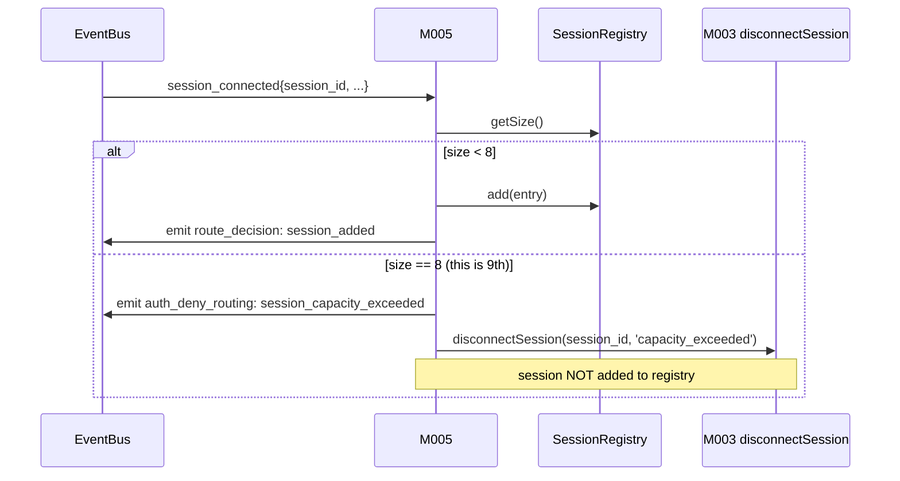

# MODULE-005: routing

> Status: Draft
> Created: 2026-05-12
> Updated: 2026-05-16 (v1.1.0 — v0.2 channels-integration amendment)
> Architecture: [ARCHITECTURE.md](../ARCHITECTURE.md)

---

## Part 1: Requirements

### 1.1 Module Goals & Overview

`routing` is the business orchestrator of telegram-channels-pro. It owns the in-memory
LRU SessionRegistry (built from `session_*` events), implements the deterministic
routing-snapshot rule for inbound TG messages (PRD §3.1), gates ALL inbound TG updates
through admin allowlist verification (both text and callback paths), enforces session
capacity (REQ-022 via Decision A13), and implements the user-facing TG slash commands
(`/session`, `/list`, `/status`).

routing is a pure subscriber/publisher with respect to EventBus and a consumer of
several other modules' contracts (AdminAllowlist, RegistrationGate, MCPTransport
deliver/disconnect, PendingApprovalRegistry). It owns no persistent state.

**v1.1.0 additions (REQ-034 inbound chat-type gating + REQ-040 strict /session +
REQ-043 auth-reject aggregator + REQ-036 architectural enforcement + REQ-046
first-listed-admin routing + REQ-047 wait-for-reset disconnect carrier + REQ-039
popup throttle + REQ-033 typing dispatcher)**:
- Inbound chat-type gating: M005 silently drops `chat.type !== 'private'` BEFORE
  admin allowlist verification (REQ-034); emits `chat_type_inbound_denied` event.
- Inbound side-effect cache warm: M005 calls `chatTypeCache.primeCache(chat_id,
  type)` on every accepted inbound (incl. denied — feeds outbound DiD) per
  REQ-035.
- `/session` strict full-line regex `^/session [a-f0-9]{1,12}$` (REQ-040 anti
  focus-redirect injection); embedded variants route as regular text.
- Auth-reject silent-drop + sliding-window aggregated alert (REQ-043): per-event
  silent drop + ERROR JSON log; threshold-aggregated `auth_reject_aggregated`
  event on burst (5/30/10/10 over 5min); M008 dispatcher applies ≤1/hour cap.
- All outbound notifications + ops alerts target `firstListedAdminUserId()` from
  CONTRACT-009 (REQ-046 multi-admin first-listed degradation).
- Wait-for-reset disconnect carrier (REQ-047): on every `session_connected`,
  M005 queries `M006.isWaitForReset()` → if true, invoke
  `M003.disconnectSession(id, "registration timed out; run reset-admin to retry")`.
- Approval-expired popup throttle dispatch (REQ-039): on `lookupByPendingId`
  miss, M005 checks `shouldEmitPopup(callback_data)` via CONTRACT-011 ext;
  emits popup only when allowed; emits `popup_throttled` event when suppressed.
- Typing indicator dispatcher (REQ-033 Decision A15): M005 fires
  `tg.sendChatAction(chat_id, 'typing')` fire-and-forget in parallel with
  `M003.deliverChannelNotification` (latency-isolated per AC-26b).
- Architectural enforcement of REQ-036 text-typed-approval boundary: M005
  inbound text path has ZERO call to `resolveApproval`; callback-query path
  is the sole resolve site (AC-30).

**Serves PRD topics**:
- `docs/PRD.md` (REQ-001 Flow A bidirectional chat, REQ-003 Flow C approval routing,
  REQ-010 opt-in + LRU + commands, REQ-013 admin enforcement, REQ-015 /session input
  sanitization, REQ-022 session capacity, REQ-024 auth-deny alert via token-bucket,
  REQ-033 typing-indicator dispatcher, REQ-034 chat-type inbound gating, REQ-035
  cache prime side-effect, REQ-036 text-typed-approval architectural enforcement,
  REQ-039 popup throttle dispatch, REQ-040 strict `/session` matching, REQ-043
  auth-reject aggregated alert, REQ-046 first-listed-admin routing, REQ-047
  wait-for-reset handshake disconnect)

### 1.2 Architecture Overview

```
┌────────────────────────────────────────────────────────────────────┐
│                          MODULE-005 routing                         │
│                                                                    │
│  ┌───────────────────┐   ┌────────────────────┐                    │
│  │ SessionRegistry   │   │ InboundDispatcher  │                    │
│  │ (LRU ordered list │◄──┤ subscribes         │                    │
│  │  built from       │   │ inbound_update     │                    │
│  │  session_* events;│   │ events             │                    │
│  │  tool_call updates│   └────────────────────┘                    │
│  │  timestamp)       │            │                                │
│  └───────────────────┘            │                                │
│      │                            ▼                                │
│      │   ┌────────────────────────────────────────┐                │
│      ▼   │ AdminGate (calls M006 isAdmin)         │                │
│   capacity└────────────────────────────────────────┘               │
│   check                │                                           │
│   (>8 reject)          ▼                                           │
│      │      ┌──────────────────────────┐                           │
│      │      │ Type branch:             │                           │
│      │      │ - text → LRU snapshot   │                           │
│      │      │   → M003.deliverToSession│                           │
│      │      │ - callback → M004        │                           │
│      │      │   .lookupByPendingId     │                           │
│      │      │   → M004.resolveApproval │                           │
│      │      └──────────────────────────┘                           │
│      │                                                             │
│      ▼                                                             │
│  ┌────────────────────────┐    ┌─────────────────────────────┐     │
│  │ /session /list /status │    │ NoSessionReplyThrottle      │     │
│  │ command handlers       │    │ (per-admin-chat 5min dedup) │     │
│  └────────────────────────┘    └─────────────────────────────┘     │
└────────────────────────────────────────────────────────────────────┘
```

### 1.3 Feature Matrix

| Feature | Priority | Status | Description |
|---------|----------|--------|-------------|
| SessionRegistry (LRU ordered list) | P0 | Planned | Built from session_connected/disconnected events; tool_call events update timestamps |
| Session capacity enforcement | P0 | Planned | Decision A13: on session_connected, if count > 8 → call M003.disconnectSession |
| Inbound text admin verification | P0 | Planned | REQ-013: M005 calls M006.isAdmin BEFORE any routing |
| Inbound text routing via LRU snapshot | P0 | Planned | REQ-001 / PRD §3.1 routing snapshot rule |
| Inbound callback admin verification | P0 | Planned | REQ-013 — same gate for callback path |
| Inbound callback routing via PendingApprovalRegistry | P0 | Planned | REQ-003 Flow C; calls M004 lookupByPendingId + resolveApproval |
| `/session <shortid>` command | P0 | Planned | REQ-010 + REQ-015 input sanitization (hex regex) |
| `/list` command | P0 | Planned | REQ-010; returns shortid/branch/ago (no project path) |
| `/status` command | P0 | Planned | REQ-010; daemon health summary (via M008 StatusReporter) |
| Per-admin-chat 5min throttle for no-session reply | P0 | Planned | REQ-024 token-bucket per chat |
| Registration-window handoff to M006 | P0 | Planned | If RegistrationGate.isInRegistrationWindow → forward DM to M006 for code-match attempt |
| pending cleanup on session_disconnected | P0 | Planned | REQ-009 / RISK-010; calls M004 cleanupBySession |

### 1.4 Detailed Feature Specifications

#### 1.4.1 SessionRegistry (LRU)

**Data structure**: ordered list of session entries by most-recent-activity-timestamp.

```ts
interface SessionEntry {
  session_id: string;           // from M003 session_connected
  shortid: string;
  branch: string;
  registered_at: number;
  last_activity_at: number;     // updated on tool_call events
}
```

**Updates from EventBus events** (Slice 2: payload shapes match `event-types.ts` EventPayloadMap):
- `session_connected` → push new entry to head; emit `route_decision: { update_id: -1, target_session: <session_id>, reason: "session_added" }`
- `session_disconnected` → remove entry; trigger M004.cleanupBySession(session_id, tg); emit `route_decision: { update_id: -1, target_session: <session_id>, reason: "session_removed" }`
- `tool_call` → update `last_activity_at` of matching session_id; bubble entry to head
- TG inbound message arrival → does NOT update LRU (per PRD §3.1 routing snapshot rule)

**`update_id: -1` sentinel**: route_decision events not tied to a TG inbound update (session lifecycle) use `update_id: -1`. M008 Subscriber treats negative update_id as "non-update" and logs without offset linkage.

**Capacity guard** (Decision A13):
- On `session_connected`, check `registry.size() >= 8` before adding. (`>= 8` means the registry already holds 8 entries; this incoming session would be the 9th, so reject.)
- If over: emit `auth_deny_routing: { sender_hash: "", reason: "session_capacity_exceeded" }` (sender_hash empty because the caller is a session-init frame from the local UDS, not a TG sender), call `M003.disconnectSession(session_id, 'capacity_exceeded')`.

**Snapshot lookup**: `getFocus()` returns the head entry (most recent activity) at call time. This is the routing-snapshot rule applied per-message.

#### 1.4.1a AdminChatRegistry (Slice 2)

In-process M005-internal helper that resolves "the admin chat" for outbound messages where M004's `request_approval` (and M008's AlertDispatcher via cross-wiring per CCD-10) need a destination. Lives at `src/routing/admin-chat-registry.ts`.

**API**:
```ts
export class AdminChatRegistry {
  constructor(envValue: string | undefined);  // parses env.TG_ADMIN_CHAT_ID eagerly
  setFromInbound(chat_id: number, chat_type: string): void;  // called by M005 InboundDispatcher post-admin-gate
  setFromEnvForTest(chat_id: number): void;
  get(): number | null;
  subscribe(callback: (chat_id: number | null) => void): () => void;  // fires immediately with current value
}
```

**Behavior**:
- Constructor parses env.TG_ADMIN_CHAT_ID (decimal int); malformed → silently ignored at boot.
- `setFromInbound` filters on `chat_type === 'private'` — group/channel chats are silently skipped (privilege-leak defense; admin must DM the bot privately).
- `subscribe` fires the callback immediately with the current value (avoids subscriber-startup race).

**Lifecycle**: in-memory only; lost on daemon restart. User must DM the bot once after restart, OR set TG_ADMIN_CHAT_ID env, OR `request_approval` returns `NoAdminChatConfigured`.

**Cross-module wiring** (per Slice 2 daemon main.ts L8a/L9a):
- `installToolHandlers` accepts `adminChatRegistry`; M004's request_approval calls `adminChatRegistry.get()`.
- `installRouting` accepts the same instance; M005's InboundDispatcher calls `setFromInbound(chat_id, chat_type)` on every admin-verified inbound text.
- M008's AlertDispatcher subscribes via `adminChatRegistry.subscribe(chatId => obs.setAdminChat(chatId ?? 0))` — this binds AlertDispatcher's `adminChatId` to the registry's current value, dynamic update on inbound DM, plus immediate sync at subscribe time.

#### 1.4.2 Inbound text dispatch

**Flow** (from EventBus subscriber, v1.1.0 revised order):
1. Receive `inbound_update` where `type === 'message'`.
1a. **v1.1.0 (REQ-034) chat-type gate FIRST** — read `message.chat.type`:
   - **Cache prime side-effect (REQ-035 AC-22)**: regardless of value, call `chatTypeCache.primeCache(message.chat.id, message.chat.type)` so future outbound DiD short-circuits without lazy-fetch (cache prime happens BEFORE the drop decision so even denied entries are captured).
   - if `chat.type !== 'private'` → emit `chat_type_inbound_denied` event with `{chat_id, observed_type, sender_hash}` + ERROR JSON log; SILENTLY DROP (no reply to attacker per PRD §3.1 step 2(a)); update sliding-window counter for `non_private_chat` aggregated alert per AC-25. **RETURN** — do NOT proceed to admin verification (chat-type gate precedes admin allowlist per PRD §3.1).
   - if `chat.type === 'private'` → proceed to step 2.
2. Call `M006.isInRegistrationWindow()` **FIRST** (before admin check, because admin allowlist is empty during registration — admin-check-first would deadlock first-run registration):
   - true → call `M006.processRegistrationDM(message.from.id, message.text)`; result either consumed (registration in progress — return without further routing) or `not_registration_dm` (drop silently; do NOT fall through to LRU because no admin exists yet).
   - false → proceed to step 3.
3. Call `M006.isAdmin(message.from.id)`:
   - false → emit `auth_deny_routing: { sender_hash: shortHash(String(msg.from.id)), reason: "inbound_text_deny" }` (token-bucket rate-limited via M008); drop message.
   - true → continue.
3a. (Slice 2) `adminChatRegistry.setFromInbound(message.chat.id, message.chat.type)` — captures admin chat for downstream `request_approval` + AlertDispatcher routing. Filtered to `chat.type === 'private'` only.
4. Check if message.text starts with `/session ` / `/list` / `/status` — if so, dispatch to command handler (§1.4.4).
5. Otherwise: call `registry.getFocus()`:
   - null (no sessions) → call NoSessionReplyThrottle.maybeReply(chat_id, text="No active claude session...")
   - entry → call `M003.deliverToSession(entry.session_id, {kind: 'inbound_push', type: 'message', payload})`. If deliver fails (unknown session — race with disconnect), remove from registry + fall back to next focus.
6. Emit `route_decision` event with chosen session_id (or "no_session" / "command_handled").

#### 1.4.3 Inbound callback dispatch

**Flow** (v1.1.0 revised order):
1. Receive `inbound_update` where `type === 'callback_query'`.
1a. **v1.1.0 (REQ-034) chat-type gate FIRST** — read `callback.message.chat.type`:
   - Cache prime side-effect (REQ-035 AC-22): regardless of value, call `chatTypeCache.primeCache(...)`.
   - if `chat.type !== 'private'` → emit `chat_type_inbound_denied` event + ERROR JSON log; SILENTLY DROP (per PRD §3.3 step 4 + ARCH §11.2 STRIDE); update sliding-window counter for `non_private_chat` aggregated alert per AC-25. **RETURN** — do NOT proceed to admin verification (chat-type precedes admin allowlist).
   - if `chat.type === 'private'` → proceed to step 2.
2. Call `M006.isAdmin(callback.from.id)`:
   - false → emit `auth_deny_routing` event (token-bucket rate-limited via M008); **silently drop** the callback (per PRD §3.3 edge case "daemon 静默忽略 callback, pending 保持挂起" — no `answerCallbackQuery` to the attacker, no state leak). pending remains alive for legitimate admin click.
   - true → continue.
3. Call `M004.lookupByPendingId(callback.data)`:
   - null → M005 calls `M002.answerCallbackQuery({callback_query_id: callback.id, text: "approval expired", show_alert: true})` (PRD §3.3 stale-pending case); emit `route_decision: { reason: "callback_stale", target_session: null }`.
   - entry → parse option index from callback.data via `entry.callback_data_map.get(callback.data)`; if `undefined` (crafted out-of-range index), reply "invalid option" via `answerCallbackQuery` and emit `route_decision: { reason: "callback_invalid_option", target_session: null }`. If valid, **await** `M004.resolveApproval(entry.pending_id, option_label, callback.id, tg)`. M004 handles answerCallbackQuery internally; ordering invariant: answerCallbackQuery dispatched BEFORE claude's awaiting Promise resolves.
4. Emit `route_decision`:
   - resolved branch: `{ update_id, target_session: entry.requester_session_id, reason: "callback_resolved" }`
   - stale branch: `{ update_id, target_session: null, reason: "callback_stale" }`
   - invalid-option branch: `{ update_id, target_session: null, reason: "callback_invalid_option" }`

#### 1.4.4 TG slash commands

**`/session <shortid>`**:
- Validate `<shortid>` matches regex `^[a-f0-9]{1,12}$` (REQ-015). Invalid → reply "Invalid shortid format" (via M002).
- Lookup matching session by shortid prefix in registry. None matching → reply "Session <shortid> not found".
- Match found: bubble to head of LRU (NOT update last_activity_at — explicit switch is separate from activity). Reply "Switched focus to <shortid>".

**`/list`**:
- Snapshot registry; format each entry as `<shortid> <branch> <ago>` (no path). Empty → "No sessions registered. Start with `claude --channels telegram`."

**`/status`**:
- Query M008 StatusReporter (CONTRACT-014). Format as redacted summary: uptime, polling state, quarantine flag, last inbound ts, session count, pending approval count.
- Reply via M002 sendMessage.

#### 1.4.5 NoSessionReplyThrottle

Per-admin-chat token bucket:
- 1 token per 5 minutes (300s).
- Refills every interval; initial fill 1 token.
- On no-session inbound: consume 1 token to send reply. No token → silently drop the reply.

Throttle keyed by `chat_id` (admin sender's chat). Single-admin scenario degenerates to "global 1 reply per 5min" as documented in PRD §3.1.

**Independence from /list throttle**: `/list` is a direct user query, not an inbound-text route. `/list` is NOT throttled by NoSessionReplyThrottle. (PRD §4.6 explicit invariant.)

### 1.5 Acceptance Criteria

| ID | REQ Source | Contracts | Criterion | Verification |
|----|-----------|-----------|-----------|-------------|
| MODULE-005-AC-01 | REQ-010 | CONTRACT-003 | `session_connected` event adds entry to registry head; emits `route_decision: session_added` | unit test |
| MODULE-005-AC-02 | REQ-010 | CONTRACT-003 | `session_disconnected` event removes entry; emits `route_decision: session_removed` | unit test |
| MODULE-005-AC-03 | REQ-022 / Decision A13 | CONTRACT-006 | session_connected when registry.size() >= 8 (i.e. 9th session attempt) → emit `auth_deny_routing: session_capacity_exceeded`; call M003.disconnectSession(id, 'capacity_exceeded'); session NOT added to registry | unit test |
| MODULE-005-AC-04 | REQ-001 / PRD §3.1 | CONTRACT-003 | inbound_update {type:message} → admin verify → registry.getFocus() at receipt time → M003.deliverToSession | integration test |
| MODULE-005-AC-05 | REQ-013 | CONTRACT-009 | non-admin inbound message: M005 calls M006.isAdmin → false → drop with auth_deny_routing; no deliverToSession call | unit test |
| MODULE-005-AC-06 | REQ-001 / PRD §3.1 | CONTRACT-003 | `tool_call` event updates last_activity_at of matching session; bubbles entry to LRU head | unit test |
| MODULE-005-AC-07 | REQ-001 | CONTRACT-003 | TG inbound message arrival does NOT update LRU (only tool_call does); snapshot rule per-receipt | unit test |
| MODULE-005-AC-08 | REQ-003 / Flow C | CONTRACT-009 + CONTRACT-011 | inbound_update {type:callback_query} → admin verify → M004.lookupByPendingId → M004.resolveApproval | integration test |
| MODULE-005-AC-09 | REQ-013 | CONTRACT-009 | non-admin callback: M005 calls M006.isAdmin → false → silent drop (NO answerCallbackQuery to attacker, per PRD §3.3); pending stays open; emit auth_deny_routing | unit test |
| MODULE-005-AC-10 | REQ-003 / PRD §3.3 | CONTRACT-011 | unknown pending_id (post-crash stale button click) → M005 calls M002.answerCallbackQuery with "approval expired" + show_alert | integration test |
| MODULE-005-AC-11 | REQ-010 / REQ-015 | — | `/session <shortid>` valid hex → bubble matching session to head; ack with "Switched focus to <shortid>" | unit test |
| MODULE-005-AC-12 | REQ-015 | — | `/session <invalid>` (non-hex / >12 chars / has shell metachar) → reply "Invalid shortid format"; no registry mutation | unit test |
| MODULE-005-AC-13 | REQ-010 | — | `/list` returns each entry as `<shortid> <branch> <ago>`; empty list → "No sessions registered..." | unit test |
| MODULE-005-AC-14 | REQ-010 | CONTRACT-014 | `/status` calls M008 StatusReporter and replies with redacted summary | integration test |
| MODULE-005-AC-15 | REQ-024 / PRD §3.1 | — | NoSessionReplyThrottle: per-admin-chat 1 reply per 5min; no token = silent drop | unit test |
| MODULE-005-AC-16 | PRD §4.6 | — | `/list` is NOT subject to no-session throttle (independent counter) | unit test |
| MODULE-005-AC-17 | REQ-011 | CONTRACT-010 | If RegistrationGate.isInRegistrationWindow → M005 forwards DM to M006.processRegistrationDM; result decides further routing | integration test |
| MODULE-005-AC-18 | REQ-009 / RISK-010 | CONTRACT-011 | `session_disconnected` triggers M005 → M004.cleanupBySession; pending entries for that session resolved with SessionTerminated | integration test |
| MODULE-005-AC-19 | REQ-020 | — | Inbound text → focus session deliver: P95 < 50ms (in-process; excludes Telegram poll cycle) | benchmark |
| MODULE-005-AC-20 | RISK-010 | — | Failed deliverToSession (race with session disconnect) → fall back to next LRU; if no next, no-session-throttle reply | integration test |
| MODULE-005-AC-21 | REQ-034 | CONTRACT-003 | Inbound chat-type gating: M005 silently drops any `inbound_update` whose `message.chat.type !== 'private'` OR `callback_query.message.chat.type !== 'private'`. Check runs BEFORE admin allowlist verification. Even if `from.id` is in admin allowlist, non-private chat type → silent drop. Emits `chat_type_inbound_denied` event with `{chat_id, observed_type, sender_hash}` for audit | unit test |
| MODULE-005-AC-22 | REQ-035 | CONTRACT-016 | On every inbound (any chat type), M005 calls `chatTypeCache.primeCache(chat_id, observed_type)` AT step 1a — BEFORE the chat-type gate decision (so the cache is populated for both accepted AND denied entries). The "denied" inbound is dropped per AC-21 but its chat_id→type binding is already in the cache, enabling future outbound DiD to short-circuit without lazy-fetch. Ordering: read chat.type → primeCache → if non-private gate-drop, else proceed | unit test |
| MODULE-005-AC-23 | REQ-040 | — | `/session <shortid>` strict matching: regex `^/session [a-f0-9]{1,12}$` (full-line anchor). Embedded `/session abc123` in message body OR multi-line text OR `/session` followed by non-hex → routed as regular channel notification (NOT a command); no focus mutation | unit test |
| MODULE-005-AC-24 | REQ-046 | CONTRACT-009 ext | All outbound notifications (REQ-002 Flow B), pending approval routing (REQ-009), and ops alerts (REQ-024, REQ-038, REQ-043) use `firstListedAdminUserId()` from CONTRACT-009 to obtain target admin user_id; under multi-admin config, only first-listed receives ops traffic | unit test |
| MODULE-005-AC-25 | REQ-043 | CONTRACT-003 | Auth-reject aggregated alert: per-category sliding-window counters (per-sender 5 / global 30 / non-admin-chat 10 / non-private-chat 10; 5-min window). On threshold trip, publish `auth_reject_aggregated` event with `{category, count, window_start, window_end}`; M008 dispatcher applies ≤1/hour per-category cap before TG admin alert | unit test |
| MODULE-005-AC-26 | REQ-039 | CONTRACT-011 ext | Approval-expired popup throttle: on `lookupByPendingId` miss (stale button), call `shouldEmitPopup(callback_data)` via CONTRACT-011 ext; if true → M002.answerCallbackQuery WITH "approval expired" popup text + records throttle ts; if false → answerCallbackQuery WITHOUT popup (silent ack); emits `popup_throttled` event when suppressed | unit test |
| MODULE-005-AC-26b | REQ-033 + Decision A15 | CONTRACT-004 + CONTRACT-006 | Typing indicator dispatch: on every accepted inbound (post chat-type + admin gates), M005 fires `tg.sendChatAction(chat_id, 'typing')` via CONTRACT-004 in parallel with `M003.deliverChannelNotification(session_id, payload, meta)` (v1.1.0 CONTRACT-006 additive method — REQ-033 channel-protocol path that supersedes the v1.0 `deliverToSession` call site for channel-tag inbound) — fire-and-forget; failure of sendChatAction does NOT block inbound or count toward §5 SLO per Decision A15 latency-isolation | unit test |
| MODULE-005-AC-27 | REQ-047 | CONTRACT-010 ext + CONTRACT-006 | Wait-for-reset handshake disconnect: on every `session_connected` event, M005 queries `M006.isWaitForReset()`; if true → M005 calls `M003.disconnectSession(session_id, "registration timed out; run reset-admin to retry")` so the disconnect frame carries the hint to the claude session terminal | integration test |
| MODULE-005-AC-28 | REQ-001 / REQ-010 | — | `/session` UX one-shot snapshot annotation: `/session <shortid>` bubbles match session to LRU head AT THE MOMENT of command; if other sessions call tool_call afterward, those updates may bubble them past — `/session` is NOT a sticky lock. Test: switch to session X, then session Y calls tool_call, send inbound → routes to Y not X | integration test |
| MODULE-005-AC-29 | REQ-001 | — | `/list` Branch trade-off documented in operator-facing `/list` reply (PRD §4.6): branch column kept in output (UX value > redaction); admin warned in operator notes (currently inline §1.1 narrative + §2.13 runbook gets a new "Branch leakage advisory" row in the same /spec rerun) to avoid leaking employer/customer/internal-codename branch names | doc verification |
| MODULE-005-AC-30 | REQ-036 + Decision A17 | CONTRACT-011 | Architectural enforcement of text-typed-approval-NOT-approval: M005 inbound text routing path has ZERO call to CONTRACT-011 `resolveApproval`; the sole call site is the callback_query path (AC-08). Verified by static analysis or property test | static analysis / architectural review |

### 1.6 Non-functional Requirements

| Requirement | Target | Measurement |
|-------------|--------|-------------|
| Inbound dispatch decision latency (E2E user-facing budget per REQ-020) | < 50 ms | E2E benchmark (production) |
| Inbound dispatch decision latency (in-process micro-benchmark with mocked M002/M003) | max < 5 ms over 5000 iterations after 200 warm-up | bun test benchmark |
| Registry add/remove/lookup | O(1) avg | benchmark |
| LRU bubble-to-head | O(1) | benchmark |
| Memory per session entry | < 1 KB | benchmark |

### 1.7 Security Requirements

- Admin verification is the ONLY gate for routing (single-source-of-truth invariant — REQ-013).
- `/session <shortid>` input strictly validated via regex `^[a-f0-9]{1,12}$` before any registry lookup.
- ack texts only echo validated/sanitized strings (REQ-015).
- `auth_deny_routing` events are token-bucket-rate-limited at M008 (Decision A5) to avoid TG flood.
- Callback_query.from.id is verified BEFORE any pending-registry lookup (defense in depth — even though stale lookups are harmless, this avoids CPU waste on attacker traffic).

---

## Part 2: Specification

### 2.1 Module Boundary

**IN**:
- SessionRegistry (LRU ordered list)
- Inbound text + callback dispatch
- Admin verification gate (via M006.isAdmin)
- TG slash commands (/session /list /status) handler
- NoSessionReplyThrottle
- Session capacity enforcement (calls M003.disconnectSession on overflow)
- pending cleanup trigger on session_disconnected (calls M004.cleanupBySession)

**OUT**:
- TG HTTP API → MODULE-002
- MCP transport (deliver mechanic) → MODULE-003
- Pending registry storage → MODULE-004
- Admin allowlist data + registration state → MODULE-006
- Status data computation → MODULE-008

### 2.2 Dependencies

#### Upstream Dependencies

| Module | Doc Link | Required Contract | Dependency Content | Type |
|--------|----------|------------------|-------------------|------|
| MODULE-001 daemon-core | [MODULE-001](./MODULE-001-daemon-core.md) | CONTRACT-003 | EventBus sub (inbound_update, session_*, tool_call) + pub (route_decision, auth_deny_routing, **v1.1.0**: `chat_type_inbound_denied`, `auth_reject_aggregated`, `popup_throttled`) | Hard |
| MODULE-002 telegram-client | [MODULE-002](./MODULE-002-telegram-client.md) | CONTRACT-004 | answerCallbackQuery for stale-button + no-session reply via sendMessage; **v1.1.0**: `sendChatAction(typing)` fire-and-forget for REQ-033 typing indicator dispatcher | Hard |
| MODULE-002 telegram-client | [MODULE-002](./MODULE-002-telegram-client.md) | **CONTRACT-016 (v1.1.0)** | ChatTypeCache `primeCache(chat_id, type)` side-effect write on EVERY inbound regardless of chat type (incl. would-be-denied entries; REQ-035 cache warm — supports M004 outbound DiD) | Hard (v1.1.0) |
| MODULE-003 mcp-server-proxy | [MODULE-003](./MODULE-003-mcp-server-proxy.md) | CONTRACT-006 | deliverToSession, disconnectSession; **v1.1.0**: `deliverChannelNotification` for inbound REQ-033 channel-protocol; `disconnectSession` invoked with REQ-047 hint string when M006.isWaitForReset on session_connected | Hard |
| MODULE-004 mcp-tools | [MODULE-004](./MODULE-004-mcp-tools.md) | CONTRACT-011 | lookupByPendingId, resolveApproval, cleanupBySession; **v1.1.0**: `recordPopupThrottle` + `shouldEmitPopup` for REQ-039 approval-expired popup throttle | Hard |
| MODULE-006 admin-auth | [MODULE-006](./MODULE-006-admin-auth.md) | CONTRACT-009 + CONTRACT-010 | isAdmin, isInRegistrationWindow, processRegistrationDM; **v1.1.0**: `firstListedAdminUserId()` for REQ-046 first-listed-admin routing; `isWaitForReset()` for REQ-047 handshake disconnect gate | Hard |
| MODULE-008 observability | [MODULE-008](./MODULE-008-observability.md) | CONTRACT-014 | StatusReporter for /status command | Hard |

#### Downstream Dependencies

(none — M005 is a terminal subscriber/orchestrator)

#### External Dependencies

(none — pure in-process)

### 2.3 Interface Definitions

#### Provided Interfaces

M005 does NOT provide cross-module contracts. Its internal SessionRegistry is intra-module
(consumed only by M005's own dispatch logic per ARCHITECTURE.md §6.1 contract-removal note).

#### Required External Interfaces

| Required Contract | Provider | Used For |
|---|---|---|
| CONTRACT-003 EventBus | M001 | sub/pub |
| CONTRACT-004 TelegramAPIClient | M002 | sendMessage (no-session reply, ack messages), answerCallbackQuery (stale buttons), **v1.1.0**: sendChatAction(typing) for REQ-033 dispatcher |
| CONTRACT-006 MCPTransport | M003 | deliverToSession, disconnectSession, **v1.1.0**: deliverChannelNotification (REQ-033 channel-protocol inbound); disconnectSession with REQ-047 hint on isWaitForReset |
| CONTRACT-009 AdminAllowlist | M006 | isAdmin; **v1.1.0**: firstListedAdminUserId (REQ-046 multi-admin first-listed routing) |
| CONTRACT-010 RegistrationGate | M006 | isInRegistrationWindow, processRegistrationDM; **v1.1.0**: isWaitForReset (REQ-047 handshake disconnect gate) |
| CONTRACT-011 PendingApprovalRegistry | M004 | lookupByPendingId, resolveApproval, cleanupBySession; **v1.1.0**: recordPopupThrottle + shouldEmitPopup (REQ-039 popup throttle) |
| CONTRACT-014 StatusReporter | M008 | /status command output |
| **CONTRACT-016 ChatTypeCache (v1.1.0)** | M002 | `primeCache(chat_id, type)` side-effect write on EVERY inbound regardless of chat type (incl. would-be-denied entries; REQ-035 cache warm) |

#### Events/Messages

**Published** (Slice 2: payloads aligned with `event-types.ts` EventPayloadMap):

| Event Name | Trigger | Payload | Consumer |
|-----------|---------|---------|----------|
| `route_decision` | Each dispatch | `{ update_id: number; target_session: string \| null; reason: string }` — canonical `reason` values: `"session_added"` / `"session_removed"` / `"text_delivered"` / `"callback_resolved"` (admin clicked, valid pending) / `"callback_stale"` (admin clicked, pending lost — post-crash) / `"callback_invalid_option"` (admin clicked, invalid option_index in callback_data) / `"no_session"` / `"command_handled"` / `"invalid_shortid"`. `update_id: -1` for non-update events (session lifecycle); else carries the inbound update's update_id. `target_session` is the chosen session_id (or null for no-session/command/invalid-shortid/callback_stale). | M008 (log) |
| `auth_deny_routing` | non-admin attempt | `{ sender_hash: string; reason: string }` — canonical `reason` values: `"inbound_text_deny"` / `"callback_deny"` / `"session_capacity_exceeded"`. `sender_hash` = `shortHash(String(sender_id))` for admin-gate denials; empty string `""` for capacity-exceeded (caller is local UDS, not TG sender). | M008 (alert via token-bucket) |
| **`chat_type_inbound_denied` (v1.1.0)** | Non-private `chat.type` on inbound message OR callback_query (REQ-034) | `{ chat_id, observed_type: 'group' \| 'supergroup' \| 'channel', sender_hash }` | M008 (ERROR JSON log) |
| **`auth_reject_aggregated` (v1.1.0)** | Sliding-window threshold trip per category (REQ-043) — per-sender 5 / global 30 / non-admin-chat 10 / non-private-chat 10 in 5min | `{ category, count, window_start, window_end }` | M008 (TG admin alert with ≤1/hour per-category cap) |
| **`popup_throttled` (v1.1.0)** | Approval-expired popup suppression (REQ-039) | `{ callback_data_hash, throttle_until_ts }` | M008 (DEBUG audit) |

**Subscribed**:

| Event Name | Source | Handler |
|-----------|--------|---------|
| `inbound_update` | M002 | InboundDispatcher (text or callback branch) |
| `session_connected` | M003 | SessionRegistry.add + capacity check |
| `session_disconnected` | M003 | SessionRegistry.remove + M004.cleanupBySession |
| `tool_call` | M004 | SessionRegistry.bumpActivity |

### 2.4 API Endpoints

(N/A)

### 2.5 Data Models

In-memory only — no persistence:

```ts
interface SessionRegistryEntry {
  session_id: string;          // UDS-connection-allocated 16-hex
  shortid: string;             // from session_init frame
  branch: string;
  registered_at: number;       // ms epoch
  last_activity_at: number;    // bumped by tool_call events
}

// Slice 2: AdminChatRegistry shape
interface AdminChatRegistryState {
  chat_id: number | null;       // captured admin chat (env or first private inbound)
  // subscribers: callbacks fired on every change AND immediately on subscribe
}

// NoSessionReplyThrottle shape (per-chat token bucket)
interface NoSessionReplyEntry {
  last_consumed_ts: number;     // ms epoch; 5min refill
}
```

**State sources**:

| Surface | Captured From | Lost on |
|---------|---------------|---------|
| SessionRegistry entries | `session_connected`/`_disconnected`/`tool_call` events | daemon restart (rebuilt from new connections) |
| AdminChatRegistry chat_id | env `TG_ADMIN_CHAT_ID` at boot OR first admin-verified private inbound | daemon restart |
| NoSessionReplyThrottle | per-chat `last_consumed_ts` | daemon restart |

### 2.6 Database Functions & RPCs

(N/A)

### 2.7 Core Logic

**Inbound text dispatch FSM**:

```mermaid
sequenceDiagram
    participant EB as EventBus
    participant RT as M005 InboundDispatcher
    participant AA as M006 AdminAllowlist
    participant RG as M006 RegistrationGate
    participant SR as M005 SessionRegistry
    participant SP as M003 deliverToSession
    participant DC as M002 sendMessage (no-session reply)

    EB->>RT: inbound_update{type:message}
    RT->>AA: isAdmin(sender)?
    alt non-admin
        AA-->>RT: false
        RT->>EB: emit auth_deny_routing
        Note over RT: drop, no reply
    else admin
        AA-->>RT: true
        RT->>RG: isInRegistrationWindow?
        alt in window
            RG-->>RT: true
            RT->>RG: processRegistrationDM(sender, text)
            alt consumed (register attempt)
                RG-->>RT: consumed
                Note over RT: routing complete
            else not registration DM
                RG-->>RT: not_registration
                RT->>RT: fall through to normal dispatch
            end
        else not in window
            RG-->>RT: false
            RT->>RT: check text for /session / /list / /status
            alt is command
                RT->>RT: command handler
            else not command
                RT->>SR: getFocus()
                alt focus session present
                    SR-->>RT: entry
                    RT->>SP: deliverToSession(entry.session_id, payload)
                    alt deliver ok
                        SP-->>RT: ok
                        RT->>EB: emit route_decision: text_delivered
                    else deliver failed (stale session)
                        SP-->>RT: error
                        RT->>SR: remove(session_id); retry getFocus
                        alt next focus
                            RT->>SP: deliverToSession (recurse)
                        else no more sessions
                            RT->>DC: no-session reply (throttled)
                            RT->>EB: emit route_decision: no_session
                        end
                    end
                else no focus
                    SR-->>RT: null
                    RT->>DC: no-session reply (throttled)
                    RT->>EB: emit route_decision: no_session
                end
            end
        end
    end
```

**Inbound callback dispatch**: similar pattern but admin-verify → M004 lookup → resolve.

**v1.1.0 — Inbound chat-type cache prime (REQ-035 + CONTRACT-016 consumer — AC-22)**:

Every inbound `handleInbound` (both message and callback_query branches) calls `chatTypeCache.primeCache(chat.id, chat.type as ChatType)` as the FIRST observable side-effect, BEFORE any routing decision (admin check, registration gate, command parse). Per CONTRACT-016 (M002 §1.4.5), ALL observed types are cached including non-private (so outbound DiD can short-circuit on any future model attempt to address a known-non-private chat_id without lazy-fetch). REQ-034 chat-type inbound gate is OUT OF SCOPE for this slice; AC-22 placement is forward-compatible: when REQ-034 lands and adds a non-private gate, primeCache will already be positioned before it.

**v1.1.0 — Wait-for-reset handshake disconnect (REQ-047 + CONTRACT-010 ext — AC-27)**:

```mermaid
sequenceDiagram
    participant EB as EventBus
    participant WH as WaitForResetHandshakeHandler
    participant RG as M006 RegistrationGate
    participant SP as M003 MCP acceptor
    participant CL as claude session

    Note over WH: registered BEFORE SessionRegistry per Set-insertion-order
    EB->>WH: session_connected{session_id, ...}
    WH->>RG: isWaitForReset()
    alt true
        RG-->>WH: true
        WH->>WH: disconnecting.add(session_id) [idempotency guard]
        WH->>SP: disconnectSession(session_id, "registration timed out; run reset-admin to retry")
        Note over WH: fire-and-forget; .finally() clears disconnecting set
        SP->>CL: disconnect frame with reason carried via M003-AC-27 free-form disconnect_farewell path
        Note over CL: claude --channels prompt sees disconnect_reason; user runs reset-admin CLI
    else false
        RG-->>WH: false
        Note over WH: no action (normal session admission proceeds via SessionRegistry)
    end
```

**v10 boot-race mitigation**: WaitForResetHandshakeHandler is constructed + installed in `src/daemon/main.ts` at NEW step L14b (between `new MCPDaemonAcceptor(...)` construction and `await mcpAcceptor.start()`), so the subscription exists before any session_connected event can fire. `src/routing/index.ts`'s `installRouting` accepts the already-installed instance via `waitForResetHandshake?` arg and skips re-install (just tracks dispose).


**Session capacity FSM**:



### 2.8 Error Handling

| Error | Trigger | Handling |
|---|---|---|
| `auth_deny_routing` | non-admin sender (text or callback) OR capacity overflow | log + token-bucket alert (via M008); drop / disconnect target |
| **`chat_type_inbound_denied` (v1.1.0 REQ-034)** | `chat.type !== 'private'` on inbound text OR callback_query | emit event + ERROR JSON log; silently drop (no reply); update sliding-window counter for `non_private_chat` aggregated alert; cache prime still happens (REQ-035 AC-22) |
| **`auth_reject_aggregated` (v1.1.0 REQ-043)** | Per-category sliding-window count reaches threshold (per-sender 5 / global 30 / non-admin-chat 10 / non-private-chat 10 in 5min) | publish `auth_reject_aggregated` event with `{category, count, window_start, window_end}`; M008 dispatcher caps to ≤1/hour per category before TG admin alert |
| **Popup-throttled stale callback (v1.1.0 REQ-039)** | `lookupByPendingId` miss AND `shouldEmitPopup(callback_data) === false` (within 5min throttle window) | M005 calls `answerCallbackQuery(callback_id)` WITHOUT popup text (silent ack); emit `popup_throttled` event |
| Stale session in registry (race with disconnect during dispatch) | deliverToSession returns unknown_session | remove entry; fall back to next focus or no-session reply |
| Stale pending callback (post-daemon-crash) | M004.lookupByPendingId returns null AND popup throttle allows | M005 calls M002.answerCallbackQuery with "approval expired" + show_alert; records popup ts via `recordPopupThrottle` |
| Invalid /session input | regex mismatch | reply "Invalid shortid format" (via M002) |
| **Embedded /session in body (v1.1.0 REQ-040)** | message body contains `/session abc` but does NOT match full-line regex `^/session [a-f0-9]{1,12}$` | route as regular channel notification (NOT a command); no focus mutation; no ack |
| Unknown shortid in /session | no entry matches prefix | reply "Session <shortid> not found" |
| **Wait-for-reset session_connected (v1.1.0 REQ-047)** | `M006.isWaitForReset() === true` at session_connected event | M005 calls `M003.disconnectSession(session_id, 'registration timed out; run reset-admin to retry')` — claude session terminal shows the hint via the disconnect frame |

### 2.9 Security Considerations

- All TG-originating data treated as untrusted (admin gate is the trust boundary).
- **v1.1.0 (REQ-034)**: chat-type gate `chat.type === 'private'` runs FIRST — BEFORE admin allowlist; even an admin user posting from group context is silently dropped. Protects against bot-in-group output leakage when admin user_id legitimately exists but the channel context is group-shared.
- `/session <shortid>` regex-validated BEFORE any registry access (avoids ReDoS / injection in lookup loop).
- **v1.1.0 (REQ-040)**: `/session` regex extended to full-line anchor `^/session [a-f0-9]{1,12}$` — embedded `/session abc123` in message body NEVER triggers focus mutation (defends against composite-message focus-redirect injection).
- ack text uses validated input only (REQ-015).
- `auth_deny_routing` events redacted (use hashed user_id, not raw).
- **v1.1.0 (REQ-043)**: Per-event auth-reject is silent at protocol surface (no enumeration to attacker); aggregated alert layer (sliding 5min window per category, ≤1/hour cap) provides admin visibility without per-event echo.
- **v1.1.0 (REQ-036 + Decision A17)**: Architectural enforcement — M005 inbound text routing path has NO call to CONTRACT-011 `resolveApproval`. The sole call site is the callback_query branch. Text "approve" / "yes" prose CANNOT advance pending state, regardless of model interpretation. Two-layer defense (architectural code path + system instructions in M003 §2.7).
- **v1.1.0 (REQ-039)**: Approval-expired popup throttle (5min per `callback_data`) prevents repeated-click info-leak probing of daemon state.
- **v1.1.0 (REQ-046)**: All outbound notifications + ops alerts target `firstListedAdminUserId()` — multi-admin config degrades safely; non-first-listed admin user_ids receive no ops traffic to avoid divergent escalation paths.
- Pending-id lookup happens AFTER admin verify (defense-in-depth — even though pending_id is daemon-generated and unguessable, this prevents CPU waste on attack traffic).

### 2.10 Configuration & Environment Variables

| Variable | Required | Default | Description |
|----------|----------|---------|-------------|
| `TGCP_SESSION_CAPACITY` | No | 8 | Session count cap (REQ-022) |
| `TGCP_NO_SESSION_REPLY_INTERVAL_SEC` | No | 300 | No-session throttle interval per chat |

### 2.11 Operational Parameters

| Parameter | Value | Description |
|-----------|-------|-------------|
| Session capacity | 8 (REQ-022) | Hard cap; 9th rejected |
| No-session reply throttle | 1 / 5min per admin chat | PRD §3.1 |
| shortid regex | `^[a-f0-9]{1,12}$` | REQ-015 |

### 2.12 State Management

**Owned state surfaces**:

| Surface | Persistence | Owner | Consumers |
|---------|-------------|-------|-----------|
| SessionRegistry (ordered list) | Process (rebuilt from session_* events on restart — empty at boot) | M005 | (internal) |
| NoSessionReplyThrottle per-chat counters | Process | M005 | (internal) |

**State transitions**: SessionRegistry entries flow `add → bump activity → remove` via events; no other transitions.

**Cross-module state protocol**: M005 reacts to M003-published session_* events; on disconnect, M005 calls M004.cleanupBySession synchronously (in same event-handler tick). The order is: M003 publishes session_disconnected → M005 handler runs → M005 calls M004 → M004 resolves Promises + edits TG buttons → cleanup complete.

### 2.13 Operations

| Symptom | Likely cause | First response | Escalation |
|---------|--------------|----------------|------------|
| Non-admin keeps DMing bot, generating `auth_deny_routing` flood | Bot username discovered by 3rd party | Token-bucket suppresses TG alert spam; investigate username exposure | Consider rotating bot token if leak suspected |
| Routing always goes to "wrong" session | LRU ordering not matching user expectation | Use `/session <shortid>` to force focus | If common, may need clearer LRU explanation in user docs |
| `/session <shortid>` always says "not found" | shortid hex doesn't match registered sessions | `/list` to see actual shortids | User should copy from `/list` output |
| Approvals frequently "approval expired" | Daemon crash-restart loop | RISK-004 territory; investigate crash root | M008 alerts should fire too |
| **v1.1.0 — `chat_type_inbound_denied` flood** | Bot added to a group/supergroup/channel | Remove bot from group; aggregated alert (REQ-043 `non_private_chat` category at threshold 10/5min) tells you it's spiking | Audit how bot was added — TG bot privacy mode may need toggling |
| **v1.1.0 — `auth_reject_aggregated` burst** | Real attack OR mistaken bot DM | Inspect M008 JSON event log for sender_hash patterns; if attack: rotate token; if user error: educate user | High burst sustained → consider env-only admin lockdown (`TELEGRAM_AUTHORIZED_USERS` set) to bypass registration window |
| **v1.1.0 — Branch leakage advisory (REQ-001 / `/list` trade-off doc — AC-29)** | `/list` output includes `<branch>` column which may carry sensitive names (employer / customer / internal codename) | Recommend renaming branches to non-sensitive forms before connecting via `--channels plugin:telegram-channels-pro@advance-kit`; admin self-managed (not redacted in `/list` per UX trade-off) | If branch names cannot be sanitized, consider not using tgcp for that project until v0.3+ adds optional branch redaction |

**Capacity**: hard 8 sessions; documented and enforced.

### 2.14 Observability

| Event | Level | Fields | Sensitive |
|-------|-------|--------|-----------|
| `route_decision` | DEBUG | session_id, kind, detail | sender hashing |
| `auth_deny_routing` | WARN | from_user_id_hash, kind | full user_id (redacted) |

**Metrics** (derived by M008): `route_decision_rate`, `auth_deny_rate`, `session_count`.

**Redaction**: sender user_id hashed before logging.

---

## Part 3: Implementation

### 3.1 Current Status

| Status | Progress | Last Updated |
|--------|----------|--------------|
| Production | 100% | 2026-05-15 |

### 3.2 File Structure

| File | Role |
|------|------|
| `src/routing/session-registry.ts` | LRU ordered list + bump/add/remove |
| `src/routing/admin-chat-registry.ts` | (Slice 2) AdminChatRegistry: env-bootstrap + private-chat-only inbound capture + subscribe/notify |
| `src/routing/inbound-dispatcher.ts` | EventBus subscriber + text/callback branch logic; admin-gate (M006.isAdmin call) is inlined here, not a separate file |
| `src/routing/commands/session.ts` | `/session <shortid>` handler |
| `src/routing/commands/list.ts` | `/list` handler |
| `src/routing/commands/status.ts` | `/status` handler (calls M008 StatusReporter) |
| `src/routing/no-session-throttle.ts` | Per-chat token bucket |
| `src/routing/index.ts` | `installRouting(deps)` wiring entry point |
| `tests/routing/*.test.ts` | Unit + integration |

### 3.3 Test Cases

| ID | Layer | AC Link | Scenario | Operation Sequence | Expected Result | Priority |
|----|-------|---------|----------|-------------------|-----------------|----------|
| MODULE-005-T01 | Unit | AC-01 | session_connected adds to head | emit event | registry.size == 1; first entry matches | P0 |
| MODULE-005-T02 | Unit | AC-02 | session_disconnected removes | add 2, then disconnect 1 | registry.size == 1 | P0 |
| MODULE-005-T03 | Unit | AC-03 | capacity exceeded | add 8, then 9th session_connected | auth_deny_routing emitted; M003.disconnectSession called; registry.size == 8 | P0 |
| MODULE-005-T04 | Integration | AC-04 | text routes to focus | session A registered + tool_call → bumps A to head → inbound_text from admin | M003.deliverToSession(A, ...) called | P0 |
| MODULE-005-T05 | Unit | AC-05 | non-admin text dropped | inbound message from non-admin | auth_deny_routing emitted; no deliverToSession | P0 |
| MODULE-005-T06 | Unit | AC-06 | tool_call bumps LRU | register 2 sessions B (newer), A (older). emit tool_call(A) | registry head == A | P0 |
| MODULE-005-T07 | Unit | AC-07 | text doesn't bump LRU | similar setup, emit inbound_update text from admin | registry order unchanged | P0 |
| MODULE-005-T08 | Integration | AC-08 | callback resolution | request_approval (M004) → admin clicks → callback inbound → resolve | claude awaiting Promise resolves with choice | P0 |
| MODULE-005-T09 | Unit | AC-09 | non-admin callback | inbound callback_query from non-admin | auth_deny_routing emitted; **silent drop** — no answerCallbackQuery to attacker (per §1.4.3 spec); pendingRegistry NOT consulted | P0 |
| MODULE-005-T10 | Integration | AC-10 | stale pending click | empty M004 registry + admin clicks | M002.answerCallbackQuery("approval expired", show_alert) | P0 |
| MODULE-005-T11 | Unit | AC-11 | /session valid | "/session a3f2e1c8" with matching session | session bubbled to head; reply "Switched focus to a3f2e1c8" | P0 |
| MODULE-005-T12 | Unit | AC-12 | /session invalid | "/session ../etc/passwd" | regex rejects; reply "Invalid shortid format"; registry unchanged | P0 |
| MODULE-005-T13 | Unit | AC-13 | /list | registry with 2 entries | output `<shortid> <branch> <ago>` × 2 lines | P0 |
| MODULE-005-T14 | Integration | AC-14 | /status | "/status" command | M008 StatusReporter called; reply with redacted summary | P0 |
| MODULE-005-T15 | Unit | AC-15 | no-session throttle | 5 inbound texts to admin chat within 5min, 0 sessions | only 1 no-session reply sent | P0 |
| MODULE-005-T16 | Unit | AC-16 | /list independent | trigger no-session throttle, then "/list" | /list always replies regardless | P0 |
| MODULE-005-T17 | Integration | AC-17 | registration window forwarding | M006.isInRegistrationWindow=true; admin DMs "register XYZ" | M006.processRegistrationDM called | P0 |
| MODULE-005-T18 | Integration | AC-18 | cleanup on disconnect | session A has pending → emit session_disconnected(A) | M004.cleanupBySession(A) called; A's pending resolved with SessionTerminated | P0 |
| MODULE-005-T19 | Benchmark | AC-19 | dispatch latency in-process micro-benchmark | 5000 inbound messages after 200 warm-up; measure max-per-call | max < 5ms (in-process tight bound; production E2E budget per REQ-020 is 50ms but includes Telegram poll cycle) | P1 |
| MODULE-005-T20 | Integration | AC-20 | stale deliver fallback | A in head, A disconnects between getFocus and deliver | fallback to next entry; if none, no-session reply | P1 |

### 3.4 Acceptance Criteria Verification

| AC ID | Active | Status | Verified By Task | Date |
|-------|--------|--------|-----------------|------|
| MODULE-005-AC-01 | Y | passed | dev-tgcp-slice-orchestration-2026-05-14-2200e70 | 2026-05-15 |
| MODULE-005-AC-02 | Y | passed | dev-tgcp-slice-orchestration-2026-05-14-2200e70 | 2026-05-15 |
| MODULE-005-AC-03 | Y | passed | dev-tgcp-slice-orchestration-2026-05-14-2200e70 | 2026-05-15 |
| MODULE-005-AC-04 | Y | passed | dev-tgcp-slice-orchestration-2026-05-14-2200e70 | 2026-05-15 |
| MODULE-005-AC-05 | Y | passed | dev-tgcp-slice-orchestration-2026-05-14-2200e70 | 2026-05-15 |
| MODULE-005-AC-06 | Y | passed | dev-tgcp-slice-orchestration-2026-05-14-2200e70 | 2026-05-15 |
| MODULE-005-AC-07 | Y | passed | dev-tgcp-slice-orchestration-2026-05-14-2200e70 | 2026-05-15 |
| MODULE-005-AC-08 | Y | passed | dev-tgcp-slice-orchestration-2026-05-14-2200e70 | 2026-05-15 |
| MODULE-005-AC-09 | Y | passed | dev-tgcp-slice-orchestration-2026-05-14-2200e70 | 2026-05-15 |
| MODULE-005-AC-10 | Y | passed | dev-tgcp-slice-orchestration-2026-05-14-2200e70 | 2026-05-15 |
| MODULE-005-AC-11 | Y | passed | dev-tgcp-slice-orchestration-2026-05-14-2200e70 | 2026-05-15 |
| MODULE-005-AC-12 | Y | passed | dev-tgcp-slice-orchestration-2026-05-14-2200e70 | 2026-05-15 |
| MODULE-005-AC-13 | Y | passed | dev-tgcp-slice-orchestration-2026-05-14-2200e70 | 2026-05-15 |
| MODULE-005-AC-14 | Y | passed | dev-tgcp-slice-orchestration-2026-05-14-2200e70 | 2026-05-15 |
| MODULE-005-AC-15 | Y | passed | dev-tgcp-slice-orchestration-2026-05-14-2200e70 | 2026-05-15 |
| MODULE-005-AC-16 | Y | passed | dev-tgcp-slice-orchestration-2026-05-14-2200e70 | 2026-05-15 |
| MODULE-005-AC-17 | Y | passed | dev-tgcp-slice-orchestration-2026-05-14-2200e70 | 2026-05-15 |
| MODULE-005-AC-18 | Y | passed | dev-tgcp-slice-orchestration-2026-05-14-2200e70 | 2026-05-15 |
| MODULE-005-AC-19 | Y | passed | dev-tgcp-slice-orchestration-2026-05-14-2200e70 | 2026-05-15 |
| MODULE-005-AC-20 | Y | passed | dev-tgcp-slice-orchestration-2026-05-14-2200e70 | 2026-05-15 |
| MODULE-005-AC-21 | Y | untested | — | — |
| MODULE-005-AC-22 | Y | untested | — | — |
| MODULE-005-AC-23 | Y | untested | — | — |
| MODULE-005-AC-24 | Y | untested | — | — |
| MODULE-005-AC-25 | Y | untested | — | — |
| MODULE-005-AC-26 | Y | untested | — | — |
| MODULE-005-AC-26b | Y | untested | — | — |
| MODULE-005-AC-27 | Y | untested | — | — |
| MODULE-005-AC-28 | Y | untested | — | — |
| MODULE-005-AC-29 | Y | untested | — | — |
| MODULE-005-AC-30 | Y | untested | — | — |

### 3.5 Feature Implementation Record

| Feature | Status | Notes |
|---------|--------|-------|
| SessionRegistry | planned | — |
| Inbound dispatch (text + callback) | planned | — |
| /session /list /status commands | planned | — |
| No-session throttle | planned | — |
| Capacity guard | planned | — |
| Pending cleanup trigger | planned | — |

### 3.6 Known Gaps & Future Work

- claim_focus / get_focus_state tools (PRD OUT-003) are explicit out-of-scope. If multi-session contention surfaces in practice, revisit.
- `/session <shortid>` doesn't support partial-prefix completion (must type full shortid prefix). Could be added v0.3+.

### 3.7 Change History

| Date | Change |
|------|--------|
| 2026-05-12 | Initial creation |
| 2026-05-15 | /dev Slice 2 begins: SessionRegistry + InboundDispatcher (text + callback branches) + AdminChatRegistry + commands (/session /list /status) + NoSessionReplyThrottle + capacity guard + pendingRegistry cleanup trigger; event payload shapes aligned to event-types.ts (route_decision uses update_id sentinel -1 for non-update events; auth_deny_routing uses sender_hash field); §1.4.3 spec-vs-test mismatch corrected (silent drop, no answerCallbackQuery to attacker); AC-19 benchmark relaxed to in-process micro-bench (max<5ms vs production E2E budget 50ms); §2.7 mermaid event payloads will be regenerated to match the table (deferred to future /spec rerun) |
| 2026-05-16 | v1.1.0 — /spec update merges PRD v1.6→v2.0 amendments. 11 new ACs (AC-21..AC-30 + AC-26b): inbound chat-type gating with `chat_type_inbound_denied` (REQ-034); cache prime side-effect on inbound (REQ-035 + CONTRACT-016 consumer); `/session` strict full-line regex (REQ-040); auth-reject aggregated alert with sliding-window thresholds (REQ-043); first-listed-admin routing for outbound notifications + ops alerts (REQ-046 via CONTRACT-009 ext); wait-for-reset handshake disconnect carrier (REQ-047 via CONTRACT-010 ext); popup throttle dispatcher (REQ-039 via CONTRACT-011 ext); typing-indicator dispatcher (REQ-033 + Decision A15 fire-and-forget); architectural enforcement of text-typed-approval-NOT-approval (REQ-036); `/session` UX one-shot snapshot annotation; `/list` Branch trade-off doc. 20 existing ACs preserved (merge-preserve per /spec stability rules). |
| 2026-05-21 | /dev task `dev-advance-kit-20260521-0edfd84f` — REQ-035 primeCache + REQ-047 wait-for-reset handshake. **In-scope ACs**: AC-22 (InboundDispatcher.handleInbound calls `chatTypeCache.primeCache(chat.id, chat.type)` as FIRST observable side-effect on every inbound — both message and callback_query branches — BEFORE admin/registration routing per CONTRACT-016 cache-population invariant; AC-22 ordering is forward-compatible with future REQ-034 chat-type inbound gate which is OUT OF SCOPE), AC-27 (NEW `WaitForResetHandshakeHandler` subscribes to `session_connected`; queries `M006.isWaitForReset()`; on true calls `mcpAcceptor.disconnectSession(session_id, "registration timed out; run reset-admin to retry")` via CONTRACT-006; idempotency guard via internal `disconnecting: Set<string>`; installed at main.ts L14b BEFORE `mcpAcceptor.start()` to close boot-race per v10 plan). §2.7 gains primeCache + WaitForResetHandshake subsections. `InstallRoutingArgs` extends with `chatTypeCache, registrationGate, waitForResetHandshake?` (handshake is pre-installed instance from main.ts; routing skips re-install). |

### 3.8 Implementation Notes

| Decision | Rationale | Alternatives | Trade-off |
|----------|-----------|--------------|-----------|
| LRU updated by tool_call events, not TG inbound | Matches PRD §3.1 routing snapshot rule; user-controllable (claude's tool activity is the user's signal) | Update LRU on every TG message arrival | Inbound messages don't reflect "user's current intent" — claude's response cadence does |
| Admin gate at M005 (not M003 or M002) | Single-source-of-truth for verification (REQ-013 invariant); keeps M002 a pure HTTP layer | Verify in M002 (closer to TG) or M006 (allowlist owner) | Centralization at orchestration layer reduces duplicated gate logic; admin allowlist module owns DATA, routing owns ENFORCEMENT |
| Capacity guard at session_connected (not pre-accept) | M003 accepts every socket; M005 reacts via event; clean separation | M003 queries M005 before accept | A13 explicit choice — keeps M003 transport-pure |
| No-session throttle keyed by chat_id | Per-admin scenario degenerates to global throttle; multi-admin scenario (future) naturally extends | global counter only | future-compatible |
| Pending cleanup via M005 → M004 (not M003 → M004 directly) | M005 owns the cross-event orchestration; M004 is pure storage | M003 directly notifies M004 | Keeps M003 layer-pure; M005 is the natural place to coordinate |
| AdminChatRegistry in-process derivation (not PRD-formalized) | PRD references "the admin chat" but doesn't formalize resolution; in-process derivation (env bootstrap + first private-DM capture) avoids /prd escalation; restart loss matches existing pending-registry semantics | Persist last admin chat to admin.json; require explicit chat_id config | In-process simplest; group/channel chat_id filtering prevents privilege leak |
| AdminChatRegistry → AlertDispatcher dynamic binding via subscribe pattern | M008 alerts (REQ-024) need same admin-chat resolution; subscribe-fires-current-value avoids subscriber-startup race | Have M008 read AdminChatRegistry directly | Decoupling: AlertDispatcher doesn't depend on M005's data structure; clean event-flow |
| route_decision update_id: -1 sentinel for non-update events (session lifecycle) | event-types.ts EventPayloadMap requires `update_id: number`; -1 cleanly distinguishes M005-internal lifecycle events from TG inbound responses | Add separate event types like `session_lifecycle_event` | Adds catalog churn for marginal benefit; sentinel is documented + M008 Subscriber treats negative as non-update |
| auth_deny_routing sender_hash empty for capacity case | The "sender" of a session_capacity_exceeded denial is a local UDS frame, not a TG sender — empty hash signals "n/a" | Synthetic hash like `"local-uds"` | Keeping it empty makes downstream filtering trivial; M008's redaction logic accepts empty as valid |
| In-process AC-19 benchmark with max<5ms ceiling (vs production E2E P95<50ms in REQ-020) | With M002+M003 mocked, in-process dispatch should be sub-millisecond; tight 5ms ceiling catches pathological regressions without flake risk | Run real Telegram round-trip in CI | Real-network test is out-of-cycle (manual soak per REQ-017); in-process benchmark guards the algorithmic side only |
