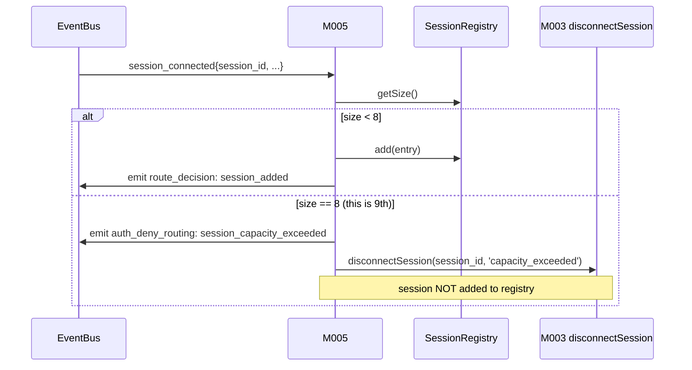

# MODULE-005: routing

> Status: Draft
> Created: 2026-05-12
> Architecture: [ARCHITECTURE.md](../ARCHITECTURE.md)

---

## Part 1: Requirements

### 1.1 Module Goals & Overview

`routing` is the business orchestrator of telegram-channels-pro. It owns the in-memory
LRU SessionRegistry (built from `session_*` events), implements the deterministic
routing-snapshot rule for inbound TG messages (PRD §3.1), gates ALL inbound TG updates
through admin allowlist verification (both text and callback paths), enforces session
capacity (REQ-022 via Decision A13), and implements the user-facing TG slash commands
(`/session`, `/list`, `/status`).

routing is a pure subscriber/publisher with respect to EventBus and a consumer of
several other modules' contracts (AdminAllowlist, RegistrationGate, MCPTransport
deliver/disconnect, PendingApprovalRegistry). It owns no persistent state.

**Serves PRD topics**:
- `docs/PRD.md` (REQ-001 Flow A bidirectional chat, REQ-003 Flow C approval routing,
  REQ-010 opt-in + LRU + commands, REQ-013 admin enforcement, REQ-015 /session input
  sanitization, REQ-022 session capacity, REQ-024 auth-deny alert via token-bucket)

### 1.2 Architecture Overview

```
┌────────────────────────────────────────────────────────────────────┐
│                          MODULE-005 routing                         │
│                                                                    │
│  ┌───────────────────┐   ┌────────────────────┐                    │
│  │ SessionRegistry   │   │ InboundDispatcher  │                    │
│  │ (LRU ordered list │◄──┤ subscribes         │                    │
│  │  built from       │   │ inbound_update     │                    │
│  │  session_* events;│   │ events             │                    │
│  │  tool_call updates│   └────────────────────┘                    │
│  │  timestamp)       │            │                                │
│  └───────────────────┘            │                                │
│      │                            ▼                                │
│      │   ┌────────────────────────────────────────┐                │
│      ▼   │ AdminGate (calls M006 isAdmin)         │                │
│   capacity└────────────────────────────────────────┘               │
│   check                │                                           │
│   (>8 reject)          ▼                                           │
│      │      ┌──────────────────────────┐                           │
│      │      │ Type branch:             │                           │
│      │      │ - text → LRU snapshot   │                           │
│      │      │   → M003.deliverToSession│                           │
│      │      │ - callback → M004        │                           │
│      │      │   .lookupByPendingId     │                           │
│      │      │   → M004.resolveApproval │                           │
│      │      └──────────────────────────┘                           │
│      │                                                             │
│      ▼                                                             │
│  ┌────────────────────────┐    ┌─────────────────────────────┐     │
│  │ /session /list /status │    │ NoSessionReplyThrottle      │     │
│  │ command handlers       │    │ (per-admin-chat 5min dedup) │     │
│  └────────────────────────┘    └─────────────────────────────┘     │
└────────────────────────────────────────────────────────────────────┘
```

### 1.3 Feature Matrix

| Feature | Priority | Status | Description |
|---------|----------|--------|-------------|
| SessionRegistry (LRU ordered list) | P0 | Planned | Built from session_connected/disconnected events; tool_call events update timestamps |
| Session capacity enforcement | P0 | Planned | Decision A13: on session_connected, if count > 8 → call M003.disconnectSession |
| Inbound text admin verification | P0 | Planned | REQ-013: M005 calls M006.isAdmin BEFORE any routing |
| Inbound text routing via LRU snapshot | P0 | Planned | REQ-001 / PRD §3.1 routing snapshot rule |
| Inbound callback admin verification | P0 | Planned | REQ-013 — same gate for callback path |
| Inbound callback routing via PendingApprovalRegistry | P0 | Planned | REQ-003 Flow C; calls M004 lookupByPendingId + resolveApproval |
| `/session <shortid>` command | P0 | Planned | REQ-010 + REQ-015 input sanitization (hex regex) |
| `/list` command | P0 | Planned | REQ-010; returns shortid/branch/ago (no project path) |
| `/status` command | P0 | Planned | REQ-010; daemon health summary (via M008 StatusReporter) |
| Per-admin-chat 5min throttle for no-session reply | P0 | Planned | REQ-024 token-bucket per chat |
| Registration-window handoff to M006 | P0 | Planned | If RegistrationGate.isInRegistrationWindow → forward DM to M006 for code-match attempt |
| pending cleanup on session_disconnected | P0 | Planned | REQ-009 / RISK-010; calls M004 cleanupBySession |

### 1.4 Detailed Feature Specifications

#### 1.4.1 SessionRegistry (LRU)

**Data structure**: ordered list of session entries by most-recent-activity-timestamp.

```ts
interface SessionEntry {
  session_id: string;           // from M003 session_connected
  shortid: string;
  branch: string;
  registered_at: number;
  last_activity_at: number;     // updated on tool_call events
}
```

**Updates from EventBus events**:
- `session_connected` → push new entry to head; emit `route_decision: session_added`
- `session_disconnected` → remove entry; trigger M004.cleanupBySession(session_id); emit `route_decision: session_removed`
- `tool_call` → update `last_activity_at` of matching session_id; bubble entry to head
- TG inbound message arrival → does NOT update LRU (per PRD §3.1 routing snapshot rule)

**Capacity guard** (Decision A13):
- On `session_connected`, check `registry.size() >= 8` before adding. (`>= 8` means the registry
  already holds 8 entries; this incoming session would be the 9th, so reject.)
- If over: emit `auth_deny_routing` event with reason='session_capacity_exceeded', call `M003.disconnectSession(session_id, 'capacity_exceeded')`.

**Snapshot lookup**: `getFocus()` returns the head entry (most recent activity) at call time. This is the routing-snapshot rule applied per-message.

#### 1.4.2 Inbound text dispatch

**Flow** (from EventBus subscriber):
1. Receive `inbound_update` where `type === 'message'`.
2. Call `M006.isInRegistrationWindow()` **FIRST** (before admin check, because admin allowlist is empty during registration — admin-check-first would deadlock first-run registration):
   - true → call `M006.processRegistrationDM(message.from.id, message.text)`; result either consumed (registration in progress — return without further routing) or `not_registration_dm` (drop silently; do NOT fall through to LRU because no admin exists yet).
   - false → proceed to step 3.
3. Call `M006.isAdmin(message.from.id)`:
   - false → emit `auth_deny_routing` event (token-bucket rate-limited via M008); drop message.
   - true → continue.
4. Check if message.text starts with `/session ` / `/list` / `/status` — if so, dispatch to command handler (§1.4.4).
5. Otherwise: call `registry.getFocus()`:
   - null (no sessions) → call NoSessionReplyThrottle.maybeReply(chat_id, text="No active claude session...")
   - entry → call `M003.deliverToSession(entry.session_id, {kind: 'inbound_push', type: 'message', payload})`. If deliver fails (unknown session — race with disconnect), remove from registry + fall back to next focus.
6. Emit `route_decision` event with chosen session_id (or "no_session" / "command_handled").

#### 1.4.3 Inbound callback dispatch

**Flow**:
1. Receive `inbound_update` where `type === 'callback_query'`.
2. Call `M006.isAdmin(callback.from.id)`:
   - false → emit `auth_deny_routing` event (token-bucket rate-limited via M008); **silently drop** the callback (per PRD §3.3 edge case "daemon 静默忽略 callback, pending 保持挂起" — no `answerCallbackQuery` to the attacker, no state leak). pending remains alive for legitimate admin click.
   - true → continue.
3. Call `M004.lookupByPendingId(callback.data)`:
   - null → M005 calls `M002.answerCallbackQuery(callback.id, text: "approval expired", show_alert: true)` (PRD §3.3 stale-pending case).
   - entry → parse option index from callback.data; call `M004.resolveApproval(entry.pending_id, option_label)`. M004 handles answerCallbackQuery internally.
4. Emit `route_decision: callback_resolved`.

#### 1.4.4 TG slash commands

**`/session <shortid>`**:
- Validate `<shortid>` matches regex `^[a-f0-9]{1,12}$` (REQ-015). Invalid → reply "Invalid shortid format" (via M002).
- Lookup matching session by shortid prefix in registry. None matching → reply "Session <shortid> not found".
- Match found: bubble to head of LRU (NOT update last_activity_at — explicit switch is separate from activity). Reply "Switched focus to <shortid>".

**`/list`**:
- Snapshot registry; format each entry as `<shortid> <branch> <ago>` (no path). Empty → "No sessions registered. Start with `claude --channels telegram`."

**`/status`**:
- Query M008 StatusReporter (CONTRACT-014). Format as redacted summary: uptime, polling state, quarantine flag, last inbound ts, session count, pending approval count.
- Reply via M002 sendMessage.

#### 1.4.5 NoSessionReplyThrottle

Per-admin-chat token bucket:
- 1 token per 5 minutes (300s).
- Refills every interval; initial fill 1 token.
- On no-session inbound: consume 1 token to send reply. No token → silently drop the reply.

Throttle keyed by `chat_id` (admin sender's chat). Single-admin scenario degenerates to "global 1 reply per 5min" as documented in PRD §3.1.

**Independence from /list throttle**: `/list` is a direct user query, not an inbound-text route. `/list` is NOT throttled by NoSessionReplyThrottle. (PRD §4.6 explicit invariant.)

### 1.5 Acceptance Criteria

| ID | REQ Source | Contracts | Criterion | Verification |
|----|-----------|-----------|-----------|-------------|
| MODULE-005-AC-01 | REQ-010 | CONTRACT-003 | `session_connected` event adds entry to registry head; emits `route_decision: session_added` | unit test |
| MODULE-005-AC-02 | REQ-010 | CONTRACT-003 | `session_disconnected` event removes entry; emits `route_decision: session_removed` | unit test |
| MODULE-005-AC-03 | REQ-022 / Decision A13 | CONTRACT-006 | session_connected when registry.size() >= 8 (i.e. 9th session attempt) → emit `auth_deny_routing: session_capacity_exceeded`; call M003.disconnectSession(id, 'capacity_exceeded'); session NOT added to registry | unit test |
| MODULE-005-AC-04 | REQ-001 / PRD §3.1 | CONTRACT-003 | inbound_update {type:message} → admin verify → registry.getFocus() at receipt time → M003.deliverToSession | integration test |
| MODULE-005-AC-05 | REQ-013 | CONTRACT-009 | non-admin inbound message: M005 calls M006.isAdmin → false → drop with auth_deny_routing; no deliverToSession call | unit test |
| MODULE-005-AC-06 | REQ-001 / PRD §3.1 | CONTRACT-003 | `tool_call` event updates last_activity_at of matching session; bubbles entry to LRU head | unit test |
| MODULE-005-AC-07 | REQ-001 | CONTRACT-003 | TG inbound message arrival does NOT update LRU (only tool_call does); snapshot rule per-receipt | unit test |
| MODULE-005-AC-08 | REQ-003 / Flow C | CONTRACT-009 + CONTRACT-011 | inbound_update {type:callback_query} → admin verify → M004.lookupByPendingId → M004.resolveApproval | integration test |
| MODULE-005-AC-09 | REQ-013 | CONTRACT-009 | non-admin callback: M005 calls M006.isAdmin → false → silent drop (NO answerCallbackQuery to attacker, per PRD §3.3); pending stays open; emit auth_deny_routing | unit test |
| MODULE-005-AC-10 | REQ-003 / PRD §3.3 | CONTRACT-011 | unknown pending_id (post-crash stale button click) → M005 calls M002.answerCallbackQuery with "approval expired" + show_alert | integration test |
| MODULE-005-AC-11 | REQ-010 / REQ-015 | — | `/session <shortid>` valid hex → bubble matching session to head; ack with "Switched focus to <shortid>" | unit test |
| MODULE-005-AC-12 | REQ-015 | — | `/session <invalid>` (non-hex / >12 chars / has shell metachar) → reply "Invalid shortid format"; no registry mutation | unit test |
| MODULE-005-AC-13 | REQ-010 | — | `/list` returns each entry as `<shortid> <branch> <ago>`; empty list → "No sessions registered..." | unit test |
| MODULE-005-AC-14 | REQ-010 | CONTRACT-014 | `/status` calls M008 StatusReporter and replies with redacted summary | integration test |
| MODULE-005-AC-15 | REQ-024 / PRD §3.1 | — | NoSessionReplyThrottle: per-admin-chat 1 reply per 5min; no token = silent drop | unit test |
| MODULE-005-AC-16 | PRD §4.6 | — | `/list` is NOT subject to no-session throttle (independent counter) | unit test |
| MODULE-005-AC-17 | REQ-011 | CONTRACT-010 | If RegistrationGate.isInRegistrationWindow → M005 forwards DM to M006.processRegistrationDM; result decides further routing | integration test |
| MODULE-005-AC-18 | REQ-009 / RISK-010 | CONTRACT-011 | `session_disconnected` triggers M005 → M004.cleanupBySession; pending entries for that session resolved with SessionTerminated | integration test |
| MODULE-005-AC-19 | REQ-020 | — | Inbound text → focus session deliver: P95 < 50ms (in-process; excludes Telegram poll cycle) | benchmark |
| MODULE-005-AC-20 | RISK-010 | — | Failed deliverToSession (race with session disconnect) → fall back to next LRU; if no next, no-session-throttle reply | integration test |

### 1.6 Non-functional Requirements

| Requirement | Target | Measurement |
|-------------|--------|-------------|
| Inbound dispatch decision latency | < 50 ms | benchmark |
| Registry add/remove/lookup | O(1) avg | benchmark |
| LRU bubble-to-head | O(1) | benchmark |
| Memory per session entry | < 1 KB | benchmark |

### 1.7 Security Requirements

- Admin verification is the ONLY gate for routing (single-source-of-truth invariant — REQ-013).
- `/session <shortid>` input strictly validated via regex `^[a-f0-9]{1,12}$` before any registry lookup.
- ack texts only echo validated/sanitized strings (REQ-015).
- `auth_deny_routing` events are token-bucket-rate-limited at M008 (Decision A5) to avoid TG flood.
- Callback_query.from.id is verified BEFORE any pending-registry lookup (defense in depth — even though stale lookups are harmless, this avoids CPU waste on attacker traffic).

---

## Part 2: Specification

### 2.1 Module Boundary

**IN**:
- SessionRegistry (LRU ordered list)
- Inbound text + callback dispatch
- Admin verification gate (via M006.isAdmin)
- TG slash commands (/session /list /status) handler
- NoSessionReplyThrottle
- Session capacity enforcement (calls M003.disconnectSession on overflow)
- pending cleanup trigger on session_disconnected (calls M004.cleanupBySession)

**OUT**:
- TG HTTP API → MODULE-002
- MCP transport (deliver mechanic) → MODULE-003
- Pending registry storage → MODULE-004
- Admin allowlist data + registration state → MODULE-006
- Status data computation → MODULE-008

### 2.2 Dependencies

#### Upstream Dependencies

| Module | Doc Link | Required Contract | Dependency Content | Type |
|--------|----------|------------------|-------------------|------|
| MODULE-001 daemon-core | [MODULE-001](./MODULE-001-daemon-core.md) | CONTRACT-003 | EventBus sub (inbound_update, session_*, tool_call) + pub (route_decision, auth_deny_routing) | Hard |
| MODULE-002 telegram-client | [MODULE-002](./MODULE-002-telegram-client.md) | CONTRACT-004 | answerCallbackQuery for stale-button + no-session reply via sendMessage | Hard |
| MODULE-003 mcp-server-proxy | [MODULE-003](./MODULE-003-mcp-server-proxy.md) | CONTRACT-006 | deliverToSession, disconnectSession | Hard |
| MODULE-004 mcp-tools | [MODULE-004](./MODULE-004-mcp-tools.md) | CONTRACT-011 | lookupByPendingId, resolveApproval, cleanupBySession | Hard |
| MODULE-006 admin-auth | [MODULE-006](./MODULE-006-admin-auth.md) | CONTRACT-009 + CONTRACT-010 | isAdmin, isInRegistrationWindow, processRegistrationDM | Hard |
| MODULE-008 observability | [MODULE-008](./MODULE-008-observability.md) | CONTRACT-014 | StatusReporter for /status command | Hard |

#### Downstream Dependencies

(none — M005 is a terminal subscriber/orchestrator)

#### External Dependencies

(none — pure in-process)

### 2.3 Interface Definitions

#### Provided Interfaces

M005 does NOT provide cross-module contracts. Its internal SessionRegistry is intra-module
(consumed only by M005's own dispatch logic per ARCHITECTURE.md §6.1 contract-removal note).

#### Required External Interfaces

| Required Contract | Provider | Used For |
|---|---|---|
| CONTRACT-003 EventBus | M001 | sub/pub |
| CONTRACT-004 TelegramAPIClient | M002 | sendMessage (no-session reply, ack messages), answerCallbackQuery (stale buttons) |
| CONTRACT-006 MCPTransport | M003 | deliverToSession, disconnectSession |
| CONTRACT-009 AdminAllowlist | M006 | isAdmin |
| CONTRACT-010 RegistrationGate | M006 | isInRegistrationWindow, processRegistrationDM |
| CONTRACT-011 PendingApprovalRegistry | M004 | lookupByPendingId, resolveApproval, cleanupBySession |
| CONTRACT-014 StatusReporter | M008 | /status command output |

#### Events/Messages

**Published**:

| Event Name | Trigger | Payload | Consumer |
|-----------|---------|---------|----------|
| `route_decision` | Each dispatch | `{ session_id \| null, kind: 'session_added' \| 'session_removed' \| 'text_delivered' \| 'callback_resolved' \| 'no_session' \| 'command_handled', detail }` | M008 (log) |
| `auth_deny_routing` | non-admin attempt | `{ from_user_id_hash, kind: 'inbound_text_deny' \| 'callback_deny' \| 'session_capacity_exceeded' }` | M008 (alert via token-bucket) |

**Subscribed**:

| Event Name | Source | Handler |
|-----------|--------|---------|
| `inbound_update` | M002 | InboundDispatcher (text or callback branch) |
| `session_connected` | M003 | SessionRegistry.add + capacity check |
| `session_disconnected` | M003 | SessionRegistry.remove + M004.cleanupBySession |
| `tool_call` | M004 | SessionRegistry.bumpActivity |

### 2.4 API Endpoints

(N/A)

### 2.5 Data Models

In-memory only — no persistence:

```ts
interface SessionRegistryEntry {
  session_id: string;          // UDS-connection-allocated 16-hex
  shortid: string;             // from session_init frame
  branch: string;
  registered_at: number;       // ms epoch
  last_activity_at: number;    // bumped by tool_call events
}
```

### 2.6 Database Functions & RPCs

(N/A)

### 2.7 Core Logic

**Inbound text dispatch FSM**:

```mermaid
sequenceDiagram
    participant EB as EventBus
    participant RT as M005 InboundDispatcher
    participant AA as M006 AdminAllowlist
    participant RG as M006 RegistrationGate
    participant SR as M005 SessionRegistry
    participant SP as M003 deliverToSession
    participant DC as M002 sendMessage (no-session reply)

    EB->>RT: inbound_update{type:message}
    RT->>AA: isAdmin(sender)?
    alt non-admin
        AA-->>RT: false
        RT->>EB: emit auth_deny_routing
        Note over RT: drop, no reply
    else admin
        AA-->>RT: true
        RT->>RG: isInRegistrationWindow?
        alt in window
            RG-->>RT: true
            RT->>RG: processRegistrationDM(sender, text)
            alt consumed (register attempt)
                RG-->>RT: consumed
                Note over RT: routing complete
            else not registration DM
                RG-->>RT: not_registration
                RT->>RT: fall through to normal dispatch
            end
        else not in window
            RG-->>RT: false
            RT->>RT: check text for /session / /list / /status
            alt is command
                RT->>RT: command handler
            else not command
                RT->>SR: getFocus()
                alt focus session present
                    SR-->>RT: entry
                    RT->>SP: deliverToSession(entry.session_id, payload)
                    alt deliver ok
                        SP-->>RT: ok
                        RT->>EB: emit route_decision: text_delivered
                    else deliver failed (stale session)
                        SP-->>RT: error
                        RT->>SR: remove(session_id); retry getFocus
                        alt next focus
                            RT->>SP: deliverToSession (recurse)
                        else no more sessions
                            RT->>DC: no-session reply (throttled)
                            RT->>EB: emit route_decision: no_session
                        end
                    end
                else no focus
                    SR-->>RT: null
                    RT->>DC: no-session reply (throttled)
                    RT->>EB: emit route_decision: no_session
                end
            end
        end
    end
```

**Inbound callback dispatch**: similar pattern but admin-verify → M004 lookup → resolve.

**Session capacity FSM**:



### 2.8 Error Handling

| Error | Trigger | Handling |
|---|---|---|
| `auth_deny_routing` | non-admin sender (text or callback) OR capacity overflow | log + token-bucket alert (via M008); drop / disconnect target |
| Stale session in registry (race with disconnect during dispatch) | deliverToSession returns unknown_session | remove entry; fall back to next focus or no-session reply |
| Stale pending callback (post-daemon-crash) | M004.lookupByPendingId returns null | M005 calls M002.answerCallbackQuery with "approval expired" + show_alert |
| Invalid /session input | regex mismatch | reply "Invalid shortid format" (via M002) |
| Unknown shortid in /session | no entry matches prefix | reply "Session <shortid> not found" |

### 2.9 Security Considerations

- All TG-originating data treated as untrusted (admin gate is the trust boundary).
- `/session <shortid>` regex-validated BEFORE any registry access (avoids ReDoS / injection in lookup loop).
- ack text uses validated input only (REQ-015).
- `auth_deny_routing` events redacted (use hashed user_id, not raw).
- Pending-id lookup happens AFTER admin verify (defense-in-depth — even though pending_id is daemon-generated and unguessable, this prevents CPU waste on attack traffic).

### 2.10 Configuration & Environment Variables

| Variable | Required | Default | Description |
|----------|----------|---------|-------------|
| `TGCP_SESSION_CAPACITY` | No | 8 | Session count cap (REQ-022) |
| `TGCP_NO_SESSION_REPLY_INTERVAL_SEC` | No | 300 | No-session throttle interval per chat |

### 2.11 Operational Parameters

| Parameter | Value | Description |
|-----------|-------|-------------|
| Session capacity | 8 (REQ-022) | Hard cap; 9th rejected |
| No-session reply throttle | 1 / 5min per admin chat | PRD §3.1 |
| shortid regex | `^[a-f0-9]{1,12}$` | REQ-015 |

### 2.12 State Management

**Owned state surfaces**:

| Surface | Persistence | Owner | Consumers |
|---------|-------------|-------|-----------|
| SessionRegistry (ordered list) | Process (rebuilt from session_* events on restart — empty at boot) | M005 | (internal) |
| NoSessionReplyThrottle per-chat counters | Process | M005 | (internal) |

**State transitions**: SessionRegistry entries flow `add → bump activity → remove` via events; no other transitions.

**Cross-module state protocol**: M005 reacts to M003-published session_* events; on disconnect, M005 calls M004.cleanupBySession synchronously (in same event-handler tick). The order is: M003 publishes session_disconnected → M005 handler runs → M005 calls M004 → M004 resolves Promises + edits TG buttons → cleanup complete.

### 2.13 Operations

| Symptom | Likely cause | First response | Escalation |
|---------|--------------|----------------|------------|
| Non-admin keeps DMing bot, generating `auth_deny_routing` flood | Bot username discovered by 3rd party | Token-bucket suppresses TG alert spam; investigate username exposure | Consider rotating bot token if leak suspected |
| Routing always goes to "wrong" session | LRU ordering not matching user expectation | Use `/session <shortid>` to force focus | If common, may need clearer LRU explanation in user docs |
| `/session <shortid>` always says "not found" | shortid hex doesn't match registered sessions | `/list` to see actual shortids | User should copy from `/list` output |
| Approvals frequently "approval expired" | Daemon crash-restart loop | RISK-004 territory; investigate crash root | M008 alerts should fire too |

**Capacity**: hard 8 sessions; documented and enforced.

### 2.14 Observability

| Event | Level | Fields | Sensitive |
|-------|-------|--------|-----------|
| `route_decision` | DEBUG | session_id, kind, detail | sender hashing |
| `auth_deny_routing` | WARN | from_user_id_hash, kind | full user_id (redacted) |

**Metrics** (derived by M008): `route_decision_rate`, `auth_deny_rate`, `session_count`.

**Redaction**: sender user_id hashed before logging.

---

## Part 3: Implementation

### 3.1 Current Status

| Status | Progress | Last Updated |
|--------|----------|--------------|
| Not Started | 0% | 2026-05-12 |

### 3.2 File Structure

| File | Role |
|------|------|
| `src/routing/session-registry.ts` | LRU ordered list + bump/add/remove |
| `src/routing/inbound-dispatcher.ts` | EventBus subscriber + text/callback branch logic |
| `src/routing/admin-gate.ts` | wrapper calling M006.isAdmin |
| `src/routing/commands/session.ts` | `/session <shortid>` handler |
| `src/routing/commands/list.ts` | `/list` handler |
| `src/routing/commands/status.ts` | `/status` handler (calls M008 StatusReporter) |
| `src/routing/no-session-throttle.ts` | Per-chat token bucket |
| `src/routing/capacity-guard.ts` | Decision A13 enforcement |
| `tests/routing/*.test.ts` | Unit + integration |

### 3.3 Test Cases

| ID | Layer | AC Link | Scenario | Operation Sequence | Expected Result | Priority |
|----|-------|---------|----------|-------------------|-----------------|----------|
| MODULE-005-T01 | Unit | AC-01 | session_connected adds to head | emit event | registry.size == 1; first entry matches | P0 |
| MODULE-005-T02 | Unit | AC-02 | session_disconnected removes | add 2, then disconnect 1 | registry.size == 1 | P0 |
| MODULE-005-T03 | Unit | AC-03 | capacity exceeded | add 8, then 9th session_connected | auth_deny_routing emitted; M003.disconnectSession called; registry.size == 8 | P0 |
| MODULE-005-T04 | Integration | AC-04 | text routes to focus | session A registered + tool_call → bumps A to head → inbound_text from admin | M003.deliverToSession(A, ...) called | P0 |
| MODULE-005-T05 | Unit | AC-05 | non-admin text dropped | inbound message from non-admin | auth_deny_routing emitted; no deliverToSession | P0 |
| MODULE-005-T06 | Unit | AC-06 | tool_call bumps LRU | register 2 sessions B (newer), A (older). emit tool_call(A) | registry head == A | P0 |
| MODULE-005-T07 | Unit | AC-07 | text doesn't bump LRU | similar setup, emit inbound_update text from admin | registry order unchanged | P0 |
| MODULE-005-T08 | Integration | AC-08 | callback resolution | request_approval (M004) → admin clicks → callback inbound → resolve | claude awaiting Promise resolves with choice | P0 |
| MODULE-005-T09 | Unit | AC-09 | non-admin callback | inbound callback_query from non-admin | auth_deny_routing; M002.answerCallbackQuery("Unauthorized") | P0 |
| MODULE-005-T10 | Integration | AC-10 | stale pending click | empty M004 registry + admin clicks | M002.answerCallbackQuery("approval expired", show_alert) | P0 |
| MODULE-005-T11 | Unit | AC-11 | /session valid | "/session a3f2e1c8" with matching session | session bubbled to head; reply "Switched focus to a3f2e1c8" | P0 |
| MODULE-005-T12 | Unit | AC-12 | /session invalid | "/session ../etc/passwd" | regex rejects; reply "Invalid shortid format"; registry unchanged | P0 |
| MODULE-005-T13 | Unit | AC-13 | /list | registry with 2 entries | output `<shortid> <branch> <ago>` × 2 lines | P0 |
| MODULE-005-T14 | Integration | AC-14 | /status | "/status" command | M008 StatusReporter called; reply with redacted summary | P0 |
| MODULE-005-T15 | Unit | AC-15 | no-session throttle | 5 inbound texts to admin chat within 5min, 0 sessions | only 1 no-session reply sent | P0 |
| MODULE-005-T16 | Unit | AC-16 | /list independent | trigger no-session throttle, then "/list" | /list always replies regardless | P0 |
| MODULE-005-T17 | Integration | AC-17 | registration window forwarding | M006.isInRegistrationWindow=true; admin DMs "register XYZ" | M006.processRegistrationDM called | P0 |
| MODULE-005-T18 | Integration | AC-18 | cleanup on disconnect | session A has pending → emit session_disconnected(A) | M004.cleanupBySession(A) called; A's pending resolved with SessionTerminated | P0 |
| MODULE-005-T19 | Benchmark | AC-19 | dispatch latency P95 | 1000 inbound messages, measure | P95 < 50ms | P1 |
| MODULE-005-T20 | Integration | AC-20 | stale deliver fallback | A in head, A disconnects between getFocus and deliver | fallback to next entry; if none, no-session reply | P1 |

### 3.4 Acceptance Criteria Verification

| AC ID | Active | Status | Verified By Task | Date |
|-------|--------|--------|-----------------|------|
| MODULE-005-AC-01 through AC-20 | Y | untested | — | — |

(20 rows abbreviated for brevity; all Active=Y, Status=untested initially.)

### 3.5 Feature Implementation Record

| Feature | Status | Notes |
|---------|--------|-------|
| SessionRegistry | planned | — |
| Inbound dispatch (text + callback) | planned | — |
| /session /list /status commands | planned | — |
| No-session throttle | planned | — |
| Capacity guard | planned | — |
| Pending cleanup trigger | planned | — |

### 3.6 Known Gaps & Future Work

- claim_focus / get_focus_state tools (PRD OUT-003) are explicit out-of-scope. If multi-session contention surfaces in practice, revisit.
- `/session <shortid>` doesn't support partial-prefix completion (must type full shortid prefix). Could be added v0.3+.

### 3.7 Change History

| Date | Change |
|------|--------|
| 2026-05-12 | Initial creation |

### 3.8 Implementation Notes

| Decision | Rationale | Alternatives | Trade-off |
|----------|-----------|--------------|-----------|
| LRU updated by tool_call events, not TG inbound | Matches PRD §3.1 routing snapshot rule; user-controllable (claude's tool activity is the user's signal) | Update LRU on every TG message arrival | Inbound messages don't reflect "user's current intent" — claude's response cadence does |
| Admin gate at M005 (not M003 or M002) | Single-source-of-truth for verification (REQ-013 invariant); keeps M002 a pure HTTP layer | Verify in M002 (closer to TG) or M006 (allowlist owner) | Centralization at orchestration layer reduces duplicated gate logic; admin allowlist module owns DATA, routing owns ENFORCEMENT |
| Capacity guard at session_connected (not pre-accept) | M003 accepts every socket; M005 reacts via event; clean separation | M003 queries M005 before accept | A13 explicit choice — keeps M003 transport-pure |
| No-session throttle keyed by chat_id | Per-admin scenario degenerates to global throttle; multi-admin scenario (future) naturally extends | global counter only | future-compatible |
| Pending cleanup via M005 → M004 (not M003 → M004 directly) | M005 owns the cross-event orchestration; M004 is pure storage | M003 directly notifies M004 | Keeps M003 layer-pure; M005 is the natural place to coordinate |
