# MODULE-006: admin-auth

> Status: Draft
> Created: 2026-05-12
> Architecture: [ARCHITECTURE.md](../ARCHITECTURE.md)

---

## Part 1: Requirements

### 1.1 Module Goals & Overview

`admin-auth` owns the authentication data and the first-run registration flow. It resolves
the admin TG user_id from two sources (env var or `admin.json` first-run registration),
exposes `isAdmin(tg_user_id)` query to consumers (M004, M005), and implements the
deployment-mode-aware registration timeout (launchd: wait-for-reset; lazy-spawn: exit).
Brute-force defense uses dual counters: per-sender (5 attempts) and global (30 attempts).

**Serves PRD topics**:
- `docs/PRD.md` (REQ-011 first-run registration, REQ-013 admin allowlist data, REQ-014
  brute-force defense, REQ-029 single-user single-machine constraint)

### 1.2 Architecture Overview

```
┌────────────────────────────────────────────────────────────────────┐
│                       MODULE-006 admin-auth                         │
│                                                                    │
│  ┌──────────────────────┐    ┌──────────────────────────┐          │
│  │ AdminAllowlist       │    │ RegistrationGate         │          │
│  │ (CONTRACT-009)       │    │ (CONTRACT-010)           │          │
│  │ - source: env or     │    │ - 5min window timer      │          │
│  │   admin.json         │    │ - 6-char alnum code      │          │
│  │ - isAdmin(uid)       │    │ - per-sender counter (5) │          │
│  │ - admin_source field │    │ - global counter (30)    │          │
│  │   for logging        │    │ - processRegistrationDM  │          │
│  └──────────────────────┘    └──────────────────────────┘          │
│           │                              │                         │
│           ▼                              ▼                         │
│  ┌──────────────────────────────────────────────────┐              │
│  │ AdminStateReset (CONTRACT-015)                   │              │
│  │ - delete admin.json                              │              │
│  │ - emit registration_event: admin_reset           │              │
│  └──────────────────────────────────────────────────┘              │
│                              │                                     │
│                              ▼                                     │
│  ┌──────────────────────────────────────────────────────────┐      │
│  │ Timeout dispatcher (DeploymentMode-aware)                │      │
│  │ - lazy-spawn: emit registration_timeout + daemon exit    │      │
│  │ - launchd: emit registration_timeout (M002 pauses); stay │      │
│  │   in wait-for-reset state                                │      │
│  └──────────────────────────────────────────────────────────┘      │
└────────────────────────────────────────────────────────────────────┘
```

### 1.3 Feature Matrix

| Feature | Priority | Status | Description |
|---------|----------|--------|-------------|
| env var precedence (TELEGRAM_AUTHORIZED_USERS) | P0 | Planned | Decision A3 — env always wins over file |
| First-run registration window | P0 | Planned | 5min; emits boot stderr + claude session log with code |
| Registration code: 6-char alnum, 32-char alphabet (excl. 0/O/I/1) | P0 | Planned | PRD §4.7 — entropy 32⁶ ≈ 1B |
| `register <code>` DM matching | P0 | Planned | Exact format; mismatches counted toward brute-force counters |
| Per-sender brute-force counter (5 fails per window) | P0 | Planned | PRD §4.7; silently ignores subsequent DMs from that sender |
| Global brute-force counter (30 fails) | P0 | Planned | PRD §4.7; daemon closes registration window + waits for reset |
| Persistent admin.json (0600 perms) | P0 | Planned | Written after successful registration; `{tg_user_id, created_at, source: 'file'}` |
| `isAdmin(uid)` query (CONTRACT-009) | P0 | Planned | Trivial lookup; consumed by M004 and M005 |
| RegistrationGate state machine (CONTRACT-010) | P0 | Planned | `closed` ↔ `open` ↔ `waiting_for_reset` (launchd) |
| AdminStateReset (CONTRACT-015) | P0 | Planned | Used by M007 reset-admin CLI handler |
| Deployment-mode-aware timeout dispatch | P0 | Planned | Decision A14 |

### 1.4 Detailed Feature Specifications

#### 1.4.1 Boot-time admin resolution

**Flow** (called by M001 daemon-core after EventBus is up):
1. Check env var `TELEGRAM_AUTHORIZED_USERS`. If non-empty:
   - Parse as JSON array of integers (Telegram user IDs). Single value also accepted (parsed as `[value]`).
   - Store as in-memory admin allowlist; mark `admin_source: 'env'`.
   - Skip registration. Emit `registration_event: skipped_env`.
2. Else read `admin.json` from StateDir. Existing file:
   - Parse JSON `{tg_user_id, created_at, source: 'file'}`.
   - Validate perms 0600 (else refuse to read, emit `state_dir_perms_anomaly`).
   - Store as in-memory allowlist; mark `admin_source: 'file'`.
   - Emit `registration_event: skipped_file`.
3. Else (no env + no file): enter registration mode.
   - Generate 6-char code from alphabet `'23456789ABCDEFGHJKLMNPQRSTUVWXYZ'` (excluded 0/O/I/1).
   - Write code to stderr + first connecting MCP session's log channel.
   - Print "Send `register <code>` to bot from your Telegram account within 5 minutes to claim admin."
   - Start 5min window timer.
   - Emit `registration_event: window_opened` with code hash (for audit; never the code itself).

#### 1.4.2 Registration DM processing

`processRegistrationDM(sender_user_id, message_text)` called by M005 when in registration window:

1. **Per-sender counter check**: if `senderFailCount.get(sender_user_id) >= 5` → return `{kind: 'rate_limited_per_sender'}`. Silently ignored — no event emitted (avoid amplifying noise).
2. **Global counter check**: if `globalFailCount >= 30` → return `{kind: 'rate_limited_global'}`. (Also handled separately by closing window — see §1.4.3.)
3. **Format match**: text must match exactly `^register ([23456789ABCDEFGHJKLMNPQRSTUVWXYZ]{6})$` (case-sensitive). Capture group is the candidate code.
4. **Code match**: candidate === stored code. If true:
   - Persist `{tg_user_id: sender_user_id, created_at: Date.now(), source: 'file'}` to `admin.json` (atomic mktemp+rename, 0600).
   - Update in-memory allowlist.
   - Close registration window; clear timer.
   - Emit `registration_event: admin_registered` (user_id hashed for audit).
   - Return `{kind: 'success', admin_user_id: sender_user_id}`.
5. Else (format mismatch or wrong code):
   - Increment `senderFailCount.get(sender_user_id) ?? 0 + 1`.
   - Increment `globalFailCount`.
   - If `senderFailCount >= 5` OR `globalFailCount >= 30` → emit `auth_deny_registration: rate_limited` event.
   - Return `{kind: 'fail_format' | 'fail_code'}`.

**Result handling by M005**: success → routing complete; rate_limited → drop silently; fail → drop silently (no reply to attacker).

#### 1.4.3 Global counter trip → window close

When `globalFailCount` reaches 30, the registration window is **immediately closed**:
- Stop the 5min timer.
- Transition state to `waiting_for_reset` (regardless of deployment mode — global trip is more critical than timeout, treated like a security event).
- Emit `registration_event: window_closed_brute_force` + `auth_deny_registration: global_trip`.
- In launchd mode: stay running in waiting_for_reset state; daemon-core / M002 still subscribed to `registration_timeout` (NOT emitted in this case — different event; emit `registration_event: waiting_for_reset` instead).
- In lazy-spawn mode: also stay in waiting_for_reset; daemon doesn't exit (treat as security state requiring explicit user action via `reset-admin` CLI).

This is stricter than ordinary 5min timeout — global counter trip indicates active attack.

#### 1.4.4 5-minute timeout dispatch (Decision A14)

When the 5min window expires without successful registration:
1. Check DeploymentMode (CONTRACT-002).
2. **lazy-spawn mode**:
   - Emit `registration_event: timeout_lazy_spawn`.
   - Emit `daemon_stop` request via M001 (daemon-core orchestrates exit).
   - Daemon exits; user's next `claude --channels telegram` triggers lazy-spawn restart + new window.
3. **launchd mode**:
   - Emit `registration_event: timeout_launchd` + `registration_timeout` (M002 subscribes → polling pause).
   - Daemon stays alive in "wait-for-reset" state.
   - Stderr periodically (every 5min) outputs "registration timed out; run `reset-admin` to retry".
   - User runs `claude-plugin telegram-channels-pro reset-admin` (M007 CLI) → M007 calls CONTRACT-015 AdminStateReset → admin.json deleted (if present) + emit `registration_event: admin_reset` → daemon restart (launchd KeepAlive after daemon-stop) → next boot re-enters registration.

#### 1.4.5 AdminStateReset (CONTRACT-015, for M007 reset-admin)

`resetAdmin(): {cleared: boolean, prior_admin_hash: string | null}`:
1. Check if admin.json exists.
2. If present:
   - Read the file (to compute prior_admin_hash for audit).
   - Unlink the file.
   - Clear in-memory allowlist (sets it to empty until re-registration).
   - Emit `registration_event: admin_reset` with prior_admin_hash.
   - Return `{cleared: true, prior_admin_hash}`.
3. Else:
   - No file → idempotent return `{cleared: false, prior_admin_hash: null}`.

reset-admin is meant to be followed by daemon restart so the next boot re-enters registration. M007 CLI handles the restart orchestration (calling daemon-stop + relying on launchd KeepAlive to bring it back up).

### 1.5 Acceptance Criteria

| ID | REQ Source | Contracts | Criterion | Verification |
|----|-----------|-----------|-----------|-------------|
| MODULE-006-AC-01 | REQ-011 / Decision A3 | CONTRACT-009 | env var TELEGRAM_AUTHORIZED_USERS set → use env value; admin_source='env'; admin.json ignored | unit test |
| MODULE-006-AC-02 | REQ-011 | CONTRACT-009 | env var empty + admin.json present → use admin.json; admin_source='file' | unit test |
| MODULE-006-AC-03 | REQ-011 | CONTRACT-009 / CONTRACT-010 | env var empty + admin.json absent → enter registration mode; emit window_opened event | integration test |
| MODULE-006-AC-04 | REQ-011 | — | Registration code is 6-char from 32-char alphabet (excluded 0/O/I/1); printed to stderr + first MCP session log | unit test |
| MODULE-006-AC-05 | REQ-011 | CONTRACT-010 | Correct `register <code>` DM persists admin.json with 0600 perms; closes window; updates in-memory allowlist | integration test |
| MODULE-006-AC-06 | REQ-014 | CONTRACT-010 | 5 consecutive mismatched DMs from same sender → that sender silently dropped for remaining window | unit test |
| MODULE-006-AC-07 | REQ-014 | CONTRACT-010 | 30 cumulative mismatched DMs across all senders → window immediately closed; transition to waiting_for_reset; emit `auth_deny_registration: global_trip` | integration test |
| MODULE-006-AC-08 | REQ-011 / Decision A14 | CONTRACT-002 / CONTRACT-010 | 5min window expires in lazy-spawn mode → daemon exits; subsequent claude --channels telegram triggers new window | integration test |
| MODULE-006-AC-09 | REQ-011 / Decision A14 | CONTRACT-002 / CONTRACT-010 | 5min window expires in launchd mode → daemon stays alive; emits `registration_timeout`; stderr periodically prints reset hint | integration test |
| MODULE-006-AC-10 | REQ-013 | CONTRACT-009 | isAdmin(env-listed-uid) returns true; isAdmin(unrelated-uid) returns false | unit test |
| MODULE-006-AC-11 | REQ-013 | CONTRACT-009 | isAdmin(admin.json-registered-uid) returns true | unit test |
| MODULE-006-AC-12 | REQ-029 / RISK-008 | CONTRACT-001 | admin.json written with 0600 perms; refuses to read existing file with wrong perms (state_dir_perms_anomaly emitted) | unit test |
| MODULE-006-AC-13 | REQ-016 | CONTRACT-001 | admin.json owner matches process uid; refuses to operate on cross-uid files | unit test |
| MODULE-006-AC-14 | Decision A11 / CONTRACT-015 | CONTRACT-015 | resetAdmin() deletes admin.json + emits registration_event: admin_reset with prior_admin_hash | unit test |
| MODULE-006-AC-15 | CONTRACT-015 | CONTRACT-015 | resetAdmin() called when no admin.json exists is idempotent: returns {cleared:false} | unit test |
| MODULE-006-AC-16 | REQ-011 | — | Registration code matching is case-sensitive | unit test |
| MODULE-006-AC-17 | REQ-014 / RISK-008 | CONTRACT-003 | Registration code redacted from all log_emit events (only code-hash logged) | unit test |
| MODULE-006-AC-18 | REQ-013 | — | env var parsed as JSON array OR single integer; malformed env → daemon refuses to start with clear error | unit test |
| MODULE-006-AC-19 | REQ-011 | CONTRACT-010 | isInRegistrationWindow() returns true between window_opened and either success/timeout/global_trip | unit test |
| MODULE-006-AC-20 | REQ-014 | CONTRACT-010 | `forceReopenForReset()` transitions gate from any prior state (`open` / `waiting_for_reset` / `closed`) to `open`; cancels both `timer` and `waitForResetReminderTimer`; resets `perSenderCount` + `globalCount`; emits `registration_event{kind:'window_opened', detail:{code_hash, trigger:'admin_reset'}}` | unit test |

### 1.6 Non-functional Requirements

| Requirement | Target | Measurement |
|-------------|--------|-------------|
| isAdmin lookup | O(1), < 1 μs | benchmark |
| Registration code generation | < 1 ms (uses crypto.randomBytes) | benchmark |
| admin.json read at boot | < 10 ms | benchmark |

### 1.7 Security Requirements

- Registration code never appears in logs (redaction enforced at M008 subscriber boundary via CONTRACT-003 `log_emit` events; direct stderr boot prints are pre-EventBus and accept the cross-uid disclosure documented in RISK-008).
- admin.json 0600; owner uid must match process uid (CONTRACT-001 enforcement).
- env var read once at boot; not re-read on signal (prevents mid-life takeover).
- 30-fail global counter is a hard security gate — closes window even before 5min timer; prevents multi-account brute force (PRD §4.7 explicit threat model).
- code alphabet excludes visually-confusable chars (0/O/I/1) to reduce user typo confusion → fewer mistaken DMs → cleaner counter telemetry.

---

## Part 2: Specification

### 2.1 Module Boundary

**IN**: admin allowlist data ownership, first-run registration state machine, brute-force counters, admin.json persistence, AdminStateReset for reset-admin CLI.

**OUT**: TG transport (M002), inbound routing decisions (M005), CLI subcommand glue (M007), logging dispatch (M008).

### 2.2 Dependencies

#### Upstream

| Module | Doc Link | Required Contract | Dependency | Type |
|--------|----------|------------------|-----------|------|
| MODULE-001 | [MODULE-001](./MODULE-001-daemon-core.md) | CONTRACT-001 | StateDir (admin.json path) | Hard |
| MODULE-001 | [MODULE-001](./MODULE-001-daemon-core.md) | CONTRACT-002 | DeploymentMode (for timeout dispatch) | Hard |
| MODULE-001 | [MODULE-001](./MODULE-001-daemon-core.md) | CONTRACT-003 | EventBus pub (registration_event, registration_timeout, auth_deny_registration) | Hard |

#### Downstream

| Module | Doc Link | Dependency Content |
|--------|----------|--------------------|
(MODULE-004 does NOT consume CONTRACT-009 per Decision A11 — callback admin verification is entirely M005's responsibility. M004 receives pre-verified lookup requests.)
| MODULE-005 routing | [MODULE-005](./MODULE-005-routing.md) | CONTRACT-009 isAdmin (primary consumer for inbound/callback verify); CONTRACT-010 (registration window state + processRegistrationDM) |
| MODULE-007 deployment | [MODULE-007](./MODULE-007-deployment.md) | CONTRACT-015 AdminStateReset (reset-admin CLI handler) |

#### External Dependencies

| Dependency | Version | Purpose |
|-----------|---------|---------|
| `crypto` (Node built-in via Bun) | bundled | randomBytes for code generation |

### 2.3 Interface Definitions

#### Provided Interfaces

| Contract ID | Interface | Source Files | Description |
|-------------|-----------|--------------|-------------|
| CONTRACT-009 | AdminAllowlist | `src/auth/allowlist.ts` | isAdmin(uid) query |
| CONTRACT-010 | RegistrationGate | `src/auth/registration-gate.ts` | window state machine + DM processor |
| CONTRACT-015 | AdminStateReset | `src/auth/state-reset.ts` | reset-admin handler |

```ts
// CONTRACT-009
export interface AdminAllowlist {
  isAdmin(tg_user_id: number): boolean;
  source(): 'env' | 'file' | 'none';
}

// CONTRACT-010
export type RegistrationResult =
  | { kind: 'success'; admin_user_id: number }
  | { kind: 'fail_format' }
  | { kind: 'fail_code' }
  | { kind: 'rate_limited_per_sender' }
  | { kind: 'rate_limited_global' }
  | { kind: 'not_registration_dm' };

export interface RegistrationGate {
  isInRegistrationWindow(): boolean;
  processRegistrationDM(sender_user_id: number, text: string): RegistrationResult;
  /**
   * Slice 2 additive: in-process reset-and-reopen for M007 reset-admin CLI.
   * Transitions gate to `open` from ANY prior state (open / waiting_for_reset / closed).
   * Cancels both pending timers (window-timeout + waitForResetReminderTimer).
   * Resets perSenderCount + globalCount.
   * Emits `registration_event{kind:'window_opened', detail:{code_hash, trigger:'admin_reset'}}`.
   * Used only by M007's control socket reset-admin handler — daemon stays alive in
   * both launchd and lazy-spawn modes; no daemon restart required.
   */
  forceReopenForReset(): void;
}

// CONTRACT-015
export interface AdminStateReset {
  resetAdmin(): { cleared: boolean; prior_admin_hash: string | null };
}
```

#### Required External Interfaces

| Required Contract | Provider | Used For |
|---|---|---|
| CONTRACT-001 StateDir | M001 | admin.json path |
| CONTRACT-002 DeploymentMode | M001 | timeout dispatch decision |
| CONTRACT-003 EventBus | M001 | publish events |

#### Events/Messages (all published)

| Event | Trigger | Payload | Consumer |
|---|---|---|---|
| `registration_event` | window open/close, success, timeout, reset | `{ kind: 'window_opened' \| 'window_closed_brute_force' \| 'admin_registered' \| 'admin_reset' \| 'timeout_lazy_spawn' \| 'timeout_launchd' \| 'skipped_env' \| 'skipped_file' \| 'waiting_for_reset', detail }` | M008 (log + selective alert), M005 (state awareness) |
| `registration_timeout` | launchd-mode 5min expiry | `{ts}` | M002 (polling pause per Decision A14) |
| `auth_deny_registration` | per-sender 5 or global 30 trip | `{ kind: 'per_sender' \| 'global_trip', sender_hash }` | M008 (alert token-bucket) |

### 2.4 API Endpoints

(N/A)

### 2.5 Data Models

```json
// admin.json schema
{
  "tg_user_id": 123456789,
  "created_at": 1715600000000,
  "source": "file"
}
```

File path: `<state_dir>/admin.json`. Perms: 0600. Atomic write via mktemp + rename.

### 2.6 Database Functions & RPCs

(N/A)

### 2.7 Core Logic

**Registration FSM**:

```mermaid
stateDiagram-v2
    [*] --> EnvResolved: env var set
    [*] --> FileResolved: admin.json present, env empty
    [*] --> Opening: no env, no file
    EnvResolved --> Active: serve isAdmin queries
    FileResolved --> Active
    Opening --> Open: window_opened event; 5min timer started; code generated
    Open --> Active: success register DM
    Open --> WaitingForReset: 30-fail global counter trip
    Open --> TimedOut: 5min expires
    TimedOut --> [*]: lazy-spawn → daemon exit
    TimedOut --> WaitingForReset: launchd mode
    WaitingForReset --> WaitingForReset: stderr periodic hint; M002 polling paused
    WaitingForReset --> [*]: reset-admin CLI → admin.json deleted → daemon restart (launchd)
    Active --> WaitingForReset: resetAdmin() called → daemon restart cycle
```



### 2.8 Error Handling

| Error | Trigger | Handling |
|---|---|---|
| Env var malformed JSON | TELEGRAM_AUTHORIZED_USERS not parseable | daemon refuses to start; clear stderr error |
| admin.json wrong perms (not 0600) | manual edit / cross-uid contamination | emit `state_dir_perms_anomaly` + refuse to read; daemon refuses to start |
| admin.json malformed | corrupted JSON | unlink + treat as missing → enter registration |
| Registration window timer drift (process suspended) | macOS sleep / Ctrl+Z (though watchdog should catch first) | timer wakes late; check timestamp; if > 5min → emit timeout_event |

### 2.9 Security Considerations

- Registration code generated via `crypto.randomBytes`, mapped to alphabet via modular reduction (uniform).
- Code never logged in plain — only hashed (SHA-256 prefix).
- env var read ONCE at boot; mid-life changes to env have no effect (prevents takeover via env injection).
- admin.json 0600 + owner-uid match.
- Brute-force defense in §1.4.2 + §1.4.3 designed against multi-account attack scenario (PRD §4.7).
- Window close on global_trip is a security-strict response (more aggressive than timeout).

### 2.10 Configuration & Environment Variables

| Variable | Required | Default | Description |
|----------|----------|---------|-------------|
| `TELEGRAM_AUTHORIZED_USERS` | No (env-source path) | (unset) | JSON array of TG user IDs, e.g. `"[123456789]"`; takes precedence over admin.json |
| `TGCP_REG_WINDOW_MS` | No | 300000 (5min) | Window duration |
| `TGCP_REG_CODE_LENGTH` | No | 6 (fixed per PRD §4.7; not /spec parameter) | — |
| `TGCP_REG_PER_SENDER_LIMIT` | No | 5 | Per-sender fail threshold |
| `TGCP_REG_GLOBAL_LIMIT` | No | 30 | Global fail threshold |

### 2.11 Operational Parameters

| Parameter | Value | Description |
|-----------|-------|-------------|
| Window duration | 5 min | PRD §4.7 |
| Code length | 6 chars (fixed product decision per PRD §4.7) | — |
| Alphabet | `23456789ABCDEFGHJKLMNPQRSTUVWXYZ` (32 chars) | PRD §4.7 |
| Per-sender limit | 5 | PRD §4.7 |
| Global limit | 30 | PRD §4.7 |

### 2.12 State Management

**Owned state surfaces**:

| Surface | Persistence | Owner | Consumers |
|---------|-------------|-------|-----------|
| admin.json | Disk (0600), atomic write | M006 | M006 (read at boot) |
| In-memory allowlist | Process | M006 | M004, M005 via isAdmin |
| RegistrationGate state (window status, code, timer, counters) | Process | M006 | M005 via processRegistrationDM |

**Cross-module state protocol**:
- M001 publishes `daemon_stop` → M006 flushes admin.json (if pending writes).
- M006 publishes `registration_timeout` → M002 pauses polling.
- M007 calls `resetAdmin()` synchronously → M006 publishes `registration_event: admin_reset`.

### 2.13 Operations

| Symptom | Likely cause | First response | Escalation |
|---------|--------------|----------------|------------|
| Registration code keeps appearing in stderr (lazy-spawn) | User hasn't sent register DM | Check claude session logs for code; send DM | If user lost code, restart daemon for new code |
| Daemon in waiting_for_reset state stuck | global brute-force trip OR launchd timeout | Investigate brute-force source (auth_deny_registration alerts); run reset-admin CLI to clear | If repeated trips: rotate bot token |
| Admin can't connect (isAdmin → false) | admin.json or env mismatch | Verify TG user_id via @userinfobot; check env var or admin.json contents | reset-admin + re-register |

**Kill switches**: `TGCP_REG_GLOBAL_LIMIT=999999` effectively disables global counter for debugging.

**Rollback**: replace daemon binary; admin.json forward-compatible (schema stable).

**Capacity**: single-admin scenario; multi-admin via env var supports unbounded list but PRD §6 single-user constraint limits practical use.

### 2.14 Observability

| Event | Level | Fields | Sensitive |
|-------|-------|--------|-----------|
| `registration_event: window_opened` | INFO | code_hash | code (NEVER) |
| `registration_event: admin_registered` | INFO | admin_user_id_hash | admin_user_id |
| `registration_event: admin_reset` | INFO | prior_admin_hash | prior admin_user_id |
| `registration_event: timeout_*` | INFO | mode | — |
| `registration_event: waiting_for_reset` | WARN | reason | — |
| `auth_deny_registration` | WARN | sender_hash, kind | sender raw user_id |

**Redaction**: registration code, admin TG user_id, sender TG user_id (all hashed).

---

## Part 3: Implementation

### 3.1 Current Status

| Status | Progress | Last Updated |
|--------|----------|--------------|
| Production | 100% | 2026-05-14 |

### 3.2 File Structure

| File | Role |
|------|------|
| `src/auth/allowlist.ts` | AdminAllowlist (CONTRACT-009) |
| `src/auth/registration-gate.ts` | RegistrationGate (CONTRACT-010) + state FSM |
| `src/auth/state-reset.ts` | AdminStateReset (CONTRACT-015) |
| `src/auth/code-gen.ts` | 6-char alnum code generation |
| `src/auth/admin-file.ts` | admin.json read/write (atomic) |
| `src/auth/boot-resolver.ts` | boot-time env/file/registration dispatch |
| `tests/auth/*.test.ts` | Unit + integration |

### 3.3 Test Cases

| ID | Layer | AC | Scenario | Operation | Expected | Priority |
|----|-------|----|----------|-----------|----------|----------|
| MODULE-006-T01 | Unit | AC-01 | env precedence | set TELEGRAM_AUTHORIZED_USERS=[1] + write admin.json with {tg_user_id: 2} | isAdmin(1)=true, isAdmin(2)=false; admin_source='env' | P0 |
| MODULE-006-T02 | Unit | AC-02 | admin.json fallback | unset env, admin.json has uid=2 | isAdmin(2)=true; admin_source='file' | P0 |
| MODULE-006-T03 | Integration | AC-03 | enter registration | unset env, no admin.json | window_opened event; code printed to stderr | P0 |
| MODULE-006-T04 | Unit | AC-04 | code shape | generate code | matches `^[23456789ABCDEFGHJKLMNPQRSTUVWXYZ]{6}$` | P0 |
| MODULE-006-T05 | Integration | AC-05 | success register | window open, DM "register <code>" | admin.json written (0600), allowlist updated, window closed | P0 |
| MODULE-006-T06 | Unit | AC-06 | per-sender 5 fails | 5 wrong DMs from same sender | 6th silently dropped (rate_limited_per_sender) | P0 |
| MODULE-006-T07 | Integration | AC-07 | global 30 trip | 30 wrong DMs across senders | window closed, transition to waiting_for_reset, auth_deny_registration: global_trip emitted | P0 |
| MODULE-006-T08 | Integration | AC-08 | lazy-spawn timeout exit | DeploymentMode=lazy-spawn; 5min passes | daemon exits | P0 |
| MODULE-006-T09 | Integration | AC-09 | launchd timeout wait-for-reset | DeploymentMode=launchd; 5min passes | daemon alive, registration_timeout event emitted, M002 sees pause | P0 |
| MODULE-006-T10 | Unit | AC-10 | env isAdmin | env=[1] | isAdmin(1)=true, isAdmin(99)=false | P0 |
| MODULE-006-T11 | Unit | AC-11 | file isAdmin | admin.json={tg_user_id:2} | isAdmin(2)=true | P0 |
| MODULE-006-T12 | Unit | AC-12 | wrong perms refused | chmod admin.json to 0644 | state_dir_perms_anomaly event, refuses read | P0 |
| MODULE-006-T13 | Unit | AC-13 | cross-uid refused | mock stat.uid mismatch | refuses operate | P0 |
| MODULE-006-T14 | Unit | AC-14 | resetAdmin clears | admin.json present, call resetAdmin | cleared=true, prior_admin_hash returned, registration_event: admin_reset emitted | P0 |
| MODULE-006-T15 | Unit | AC-15 | resetAdmin idempotent | no admin.json, call resetAdmin | cleared=false | P1 |
| MODULE-006-T16 | Unit | AC-16 | case sensitivity | DM "REGISTER <code>" (uppercase prefix) | fail_format; counter incremented | P1 |
| MODULE-006-T17 | Unit | AC-17 | code redaction | inspect all emitted events | code itself never appears; only code_hash | P0 |
| MODULE-006-T18 | Unit | AC-18 | malformed env | TELEGRAM_AUTHORIZED_USERS="not-json" | daemon refuses to start; clear stderr | P1 |
| MODULE-006-T19 | Unit | AC-19 | isInRegistrationWindow | check during open/closed/waiting | returns true during open only | P0 |
| MODULE-006-T20 | Unit | AC-20 | forceReopenForReset cross-state | 3 sub-cases: pre-state ∈ {open, waiting_for_reset, closed} → call forceReopenForReset() | post-state == 'open'; both timer + waitForResetReminderTimer cancelled (FakeClock advance asserts no fire); perSenderCount + globalCount == 0; registration_event{kind:'window_opened', detail:{code_hash, trigger:'admin_reset'}} emitted exactly once | P0 |

### 3.4 Acceptance Criteria Verification

| AC ID | Active | Status | Verified By Task | Date |
|-------|--------|--------|-----------------|------|
| MODULE-006-AC-01 | Y | passed | dev-tgcp-2026-05-13-slice-infra | 2026-05-14 |
| MODULE-006-AC-02 | Y | passed | dev-tgcp-2026-05-13-slice-infra | 2026-05-14 |
| MODULE-006-AC-03 | Y | passed | dev-tgcp-2026-05-13-slice-infra | 2026-05-14 |
| MODULE-006-AC-04 | Y | passed | dev-tgcp-2026-05-13-slice-infra | 2026-05-14 |
| MODULE-006-AC-05 | Y | passed | dev-tgcp-2026-05-13-slice-infra | 2026-05-14 |
| MODULE-006-AC-06 | Y | passed | dev-tgcp-2026-05-13-slice-infra | 2026-05-14 |
| MODULE-006-AC-07 | Y | passed | dev-tgcp-2026-05-13-slice-infra | 2026-05-14 |
| MODULE-006-AC-08 | Y | passed | dev-tgcp-2026-05-13-slice-infra | 2026-05-14 |
| MODULE-006-AC-09 | Y | passed | dev-tgcp-2026-05-13-slice-infra | 2026-05-14 |
| MODULE-006-AC-10 | Y | passed | dev-tgcp-2026-05-13-slice-infra | 2026-05-14 |
| MODULE-006-AC-11 | Y | passed | dev-tgcp-2026-05-13-slice-infra | 2026-05-14 |
| MODULE-006-AC-12 | Y | passed | dev-tgcp-slice-orchestration-2026-05-14-2200e70 (re-verify; Slice B initial) | 2026-05-15 |
| MODULE-006-AC-13 | Y | passed | dev-tgcp-slice-orchestration-2026-05-14-2200e70 (re-verify; Slice B initial) | 2026-05-15 |
| MODULE-006-AC-14 | Y | passed | dev-tgcp-2026-05-13-slice-infra | 2026-05-14 |
| MODULE-006-AC-15 | Y | passed | dev-tgcp-2026-05-13-slice-infra | 2026-05-14 |
| MODULE-006-AC-16 | Y | passed | dev-tgcp-2026-05-13-slice-infra | 2026-05-14 |
| MODULE-006-AC-17 | Y | passed | dev-tgcp-2026-05-13-slice-infra | 2026-05-14 |
| MODULE-006-AC-18 | Y | passed | dev-tgcp-2026-05-13-slice-infra | 2026-05-14 |
| MODULE-006-AC-19 | Y | passed | dev-tgcp-2026-05-13-slice-infra | 2026-05-14 |
| MODULE-006-AC-20 | Y | passed | dev-tgcp-slice-orchestration-2026-05-14-2200e70 | 2026-05-15 |

### 3.5 Feature Implementation Record

| Feature | Status | Notes |
|---------|--------|-------|
| Allowlist + boot resolver | in-progress | /dev Slice B (2026-05-14) — env/file dispatch |
| Registration gate FSM | in-progress | /dev Slice B (2026-05-14) — open/closed/waiting |
| Code generation | in-progress | /dev Slice B (2026-05-14) — crypto.randomBytes uniform |
| Brute-force counters | in-progress | /dev Slice B (2026-05-14) — per-sender + global |
| AdminStateReset | in-progress | /dev Slice B (2026-05-14) — CONTRACT-015 |
| Timeout dispatch | in-progress | /dev Slice B (2026-05-14) — DeploymentMode-aware |

### 3.6 Known Gaps & Future Work

- env var TELEGRAM_AUTHORIZED_USERS accepts JSON array; future v0.3+ may allow comma-separated strings for shell-friendliness.
- Multi-admin via env var supported but PRD §6 single-user assumption means it's not the primary path.

### 3.7 Change History

| Date | Change |
|------|--------|
| 2026-05-12 | Initial creation |
| 2026-05-14 | /dev Slice B begins: admin-auth (allowlist + registration gate + brute-force counters + AdminStateReset + deployment-mode-aware timeout) under `plugins/telegram-channels-pro/` |
| 2026-05-15 | Slice 2 additive: `forceReopenForReset()` added to CONTRACT-010 RegistrationGate interface for M007's reset-admin in-process re-open path; new AC-20 + T20; existing 19 AC tests unchanged |

### 3.8 Implementation Notes

| Decision | Rationale | Alternatives | Trade-off |
|----------|-----------|--------------|-----------|
| env var precedence over admin.json | Upstream-compat migration path; explicit override authority | admin.json wins | Decision A3 — env mirrors upstream pattern |
| admin.json kept on env-set (not deleted) | env unset later restores prior admin; preserves user intent | clear file when env present | A3 — preserves recovery option |
| 6-char alphabet excluding 0/O/I/1 | reduce typo confusion → fewer mistaken DMs → cleaner counter telemetry | full base32 / hex | minor entropy reduction (32⁶ vs 36⁶) acceptable given 5min window + counters |
| Counter trip closes window IMMEDIATELY (not waiting for 5min) | Active brute-force attempt is more critical than passive timeout | wait until timer | aggressive close reduces attack window further |
| `crypto.randomBytes` via Node built-in | well-audited; no extra dep | self-built PRNG | trivial; standard |
| code stored only in process memory (not on disk) | minimizes exposure window | persist for resume | 5min validity makes persistence pointless |
| forceReopenForReset transitions from any state via internal `currentState = "closed"` then re-calls openWindow() | Reuses existing openWindow code path; preserves invariants (counter reset, timer schedule, event emission) | Inline duplicate the open logic | Single source of truth for "open a window"; openWindow's idempotency guard naturally rejects double-open |
| forceReopenForReset emits same event kind (window_opened) with additive `trigger` field | M008 Subscriber treats unknown detail fields as opaque (logs whole detail object); preserves backward compat with code_hash field consumers | New event kind like `window_reopened` | New event type would require event-types.ts catalog change AND M008 subscriber branch — not justified for an audit-only distinction |
