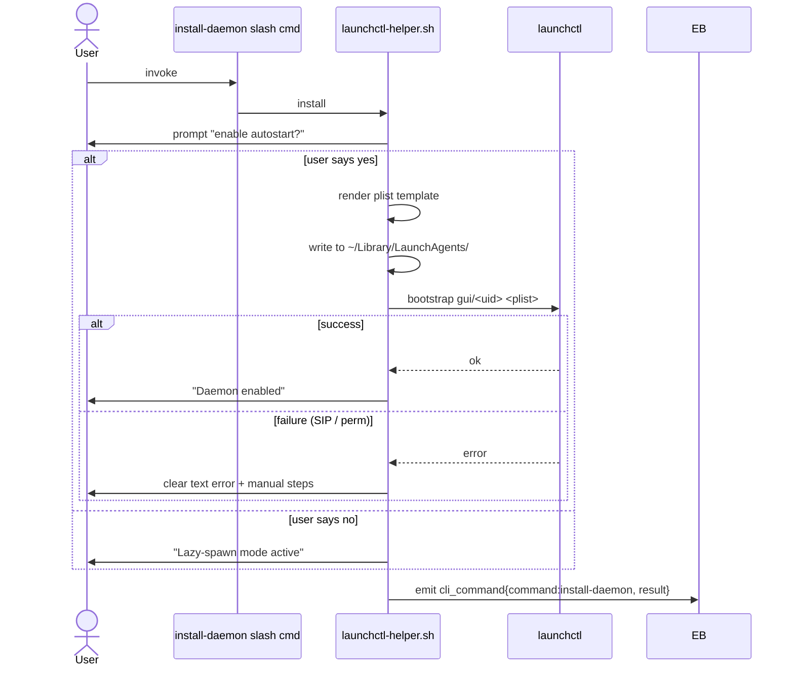
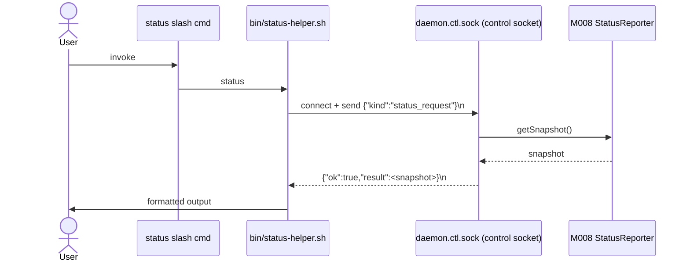

# MODULE-007: deployment

> Status: Draft
> Created: 2026-05-12
> Architecture: [ARCHITECTURE.md](../ARCHITECTURE.md)

---

## Part 1: Requirements

### 1.1 Module Goals & Overview

`deployment` is the install-ceremony module: it provides the launchd plist template, the
CLI subcommands users invoke (slash commands per claude-code SDK), and the advance-kit
plugin format compliance glue (plugin.json + marketplace.json + 3 README synchronization).
It owns the lazy-spawn fallback decision (when user declines launchd takeover) and the
concurrent lazy-spawn race resolution via M001 file lock. **(Slice 2)** It also owns
the daemon-side **control socket** (`<state_dir>/daemon.ctl.sock`) — a separate UDS
distinct from the MCP socket — that handles `status_request` and `reset_admin_request`
frames sent by `bin/status-helper.sh` and `bin/reset-admin-helper.sh`.

deployment is the ONLY module that interacts with system-level `launchctl` and the macOS
`~/Library/LaunchAgents/` directory; daemon-core runtime behavior (M001) is separate.

**Serves PRD topics**:
- `docs/PRD.md` (REQ-012 launchd integration, REQ-026 rollback path, REQ-027 macOS,
  REQ-028 plugin format compliance, REQ-030 namespace)

### 1.2 Architecture Overview

```
┌────────────────────────────────────────────────────────────────────┐
│                       MODULE-007 deployment                         │
│                                                                    │
│  ┌─────────────────────────────┐   ┌─────────────────────────────┐ │
│  │ commands/                   │   │ bin/                         │ │
│  │  install-daemon.md          │   │  launchctl-helper.sh         │ │
│  │  uninstall-daemon.md        │   │  daemon-spawn.sh             │ │
│  │  reset-admin.md             │   │                              │ │
│  │  status.md                  │   │  (shell scripts for system   │ │
│  │  (slash commands per        │   │   interactions; called from  │ │
│  │   claude-code SDK)          │   │   slash-command handlers)    │ │
│  └─────────────────────────────┘   └─────────────────────────────┘ │
│                                                                    │
│  ┌─────────────────────────────────────────────────────────────┐   │
│  │ plist-template (com.advance.telegram-channels-pro.plist)    │   │
│  │  - ProgramArguments: bun /path/to/daemon-main.ts             │   │
│  │  - KeepAlive: true (auto-restart on crash)                  │   │
│  │  - StandardOutPath / StandardErrorPath → ~/Library/Logs      │   │
│  │  - EnvironmentVariables: TELEGRAM_BOT_TOKEN, HOME, PATH      │   │
│  └─────────────────────────────────────────────────────────────┘   │
│                                                                    │
│  ┌─────────────────────────────────────────────────────────────┐   │
│  │ Marketplace integration                                      │   │
│  │  plugins/telegram-channels-pro/.claude-plugin/plugin.json    │   │
│  │  + advance-kit/.claude-plugin/marketplace.json updates       │   │
│  │  + README sync invariant (3 langs)                          │   │
│  └─────────────────────────────────────────────────────────────┘   │
└────────────────────────────────────────────────────────────────────┘
```

### 1.3 Feature Matrix

| Feature | Priority | Status | Description |
|---------|----------|--------|-------------|
| `install-daemon` slash command | P0 | Planned | Writes plist + launchctl bootstrap (with user opt-out prompt) |
| `uninstall-daemon` slash command | P0 | Planned | launchctl bootout + unlinks plist + (optionally) state dir cleanup |
| `reset-admin` slash command | P0 | Planned | Calls M006 CONTRACT-015 + restarts daemon |
| `status` slash command | P0 | Planned | Calls M008 CONTRACT-014 + formats output |
| launchd plist template | P0 | Planned | KeepAlive=true, EnvironmentVariables, log paths |
| Lazy-spawn entry point | P0 | Planned | Invoked by claude-side MCP proxy when daemon socket connect fails |
| Concurrent lazy-spawn race resolution | P0 | Planned | Per Decision A13 + RISK-007; via M001 file lock |
| Plugin format compliance (plugin.json) | P0 | Planned | namespace, version, dependencies; advance-kit VERSIONING.md 5-sync-point |
| Marketplace entry | P0 | Planned | Add to `advance-kit/.claude-plugin/marketplace.json` |
| README sync (3 langs) | P0 | Planned | Add entry to README.md / README.zh-CN.md / README.es.md status tables |
| Rollback documentation | P0 | Planned | `docs/ROLLBACK.md` with triggers + diagnostics |
| `pkill -9 bun` migration assist | P1 | Planned | uninstall warns user about residual processes from prior unclean exits |

### 1.4 Detailed Feature Specifications

#### 1.4.1 install-daemon

**User flow** (slash command `/telegram-channels-pro:install-daemon`):
1. Slash command handler in `commands/install-daemon.md` invokes `bin/launchctl-helper.sh install`.
2. Helper script:
   - Asks user: "Enable open-bot auto-start via launchd? (y/n) — default: y. Choose n to use lazy-spawn fallback."
   - If `n`: exit with note "Lazy-spawn mode active. Daemon will be spawned on first `claude --channels telegram` invocation."
   - If `y`:
     - Render plist template into `~/Library/LaunchAgents/com.advance.telegram-channels-pro.plist` (0644 perms).
     - Run `launchctl bootstrap gui/$(id -u) ~/Library/LaunchAgents/com.advance.telegram-channels-pro.plist`.
     - If `launchctl` exits non-zero (SIP / permission denial): print clear text error with manual steps; do NOT consider the plugin install failed.
     - If success: print "Daemon enabled. To uninstall: `/telegram-channels-pro:uninstall-daemon`".
3. Helper also validates TELEGRAM_BOT_TOKEN env var is set; warns if missing.

**plist template** (rendered from `templates/com.advance.telegram-channels-pro.plist.tmpl` with `{{LABEL}}` / `{{BUN_BIN}}` / `{{DAEMON_BIN}}` / `{{LOG_DIR}}` / `{{TG_TOKEN}}` / `{{HOME_DIR}}` placeholders replaced at install time by `bin/launchctl-helper.sh`):

```xml
<plist version="1.0">
<dict>
  <key>Label</key>
  <string>{{LABEL}}</string>
  <key>ProgramArguments</key>
  <array>
    <string>{{BUN_BIN}}</string>
    <string>{{DAEMON_BIN}}</string>     <!-- resolves to bin/daemon.ts (Bun shebang TS entry, NOT a built dist/ bundle) -->
  </array>
  <key>KeepAlive</key>
  <true/>
  <key>RunAtLoad</key>
  <true/>
  <key>StandardOutPath</key>
  <string>{{LOG_DIR}}/daemon.out</string>
  <key>StandardErrorPath</key>
  <string>{{LOG_DIR}}/daemon.err</string>
  <key>EnvironmentVariables</key>
  <dict>
    <key>TELEGRAM_BOT_TOKEN</key>
    <string>{{TG_TOKEN}}</string>      <!-- captured by install script from current shell env (RISK-001) -->
    <key>HOME</key>
    <string>{{HOME_DIR}}</string>
    <key>PATH</key>
    <string>/usr/local/bin:/usr/bin:/bin:/opt/homebrew/bin</string>
  </dict>
</dict>
</plist>
```

**RISK-001 mitigation**: env var inheritance under launchd is unreliable; the install script
captures the user's current shell env (`printenv TELEGRAM_BOT_TOKEN`) and writes it into the
plist's `EnvironmentVariables` block explicitly. Documented in the install command's user-facing
output.

#### 1.4.2 uninstall-daemon

**User flow**:
1. Helper invokes `launchctl bootout gui/$(id -u) ~/Library/LaunchAgents/com.advance.telegram-channels-pro.plist`.
2. Unlinks the plist file.
3. Prompts: "Also remove state directory `~/Library/Application Support/advance-kit/telegram-channels-pro/`? (y/n) — default: n."
4. If `y`: rm -rf state dir (admin.json, offset.json, attachments, lock file).
5. If `n`: leaves state dir for reinstall recovery.
6. Print "Daemon uninstalled. If you had any orphan `bun` processes, run `pkill -9 bun` to clean up."

#### 1.4.3 reset-admin (Slice 2: in-process re-open, no daemon restart)

**User flow** (Slice 2 design — supersedes the original "kill + KeepAlive restart" flow):
1. Helper opens unix socket connection to daemon (`<state_dir>/daemon.ctl.sock` — the CONTROL socket, not the MCP socket).
2. Sends `{kind: "reset_admin_request"}` (LF-terminated JSON).
3. Daemon-side `ControlSocket` handler:
   - Calls `M006.AdminStateReset.resetAdmin()` — clears admin.json + clears in-memory allowlist + emits `registration_event: admin_reset` with `prior_admin_hash` (audit).
   - Calls `M006.RegistrationGate.forceReopenForReset()` (CONTRACT-010 Slice-2 additive method) — transitions gate to `open` from any prior state, cancels both pending timers (window-timeout + waitForResetReminder), resets brute-force counters, emits `registration_event: window_opened` with `detail: {code_hash, trigger: "admin_reset"}`. Daemon STAYS ALIVE.
   - Returns `{ok: true, result: {cleared, prior_admin_hash, deployment_mode, daemon_pid}}`.
4. Helper inspects `deployment_mode`:
   - `launchd`: prints "Admin state cleared. Daemon continues running with a fresh registration window. Code printed in launchd stderr log; check `~/Library/Logs/advance-kit/telegram-channels-pro/daemon.err`." NO daemon kill.
   - `lazy-spawn`: prints "Admin state cleared. Send any DM to the bot — it will reply with the registration code from the daemon's open log." NO daemon kill.

**Why no daemon restart**: in lazy-spawn mode there is no launchd KeepAlive — killing the daemon would leave it permanently dead until the next claude session triggers a respawn. The in-process `forceReopenForReset` works uniformly across both deployment modes and is unconditionally safer.

#### 1.4.4 status

**User flow** (Slice 2: control socket path):
1. Helper opens unix socket connection to daemon (`<state_dir>/daemon.ctl.sock` — control socket; distinct from MCP socket `daemon.sock`).
2. Sends a `status_request` frame: `{kind: "status_request"}` (LF-terminated JSON).
3. Daemon-side `ControlSocket` handler calls M008 CONTRACT-014 `StatusReporter.getSnapshot()`.
4. Returns the snapshot as `{ok: true, result: <StatusSnapshot>}` (LF-terminated JSON).
5. Helper formats the snapshot as text and prints.

**Why a separate control socket**: the MCP socket (`daemon.sock`) speaks the length-prefixed framing protocol used by claude sessions (M003). Mixing CLI-only one-shot frames into M003's protocol would either expand CONTRACT-006 (M003's surface) with M007-specific concerns or require special-casing inside M003. A separate UDS at `daemon.ctl.sock` keeps M003 transport-pure, owned entirely by M007 (`src/deployment/control-socket.ts`). The control socket uses simpler newline-delimited JSON (no length prefix; one-shot exchanges).

**Output format**:
```
Daemon status
  Uptime:                 4h 23m 14s
  Deployment mode:        launchd
  Polling state:          running
  Last inbound:           00:00:12 ago
  Quarantine:             no
  Registered sessions:    3
  Pending approvals:      1 / 50
  Admin source:           env (or file)
```

#### 1.4.5 Lazy-spawn entry point + race resolution

When claude-side MCP proxy attempts to connect to `daemon.sock` and gets ECONNREFUSED:
1. The proxy invokes `bin/daemon-spawn.sh` (forked).
2. The script `exec`s the daemon binary as a detached child process.
3. The daemon's normal boot sequence (M001) attempts to acquire the lock.
4. If two claude sessions race-spawn:
   - Both daemon processes start.
   - One wins the lock (M001 mechanism); becomes the daemon.
   - The other detects lock-held-by-live → exits 0 with stderr "daemon already running, attaching".
5. The losing daemon's spawn-shell script reports the "attaching" message to its parent claude session (stderr propagation).
6. Both claude proxies then reconnect to the socket (now live, owned by the winner).

#### 1.4.6 Plugin format compliance

`plugins/telegram-channels-pro/.claude-plugin/plugin.json`:

```json
{
  "name": "telegram-channels-pro",
  "version": "0.1.0",
  "description": "Daemon-based Telegram channel plugin for Claude Code...",
  "author": { "name": "Advance Studio" }
}
```

`advance-kit/.claude-plugin/marketplace.json` updated to include the new entry:

```json
{
  "name": "telegram-channels-pro",
  "version": "0.1.0",
  "source": { "type": "path", "path": "plugins/telegram-channels-pro" }
}
```

3 READMEs (README.md, README.zh-CN.md, README.es.md): status table row added:
```
| telegram-channels-pro | 0.1.0 | Daemon-based TG bot ... |
```

Per advance-kit VERSIONING.md 5-sync-point invariant: all 5 places (plugin.json + marketplace.json + 3 READMEs) must agree on version.

#### 1.4.7 Rollback path

`docs/ROLLBACK.md` (newly authored by this module):

- Rollback triggers (3 criteria from PRD §7):
  - (a) 72h soak: ≥1 inbound silent-failure event not auto-healing in 5min
  - (b) Any non-daemon process SIGTERM'd by this plugin
  - (c) ≥3 request_approval "click but no claude receipt" events in 24h
- Diagnostic steps before rollback:
  - `/telegram-channels-pro:status` → save output
  - Capture last 24h logs from `~/Library/Logs/advance-kit/telegram-channels-pro/`
  - Archive both for post-incident review
- Rollback execution:
  1. `/telegram-channels-pro:uninstall-daemon` (says yes to state-dir removal)
  2. Remove plugin entry from `advance-kit/.claude-plugin/marketplace.json`
  3. `claude /reload-plugins`
  4. Install upstream `external_plugins/telegram` per upstream docs
  5. Restart claude sessions
- Version-revert (advance-kit-level): `git revert <plugin-bump-commit>` to drop back to last stable advance-kit plugin version.

### 1.5 Acceptance Criteria

| ID | REQ Source | Contracts | Criterion | Verification |
|----|-----------|-----------|-----------|-------------|
| MODULE-007-AC-01 | REQ-012 | — | `install-daemon` writes plist to `~/Library/LaunchAgents/com.advance.telegram-channels-pro.plist` + runs `launchctl bootstrap` | integration test |
| MODULE-007-AC-02 | REQ-012 | — | User opts out at install prompt → plist NOT written; lazy-spawn fallback documented | integration test |
| MODULE-007-AC-03 | REQ-012 / RISK-005 | — | `launchctl bootstrap` failure → clear text error + manual instructions; plugin install does NOT fail | integration test |
| MODULE-007-AC-04 | REQ-012 / RISK-001 | — | Install captures current shell TELEGRAM_BOT_TOKEN + writes to plist EnvironmentVariables explicitly | unit test |
| MODULE-007-AC-05 | REQ-012 | — | `uninstall-daemon` runs `launchctl bootout` + unlinks plist | integration test |
| MODULE-007-AC-06 | REQ-012 | — | `uninstall-daemon` prompts for state-dir removal; user choice respected | integration test |
| MODULE-007-AC-07 | Decision A11 / CONTRACT-015 | CONTRACT-015 | `reset-admin` invokes M006 resetAdmin + signals daemon stop + relies on launchd KeepAlive restart | integration test |
| MODULE-007-AC-08 | CONTRACT-014 | CONTRACT-014 | `status` opens socket, sends status_request frame, formats response per §1.4.4 | integration test |
| MODULE-007-AC-09 | REQ-012 / RISK-007 | — | Concurrent lazy-spawn: 2 claude sessions both try to spawn daemon; loser detects via M001 lock + exits 0 with "attaching" log; winner serves both | integration test |
| MODULE-007-AC-10 | REQ-028 | — | plugin.json has correct shape (name, version 0.1.0, description, author); namespace = telegram-channels-pro | unit test |
| MODULE-007-AC-11 | REQ-028 | — | marketplace.json has entry matching plugin.json version | unit test |
| MODULE-007-AC-12 | REQ-028 / advance-kit VERSIONING.md | — | All 5 sync points (plugin.json + marketplace.json + 3 READMEs) agree on version | unit test |
| MODULE-007-AC-13 | REQ-026 | — | `docs/ROLLBACK.md` exists; covers 3 triggers + diagnostics + execution steps | doc verification |
| MODULE-007-AC-14 | REQ-030 | — | plist Label is `com.advance.telegram-channels-pro` (distinct from upstream `com.anthropic.telegram` or similar) | unit test |
| MODULE-007-AC-15 | REQ-027 | — | install + uninstall scripts macOS-specific (use `launchctl`); refuse to run on non-macOS with clear error | integration test |
| MODULE-007-AC-16 | RISK-009 | — | plugin.json conforms to claude-code SDK schema at the version used by advance-kit; install validates `version` field exists (peer dep mechanism is NOT a standard claude-code SDK field as of v0.1.0 — RISK-009 mitigation via M0 validation + product-rnd review per upstream minor, not via plugin.json field) | doc verification |
| MODULE-007-AC-17 | RISK-005 | — | After failed bootstrap, lazy-spawn fallback path still works (claude sessions can connect) | integration test |
| MODULE-007-AC-18 | REQ-012 | — | Plist KeepAlive=true; RunAtLoad=true; log paths point to `~/Library/Logs/advance-kit/telegram-channels-pro/` | unit test |

### 1.6 Non-functional Requirements

| Requirement | Target | Measurement |
|-------------|--------|-------------|
| install-daemon end-to-end (interactive prompt + bootstrap) | < 5 sec | E2E test |
| uninstall-daemon (without state-dir removal) | < 2 sec | E2E test |
| status command turnaround | < 500 ms (depends on M008 StatusReporter) | benchmark |
| Plist file size | < 4 KB | static |

### 1.7 Security Requirements

- Plist contents include TELEGRAM_BOT_TOKEN — file should be 0644 (default LaunchAgents perms) since macOS launchd reads it under user uid. **NOTE**: this is a documented same-uid trust exposure (RISK-008 territory: if user grants directory access to a 3rd party, they can read the plist). Mitigation: document in install output, recommend users keep `~/Library/LaunchAgents/` access tight.
- **(Slice 2)** Control socket auth: `daemon.ctl.sock` is chmod 0600 — same-uid trust model identical to the plist. The implementation **hard-fails** the bind if `chmod 0600` returns an error (audit Round 1 fix), so a control socket is NEVER served at default umask perms. A local user with the same uid as the daemon CAN issue `reset_admin_request` over the socket — this is acceptable per the single-user single-machine assumption (REQ-029). Multi-user / multi-uid scenarios are out of scope (PRD OUT-002, v0.3+).
- ControlSocket buffer + idle bounds: 16 KB max input, 10 sec idle timeout per connection (audit Round 1 W1 fix). Frames larger than 16 KB are rejected with `{"ok":false,"error":"input_too_large"}`; idle connections are auto-closed.
- Slash commands are invoked by claude; the bin/*.sh scripts SHOULD validate they're being called from this plugin's context (presence of plugin-specific env or argv signature) before running launchctl operations.
- `pkill -9 bun` migration warning is documentation only; the plugin does NOT auto-execute pkill.

---

## Part 2: Specification

### 2.1 Module Boundary

**IN**:
- launchd plist template + bootstrap/bootout
- CLI slash commands (4 total)
- Lazy-spawn entry point + concurrent race resolution
- Plugin format compliance (plugin.json + marketplace.json + 3 READMEs)
- Rollback documentation authoring
- (Slice 2) Daemon-side **control socket** (`daemon.ctl.sock`) — frame handlers for `status_request` and `reset_admin_request`

**OUT**:
- Daemon runtime behavior → MODULE-001
- Admin state mutation → MODULE-006 (via CONTRACT-015 + CONTRACT-010 forceReopenForReset)
- Status data computation → MODULE-008 (via CONTRACT-014)
- TG transport / MCP transport → MODULE-002 / MODULE-003

### 2.2 Dependencies

#### Upstream

| Module | Doc Link | Required Contract | Dependency Content | Type |
|--------|----------|------------------|-------------------|------|
| MODULE-001 | [MODULE-001](./MODULE-001-daemon-core.md) | CONTRACT-001 | StateDir resolution for plist log paths + daemon binary path | Hard |
| MODULE-001 | [MODULE-001](./MODULE-001-daemon-core.md) | CONTRACT-002 | DeploymentMode for status output | Hard |
| MODULE-006 | [MODULE-006](./MODULE-006-admin-auth.md) | CONTRACT-015 | AdminStateReset for reset-admin CLI | Hard |
| MODULE-008 | [MODULE-008](./MODULE-008-observability.md) | CONTRACT-014 | StatusReporter for status CLI | Hard |

#### Downstream

(none — M007 is CLI ingress, not consumed by daemon runtime modules)

#### External Dependencies

| Dependency | Version | Purpose |
|-----------|---------|---------|
| `launchctl` | macOS-bundled | system service manager |
| `printenv`, `cp`, `rm`, `mkdir` | macOS-bundled | shell ops |
| claude-code plugin SDK | current minor | slash command + bin/ conventions |

### 2.3 Interface Definitions

#### Provided Interfaces

M007 does NOT provide cross-module contracts. Its surface is the user-facing CLI subcommands (slash commands defined in `commands/*.md`).

#### Required External Interfaces

(All listed in §2.2 Upstream Dependencies.)

#### Events/Messages

| Event Name | Trigger | Payload | Consumer |
|---|---|---|---|
| `cli_command` | Each CLI subcommand invocation | `{ command, args_redacted, ts }` | M008 (audit log) |

### 2.4 API Endpoints

(N/A)

### 2.5 Data Models

Plist file (XML), see §1.4.1 template. Lives at `~/Library/LaunchAgents/com.advance.telegram-channels-pro.plist`.

**Control socket frame schemas (Slice 2)** — newline-delimited JSON over UDS at `<state_dir>/daemon.ctl.sock` (perms 0600). One-shot exchanges (single request line + single response line + close):

```jsonc
// REQUEST: status
{"kind":"status_request"}

// RESPONSE: status
{"ok":true,"result":{
  "uptime_seconds": 1234,
  "deployment_mode": "launchd"|"lazy-spawn",
  "polling_state": "running"|"quarantine"|"paused",
  "quarantine_active": false,
  "last_inbound_ts": 1730000000000,
  "registered_sessions": 2,
  "pending_approvals": {"current": 1, "max": <number>},  // max defaults to 50; env-overridable via TGCP_PENDING_CAPACITY
  "admin_source": "env"|"file"|"none"
}}

// REQUEST: reset-admin
{"kind":"reset_admin_request"}

// RESPONSE: reset-admin
{"ok":true,"result":{
  "cleared": true|false,
  "prior_admin_hash": "abc123"|null,
  "deployment_mode": "launchd"|"lazy-spawn",
  "daemon_pid": 12345
}}

// ERROR (any kind):
{"ok":false,"error":"<message>"}
```

**Stale-socket cleanup at boot**: control socket bind path same pattern as MCP socket — `M001.cleanupStaleSocket(stateDir.controlSocketFile)` is called by `src/daemon/main.ts` before `ControlSocket.start()`.

plugin.json + marketplace.json — JSON files governed by claude-code SDK schemas.

### 2.6 Database Functions & RPCs

(N/A)

### 2.7 Core Logic

**install flow** (see §1.4.1 above for narrative). Sequence:



**status flow**:



### 2.8 Error Handling

| Error | Trigger | Handling |
|---|---|---|
| `launchctl bootstrap` non-zero exit | SIP, permission, malformed plist | print error + manual instructions; fallback to lazy-spawn; don't fail plugin install |
| `launchctl bootout` non-zero (daemon already gone) | normal during shutdown | warn, continue (idempotent) |
| daemon.sock connect refused during status | daemon not running | helper reports "daemon not running"; suggest `install-daemon` or check launchd state |
| Concurrent install attempts | rare | second invocation detects existing plist; prompts for overwrite |
| TELEGRAM_BOT_TOKEN env unset at install | env-source path | warn + suggest `launchctl setenv` |

### 2.9 Security Considerations

- Plist 0644 (LaunchAgents standard); contains TG bot token → same-uid trust exposure documented.
- bin/*.sh scripts validate context (e.g., refuse to run if not invoked via plugin's argv pattern).
- Slash command handlers route through the standard claude-code SDK ingress (no special elevation).

### 2.10 Configuration & Environment Variables

| Variable | Required | Default | Description |
|----------|----------|---------|-------------|
| `TELEGRAM_BOT_TOKEN` | Yes (at install) | — | Captured by install script + written to plist; daemon reads at boot |
| `TGCP_PLIST_LABEL` | No | `com.advance.telegram-channels-pro` | Plist label override (testing only) |

### 2.11 Operational Parameters

| Parameter | Value | Description |
|-----------|-------|-------------|
| Plist Label | `com.advance.telegram-channels-pro` | REQ-030 namespace |
| Plist KeepAlive | true | REQ-025 launchd recoverability |
| Plist RunAtLoad | true | start at boot |

### 2.12 State Management

**Owned state surfaces**:

| Surface | Persistence | Owner | Consumers |
|---------|-------------|-------|-----------|
| Plist file | Disk in `~/Library/LaunchAgents/` (0644) | M007 | launchd |
| plugin.json + marketplace.json + 3 READMEs | Disk in advance-kit repo | M007 (authored by /spec; not runtime) | claude-code plugin loader |

### 2.13 Operations

| Symptom | Likely cause | First response | Escalation |
|---------|--------------|----------------|------------|
| install-daemon fails with SIP error | macOS Security restrictions | Print manual `launchctl` command for user to run with elevated permissions if appropriate | RISK-005 |
| Plist not loaded at boot | RunAtLoad=false bug OR plist syntax error | `plutil -lint <plist>` to validate; reinstall | If syntax bug, treat as M007 issue |
| Status CLI hangs | daemon.sock connect timeout | Check daemon alive via `pgrep`; if dead, restart daemon | If repeated: investigate watchdog logs |
| Concurrent lazy-spawn losses observable | RISK-007 cosmetic; not a problem | Check both claude sessions report "attaching" | Inform user this is expected behavior |
| Plugin version drift (sync points out of agreement) | Manual edit without VERSIONING discipline | Run /dev sync-version helper | Block PR until sync |

**Kill switches**: `TGCP_DISABLE_LAUNCHD_INSTALL=1` env forces install prompt to default to "n" (skip launchd).

**Rollback strategy**: see §1.4.7 / docs/ROLLBACK.md.

**Capacity**: install/uninstall are one-shot operations; no concurrency limit.

### 2.14 Observability

| Event | Level | Fields | Sensitive |
|-------|-------|--------|-----------|
| `cli_command` | INFO | command, args (redacted: only command name + nonsensitive args), result, duration_ms | command full argv (redacted) |

**Metrics**: not really applicable; CLI is one-shot per invocation.

**Redaction**: TG bot token in plist log surface (if any error message echoes plist contents).

---

## Part 3: Implementation

### 3.1 Current Status

| Status | Progress | Last Updated |
|--------|----------|--------------|
| Production | 100% | 2026-05-15 |

### 3.2 File Structure

| File | Role |
|------|------|
| `plugins/telegram-channels-pro/.claude-plugin/plugin.json` | Plugin metadata |
| `plugins/telegram-channels-pro/commands/install-daemon.md` | slash command for install |
| `plugins/telegram-channels-pro/commands/uninstall-daemon.md` | slash command for uninstall |
| `plugins/telegram-channels-pro/commands/reset-admin.md` | slash command for admin reset |
| `plugins/telegram-channels-pro/commands/status.md` | slash command for status |
| `plugins/telegram-channels-pro/bin/launchctl-helper.sh` | Install/uninstall + bootstrap/bootout |
| `plugins/telegram-channels-pro/bin/daemon-spawn.sh` | Lazy-spawn entry |
| `plugins/telegram-channels-pro/bin/status-helper.sh` | Connects to control socket + format status |
| `plugins/telegram-channels-pro/bin/reset-admin-helper.sh` | Connects to control socket + branches by deployment_mode (no daemon kill) |
| `plugins/telegram-channels-pro/bin/daemon.ts` | Daemon entry (Bun shebang TS — invoked by launchd via the plist's ProgramArguments AND by lazy-spawn fork). Ships unbuilt; Bun executes the .ts file directly. |
| `plugins/telegram-channels-pro/templates/com.advance.telegram-channels-pro.plist.tmpl` | Plist template |
| **(Slice 2)** `plugins/telegram-channels-pro/src/deployment/control-socket.ts` | Daemon-side ControlSocket: bind UDS + frame dispatch (status / reset_admin) |
| **(Slice 2)** `plugins/telegram-channels-pro/src/deployment/index.ts` | Module entry exports |
| `.claude-plugin/marketplace.json` (advance-kit-level update) | Add telegram-channels-pro entry |
| `README.md` / `README.zh-CN.md` / `README.es.md` (3 files) | Status table row updates |
| `docs/ROLLBACK.md` | Rollback documentation |
| `tests/deployment/*.test.ts` | Per-feature tests (using Bun.spawn for shell tests + net.connect for control socket) |

### 3.3 Test Cases

| ID | Layer | AC | Scenario | Operation | Expected | Priority |
|----|-------|----|----------|-----------|----------|----------|
| MODULE-007-T01 | Integration | AC-01 | install plist + bootstrap | run install-daemon helper | plist file present at 0644; launchctl print plist loaded | P0 |
| MODULE-007-T02 | Integration | AC-02 | install opt-out | answer "n" at prompt | plist NOT written; "lazy-spawn mode" message printed | P0 |
| MODULE-007-T03 | Integration | AC-03 | bootstrap failure | force SIP-like error (mock launchctl to fail) | clear error + manual instructions; plugin install does not error | P0 |
| MODULE-007-T04 | Unit | AC-04 | env var captured | set TELEGRAM_BOT_TOKEN before install | plist contains explicit token value | P0 |
| MODULE-007-T05 | Integration | AC-05 | uninstall path | install + uninstall | launchctl bootout success; plist unlinked | P0 |
| MODULE-007-T06 | Integration | AC-06 | uninstall state-dir prompt | uninstall + answer "y" to state removal | state dir removed | P0 |
| MODULE-007-T07 | Integration | AC-07 | reset-admin via control socket | start ControlSocket; pre-condition gate.state ∈ {"open", "waiting_for_reset", "closed"}; send `{"kind":"reset_admin_request"}` over net.connect to daemon.ctl.sock | response shape `{ok:true, result:{cleared, prior_admin_hash, deployment_mode, daemon_pid}}`; AdminStateReset.resetAdmin invoked; RegistrationGate.forceReopenForReset invoked; gate.state == "open" post-call; admin.json absent; registration_event(window_opened, detail.trigger=="admin_reset") emitted | P0 |
| MODULE-007-T08 | Integration | AC-08 | status command via control socket | start ControlSocket; daemon running with 2 sessions; send `{"kind":"status_request"}` over net.connect to daemon.ctl.sock | response shape `{ok:true, result:<StatusSnapshot>}` matches CONTRACT-014 with all 8 fields; uptime / session count correct | P0 |
| MODULE-007-T09 | Integration | AC-09 | concurrent lazy-spawn | spawn 2 daemon processes simultaneously | one wins lock, one exits 0 "attaching"; both claude proxies connect | P0 |
| MODULE-007-T10 | Unit | AC-10 | plugin.json shape | parse plugin.json | matches expected JSON shape; version 0.1.0; namespace telegram-channels-pro | P0 |
| MODULE-007-T11 | Unit | AC-11 | marketplace.json shape | parse marketplace.json | telegram-channels-pro entry present; version matches plugin.json | P0 |
| MODULE-007-T12 | Unit | AC-12 | 5-sync-point version agreement | grep version across all 5 files | all 5 show 0.1.0 | P0 |
| MODULE-007-T13 | Doc | AC-13 | ROLLBACK.md exists | read docs/ROLLBACK.md | contains 3 triggers, diagnostic steps, execution steps | P0 |
| MODULE-007-T14 | Unit | AC-14 | plist Label | parse plist | Label == com.advance.telegram-channels-pro | P0 |
| MODULE-007-T15 | Integration | AC-15 | non-macOS refuse | run install on Linux (mock) | clear error; exit non-zero | P1 |
| MODULE-007-T16 | Unit | AC-16 | SDK peer dep | parse plugin.json | claude-code-sdk: ">=current minor" present | P1 |
| MODULE-007-T17 | Integration | AC-17 | lazy-spawn after bootstrap fail | mock bootstrap fail; then spawn claude --channels telegram | daemon-spawn.sh runs; daemon comes up; claude connects | P1 |
| MODULE-007-T18 | Unit | AC-18 | plist KeepAlive | parse plist | KeepAlive=true, RunAtLoad=true, log paths under ~/Library/Logs/ | P0 |

### 3.4 Acceptance Criteria Verification

| AC ID | Active | Status | Verified By Task | Date |
|-------|--------|--------|-----------------|------|
| MODULE-007-AC-01 | Y | passed | dev-tgcp-slice-orchestration-2026-05-14-2200e70 | 2026-05-15 |
| MODULE-007-AC-02 | Y | passed | dev-tgcp-slice-orchestration-2026-05-14-2200e70 | 2026-05-15 |
| MODULE-007-AC-03 | Y | passed | dev-tgcp-slice-orchestration-2026-05-14-2200e70 | 2026-05-15 |
| MODULE-007-AC-04 | Y | passed | dev-tgcp-slice-orchestration-2026-05-14-2200e70 | 2026-05-15 |
| MODULE-007-AC-05 | Y | passed | dev-tgcp-slice-orchestration-2026-05-14-2200e70 | 2026-05-15 |
| MODULE-007-AC-06 | Y | passed | dev-tgcp-slice-orchestration-2026-05-14-2200e70 | 2026-05-15 |
| MODULE-007-AC-07 | Y | passed | dev-tgcp-slice-orchestration-2026-05-14-2200e70 | 2026-05-15 |
| MODULE-007-AC-08 | Y | passed | dev-tgcp-slice-orchestration-2026-05-14-2200e70 | 2026-05-15 |
| MODULE-007-AC-09 | Y | passed | dev-tgcp-slice-orchestration-2026-05-14-2200e70 | 2026-05-15 |
| MODULE-007-AC-10 | Y | passed | dev-tgcp-slice-orchestration-2026-05-14-2200e70 | 2026-05-15 |
| MODULE-007-AC-11 | Y | passed | dev-tgcp-slice-orchestration-2026-05-14-2200e70 | 2026-05-15 |
| MODULE-007-AC-12 | Y | passed | dev-tgcp-slice-orchestration-2026-05-14-2200e70 | 2026-05-15 |
| MODULE-007-AC-13 | Y | passed | dev-tgcp-slice-orchestration-2026-05-14-2200e70 | 2026-05-15 |
| MODULE-007-AC-14 | Y | passed | dev-tgcp-slice-orchestration-2026-05-14-2200e70 | 2026-05-15 |
| MODULE-007-AC-15 | Y | passed | dev-tgcp-slice-orchestration-2026-05-14-2200e70 | 2026-05-15 |
| MODULE-007-AC-16 | Y | passed | dev-tgcp-slice-orchestration-2026-05-14-2200e70 | 2026-05-15 |
| MODULE-007-AC-17 | Y | passed | dev-tgcp-slice-orchestration-2026-05-14-2200e70 | 2026-05-15 |
| MODULE-007-AC-18 | Y | passed | dev-tgcp-slice-orchestration-2026-05-14-2200e70 | 2026-05-15 |

### 3.5 Feature Implementation Record

| Feature | Status | Notes |
|---------|--------|-------|
| 4 slash commands + 4 bin helpers | planned | — |
| Plist template + rendering | planned | — |
| Lazy-spawn entry | planned | — |
| Plugin format compliance | planned | — |
| Rollback documentation | planned | — |

### 3.6 Known Gaps & Future Work

- macOS-only by design (REQ-027); Linux systemd + Windows Service v0.3+.
- Plist 0644 means same-uid trust exposure for bot token; cert-pinning or vault integration v0.3+.

### 3.7 Change History

| Date | Change |
|------|--------|
| 2026-05-12 | Initial creation |
| 2026-05-15 | /dev Slice 2 begins: 4 slash commands + 4 bin/ helpers + plist template + ROLLBACK.md authored; daemon-side ControlSocket added at `src/deployment/control-socket.ts` (separate UDS at `daemon.ctl.sock`, distinct from MCP socket); reset-admin path rewritten — no daemon kill in either deployment mode (in-process forceReopenForReset via CONTRACT-010) |

### 3.8 Implementation Notes

| Decision | Rationale | Alternatives | Trade-off |
|----------|-----------|--------------|-----------|
| launchctl wrapper in shell (not TS) | bash is universal on macOS; no Bun deps required for install ceremony | TS scripts | shell is more brittle but install-time only |
| Plist 0644 (not 0600) | macOS launchd reads plists under user uid; restrictive perms may break load | 0600 | follow macOS conventions; accept same-uid trust exposure (RISK-008 territory; documented) |
| Lazy-spawn via shell fork (not TS spawnSync) | Decoupled from claude session lifecycle; daemon survives claude exit | TS spawnSync | shell-fork is the launchd-compatible pattern |
| reset-admin signals daemon stop (not direct kill) | KeepAlive handles restart; clean shutdown preserves pending offset.json flush | SIGKILL | clean is safer; KeepAlive auto-recovers — **superseded in Slice 2 by in-process forceReopenForReset (no daemon kill at all)** |
| **(Slice 2)** Reset-admin via in-process forceReopenForReset, NOT daemon kill | Lazy-spawn mode has no KeepAlive; killing daemon leaves it dead until next claude spawn. In-process re-open works in both deployment modes; uniformly safer | Branch on deployment_mode and kill only in launchd | Branching adds error-prone two-mode logic; in-process re-open is cleaner |
| **(Slice 2)** Separate control socket (daemon.ctl.sock) for CLI ingress, NOT extending CONTRACT-006 MCPTransport | Keeps M003 transport-pure for claude sessions; isolates CLI-only frame protocols from MCP protocol; M007 owns the new socket end-to-end | Add status_request / reset_admin_request to CONTRACT-006 | Mixing CLI frames into M003 would expand a contract whose only consumer is M004; cross-cutting CLI concerns belong in M007 |
| **(Slice 2)** Control socket uses LF-delimited JSON (not length-prefixed framing) | One-shot exchanges (single request + single response + close); length prefix overkill for CLI use | Reuse M003 framing | Simpler implementation; no shared codec dependency |
| plugin.json + marketplace.json + 3 READMEs as 5 sync points | advance-kit VERSIONING.md invariant; auto-validatable via grep tests | central version source | 5 places is the established convention |
