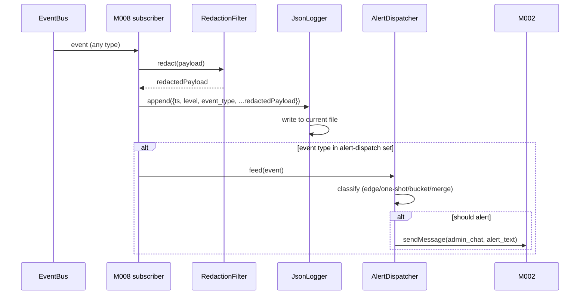
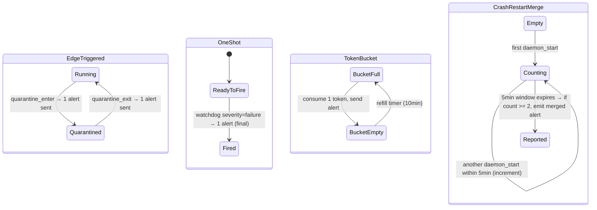

# MODULE-008: observability

> Status: Draft
> Created: 2026-05-12
> Architecture: [ARCHITECTURE.md](../ARCHITECTURE.md)

---

## Part 1: Requirements

### 1.1 Module Goals & Overview

`observability` is the EventBus-driven log + alert + status subsystem. It subscribes to ALL
event types published in CONTRACT-003, writes structured JSON logs to disk (with redaction
enforcement), dispatches TG alerts (with 3 dedup strategies per Decision A5), and serves
the `status` CLI subcommand via CONTRACT-014 StatusReporter. It uses CONTRACT-004
(TelegramAPIClient) from M002 to deliver alerts as TG messages.

Per Decision A12, no module calls M008 directly except M007 (for status CLI). All other
modules emit `log_emit` / `alert_emit` events to EventBus; M008 subscribes and dispatches.

**Serves PRD topics**:
- `docs/PRD.md` (REQ-023 observability/structured-logs/redaction/status, REQ-024 alerting
  edge-triggered semantics, REQ-021 measurement script for resource budget)

### 1.2 Architecture Overview

```
┌────────────────────────────────────────────────────────────────────┐
│                       MODULE-008 observability                      │
│                                                                    │
│  ┌─────────────────────────────┐   ┌────────────────────────────┐  │
│  │ EventBus Subscriber         │   │ RedactionFilter            │  │
│  │ (all event types)           │──►│ - bot_token                │  │
│  │                             │   │ - tg_user_id (hash only)   │  │
│  │                             │   │ - DM text + tool params    │  │
│  │                             │   │ - project_path             │  │
│  │                             │   │ - registration code        │  │
│  └─────────────────────────────┘   └────────────────────────────┘  │
│           │                                                        │
│           ▼                                                        │
│  ┌──────────────────────────┐   ┌──────────────────────────────┐   │
│  │ JsonLogger               │   │ AlertDispatcher              │   │
│  │ - file-rolled (size+date)│   │ - state-change (edge-trig)   │   │
│  │ - 0600 perms             │   │ - one-shot (terminal events) │   │
│  │ - structured fields      │   │ - token-bucket (rate-limited)│   │
│  └──────────────────────────┘   │ - crash-restart merge window │   │
│                                 │ - uses CONTRACT-004 send     │   │
│                                 └──────────────────────────────┘   │
│                                                                    │
│  ┌─────────────────────────────────────────────────────────────┐   │
│  │ StatusReporter (CONTRACT-014)                                │   │
│  │ - cache: latest polling_status_snapshot, pending_capacity_   │   │
│  │   snapshot, daemon_start (uptime base), session counts       │   │
│  │ - getSnapshot() → redacted summary for status CLI            │   │
│  └─────────────────────────────────────────────────────────────┘   │
│                                                                    │
│  ┌─────────────────────────────────────────────────────────────┐   │
│  │ MeasurementHelper (REQ-021 stationary RSS / CPU script)     │   │
│  │ - emits log_emit per 30s sample; gates via "no tool_call    │   │
│  │   in last 60s" check                                        │   │
│  └─────────────────────────────────────────────────────────────┘   │
└────────────────────────────────────────────────────────────────────┘
```

### 1.3 Feature Matrix

| Feature | Priority | Status | Description |
|---------|----------|--------|-------------|
| Subscribe to ALL CONTRACT-003 event types | P0 | Planned | Per Decision A12 |
| Structured JSON log writer | P0 | Planned | REQ-023; file-rolled by date + size |
| Redaction filter | P0 | Planned | 5 redaction classes (PRD §5) |
| AlertDispatcher: state-change edge-triggered (quarantine) | P0 | Planned | Decision A5 |
| AlertDispatcher: one-shot terminal (watchdog fatal) | P0 | Planned | Decision A5 |
| AlertDispatcher: token-bucket rate-limited (auth_deny) | P0 | Planned | Decision A5 |
| Crash-restart merge window | P0 | Planned | Decision A5; 30s-10min, default 5min |
| StatusReporter (CONTRACT-014) | P0 | Planned | for M007 status CLI |
| Log rotation (file roll) | P1 | Planned | 14-day retention, size-cap per file |
| Measurement helper for REQ-021 stationary sample | P1 | Planned | gates samples by "no active tool_call within 60s" window |

### 1.4 Detailed Feature Specifications

#### 1.4.1 EventBus subscription + Logger

**Subscription pattern**:
M008 subscribes to ALL CONTRACT-003 event types via a wildcard pattern (or via
`bus.on(['inbound_update', 'tool_call', 'quarantine_enter', ...etc], handler)`).

On each event:
1. Apply redaction filter (next section).
2. Determine log level (per event-type catalog in respective module docs).
3. Append JSON line to log file: `{ts, level, event_type, fields...}`.
4. If event type is in alerter dispatch set (quarantine_*, watchdog_signal severity=failure, auth_deny_*, daemon_start (for crash-restart merge)) → also feed to AlertDispatcher.

#### 1.4.2 RedactionFilter

5 classes per PRD §5:

```ts
const REDACT = {
  bot_token: /bot[0-9]+:[A-Za-z0-9_-]+/g,          // → "bot[REDACTED]"
  tg_user_id: 'hash',                              // sha256(uid).slice(0, 12)
  dm_text: 'fingerprint',                          // hash + length
  project_path: 'first-segment-and-leaf',          // /usr/local/foo/bar/baz → "/usr/.../baz"
  registration_code: /\b[23456789ABCDEFGHJKLMNPQRSTUVWXYZ]{6}\b/g, // → "code[REDACTED]"
};

function redact(eventPayload: any): any {
  // Deep-walk; substitute matching fields
  // Returns a new object with redacted values
}
```

Applied BEFORE serialization to log file. Pre-emptive: if a future event type carries a token-like substring inadvertently, redaction catches via regex.

#### 1.4.3 JsonLogger

Write to `<log_dir>/daemon-YYYYMMDD.jsonl` (0600 perms; log dir is 0700 per ARCHITECTURE §11.3):

- One JSON object per line.
- Rotate when file size > 50 MB OR date changes (whichever first).
- Retention: 14 days (older files unlinked by a janitor that runs daily, same pattern as M004 attachment janitor).
- Open file descriptor cached; reopens on date roll (mid-write detection via timestamp comparison every 60s).

#### 1.4.4 AlertDispatcher: 3 categories (Decision A5)

**(a) State-change edge-triggered** (quarantine_enter / quarantine_exit):
- Maintain in-memory state machine `running ↔ quarantine`.
- On `quarantine_enter` event: emit ONE alert → call M002.sendMessage to admin chat with text "Daemon entered quarantine: <reason>".
- On `quarantine_exit`: emit ONE alert → "Daemon exited quarantine, recovered after <ms>ms".
- During quarantine: NO repeat alerts even if `polling_event: conflict_409` etc. flood.

**(b) One-shot terminal** (watchdog_signal severity=failure):
- On receipt: emit ONE alert with topic + detail.
- Subscribe also to `daemon_stop` to ensure the alert is flushed before exit (synchronous send if possible; else best-effort with timeout 1s).

**(c) Token-bucket rate-limited** (auth_deny_routing, auth_deny_registration):
- Per-key bucket (key = `${event_type}:${sender_hash}` for routing; `${event_type}` global for registration since per-sender already throttled at M006).
- 1 token per 10-min window per key (Decision A5 spec).
- On event: try to consume; if available → send alert; else log only.

**(d) Crash-restart merge window**:
- Track `daemon_start` events with their timestamps.
- If new `daemon_start` arrives within 5min (default; tunable 30s-10min) of previous → MERGE.
- Maintain a per-window counter; at the end of 5min, emit ONE "daemon crash-restarted N times in 5min" alert if N >= 2.
- Single isolated `daemon_start` (no merge): emit "daemon started" INFO log only; NO alert (avoid noise on normal launchd startup).

#### 1.4.5 StatusReporter (CONTRACT-014)

Maintains an in-memory cache of recent snapshot events:

```ts
interface StatusSnapshot {
  uptime_seconds: number;
  deployment_mode: 'launchd' | 'lazy-spawn';
  polling_state: 'running' | 'quarantine' | 'paused';
  quarantine_active: boolean;
  last_inbound_ts: number | null;
  registered_sessions: number;
  pending_approvals: { current: number; max: 50 };
  admin_source: 'env' | 'file' | 'none';
}
```

Sources:
- `daemon_start` event → uptime base
- `polling_status_snapshot` event → polling state, last_inbound_ts
- `session_connected` / `session_disconnected` events → session count
- `pending_capacity_snapshot` event → pending count
- `registration_event: skipped_env/skipped_file/admin_registered` → admin_source
- CONTRACT-002 query at boot → deployment_mode

`getSnapshot()`: applies redaction (admin user_id never exposed; only redacted "admin_source" enum), returns the struct.

#### 1.4.6 Measurement helper for REQ-021

A background helper runs the stationary RSS / CPU measurement protocol:
1. Subscribes to `tool_call` / `pending_capacity_snapshot` events.
2. Tracks `last_tool_call_ts` and `current_pending`.
3. Every 30s, checks "stationary" condition: `now - last_tool_call_ts > 60s` AND `current_pending === 0`.
4. If stationary: sample `ps -o rss=,%cpu= -p <daemon_pid>` and log via `log_emit` event with kind=`stationary_sample`.
5. Else: skip this 30s tick.

After ≥120 stationary samples, an aggregation log entry can be emitted for the soak test verification (M001-AC-16).

### 1.5 Acceptance Criteria

| ID | REQ Source | Contracts | Criterion | Verification |
|----|-----------|-----------|-----------|-------------|
| MODULE-008-AC-01 | REQ-023 / Decision A12 | CONTRACT-003 | M008 subscribes to ALL canonical event types; emits a log_emit-side log for each | unit test |
| MODULE-008-AC-02 | REQ-023 | CONTRACT-001 | Log file path is `<log_dir>/daemon-YYYYMMDD.jsonl`; perms 0600 | unit test |
| MODULE-008-AC-03 | REQ-023 | — | Log file rotates on size > 50 MB OR date change | integration test |
| MODULE-008-AC-04 | REQ-023 / PRD §5 | — | Redaction filter substitutes bot_token in any log field; output has "bot[REDACTED]" | unit test |
| MODULE-008-AC-05 | REQ-023 / PRD §5 | — | TG user_id appears as 12-char SHA256 hex prefix in all logs | unit test |
| MODULE-008-AC-06 | REQ-023 / PRD §5 | — | DM text + tool params logged as `{hash, length}`, NOT the raw content | unit test |
| MODULE-008-AC-07 | REQ-023 / PRD §5 | — | project_path logged as `/<first>/.../<leaf>`, hiding interior segments | unit test |
| MODULE-008-AC-08 | REQ-023 / PRD §5 | — | Registration code (6-char alnum) substituted with "code[REDACTED]" via regex | unit test |
| MODULE-008-AC-09 | REQ-024 / Decision A5 | CONTRACT-004 | quarantine_enter → ONE alert via sendMessage; quarantine_exit → ONE alert; no repeats during quarantine | integration test |
| MODULE-008-AC-10 | REQ-024 / Decision A5 | CONTRACT-004 | watchdog_signal severity=failure → ONE alert; flushed before daemon_stop | integration test |
| MODULE-008-AC-11 | REQ-024 / Decision A5 | CONTRACT-004 | auth_deny_routing rate-limited: per `(event_type, sender_hash)` 1 alert per 10min | unit test |
| MODULE-008-AC-12 | REQ-024 / Decision A5 | CONTRACT-004 | Crash-restart merge: ≥2 daemon_start events within 5min → ONE merged alert; single start → INFO log only (no alert) | integration test |
| MODULE-008-AC-13 | REQ-023 / CONTRACT-014 | CONTRACT-014 | StatusReporter.getSnapshot() returns redacted struct with all fields populated (or null where unknown) | unit test |
| MODULE-008-AC-14 | CONTRACT-014 | CONTRACT-014 | M007 status CLI receives snapshot via socket; output matches §1.4.4 template | integration test |
| MODULE-008-AC-15 | REQ-021 | CONTRACT-003 | Measurement helper samples ps RSS/CPU only when "stationary" (no tool_call for 60s AND 0 pending) | integration test |
| MODULE-008-AC-16 | RISK-013 | CONTRACT-003 | subscriber_queue_drop event published to all subscribers (including M008) → WARN log | unit test |
| MODULE-008-AC-17 | REQ-023 | — | Log files older than 14 days unlinked by daily janitor | integration test |
| MODULE-008-AC-18 | RISK-008 | CONTRACT-001 | Log directory 0700; log files 0600 (cross-uid mitigation under same-uid trust boundary) | unit test |
| MODULE-008-AC-19 | REQ-024 / Decision A5 | — | Alert that fails to deliver (M002 returns disconnected during quarantine) → logged with kind=`alert_delivery_failed`; no crash | unit test |

### 1.6 Non-functional Requirements

| Requirement | Target | Measurement |
|-------------|--------|-------------|
| Log write throughput | ≥10k events/sec sustained | benchmark |
| Log write latency P99 | < 10 ms (file append) | benchmark |
| StatusReporter snapshot read | < 5 ms (cache only; no IO) | benchmark |
| Subscribe handler overhead | < 1 ms per event | benchmark |

### 1.7 Security Requirements

- Log dir 0700; log files 0600 (RISK-008 mitigation under same-uid trust).
- All 5 redaction classes enforced at write boundary (NOT at event emission, where redaction is opt-in).
- Bot token never appears as raw value in logs OR alerts (alert messages also pass through redactor).
- Registration code redacted by regex pattern even if a future event type accidentally includes it (defense in depth).

---

## Part 2: Specification

### 2.1 Module Boundary

**IN**:
- EventBus subscriber for all CONTRACT-003 event types
- Structured JSON log writer + rotation
- Redaction filter (5 classes)
- Alert dispatcher (3 categories + crash-restart merge)
- StatusReporter (CONTRACT-014)
- Measurement helper for REQ-021

**OUT**:
- TG HTTP API (M002 — used via CONTRACT-004 for alert delivery; not owned)
- CLI subcommands (M007 — calls into M008 via CONTRACT-014)
- Daemon lifecycle (M001)

### 2.2 Dependencies

#### Upstream

| Module | Doc Link | Required Contract | Dependency Content | Type |
|--------|----------|------------------|-------------------|------|
| MODULE-001 | [MODULE-001](./MODULE-001-daemon-core.md) | CONTRACT-001 | StateDir (log dir) | Hard |
| MODULE-001 | [MODULE-001](./MODULE-001-daemon-core.md) | CONTRACT-002 | DeploymentMode (status output) | Hard |
| MODULE-001 | [MODULE-001](./MODULE-001-daemon-core.md) | CONTRACT-003 | EventBus sub all event types | Hard |
| MODULE-002 | [MODULE-002](./MODULE-002-telegram-client.md) | CONTRACT-004 | sendMessage for alert delivery | Hard |
| MODULE-002 | [MODULE-002](./MODULE-002-telegram-client.md) | CONTRACT-005 | (not directly — receives snapshot via EventBus polling_status_snapshot events) | (via events) |

#### Downstream

| Module | Doc Link | Dependency Content |
|--------|----------|--------------------|
| MODULE-007 deployment | [MODULE-007](./MODULE-007-deployment.md) | CONTRACT-014 StatusReporter (status CLI) |

#### External Dependencies

| Dependency | Version | Purpose |
|-----------|---------|---------|
| `crypto` (Bun built-in) | bundled | SHA256 for tg_user_id hashing in redaction |
| `Bun.file().writer()` | ≥1.1 | log file append |
| macOS `ps` binary | system | RSS/CPU sampling for measurement helper |

### 2.3 Interface Definitions

#### Provided Interfaces

| Contract ID | Interface | Source Files | Description |
|-------------|-----------|--------------|-------------|
| CONTRACT-014 | StatusReporter | `src/obs/status-reporter.ts` | Synchronous read of cached state |

```ts
export interface StatusReporter {
  getSnapshot(): StatusSnapshot;
}
export interface StatusSnapshot {
  uptime_seconds: number;
  deployment_mode: 'launchd' | 'lazy-spawn';
  polling_state: 'running' | 'quarantine' | 'paused';
  quarantine_active: boolean;
  last_inbound_ts: number | null;
  registered_sessions: number;
  pending_approvals: { current: number; max: 50 };
  admin_source: 'env' | 'file' | 'none';
}
```

#### Required External Interfaces

| Required Contract | Provider | Used For |
|---|---|---|
| CONTRACT-001 StateDir | M001 | log dir resolution |
| CONTRACT-002 DeploymentMode | M001 | status output |
| CONTRACT-003 EventBus | M001 | sub all event types |
| CONTRACT-004 TelegramAPIClient | M002 | sendMessage for alert delivery |

#### Events/Messages

**Published**:

| Event | Trigger | Payload | Consumer |
|---|---|---|---|
| `log_emit` (self) | when M008 writes a log line that itself originates an event (rare; mostly an introspection mechanism for testing the redaction pipeline) | structured fields | — (mostly diagnostic) |

**Subscribed**: all CONTRACT-003 event types (the canonical catalog in ARCHITECTURE §6.1 CONTRACT-003).

### 2.4 API Endpoints

(N/A — CONTRACT-014 is in-process)

### 2.5 Data Models

Log file: append-only JSON Lines. Each line:

```json
{
  "ts": 1715600000123,
  "level": "INFO" | "DEBUG" | "WARN" | "ERROR",
  "event_type": "inbound_update",
  "session_id": "...",
  "request_id": "...",
  "error_class": "...",
  "...other fields...": "..."
}
```

File: `<log_dir>/daemon-20260512.jsonl` (rotated by date; size cap 50 MB rolls to `-<n>.jsonl` suffix).

StatusReporter cache: in-process, populated from subscribed events.

### 2.6 Database Functions & RPCs

(N/A)

### 2.7 Core Logic

**Log dispatch FSM** per event:



**Alert dispatch FSM**:



### 2.8 Error Handling

| Error | Trigger | Handling |
|---|---|---|
| Log file write failure (disk full / perms) | OS error | print to stderr; do NOT crash daemon; emit `alert_emit: log_write_failed` for next-tier escalation |
| Alert delivery failure (M002 quarantine) | sendMessage returns disconnected/queued | log `alert_delivery_failed`; do NOT retry (would amplify spam) |
| Subscriber overflow (queue full) | high event rate | drop oldest event in subscriber queue per M001 RISK-013 mitigation; emit `subscriber_queue_drop` event (which we also subscribe to and log) |
| StatusReporter snapshot before any events received | early boot | return snapshot with `last_inbound_ts: null`, `registered_sessions: 0`, etc. (sensible defaults) |
| Log file rotation race (mid-write across date boundary) | rare | open new file; flush old buffered writes to old file before reopening |

### 2.9 Security Considerations

- Redaction applied at WRITE boundary — single point of enforcement.
- Log dir 0700 + files 0600 (cross-uid log access denied; same-uid trusted per PRD §8).
- Registration code regex-redacted defensively even though M006 already redacts at emission.
- Alert messages also passed through redactor before sendMessage (defense in depth).

### 2.10 Configuration & Environment Variables

| Variable | Required | Default | Description |
|----------|----------|---------|-------------|
| `TGCP_LOG_DIR` | No | `~/Library/Logs/advance-kit/telegram-channels-pro/` | Log dir override (testing) |
| `TGCP_LOG_MAX_FILE_MB` | No | 50 | Per-file size cap |
| `TGCP_LOG_RETENTION_DAYS` | No | 14 | Daily janitor cutoff |
| `TGCP_ALERT_TOKEN_BUCKET_MIN` | No | 10 | Token-bucket refill interval for auth_deny |
| `TGCP_CRASH_MERGE_WINDOW_MIN` | No | 5 | Crash-restart merge window (PRD §8 bound 30s-10min) |
| `TGCP_STATIONARY_QUIET_SECONDS` | No | 60 | Stationary measurement quiet period |

### 2.11 Operational Parameters

| Parameter | Value | Description |
|-----------|-------|-------------|
| Log rotation file size cap | 50 MB | NFR |
| Log retention | 14 days | NFR |
| auth_deny rate-limit | 1 alert per 10min per key | Decision A5 |
| Crash-restart merge | 5min (30s-10min range) | Decision A5 + PRD §8 bound |
| Stationary quiet | 60s | REQ-021 measurement protocol |
| Stationary sample cadence | 30s | REQ-021 measurement protocol |

### 2.12 State Management

**Owned state surfaces**:

| Surface | Persistence | Owner | Consumers |
|---------|-------------|-------|-----------|
| Log files (daemon-YYYYMMDD.jsonl) | Disk (0600), 14-day retention | M008 | external (operators) |
| StatusReporter cache | Process | M008 | M007 via CONTRACT-014 |
| AlertDispatcher state machines (3 categories + merge window) | Process | M008 | (internal) |
| Token-bucket state (per-key counters) | Process | M008 | (internal) |
| Measurement helper sample buffer | Process | M008 | (logged out periodically) |

**Cross-module state protocol**: M008 is purely a subscriber; it does NOT mutate other modules' state. Outbound interactions: sendMessage (CONTRACT-004) for alerts. CONTRACT-014 read calls from M007.

### 2.13 Operations

**Health & monitoring**: M008 is the health surfacer; it doesn't have its own.

**Common failures & runbook**:

| Symptom | Likely cause | First response | Escalation |
|---------|--------------|----------------|------------|
| `log_write_failed` events | disk full | cleanup attachments + old logs; check disk | If sustained: check janitor logs |
| Alerts flooding TG | dedup logic broken OR genuinely many alerts | Check alert categories triggering; review Decision A5 dedup state | If alerting itself buggy: disable via env (kill switch below) |
| status CLI returns stale data | StatusReporter cache not updating | Check event subscription health; restart daemon | Investigate subscriber_queue_drop |
| Logs missing expected events | redaction over-aggressive OR subscription gap | Compare event_type catalog (ARCHITECTURE §6.1 CONTRACT-003) with M008 subscription list | Add missing event type to subscription |

**Kill switches**:
- `TGCP_DISABLE_ALERTS=1`: AlertDispatcher logs only, no TG sendMessage.
- `TGCP_DISABLE_LOG_ROTATION=1`: keeps single log file (testing convenience).

**Rollback strategy**: replace binary; logs forward-compatible (JSONL with arbitrary schema growth).

**Capacity**:
- Sustained ~10k events/sec write throughput.
- StatusReporter cache: trivial memory (≤1 KB per snapshot field).

### 2.14 Observability

(M008 IS the observability module — meta-observability is just normal logging on its own events.)

**Self-logged events**:

| Event | Level | Fields |
|---|---|---|
| `log_write_failed` | ERROR | os_error, file_path |
| `alert_delivery_failed` | WARN | event_type, m002_error |
| `subscriber_queue_drop` (as a subscriber of its own observation) | WARN | event_type, drop_count |
| `stationary_sample` | DEBUG | rss_kb, cpu_pct, ts |
| `log_rotation` | INFO | old_file, new_file |
| `log_retention_unlink` | INFO | unlinked_count, oldest_date |

**Metrics derived**:
- `events_per_second` (rate of event ingestion by event_type)
- `alert_count_per_category` (counter)
- `log_write_latency_p99` (histogram)
- `stationary_sample_count` (counter)

**Redaction list** (the 5 classes):
1. bot_token → `bot[REDACTED]`
2. tg_user_id → SHA256 12-char hex prefix
3. DM text + tool params → `{hash, length}`
4. project_path → `/<first>/.../<leaf>`
5. registration code → `code[REDACTED]`

**Retention**: 14 days (configurable).

---

## Part 3: Implementation

### 3.1 Current Status

| Status | Progress | Last Updated |
|--------|----------|--------------|
| Not Started | 0% | 2026-05-12 |

### 3.2 File Structure

| File | Role |
|------|------|
| `src/obs/subscriber.ts` | EventBus wildcard subscriber |
| `src/obs/redaction.ts` | RedactionFilter implementation |
| `src/obs/json-logger.ts` | JsonLogger + file rotation + retention janitor |
| `src/obs/alert-dispatcher.ts` | 3-category alert + crash-restart merge |
| `src/obs/status-reporter.ts` | CONTRACT-014 + event-cache |
| `src/obs/measurement-helper.ts` | REQ-021 stationary sampler |
| `src/obs/event-handlers/` | One file per event type |
| `tests/obs/*.test.ts` | Unit + integration |

### 3.3 Test Cases

| ID | Layer | AC | Scenario | Operation | Expected | Priority |
|----|-------|----|----------|-----------|----------|----------|
| MODULE-008-T01 | Unit | AC-01 | subscribe all event types | emit each canonical type | log line per type | P0 |
| MODULE-008-T02 | Unit | AC-02 | log file path + perms | observe write | path matches; perms 0600 | P0 |
| MODULE-008-T03 | Integration | AC-03 | rotation size 50MB | fill log to 50MB | new file created with -1 suffix | P1 |
| MODULE-008-T04 | Unit | AC-04 | bot_token redaction | log event with payload containing bot token string | output substituted with bot[REDACTED] | P0 |
| MODULE-008-T05 | Unit | AC-05 | tg_user_id hash | log event with user_id=12345 | output contains 12-char hex (not 12345) | P0 |
| MODULE-008-T06 | Unit | AC-06 | DM text fingerprint | log event with message_text="secret" | output `{hash, length:6}` | P0 |
| MODULE-008-T07 | Unit | AC-07 | project_path redaction | log event with path="/u/me/Work/secret-project/src" | output "/u/.../src" | P0 |
| MODULE-008-T08 | Unit | AC-08 | reg code redaction | log event with "code=ABCDEF" | output "code=code[REDACTED]" | P0 |
| MODULE-008-T09 | Integration | AC-09 | edge-triggered quarantine alerts | emit quarantine_enter then conflict_409 ×10 then quarantine_exit | exactly 2 sendMessage calls (enter + exit) | P0 |
| MODULE-008-T10 | Integration | AC-10 | one-shot watchdog | emit watchdog_signal severity=failure | 1 sendMessage; flushed within 1s | P0 |
| MODULE-008-T11 | Unit | AC-11 | token-bucket auth_deny | emit auth_deny_routing for same sender 5 times within 10min | 1 sendMessage (first); rest log-only | P0 |
| MODULE-008-T12 | Integration | AC-12 | crash-restart merge | emit 3 daemon_start within 4min | 1 merged alert after 5min window expires | P1 |
| MODULE-008-T13 | Unit | AC-13 | StatusReporter snapshot | populate cache via events; call getSnapshot | all fields populated | P0 |
| MODULE-008-T14 | Integration | AC-14 | status CLI delivery | M007 invokes /status; daemon responds | output matches §1.4.4 template | P0 |
| MODULE-008-T15 | Integration | AC-15 | stationary measurement | active tool_call, then idle 60s, sample | first 30s ticks skipped; after 60s + 30s, sample taken | P1 |
| MODULE-008-T16 | Unit | AC-16 | subscriber_queue_drop logging | emit subscriber_queue_drop event | WARN log line | P1 |
| MODULE-008-T17 | Integration | AC-17 | retention janitor | create old log files; run janitor | files older than 14 days unlinked | P1 |
| MODULE-008-T18 | Unit | AC-18 | dir/file perms | stat log dir + files | dir 0700, files 0600 | P0 |
| MODULE-008-T19 | Unit | AC-19 | alert delivery failure | mock M002 disconnected | alert_delivery_failed logged; no crash | P1 |

### 3.4 Acceptance Criteria Verification

| AC ID | Active | Status | Verified By Task | Date |
|-------|--------|--------|-----------------|------|
| MODULE-008-AC-01 through AC-19 | Y | untested | — | — |

### 3.5 Feature Implementation Record

| Feature | Status | Notes |
|---------|--------|-------|
| Subscriber + Logger + Redaction | in-progress | /dev Slice B (2026-05-14) — wildcard subscriber with late-binding setter pattern (subscribes before stateDir/tgClient ready) |
| AlertDispatcher 3 categories | in-progress | /dev Slice B (2026-05-14) — edge / one-shot / token-bucket |
| Crash-restart merge | in-progress | /dev Slice B (2026-05-14) — 5min default window |
| StatusReporter | in-progress | /dev Slice B (2026-05-14) — CONTRACT-014; status CLI delivery (AC-14) tracked outside this slice (needs M007) |
| Measurement helper | in-progress | /dev Slice B (2026-05-14) — passive subscriber to tool_call (M004 not in slice → trivially stationary) |
| Retention janitor | in-progress | /dev Slice B (2026-05-14) — 14-day file roll-off |
| drainAlertsToLogOnly (token-missing exit) | in-progress | /dev Slice B (2026-05-14) — boot-error exit-1 path drains queued alerts to JSONL with delivery='aborted' |

### 3.6 Known Gaps & Future Work

- Log shipping to external sink (e.g., Datadog, OpenTelemetry) — v0.3+; current is local-only.
- Metrics export (Prometheus etc.) — v0.3+; M008 derives metrics in-process for status CLI.
- Alert deduplication state is in-memory only; crash forgets recent alert history (acceptable for v0.2 — alerts are eventually consistent).

### 3.7 Change History

| Date | Change |
|------|--------|
| 2026-05-12 | Initial creation |
| 2026-05-14 | /dev Slice B begins: observability subsystem (subscriber, redaction, JSON logger, alert dispatcher with 3 categories + crash-restart merge, StatusReporter, measurement helper, retention janitor) under `plugins/telegram-channels-pro/`. Adds `drainAlertsToLogOnly` exit-path helper for boot-error paths that exit before tgClient is ready. |

### 3.8 Implementation Notes

| Decision | Rationale | Alternatives | Trade-off |
|----------|-----------|--------------|-----------|
| EventBus subscriber pattern (not direct call) | Decision A12 — eliminates M008's reverse dep edges; pub/sub is the unidirectional decoupler | direct Logger.log() everywhere | minor perf hit (event dispatch overhead) acceptable; cleaner layering |
| 5 redaction classes hardcoded (not configurable) | Security-critical; configurability invites errors | dynamic config | hardcoding is safer; new redaction classes require code change + review |
| JSONL line format | Trivial to parse with jq/grep; append-only friendly | binary (protobuf, msgpack) | human-readable; toolability outweighs space overhead |
| Per-key token bucket (event_type + sender_hash) for auth_deny | granular dedup avoids one noisy sender silencing all alerts | global bucket | finer-grained = better signal quality |
| StatusReporter cache via subscribed events (not direct query) | Decision A12; no M008→M004/M005 direct call edges | direct query | freshness slight lag (event dispatch), but seconds-old is fine for status |
| Measurement helper subscribes to tool_call (not active queries) | Passive observation; no perf impact when idle | poll daemon state every 30s | passive is cheaper |
